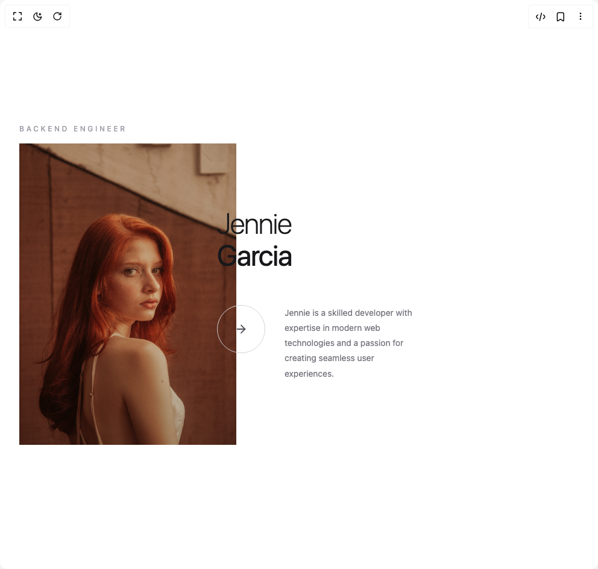

# Build Team Member Card in BuilderStudio

> Build this component in our Agentic IDE: [BuilderStudio](https://builderstudio.dev).
>
> Join the BuilderStudio community on [Discord](https://discord.gg/QdWeSGCqfe) and [Reddit](https://reddit.com/r/builderstudio).



## Component

- Author group: `shatlyk1011`
- Component: `team-member-card`
- Variant: `default`
- Rendered HTML snapshot: [`rendered.html`](rendered.html)

## BuilderStudio prompt

You are implementing a React component based on a component reference.

## Component identity

- Author: Shatlyk1011
- Component slug: team-member-card
- Demo slug: default
- Title: team-member-card
- Description: 

## Goal

Recreate this component in a React + TypeScript + Tailwind CSS project. Preserve the visual layout, spacing, colors, border radius, shadows, interaction behavior, animation behavior, responsive behavior, and dark mode behavior shown in the rendered demo.

## Implementation requirements

- Use React and TypeScript.
- Use Tailwind CSS classes whenever possible.
- Keep the component self-contained unless the source files require helper components.
- If the source uses CSS variables, custom CSS, animations, or keyframes, include them.
- If the source uses external packages, list and use the required packages.
- Preserve accessibility attributes, button semantics, links, keyboard behavior, and ARIA attributes when visible in the source.
- Do not replace the component with a simplified placeholder.
- Return complete production-ready code.

## Dependencies

No reference metadata available.

## Rendered DOM snapshot

This is the rendered demo HTML extracted from the live preview. Use it to verify structure, class names, visible content, and layout.

```html
<div id="root"><div class="w-screen min-h-screen flex justify-center items-center"><div class="w-screen min-h-screen flex justify-center items-center"><div class="flex items-center justify-center min-h-screen bg-background p-8"><div class="relative my-16 flex flex-col justify-center" style="opacity: 1;"><div style="opacity: 1; transform: none;"><p class="mb-4 text-xs font-medium tracking-[0.3em] text-zinc-400 uppercase dark:text-zinc-500">Backend Engineer</p></div><div class="flex items-center justify-end"><div class="relative h-125 w-90 shrink-0 overflow-hidden" style="opacity: 1; transform: none;"><div class="pointer-events-none absolute inset-0 z-10 bg-linear-to-t from-black/20 via-transparent to-transparent"></div></div><div class="relative -left-8 z-2 flex w-[calc(100%-350px)] flex-col gap-14" style="opacity: 1; transform: none;"><div><p class="text-5xl leading-[1.1] font-extralight tracking-tight text-zinc-900 dark:text-white">Jennie<br><span class="font-normal">Garcia</span></p></div><div class="flex gap-8"><div class="group flex h-20 w-20 shrink-0 cursor-pointer items-center justify-center rounded-full border border-zinc-300 transition-colors duration-300 hover:border-zinc-600 hover:bg-zinc-900 dark:border-white/20 dark:hover:border-white/60 dark:hover:bg-white/10" tabindex="0"><svg xmlns="http://www.w3.org/2000/svg" width="22" height="22" viewBox="0 0 24 24" fill="none" stroke="currentColor" stroke-width="2" stroke-linecap="round" stroke-linejoin="round" class="lucide lucide-arrow-right text-zinc-600 transition-all duration-300 group-hover:-rotate-45 group-hover:text-white dark:text-zinc-400 dark:group-hover:text-white" aria-hidden="true"><path d="M5 12h14"></path><path d="m12 5 7 7-7 7"></path></svg></div><div class="w-[40%]"><p class="text-sm leading-[1.8] text-zinc-500 dark:text-zinc-400">Jennie is a skilled developer with expertise in modern web technologies and a passion for creating seamless user experiences.</p></div></div></div></div></div></div></div></div></div>
```

## Reference source files

No reference source files were available.
