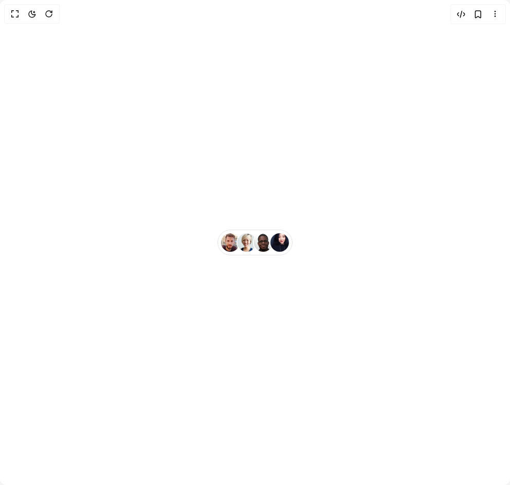
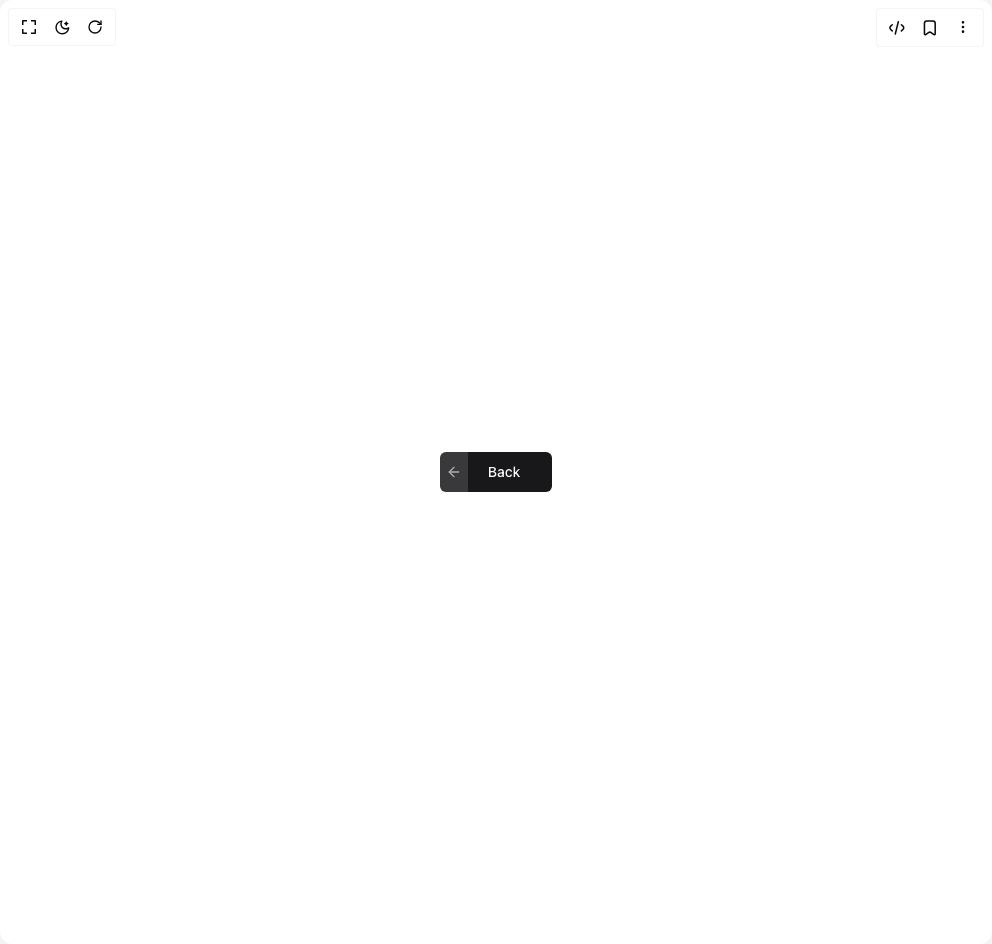
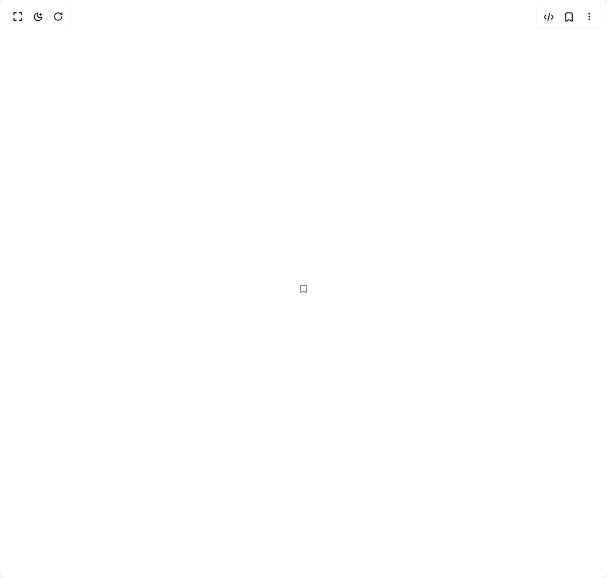
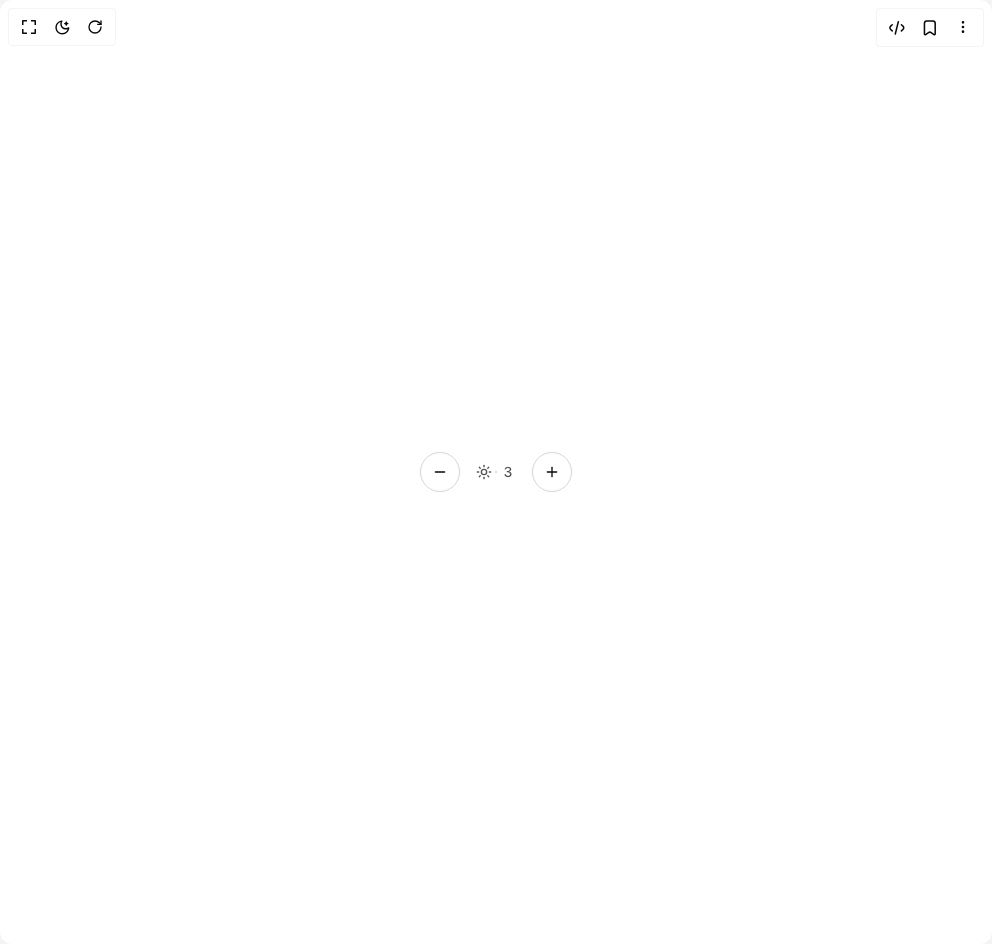
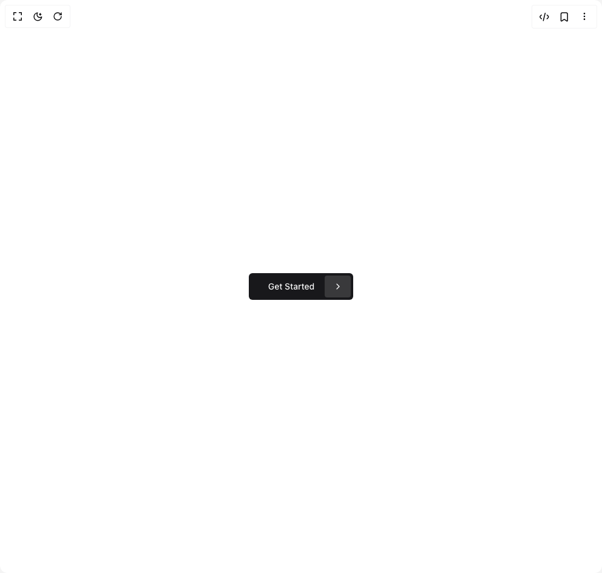
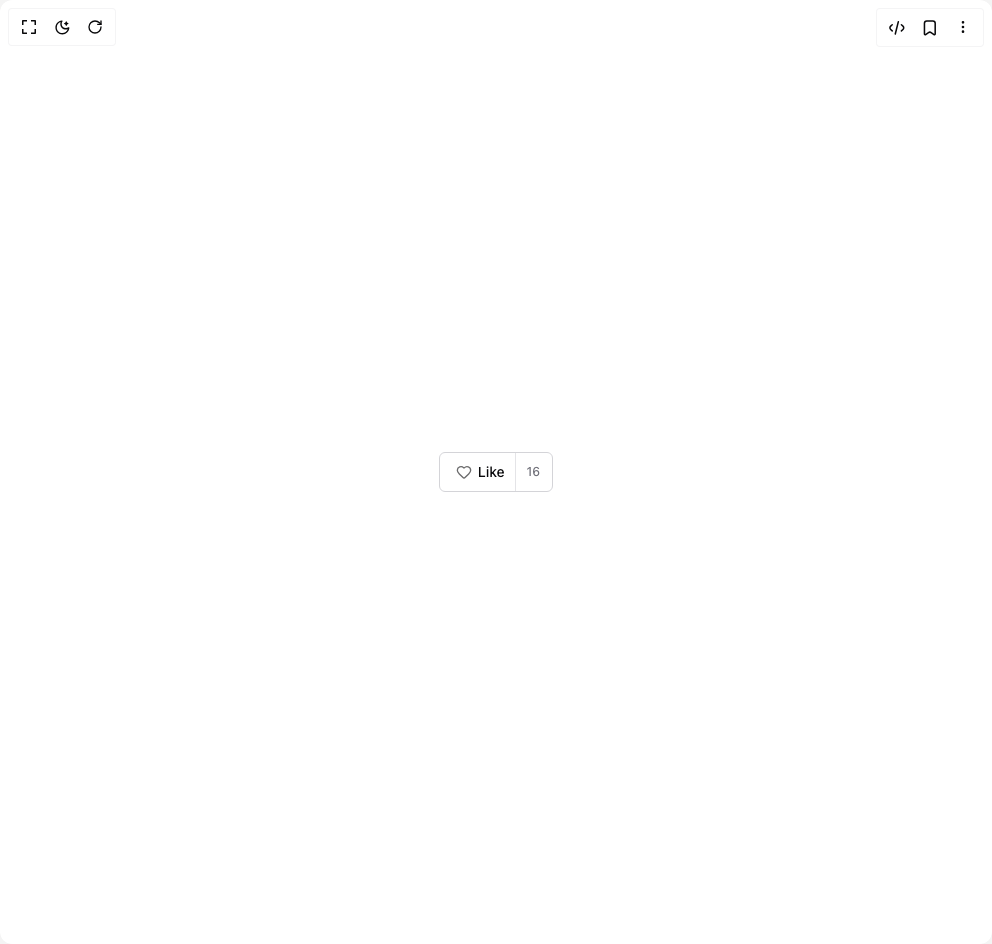

# Shsfwork Components

6 components are available in this author group.

> Build any component in [BuilderStudio](https://builderstudio.dev), then share improvements with the community on [Discord](https://discord.gg/QdWeSGCqfe) or [Reddit](https://reddit.com/r/builderstudio).

| Preview | Component | Variant |
| --- | --- | --- |
|  | [Avatar Group With Tooltip](avatar-group-with-tooltip/avatar-group-with-tooltip/README.md) | `avatar-group-with-tooltip` |
|  | [Back Button](back-button/default/README.md) | `default` |
|  | [Bookmark Icon Button](bookmark-icon-button/default/README.md) | `default` |
|  | [Brightness Control](brightness-control/default/README.md) | `default` |
|  | [Get Started Button](get-started-button/default/README.md) | `default` |
|  | [Heart Button](heart-button/heart-button/README.md) | `heart-button` |
