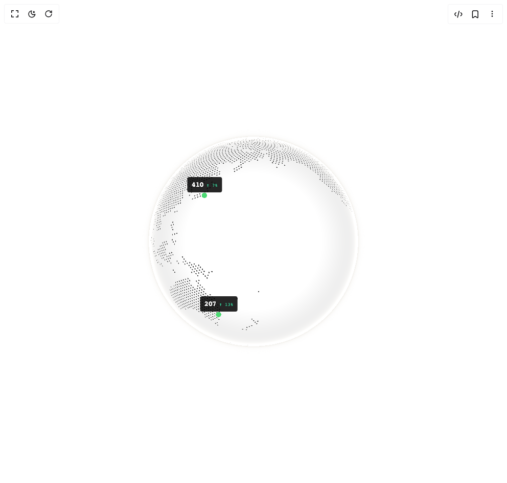

# Build Cobe Globe Analytics in BuilderStudio

> Build this component in our Agentic IDE: [BuilderStudio](https://builderstudio.dev).
>
> Join the BuilderStudio community on [Discord](https://discord.gg/QdWeSGCqfe) and [Reddit](https://reddit.com/r/builderstudio).



## Component

- Author group: `shuding`
- Component: `cobe-globe-analytics`
- Variant: `default`
- Rendered HTML snapshot: [`rendered.html`](rendered.html)

## BuilderStudio prompt

You are implementing a React component based on a component reference.

## Component identity

- Author: shuding
- Component slug: cobe-globe-analytics
- Demo slug: default
- Title: cobe-globe-analytics
- Description: 

## Goal

Recreate this component in a React + TypeScript + Tailwind CSS project. Preserve the visual layout, spacing, colors, border radius, shadows, interaction behavior, animation behavior, responsive behavior, and dark mode behavior shown in the rendered demo.

## Implementation requirements

- Use React and TypeScript.
- Use Tailwind CSS classes whenever possible.
- Keep the component self-contained unless the source files require helper components.
- If the source uses CSS variables, custom CSS, animations, or keyframes, include them.
- If the source uses external packages, list and use the required packages.
- Preserve accessibility attributes, button semantics, links, keyboard behavior, and ARIA attributes when visible in the source.
- Do not replace the component with a simplified placeholder.
- Return complete production-ready code.

## Dependencies

No reference metadata available.

## Rendered DOM snapshot

This is the rendered demo HTML extracted from the live preview. Use it to verify structure, class names, visible content, and layout.

```html
<div id="root"><div class="w-screen min-h-screen flex justify-center items-center"><div class="fixed top-4 left-4 z-10"><select class="appearance-none h-8 max-w-[200px] text-sm leading-tight rounded-lg pl-3 pr-7 py-0 border bg-background focus:outline-none focus:ring-0"><option value="default.tsx_GlobeAnalyticsDemo">default.tsx</option></select><div class="absolute top-1/2 transform -translate-y-1/2 right-2 pointer-events-none"><svg class="w-4 h-4 fill-current" viewBox="0 0 20 20"><path d="M5.516 7.548c.436-.446 1.043-.48 1.576 0L10 10.405l2.908-2.857c.533-.48 1.14-.446 1.576 0 .436.445.408 1.197 0 1.615l-3.734 3.705c-.533.534-1.39.534-1.923 0l-3.734-3.705c-.408-.418-.436-1.17 0-1.615z"></path></svg></div></div><div class="w-screen min-h-screen flex justify-center items-center"><div class="flex items-center justify-center w-full min-h-screen bg-white p-8 overflow-hidden"><div class="w-full max-w-lg"><div class="relative aspect-square select-none "><div style="position: relative; width: 100%; height: 100%;"><canvas width="512" height="512" style="width: 100%; height: 100%; cursor: grab; opacity: 1; transition: opacity 1.2s; border-radius: 50%; touch-action: none;"></canvas><div style="position: absolute; width: 1px; height: 1px; pointer-events: none; anchor-name: --cobe-vis-1; left: 78.4588%; top: 22.3524%;"></div><div style="position: absolute; width: 1px; height: 1px; pointer-events: none; anchor-name: --cobe-vis-2; left: 48.2356%; top: 14.382%;"></div><div style="position: absolute; width: 1px; height: 1px; pointer-events: none; anchor-name: --cobe-vis-3; left: 30.8306%; top: 32.3467%;"></div><div style="position: absolute; width: 1px; height: 1px; pointer-events: none; anchor-name: --cobe-vis-4; left: 47.0007%; top: 15.2822%;"></div><div style="position: absolute; width: 1px; height: 1px; pointer-events: none; anchor-name: --cobe-vis-5; left: 36.1767%; top: 77.8476%;"></div><div style="position: absolute; width: 1px; height: 1px; pointer-events: none; anchor-name: --cobe-vis-6; left: 42.6388%; top: 14.2811%;"></div></div><div style="position: absolute; position-anchor: --cobe-vis-1; bottom: anchor(top); left: anchor(center); translate: -50%; margin-bottom: 6px; display: flex; align-items: baseline; gap: 0.35rem; padding: 0.3rem 0.5rem; background: rgba(0, 0, 0, 0.85); border-radius: 4px; pointer-events: none; white-space: nowrap; opacity: var(--cobe-visible-vis-1, 0); filter: blur(calc((1 - var(--cobe-visible-vis-1, 0)) * 8px)); transition: opacity 0.3s, filter 0.3s;"><span style="font-family: monospace; font-size: 0.85rem; font-weight: 600; color: rgb(255, 255, 255); letter-spacing: -0.02em;">854</span><span style="font-family: monospace; font-size: 0.55rem; font-weight: 500; letter-spacing: 0.02em; color: rgb(52, 211, 153);">↑ 13%</span></div><div style="position: absolute; position-anchor: --cobe-vis-2; bottom: anchor(top); left: anchor(center); translate: -50%; margin-bottom: 6px; display: flex; align-items: baseline; gap: 0.35rem; padding: 0.3rem 0.5rem; background: rgba(0, 0, 0, 0.85); border-radius: 4px; pointer-events: none; white-space: nowrap; opacity: var(--cobe-visible-vis-2, 0); filter: blur(calc((1 - var(--cobe-visible-vis-2, 0)) * 8px)); transition: opacity 0.3s, filter 0.3s;"><span style="font-family: monospace; font-size: 0.85rem; font-weight: 600; color: rgb(255, 255, 255); letter-spacing: -0.02em;">629</span><span style="font-family: monospace; font-size: 0.55rem; font-weight: 500; letter-spacing: 0.02em; color: rgb(248, 113, 113);">↓ 3%</span></div><div style="position: absolute; position-anchor: --cobe-vis-3; bottom: anchor(top); left: anchor(center); translate: -50%; margin-bottom: 6px; display: flex; align-items: baseline; gap: 0.35rem; padding: 0.3rem 0.5rem; background: rgba(0, 0, 0, 0.85); border-radius: 4px; pointer-events: none; white-space: nowrap; opacity: var(--cobe-visible-vis-3, 0); filter: blur(calc((1 - var(--cobe-visible-vis-3, 0)) * 8px)); transition: opacity 0.3s, filter 0.3s;"><span style="font-family: monospace; font-size: 0.85rem; font-weight: 600; color: rgb(255, 255, 255); letter-spacing: -0.02em;">410</span><span style="font-family: monospace; font-size: 0.55rem; font-weight: 500; letter-spacing: 0.02em; color: rgb(52, 211, 153);">↑ 7%</span></div><div style="position: absolute; position-anchor: --cobe-vis-4; bottom: anchor(top); left: anchor(center); translate: -50%; margin-bottom: 6px; display: flex; align-items: baseline; gap: 0.35rem; padding: 0.3rem 0.5rem; background: rgba(0, 0, 0, 0.85); border-radius: 4px; pointer-events: none; white-space: nowrap; opacity: var(--cobe-visible-vis-4, 0); filter: blur(calc((1 - var(--cobe-visible-vis-4, 0)) * 8px)); transition: opacity 0.3s, filter 0.3s;"><span style="font-family: monospace; font-size: 0.85rem; font-weight: 600; color: rgb(255, 255, 255); letter-spacing: -0.02em;">391</span><span style="font-family: monospace; font-size: 0.55rem; font-weight: 500; letter-spacing: 0.02em; color: rgb(52, 211, 153);">↑ 5%</span></div><div style="position: absolute; position-anchor: --cobe-vis-5; bottom: anchor(top); left: anchor(center); translate: -50%; margin-bottom: 6px; display: flex; align-items: baseline; gap: 0.35rem; padding: 0.3rem 0.5rem; background: rgba(0, 0, 0, 0.85); border-radius: 4px; pointer-events: none; white-space: nowrap; opacity: var(--cobe-visible-vis-5, 0); filter: blur(calc((1 - var(--cobe-visible-vis-5, 0)) * 8px)); transition: opacity 0.3s, filter 0.3s;"><span style="font-family: monospace; font-size: 0.85rem; font-weight: 600; color: rgb(255, 255, 255); letter-spacing: -0.02em;">207</span><span style="font-family: monospace; font-size: 0.55rem; font-weight: 500; letter-spacing: 0.02em; color: rgb(52, 211, 153);">↑ 13%</span></div><div style="position: absolute; position-anchor: --cobe-vis-6; bottom: anchor(top); left: anchor(center); translate: -50%; margin-bottom: 6px; display: flex; align-items: baseline; gap: 0.35rem; padding: 0.3rem 0.5rem; background: rgba(0, 0, 0, 0.85); border-radius: 4px; pointer-events: none; white-space: nowrap; opacity: var(--cobe-visible-vis-6, 0); filter: blur(calc((1 - var(--cobe-visible-vis-6, 0)) * 8px)); transition: opacity 0.3s, filter 0.3s;"><span style="font-family: monospace; font-size: 0.85rem; font-weight: 600; color: rgb(255, 255, 255); letter-spacing: -0.02em;">175</span><span style="font-family: monospace; font-size: 0.55rem; font-weight: 500; letter-spacing: 0.02em; color: rgb(248, 113, 113);">↓ 2%</span></div></div></div></div></div></div></div>
```

## Reference source files

No reference source files were available.
