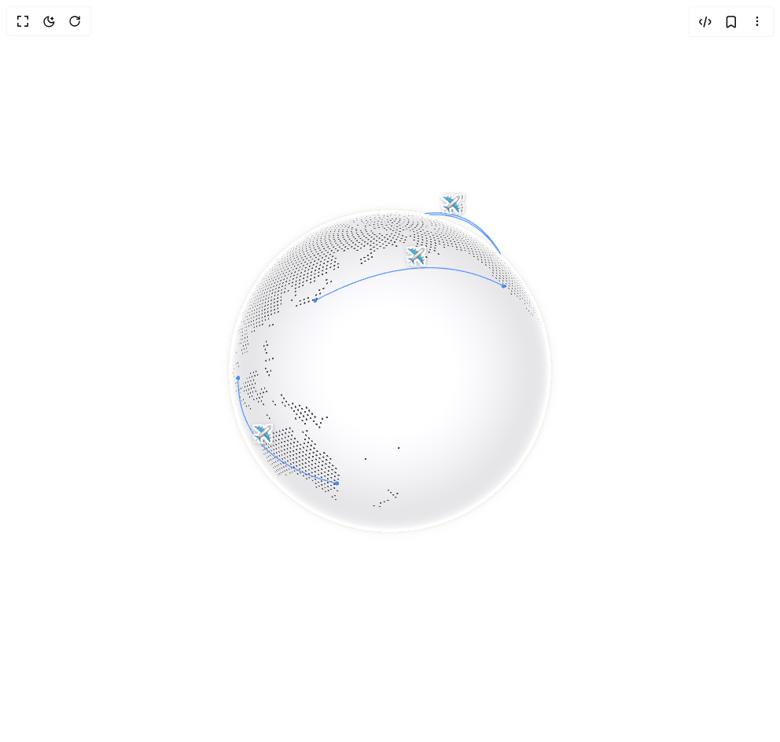

# Build Cobe Globe Flights in BuilderStudio

> Build this component in our Agentic IDE: [BuilderStudio](https://builderstudio.dev).
>
> Join the BuilderStudio community on [Discord](https://discord.gg/QdWeSGCqfe) and [Reddit](https://reddit.com/r/builderstudio).



## Component

- Author group: `shuding`
- Component: `cobe-globe-flights`
- Variant: `default`
- Rendered HTML snapshot: [`rendered.html`](rendered.html)

## BuilderStudio prompt

You are implementing a React component based on a component reference.

## Component identity

- Author: shuding
- Component slug: cobe-globe-flights
- Demo slug: default
- Title: cobe-globe-flights
- Description: 

## Goal

Recreate this component in a React + TypeScript + Tailwind CSS project. Preserve the visual layout, spacing, colors, border radius, shadows, interaction behavior, animation behavior, responsive behavior, and dark mode behavior shown in the rendered demo.

## Implementation requirements

- Use React and TypeScript.
- Use Tailwind CSS classes whenever possible.
- Keep the component self-contained unless the source files require helper components.
- If the source uses CSS variables, custom CSS, animations, or keyframes, include them.
- If the source uses external packages, list and use the required packages.
- Preserve accessibility attributes, button semantics, links, keyboard behavior, and ARIA attributes when visible in the source.
- Do not replace the component with a simplified placeholder.
- Return complete production-ready code.

## Dependencies

No reference metadata available.

## Rendered DOM snapshot

This is the rendered demo HTML extracted from the live preview. Use it to verify structure, class names, visible content, and layout.

```html
<div id="root"><div class="w-screen min-h-screen flex justify-center items-center"><div class="fixed top-4 left-4 z-10"><select class="appearance-none h-8 max-w-[200px] text-sm leading-tight rounded-lg pl-3 pr-7 py-0 border bg-background focus:outline-none focus:ring-0"><option value="default.tsx_GlobeFlightsDemo">default.tsx</option></select><div class="absolute top-1/2 transform -translate-y-1/2 right-2 pointer-events-none"><svg class="w-4 h-4 fill-current" viewBox="0 0 20 20"><path d="M5.516 7.548c.436-.446 1.043-.48 1.576 0L10 10.405l2.908-2.857c.533-.48 1.14-.446 1.576 0 .436.445.408 1.197 0 1.615l-3.734 3.705c-.533.534-1.39.534-1.923 0l-3.734-3.705c-.408-.418-.436-1.17 0-1.615z"></path></svg></div></div><div class="w-screen min-h-screen flex justify-center items-center"><div class="flex items-center justify-center w-full min-h-screen bg-white p-8 overflow-hidden"><div class="w-full max-w-lg"><div class="relative aspect-square select-none "><svg width="0" height="0" style="position: absolute;"><defs><filter id="sticker-outline-flight"><feMorphology in="SourceAlpha" result="Dilated" operator="dilate" radius="2"></feMorphology><feFlood flood-color="#ffffff" result="OutlineColor"></feFlood><feComposite in="OutlineColor" in2="Dilated" operator="in" result="Outline"></feComposite><feMerge><feMergeNode in="Outline"></feMergeNode><feMergeNode in="SourceGraphic"></feMergeNode></feMerge></filter></defs></svg><div style="position: relative; width: 100%; height: 100%;"><canvas width="512" height="512" style="width: 100%; height: 100%; cursor: grab; opacity: 1; transition: opacity 1.2s; border-radius: 50%; touch-action: none;"></canvas><div style="position: absolute; width: 1px; height: 1px; pointer-events: none; anchor-name: --cobe-apt-jfk; left: 78.4145%; top: 22.3469%;"></div><div style="position: absolute; width: 1px; height: 1px; pointer-events: none; anchor-name: --cobe-apt-lhr; left: 48.3026%; top: 14.3937%;"></div><div style="position: absolute; width: 1px; height: 1px; pointer-events: none; anchor-name: --cobe-apt-dxb; left: 18.7556%; top: 29.6539%;"></div><div style="position: absolute; width: 1px; height: 1px; pointer-events: none; anchor-name: --cobe-apt-nrt; left: 30.9381%; top: 32.4475%;"></div><div style="position: absolute; width: 1px; height: 1px; pointer-events: none; anchor-name: --cobe-apt-sfo; left: 77.9709%; top: 29.0263%;"></div><div style="position: absolute; width: 1px; height: 1px; pointer-events: none; anchor-name: --cobe-apt-sin; left: 12.046%; top: 51.5715%;"></div><div style="position: absolute; width: 1px; height: 1px; pointer-events: none; anchor-name: --cobe-apt-syd; left: 36.2644%; top: 77.8942%;"></div><div style="position: absolute; width: 1px; height: 1px; pointer-events: none; anchor-name: --cobe-apt-cdg; left: 46.9223%; top: 15.284%;"></div><div style="position: absolute; width: 1px; height: 1px; pointer-events: none; anchor-name: --cobe-arc-flight-1; left: 66.3451%; top: 11.299%;"></div><div style="position: absolute; width: 1px; height: 1px; pointer-events: none; anchor-name: --cobe-arc-flight-2; left: 29.865%; top: 15.8002%;"></div><div style="position: absolute; width: 1px; height: 1px; pointer-events: none; anchor-name: --cobe-arc-flight-3; left: 55.9%; top: 24.4858%;"></div><div style="position: absolute; width: 1px; height: 1px; pointer-events: none; anchor-name: --cobe-arc-flight-4; left: 17.8135%; top: 68.3479%;"></div><div style="position: absolute; width: 1px; height: 1px; pointer-events: none; anchor-name: --cobe-arc-flight-5; left: 65.5997%; top: 11.5997%;"></div></div><div style="position: absolute; position-anchor: --cobe-arc-flight-1; bottom: anchor(top); left: anchor(center); translate: -50%; font-size: 1.2rem; pointer-events: none; filter: url(&quot;#sticker-outline-flight&quot;) drop-shadow(rgba(0, 0, 0, 0.3) 0px 1px 2px); opacity: var(--cobe-visible-arc-flight-1, 0); transition: opacity 0.3s, filter 0.3s;">✈️</div><div style="position: absolute; position-anchor: --cobe-arc-flight-2; bottom: anchor(top); left: anchor(center); translate: -50%; font-size: 1.2rem; pointer-events: none; filter: url(&quot;#sticker-outline-flight&quot;) drop-shadow(rgba(0, 0, 0, 0.3) 0px 1px 2px); opacity: var(--cobe-visible-arc-flight-2, 0); transition: opacity 0.3s, filter 0.3s;">✈️</div><div style="position: absolute; position-anchor: --cobe-arc-flight-3; bottom: anchor(top); left: anchor(center); translate: -50%; font-size: 1.2rem; pointer-events: none; filter: url(&quot;#sticker-outline-flight&quot;) drop-shadow(rgba(0, 0, 0, 0.3) 0px 1px 2px); opacity: var(--cobe-visible-arc-flight-3, 0); transition: opacity 0.3s, filter 0.3s;">✈️</div><div style="position: absolute; position-anchor: --cobe-arc-flight-4; bottom: anchor(top); left: anchor(center); translate: -50%; font-size: 1.2rem; pointer-events: none; filter: url(&quot;#sticker-outline-flight&quot;) drop-shadow(rgba(0, 0, 0, 0.3) 0px 1px 2px); opacity: var(--cobe-visible-arc-flight-4, 0); transition: opacity 0.3s, filter 0.3s;">✈️</div><div style="position: absolute; position-anchor: --cobe-arc-flight-5; bottom: anchor(top); left: anchor(center); translate: -50%; font-size: 1.2rem; pointer-events: none; filter: url(&quot;#sticker-outline-flight&quot;) drop-shadow(rgba(0, 0, 0, 0.3) 0px 1px 2px); opacity: var(--cobe-visible-arc-flight-5, 0); transition: opacity 0.3s, filter 0.3s;">✈️</div></div></div></div></div></div></div>
```

## Reference source files

No reference source files were available.
