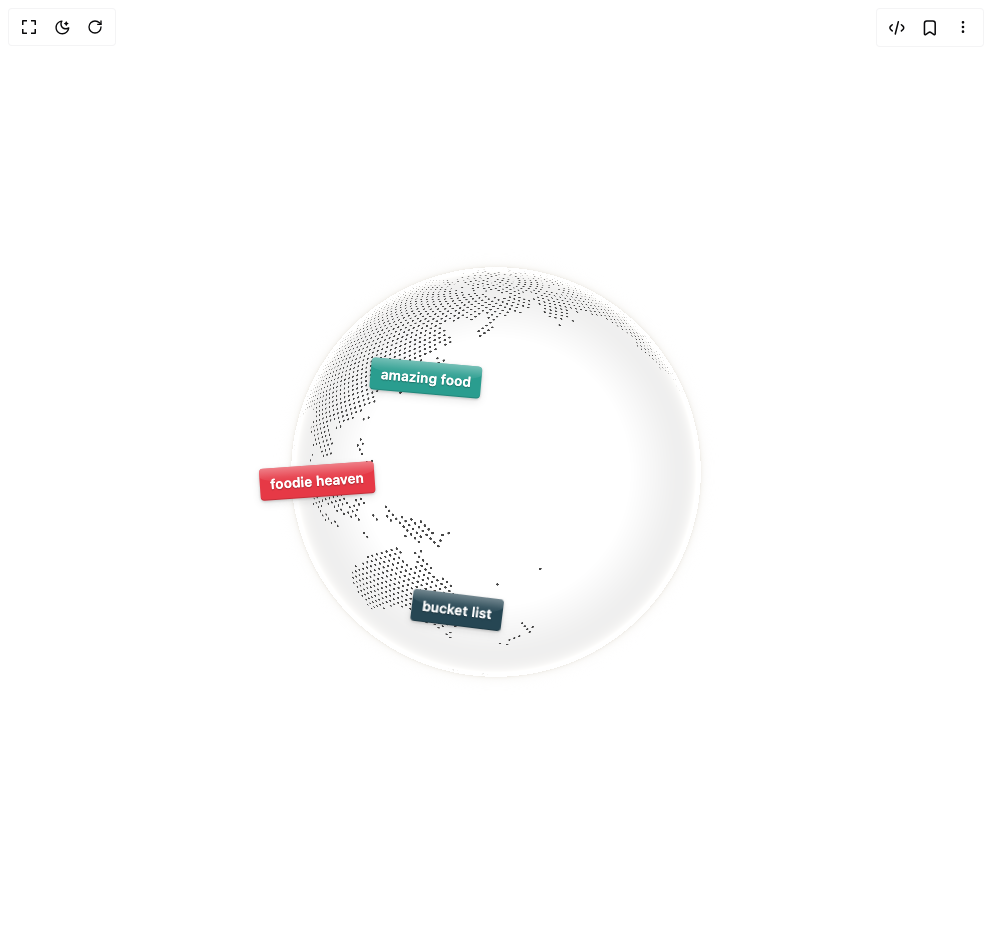

# Build Cobe Globe Labels in BuilderStudio

> Build this component in our Agentic IDE: [BuilderStudio](https://builderstudio.dev).
>
> Join the BuilderStudio community on [Discord](https://discord.gg/QdWeSGCqfe) and [Reddit](https://reddit.com/r/builderstudio).



## Component

- Author group: `shuding`
- Component: `cobe-globe-labels`
- Variant: `default`
- Rendered HTML snapshot: [`rendered.html`](rendered.html)

## BuilderStudio prompt

You are implementing a React component based on a component reference.

## Component identity

- Author: shuding
- Component slug: cobe-globe-labels
- Demo slug: default
- Title: cobe-globe-labels
- Description: 

## Goal

Recreate this component in a React + TypeScript + Tailwind CSS project. Preserve the visual layout, spacing, colors, border radius, shadows, interaction behavior, animation behavior, responsive behavior, and dark mode behavior shown in the rendered demo.

## Implementation requirements

- Use React and TypeScript.
- Use Tailwind CSS classes whenever possible.
- Keep the component self-contained unless the source files require helper components.
- If the source uses CSS variables, custom CSS, animations, or keyframes, include them.
- If the source uses external packages, list and use the required packages.
- Preserve accessibility attributes, button semantics, links, keyboard behavior, and ARIA attributes when visible in the source.
- Do not replace the component with a simplified placeholder.
- Return complete production-ready code.

## Dependencies

No reference metadata available.

## Rendered DOM snapshot

This is the rendered demo HTML extracted from the live preview. Use it to verify structure, class names, visible content, and layout.

```html
<div id="root"><div class="w-screen min-h-screen flex justify-center items-center"><div class="fixed top-4 left-4 z-10"><select class="appearance-none h-8 max-w-[200px] text-sm leading-tight rounded-lg pl-3 pr-7 py-0 border bg-background focus:outline-none focus:ring-0"><option value="default.tsx_GlobeLabelsDemo">default.tsx</option></select><div class="absolute top-1/2 transform -translate-y-1/2 right-2 pointer-events-none"><svg class="w-4 h-4 fill-current" viewBox="0 0 20 20"><path d="M5.516 7.548c.436-.446 1.043-.48 1.576 0L10 10.405l2.908-2.857c.533-.48 1.14-.446 1.576 0 .436.445.408 1.197 0 1.615l-3.734 3.705c-.533.534-1.39.534-1.923 0l-3.734-3.705c-.408-.418-.436-1.17 0-1.615z"></path></svg></div></div><div class="w-screen min-h-screen flex justify-center items-center"><div class="flex items-center justify-center w-full min-h-screen bg-white p-8 overflow-hidden"><div class="w-full max-w-lg"><div class="relative aspect-square select-none "><div style="position: relative; width: 100%; height: 100%;"><canvas width="512" height="512" style="width: 100%; height: 100%; cursor: grab; opacity: 1; transition: opacity 1.2s; border-radius: 50%; touch-action: none;"></canvas><div style="position: absolute; width: 1px; height: 1px; pointer-events: none; anchor-name: --cobe-label-1; left: 42.5955%; top: 15.4593%;"></div><div style="position: absolute; width: 1px; height: 1px; pointer-events: none; anchor-name: --cobe-label-2; left: 35.5744%; top: 32.9187%;"></div><div style="position: absolute; width: 1px; height: 1px; pointer-events: none; anchor-name: --cobe-label-3; left: 76.2634%; top: 21.4206%;"></div><div style="position: absolute; width: 1px; height: 1px; pointer-events: none; anchor-name: --cobe-label-4; left: 41.5171%; top: 78.2274%;"></div><div style="position: absolute; width: 1px; height: 1px; pointer-events: none; anchor-name: --cobe-label-5; left: 44.0356%; top: 14.5136%;"></div><div style="position: absolute; width: 1px; height: 1px; pointer-events: none; anchor-name: --cobe-label-6; left: 67.9628%; top: 58.8699%;"></div><div style="position: absolute; width: 1px; height: 1px; pointer-events: none; anchor-name: --cobe-label-7; left: 32.3544%; top: 14.8181%;"></div><div style="position: absolute; width: 1px; height: 1px; pointer-events: none; anchor-name: --cobe-label-8; left: 16.1519%; top: 30.7622%;"></div><div style="position: absolute; width: 1px; height: 1px; pointer-events: none; anchor-name: --cobe-label-9; left: 14.6304%; top: 52.7831%;"></div><div style="position: absolute; width: 1px; height: 1px; pointer-events: none; anchor-name: --cobe-label-10; left: 73.0319%; top: 67.5865%;"></div></div><div style="position: absolute; position-anchor: --cobe-label-1; bottom: anchor(top); left: anchor(center); translate: -50%; margin-bottom: -10px; padding: 0.4rem 0.65rem 0.35rem; background: rgb(232, 72, 85); color: rgb(255, 255, 255); font-family: ui-rounded, &quot;SF Pro Rounded&quot;, system-ui, sans-serif; font-size: 0.85rem; font-weight: 600; letter-spacing: 0.01em; white-space: nowrap; transform: rotate(-8deg); border-radius: 4px; box-shadow: rgba(0, 0, 0, 0.2) 0px 1px 3px, rgba(0, 0, 0, 0.1) 0px 3px 8px, rgba(0, 0, 0, 0.15) 0px -1px 0px inset; text-shadow: rgba(0, 0, 0, 0.25) 0px 1px 1px; pointer-events: none; overflow: hidden; opacity: var(--cobe-visible-label-1, 0); filter: blur(calc((1 - var(--cobe-visible-label-1, 0)) * 8px)); transition: opacity 0.3s, filter 0.3s;"><span style="position: absolute; top: 0px; left: 0px; right: 0px; height: 50%; background: linear-gradient(rgba(255, 255, 255, 0.35) 0%, rgba(255, 255, 255, 0.1) 60%, transparent 100%); border-radius: 4px 4px 50% 50%; pointer-events: none;"></span>visit soon!</div><div style="position: absolute; position-anchor: --cobe-label-2; bottom: anchor(top); left: anchor(center); translate: -50%; margin-bottom: -10px; padding: 0.4rem 0.65rem 0.35rem; background: rgb(42, 157, 143); color: rgb(255, 255, 255); font-family: ui-rounded, &quot;SF Pro Rounded&quot;, system-ui, sans-serif; font-size: 0.85rem; font-weight: 600; letter-spacing: 0.01em; white-space: nowrap; transform: rotate(5deg); border-radius: 4px; box-shadow: rgba(0, 0, 0, 0.2) 0px 1px 3px, rgba(0, 0, 0, 0.1) 0px 3px 8px, rgba(0, 0, 0, 0.15) 0px -1px 0px inset; text-shadow: rgba(0, 0, 0, 0.25) 0px 1px 1px; pointer-events: none; overflow: hidden; opacity: var(--cobe-visible-label-2, 0); filter: blur(calc((1 - var(--cobe-visible-label-2, 0)) * 8px)); transition: opacity 0.3s, filter 0.3s;"><span style="position: absolute; top: 0px; left: 0px; right: 0px; height: 50%; background: linear-gradient(rgba(255, 255, 255, 0.35) 0%, rgba(255, 255, 255, 0.1) 60%, transparent 100%); border-radius: 4px 4px 50% 50%; pointer-events: none;"></span>amazing food</div><div style="position: absolute; position-anchor: --cobe-label-3; bottom: anchor(top); left: anchor(center); translate: -50%; margin-bottom: -10px; padding: 0.4rem 0.65rem 0.35rem; background: rgb(231, 111, 81); color: rgb(255, 255, 255); font-family: ui-rounded, &quot;SF Pro Rounded&quot;, system-ui, sans-serif; font-size: 0.85rem; font-weight: 600; letter-spacing: 0.01em; white-space: nowrap; transform: rotate(-3deg); border-radius: 4px; box-shadow: rgba(0, 0, 0, 0.2) 0px 1px 3px, rgba(0, 0, 0, 0.1) 0px 3px 8px, rgba(0, 0, 0, 0.15) 0px -1px 0px inset; text-shadow: rgba(0, 0, 0, 0.25) 0px 1px 1px; pointer-events: none; overflow: hidden; opacity: var(--cobe-visible-label-3, 0); filter: blur(calc((1 - var(--cobe-visible-label-3, 0)) * 8px)); transition: opacity 0.3s, filter 0.3s;"><span style="position: absolute; top: 0px; left: 0px; right: 0px; height: 50%; background: linear-gradient(rgba(255, 255, 255, 0.35) 0%, rgba(255, 255, 255, 0.1) 60%, transparent 100%); border-radius: 4px 4px 50% 50%; pointer-events: none;"></span>home ♥</div><div style="position: absolute; position-anchor: --cobe-label-4; bottom: anchor(top); left: anchor(center); translate: -50%; margin-bottom: -10px; padding: 0.4rem 0.65rem 0.35rem; background: rgb(38, 70, 83); color: rgb(255, 255, 255); font-family: ui-rounded, &quot;SF Pro Rounded&quot;, system-ui, sans-serif; font-size: 0.85rem; font-weight: 600; letter-spacing: 0.01em; white-space: nowrap; transform: rotate(7deg); border-radius: 4px; box-shadow: rgba(0, 0, 0, 0.2) 0px 1px 3px, rgba(0, 0, 0, 0.1) 0px 3px 8px, rgba(0, 0, 0, 0.15) 0px -1px 0px inset; text-shadow: rgba(0, 0, 0, 0.25) 0px 1px 1px; pointer-events: none; overflow: hidden; opacity: var(--cobe-visible-label-4, 0); filter: blur(calc((1 - var(--cobe-visible-label-4, 0)) * 8px)); transition: opacity 0.3s, filter 0.3s;"><span style="position: absolute; top: 0px; left: 0px; right: 0px; height: 50%; background: linear-gradient(rgba(255, 255, 255, 0.35) 0%, rgba(255, 255, 255, 0.1) 60%, transparent 100%); border-radius: 4px 4px 50% 50%; pointer-events: none;"></span>bucket list</div><div style="position: absolute; position-anchor: --cobe-label-5; bottom: anchor(top); left: anchor(center); translate: -50%; margin-bottom: -10px; padding: 0.4rem 0.65rem 0.35rem; background: rgb(123, 44, 191); color: rgb(255, 255, 255); font-family: ui-rounded, &quot;SF Pro Rounded&quot;, system-ui, sans-serif; font-size: 0.85rem; font-weight: 600; letter-spacing: 0.01em; white-space: nowrap; transform: rotate(-5deg); border-radius: 4px; box-shadow: rgba(0, 0, 0, 0.2) 0px 1px 3px, rgba(0, 0, 0, 0.1) 0px 3px 8px, rgba(0, 0, 0, 0.15) 0px -1px 0px inset; text-shadow: rgba(0, 0, 0, 0.25) 0px 1px 1px; pointer-events: none; overflow: hidden; opacity: var(--cobe-visible-label-5, 0); filter: blur(calc((1 - var(--cobe-visible-label-5, 0)) * 8px)); transition: opacity 0.3s, filter 0.3s;"><span style="position: absolute; top: 0px; left: 0px; right: 0px; height: 50%; background: linear-gradient(rgba(255, 255, 255, 0.35) 0%, rgba(255, 255, 255, 0.1) 60%, transparent 100%); border-radius: 4px 4px 50% 50%; pointer-events: none;"></span>rainy but fun</div><div style="position: absolute; position-anchor: --cobe-label-6; bottom: anchor(top); left: anchor(center); translate: -50%; margin-bottom: -10px; padding: 0.4rem 0.65rem 0.35rem; background: rgb(244, 162, 97); color: rgb(255, 255, 255); font-family: ui-rounded, &quot;SF Pro Rounded&quot;, system-ui, sans-serif; font-size: 0.85rem; font-weight: 600; letter-spacing: 0.01em; white-space: nowrap; transform: rotate(4deg); border-radius: 4px; box-shadow: rgba(0, 0, 0, 0.2) 0px 1px 3px, rgba(0, 0, 0, 0.1) 0px 3px 8px, rgba(0, 0, 0, 0.15) 0px -1px 0px inset; text-shadow: rgba(0, 0, 0, 0.25) 0px 1px 1px; pointer-events: none; overflow: hidden; opacity: var(--cobe-visible-label-6, 0); filter: blur(calc((1 - var(--cobe-visible-label-6, 0)) * 8px)); transition: opacity 0.3s, filter 0.3s;"><span style="position: absolute; top: 0px; left: 0px; right: 0px; height: 50%; background: linear-gradient(rgba(255, 255, 255, 0.35) 0%, rgba(255, 255, 255, 0.1) 60%, transparent 100%); border-radius: 4px 4px 50% 50%; pointer-events: none;"></span>samba time!</div><div style="position: absolute; position-anchor: --cobe-label-7; bottom: anchor(top); left: anchor(center); translate: -50%; margin-bottom: -10px; padding: 0.4rem 0.65rem 0.35rem; background: rgb(69, 123, 157); color: rgb(255, 255, 255); font-family: ui-rounded, &quot;SF Pro Rounded&quot;, system-ui, sans-serif; font-size: 0.85rem; font-weight: 600; letter-spacing: 0.01em; white-space: nowrap; transform: rotate(-6deg); border-radius: 4px; box-shadow: rgba(0, 0, 0, 0.2) 0px 1px 3px, rgba(0, 0, 0, 0.1) 0px 3px 8px, rgba(0, 0, 0, 0.15) 0px -1px 0px inset; text-shadow: rgba(0, 0, 0, 0.25) 0px 1px 1px; pointer-events: none; overflow: hidden; opacity: var(--cobe-visible-label-7, 0); filter: blur(calc((1 - var(--cobe-visible-label-7, 0)) * 8px)); transition: opacity 0.3s, filter 0.3s;"><span style="position: absolute; top: 0px; left: 0px; right: 0px; height: 50%; background: linear-gradient(rgba(255, 255, 255, 0.35) 0%, rgba(255, 255, 255, 0.1) 60%, transparent 100%); border-radius: 4px 4px 50% 50%; pointer-events: none;"></span>cold but cozy</div><div style="position: absolute; position-anchor: --cobe-label-8; bottom: anchor(top); left: anchor(center); translate: -50%; margin-bottom: -10px; padding: 0.4rem 0.65rem 0.35rem; background: rgb(212, 163, 115); color: rgb(255, 255, 255); font-family: ui-rounded, &quot;SF Pro Rounded&quot;, system-ui, sans-serif; font-size: 0.85rem; font-weight: 600; letter-spacing: 0.01em; white-space: nowrap; transform: rotate(3deg); border-radius: 4px; box-shadow: rgba(0, 0, 0, 0.2) 0px 1px 3px, rgba(0, 0, 0, 0.1) 0px 3px 8px, rgba(0, 0, 0, 0.15) 0px -1px 0px inset; text-shadow: rgba(0, 0, 0, 0.25) 0px 1px 1px; pointer-events: none; overflow: hidden; opacity: var(--cobe-visible-label-8, 0); filter: blur(calc((1 - var(--cobe-visible-label-8, 0)) * 8px)); transition: opacity 0.3s, filter 0.3s;"><span style="position: absolute; top: 0px; left: 0px; right: 0px; height: 50%; background: linear-gradient(rgba(255, 255, 255, 0.35) 0%, rgba(255, 255, 255, 0.1) 60%, transparent 100%); border-radius: 4px 4px 50% 50%; pointer-events: none;"></span>so luxurious</div><div style="position: absolute; position-anchor: --cobe-label-9; bottom: anchor(top); left: anchor(center); translate: -50%; margin-bottom: -10px; padding: 0.4rem 0.65rem 0.35rem; background: rgb(230, 57, 70); color: rgb(255, 255, 255); font-family: ui-rounded, &quot;SF Pro Rounded&quot;, system-ui, sans-serif; font-size: 0.85rem; font-weight: 600; letter-spacing: 0.01em; white-space: nowrap; transform: rotate(-4deg); border-radius: 4px; box-shadow: rgba(0, 0, 0, 0.2) 0px 1px 3px, rgba(0, 0, 0, 0.1) 0px 3px 8px, rgba(0, 0, 0, 0.15) 0px -1px 0px inset; text-shadow: rgba(0, 0, 0, 0.25) 0px 1px 1px; pointer-events: none; overflow: hidden; opacity: var(--cobe-visible-label-9, 0); filter: blur(calc((1 - var(--cobe-visible-label-9, 0)) * 8px)); transition: opacity 0.3s, filter 0.3s;"><span style="position: absolute; top: 0px; left: 0px; right: 0px; height: 50%; background: linear-gradient(rgba(255, 255, 255, 0.35) 0%, rgba(255, 255, 255, 0.1) 60%, transparent 100%); border-radius: 4px 4px 50% 50%; pointer-events: none;"></span>foodie heaven</div><div style="position: absolute; position-anchor: --cobe-label-10; bottom: anchor(top); left: anchor(center); translate: -50%; margin-bottom: -10px; padding: 0.4rem 0.65rem 0.35rem; background: rgb(157, 78, 221); color: rgb(255, 255, 255); font-family: ui-rounded, &quot;SF Pro Rounded&quot;, system-ui, sans-serif; font-size: 0.85rem; font-weight: 600; letter-spacing: 0.01em; white-space: nowrap; transform: rotate(6deg); border-radius: 4px; box-shadow: rgba(0, 0, 0, 0.2) 0px 1px 3px, rgba(0, 0, 0, 0.1) 0px 3px 8px, rgba(0, 0, 0, 0.15) 0px -1px 0px inset; text-shadow: rgba(0, 0, 0, 0.25) 0px 1px 1px; pointer-events: none; overflow: hidden; opacity: var(--cobe-visible-label-10, 0); filter: blur(calc((1 - var(--cobe-visible-label-10, 0)) * 8px)); transition: opacity 0.3s, filter 0.3s;"><span style="position: absolute; top: 0px; left: 0px; right: 0px; height: 50%; background: linear-gradient(rgba(255, 255, 255, 0.35) 0%, rgba(255, 255, 255, 0.1) 60%, transparent 100%); border-radius: 4px 4px 50% 50%; pointer-events: none;"></span>tango nights</div></div></div></div></div></div></div>
```

## Reference source files

No reference source files were available.
