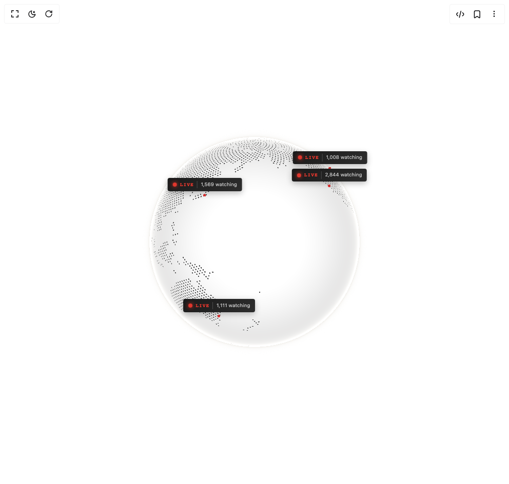

# Build Cobe Globe Live in BuilderStudio

> Build this component in our Agentic IDE: [BuilderStudio](https://builderstudio.dev).
>
> Join the BuilderStudio community on [Discord](https://discord.gg/QdWeSGCqfe) and [Reddit](https://reddit.com/r/builderstudio).



## Component

- Author group: `shuding`
- Component: `cobe-globe-live`
- Variant: `default`
- Rendered HTML snapshot: [`rendered.html`](rendered.html)

## BuilderStudio prompt

You are implementing a React component based on a component reference.

## Component identity

- Author: shuding
- Component slug: cobe-globe-live
- Demo slug: default
- Title: cobe-globe-live
- Description: 

## Goal

Recreate this component in a React + TypeScript + Tailwind CSS project. Preserve the visual layout, spacing, colors, border radius, shadows, interaction behavior, animation behavior, responsive behavior, and dark mode behavior shown in the rendered demo.

## Implementation requirements

- Use React and TypeScript.
- Use Tailwind CSS classes whenever possible.
- Keep the component self-contained unless the source files require helper components.
- If the source uses CSS variables, custom CSS, animations, or keyframes, include them.
- If the source uses external packages, list and use the required packages.
- Preserve accessibility attributes, button semantics, links, keyboard behavior, and ARIA attributes when visible in the source.
- Do not replace the component with a simplified placeholder.
- Return complete production-ready code.

## Dependencies

No reference metadata available.

## Rendered DOM snapshot

This is the rendered demo HTML extracted from the live preview. Use it to verify structure, class names, visible content, and layout.

```html
<div id="root"><div class="w-screen min-h-screen flex justify-center items-center"><div class="fixed top-4 left-4 z-10"><select class="appearance-none h-8 max-w-[200px] text-sm leading-tight rounded-lg pl-3 pr-7 py-0 border bg-background focus:outline-none focus:ring-0"><option value="default.tsx_GlobeLiveDemo">default.tsx</option></select><div class="absolute top-1/2 transform -translate-y-1/2 right-2 pointer-events-none"><svg class="w-4 h-4 fill-current" viewBox="0 0 20 20"><path d="M5.516 7.548c.436-.446 1.043-.48 1.576 0L10 10.405l2.908-2.857c.533-.48 1.14-.446 1.576 0 .436.445.408 1.197 0 1.615l-3.734 3.705c-.533.534-1.39.534-1.923 0l-3.734-3.705c-.408-.418-.436-1.17 0-1.615z"></path></svg></div></div><div class="w-screen min-h-screen flex justify-center items-center"><div class="flex items-center justify-center w-full min-h-screen bg-white p-8 overflow-hidden"><div class="w-full max-w-lg"><div class="relative aspect-square select-none "><style>
        @keyframes live-pulse {
          0%, 100% { opacity: 1; }
          50% { opacity: 0.6; }
        }
      </style><div style="position: relative; width: 100%; height: 100%;"><canvas width="512" height="512" style="width: 100%; height: 100%; cursor: grab; opacity: 1; transition: opacity 1.2s; border-radius: 50%; touch-action: none;"></canvas><div style="position: absolute; width: 1px; height: 1px; pointer-events: none; anchor-name: --cobe-sf; left: 78.1528%; top: 28.7094%;"></div><div style="position: absolute; width: 1px; height: 1px; pointer-events: none; anchor-name: --cobe-london; left: 48.2889%; top: 13.9357%;"></div><div style="position: absolute; width: 1px; height: 1px; pointer-events: none; anchor-name: --cobe-tokyo; left: 30.5114%; top: 32.1144%;"></div><div style="position: absolute; width: 1px; height: 1px; pointer-events: none; anchor-name: --cobe-paris; left: 47.0427%; top: 14.8464%;"></div><div style="position: absolute; width: 1px; height: 1px; pointer-events: none; anchor-name: --cobe-sydney; left: 35.9122%; top: 78.1873%;"></div><div style="position: absolute; width: 1px; height: 1px; pointer-events: none; anchor-name: --cobe-nyc; left: 78.8461%; top: 22.0239%;"></div></div><div style="position: absolute; position-anchor: --cobe-sf; bottom: anchor(top); left: anchor(center); translate: -50%; margin-bottom: 8px; display: flex; align-items: center; gap: 0.4rem; padding: 0.35rem 0.6rem; background: linear-gradient(135deg, rgb(26, 26, 26) 0%, rgb(45, 45, 45) 100%); border-radius: 4px; box-shadow: rgba(0, 0, 0, 0.25) 0px 4px 12px; pointer-events: none; white-space: nowrap; opacity: var(--cobe-visible-sf, 0); filter: blur(calc((1 - var(--cobe-visible-sf, 0)) * 8px)); transition: opacity 0.4s, filter 0.4s;"><span style="width: 8px; height: 8px; background: rgb(255, 59, 48); border-radius: 50%; box-shadow: rgb(255, 59, 48) 0px 0px 8px; animation: 1.5s ease-in-out 0s infinite normal none running live-pulse;"></span><span style="font-family: monospace; font-size: 0.6rem; font-weight: 600; letter-spacing: 0.1em; color: rgb(255, 59, 48); text-transform: uppercase;">LIVE</span><span style="font-family: system-ui, sans-serif; font-size: 0.6rem; color: rgba(255, 255, 255, 0.7); padding-left: 0.4rem; border-left: 1px solid rgba(255, 255, 255, 0.2);">2,851 watching</span></div><div style="position: absolute; position-anchor: --cobe-london; bottom: anchor(top); left: anchor(center); translate: -50%; margin-bottom: 8px; display: flex; align-items: center; gap: 0.4rem; padding: 0.35rem 0.6rem; background: linear-gradient(135deg, rgb(26, 26, 26) 0%, rgb(45, 45, 45) 100%); border-radius: 4px; box-shadow: rgba(0, 0, 0, 0.25) 0px 4px 12px; pointer-events: none; white-space: nowrap; opacity: var(--cobe-visible-london, 0); filter: blur(calc((1 - var(--cobe-visible-london, 0)) * 8px)); transition: opacity 0.4s, filter 0.4s;"><span style="width: 8px; height: 8px; background: rgb(255, 59, 48); border-radius: 50%; box-shadow: rgb(255, 59, 48) 0px 0px 8px; animation: 1.5s ease-in-out 0s infinite normal none running live-pulse;"></span><span style="font-family: monospace; font-size: 0.6rem; font-weight: 600; letter-spacing: 0.1em; color: rgb(255, 59, 48); text-transform: uppercase;">LIVE</span><span style="font-family: system-ui, sans-serif; font-size: 0.6rem; color: rgba(255, 255, 255, 0.7); padding-left: 0.4rem; border-left: 1px solid rgba(255, 255, 255, 0.2);">2,052 watching</span></div><div style="position: absolute; position-anchor: --cobe-tokyo; bottom: anchor(top); left: anchor(center); translate: -50%; margin-bottom: 8px; display: flex; align-items: center; gap: 0.4rem; padding: 0.35rem 0.6rem; background: linear-gradient(135deg, rgb(26, 26, 26) 0%, rgb(45, 45, 45) 100%); border-radius: 4px; box-shadow: rgba(0, 0, 0, 0.25) 0px 4px 12px; pointer-events: none; white-space: nowrap; opacity: var(--cobe-visible-tokyo, 0); filter: blur(calc((1 - var(--cobe-visible-tokyo, 0)) * 8px)); transition: opacity 0.4s, filter 0.4s;"><span style="width: 8px; height: 8px; background: rgb(255, 59, 48); border-radius: 50%; box-shadow: rgb(255, 59, 48) 0px 0px 8px; animation: 1.5s ease-in-out 0s infinite normal none running live-pulse;"></span><span style="font-family: monospace; font-size: 0.6rem; font-weight: 600; letter-spacing: 0.1em; color: rgb(255, 59, 48); text-transform: uppercase;">LIVE</span><span style="font-family: system-ui, sans-serif; font-size: 0.6rem; color: rgba(255, 255, 255, 0.7); padding-left: 0.4rem; border-left: 1px solid rgba(255, 255, 255, 0.2);">1,573 watching</span></div><div style="position: absolute; position-anchor: --cobe-paris; bottom: anchor(top); left: anchor(center); translate: -50%; margin-bottom: 8px; display: flex; align-items: center; gap: 0.4rem; padding: 0.35rem 0.6rem; background: linear-gradient(135deg, rgb(26, 26, 26) 0%, rgb(45, 45, 45) 100%); border-radius: 4px; box-shadow: rgba(0, 0, 0, 0.25) 0px 4px 12px; pointer-events: none; white-space: nowrap; opacity: var(--cobe-visible-paris, 0); filter: blur(calc((1 - var(--cobe-visible-paris, 0)) * 8px)); transition: opacity 0.4s, filter 0.4s;"><span style="width: 8px; height: 8px; background: rgb(255, 59, 48); border-radius: 50%; box-shadow: rgb(255, 59, 48) 0px 0px 8px; animation: 1.5s ease-in-out 0s infinite normal none running live-pulse;"></span><span style="font-family: monospace; font-size: 0.6rem; font-weight: 600; letter-spacing: 0.1em; color: rgb(255, 59, 48); text-transform: uppercase;">LIVE</span><span style="font-family: system-ui, sans-serif; font-size: 0.6rem; color: rgba(255, 255, 255, 0.7); padding-left: 0.4rem; border-left: 1px solid rgba(255, 255, 255, 0.2);">1,286 watching</span></div><div style="position: absolute; position-anchor: --cobe-sydney; bottom: anchor(top); left: anchor(center); translate: -50%; margin-bottom: 8px; display: flex; align-items: center; gap: 0.4rem; padding: 0.35rem 0.6rem; background: linear-gradient(135deg, rgb(26, 26, 26) 0%, rgb(45, 45, 45) 100%); border-radius: 4px; box-shadow: rgba(0, 0, 0, 0.25) 0px 4px 12px; pointer-events: none; white-space: nowrap; opacity: var(--cobe-visible-sydney, 0); filter: blur(calc((1 - var(--cobe-visible-sydney, 0)) * 8px)); transition: opacity 0.4s, filter 0.4s;"><span style="width: 8px; height: 8px; background: rgb(255, 59, 48); border-radius: 50%; box-shadow: rgb(255, 59, 48) 0px 0px 8px; animation: 1.5s ease-in-out 0s infinite normal none running live-pulse;"></span><span style="font-family: monospace; font-size: 0.6rem; font-weight: 600; letter-spacing: 0.1em; color: rgb(255, 59, 48); text-transform: uppercase;">LIVE</span><span style="font-family: system-ui, sans-serif; font-size: 0.6rem; color: rgba(255, 255, 255, 0.7); padding-left: 0.4rem; border-left: 1px solid rgba(255, 255, 255, 0.2);">1,113 watching</span></div><div style="position: absolute; position-anchor: --cobe-nyc; bottom: anchor(top); left: anchor(center); translate: -50%; margin-bottom: 8px; display: flex; align-items: center; gap: 0.4rem; padding: 0.35rem 0.6rem; background: linear-gradient(135deg, rgb(26, 26, 26) 0%, rgb(45, 45, 45) 100%); border-radius: 4px; box-shadow: rgba(0, 0, 0, 0.25) 0px 4px 12px; pointer-events: none; white-space: nowrap; opacity: var(--cobe-visible-nyc, 0); filter: blur(calc((1 - var(--cobe-visible-nyc, 0)) * 8px)); transition: opacity 0.4s, filter 0.4s;"><span style="width: 8px; height: 8px; background: rgb(255, 59, 48); border-radius: 50%; box-shadow: rgb(255, 59, 48) 0px 0px 8px; animation: 1.5s ease-in-out 0s infinite normal none running live-pulse;"></span><span style="font-family: monospace; font-size: 0.6rem; font-weight: 600; letter-spacing: 0.1em; color: rgb(255, 59, 48); text-transform: uppercase;">LIVE</span><span style="font-family: system-ui, sans-serif; font-size: 0.6rem; color: rgba(255, 255, 255, 0.7); padding-left: 0.4rem; border-left: 1px solid rgba(255, 255, 255, 0.2);">1,010 watching</span></div></div></div></div></div></div></div>
```

## Reference source files

No reference source files were available.
