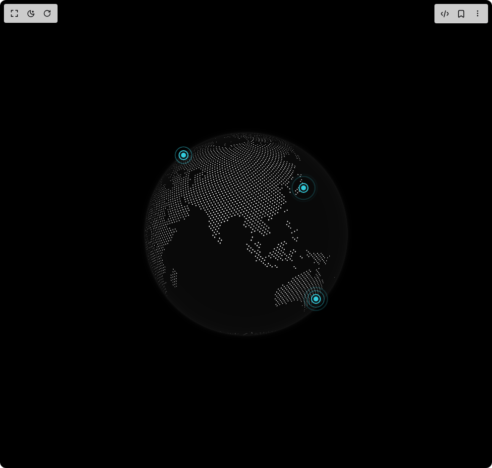

# Build Cobe Globe Pulse in BuilderStudio

> Build this component in our Agentic IDE: [BuilderStudio](https://builderstudio.dev).
>
> Join the BuilderStudio community on [Discord](https://discord.gg/QdWeSGCqfe) and [Reddit](https://reddit.com/r/builderstudio).



## Component

- Author group: `shuding`
- Component: `cobe-globe-pulse`
- Variant: `default`
- Rendered HTML snapshot: [`rendered.html`](rendered.html)

## BuilderStudio prompt

You are implementing a React component based on a component reference.

## Component identity

- Author: shuding
- Component slug: cobe-globe-pulse
- Demo slug: default
- Title: cobe-globe-pulse
- Description: 

## Goal

Recreate this component in a React + TypeScript + Tailwind CSS project. Preserve the visual layout, spacing, colors, border radius, shadows, interaction behavior, animation behavior, responsive behavior, and dark mode behavior shown in the rendered demo.

## Implementation requirements

- Use React and TypeScript.
- Use Tailwind CSS classes whenever possible.
- Keep the component self-contained unless the source files require helper components.
- If the source uses CSS variables, custom CSS, animations, or keyframes, include them.
- If the source uses external packages, list and use the required packages.
- Preserve accessibility attributes, button semantics, links, keyboard behavior, and ARIA attributes when visible in the source.
- Do not replace the component with a simplified placeholder.
- Return complete production-ready code.

## Dependencies

No reference metadata available.

## Rendered DOM snapshot

This is the rendered demo HTML extracted from the live preview. Use it to verify structure, class names, visible content, and layout.

```html
<div id="root"><div class="w-screen min-h-screen flex justify-center items-center"><div class="fixed top-4 left-4 z-10"><select class="appearance-none h-8 max-w-[200px] text-sm leading-tight rounded-lg pl-3 pr-7 py-0 border bg-background focus:outline-none focus:ring-0"><option value="default.tsx_GlobePulseDemo">default.tsx</option></select><div class="absolute top-1/2 transform -translate-y-1/2 right-2 pointer-events-none"><svg class="w-4 h-4 fill-current" viewBox="0 0 20 20"><path d="M5.516 7.548c.436-.446 1.043-.48 1.576 0L10 10.405l2.908-2.857c.533-.48 1.14-.446 1.576 0 .436.445.408 1.197 0 1.615l-3.734 3.705c-.533.534-1.39.534-1.923 0l-3.734-3.705c-.408-.418-.436-1.17 0-1.615z"></path></svg></div></div><div class="w-screen min-h-screen flex justify-center items-center"><div class="flex items-center justify-center w-full min-h-screen bg-black p-8 overflow-hidden"><div class="w-full max-w-lg"><div class="relative aspect-square select-none "><style>
        @keyframes pulse-expand {
          0% { transform: scaleX(0.3) scaleY(0.3); opacity: 0.8; }
          100% { transform: scaleX(1.5) scaleY(1.5); opacity: 0; }
        }
      </style><div style="position: relative; width: 100%; height: 100%;"><canvas width="512" height="512" style="width: 100%; height: 100%; cursor: grab; opacity: 1; transition: opacity 1.2s; border-radius: 50%; touch-action: none;"></canvas><div style="position: absolute; width: 1px; height: 1px; pointer-events: none; anchor-name: --cobe-pulse-1; left: 25.2747%; top: 18.7387%;"></div><div style="position: absolute; width: 1px; height: 1px; pointer-events: none; anchor-name: --cobe-pulse-2; left: 45.0351%; top: 18.4883%;"></div><div style="position: absolute; width: 1px; height: 1px; pointer-events: none; anchor-name: --cobe-pulse-3; left: 72.1941%; top: 31.8492%;"></div><div style="position: absolute; width: 1px; height: 1px; pointer-events: none; anchor-name: --cobe-pulse-4; left: 77.087%; top: 75.6661%;"></div></div><div style="position: absolute; position-anchor: --cobe-pulse-1; bottom: anchor(center); left: anchor(center); translate: -50% 50%; width: 40px; height: 40px; display: flex; align-items: center; justify-content: center; pointer-events: none; opacity: var(--cobe-visible-pulse-1, 0); filter: blur(calc((1 - var(--cobe-visible-pulse-1, 0)) * 8px)); transition: opacity 0.4s, filter 0.4s;"><span style="position: absolute; inset: 0px; border: 2px solid rgb(51, 204, 221); border-radius: 50%; opacity: 0; animation: 2s ease-out 0s infinite normal none running pulse-expand;"></span><span style="position: absolute; inset: 0px; border: 2px solid rgb(51, 204, 221); border-radius: 50%; opacity: 0; animation: 2s ease-out 0.5s infinite normal none running pulse-expand;"></span><span style="width: 10px; height: 10px; background: rgb(51, 204, 221); border-radius: 50%; box-shadow: rgb(17, 17, 17) 0px 0px 0px 3px, rgb(51, 204, 221) 0px 0px 0px 5px;"></span></div><div style="position: absolute; position-anchor: --cobe-pulse-2; bottom: anchor(center); left: anchor(center); translate: -50% 50%; width: 40px; height: 40px; display: flex; align-items: center; justify-content: center; pointer-events: none; opacity: var(--cobe-visible-pulse-2, 0); filter: blur(calc((1 - var(--cobe-visible-pulse-2, 0)) * 8px)); transition: opacity 0.4s, filter 0.4s;"><span style="position: absolute; inset: 0px; border: 2px solid rgb(51, 204, 221); border-radius: 50%; opacity: 0; animation: 2s ease-out 0.5s infinite normal none running pulse-expand;"></span><span style="position: absolute; inset: 0px; border: 2px solid rgb(51, 204, 221); border-radius: 50%; opacity: 0; animation: 2s ease-out 1s infinite normal none running pulse-expand;"></span><span style="width: 10px; height: 10px; background: rgb(51, 204, 221); border-radius: 50%; box-shadow: rgb(17, 17, 17) 0px 0px 0px 3px, rgb(51, 204, 221) 0px 0px 0px 5px;"></span></div><div style="position: absolute; position-anchor: --cobe-pulse-3; bottom: anchor(center); left: anchor(center); translate: -50% 50%; width: 40px; height: 40px; display: flex; align-items: center; justify-content: center; pointer-events: none; opacity: var(--cobe-visible-pulse-3, 0); filter: blur(calc((1 - var(--cobe-visible-pulse-3, 0)) * 8px)); transition: opacity 0.4s, filter 0.4s;"><span style="position: absolute; inset: 0px; border: 2px solid rgb(51, 204, 221); border-radius: 50%; opacity: 0; animation: 2s ease-out 1s infinite normal none running pulse-expand;"></span><span style="position: absolute; inset: 0px; border: 2px solid rgb(51, 204, 221); border-radius: 50%; opacity: 0; animation: 2s ease-out 1.5s infinite normal none running pulse-expand;"></span><span style="width: 10px; height: 10px; background: rgb(51, 204, 221); border-radius: 50%; box-shadow: rgb(17, 17, 17) 0px 0px 0px 3px, rgb(51, 204, 221) 0px 0px 0px 5px;"></span></div><div style="position: absolute; position-anchor: --cobe-pulse-4; bottom: anchor(center); left: anchor(center); translate: -50% 50%; width: 40px; height: 40px; display: flex; align-items: center; justify-content: center; pointer-events: none; opacity: var(--cobe-visible-pulse-4, 0); filter: blur(calc((1 - var(--cobe-visible-pulse-4, 0)) * 8px)); transition: opacity 0.4s, filter 0.4s;"><span style="position: absolute; inset: 0px; border: 2px solid rgb(51, 204, 221); border-radius: 50%; opacity: 0; animation: 2s ease-out 1.5s infinite normal none running pulse-expand;"></span><span style="position: absolute; inset: 0px; border: 2px solid rgb(51, 204, 221); border-radius: 50%; opacity: 0; animation: 2s ease-out 2s infinite normal none running pulse-expand;"></span><span style="width: 10px; height: 10px; background: rgb(51, 204, 221); border-radius: 50%; box-shadow: rgb(17, 17, 17) 0px 0px 0px 3px, rgb(51, 204, 221) 0px 0px 0px 5px;"></span></div></div></div></div></div></div></div>
```

## Reference source files

No reference source files were available.
