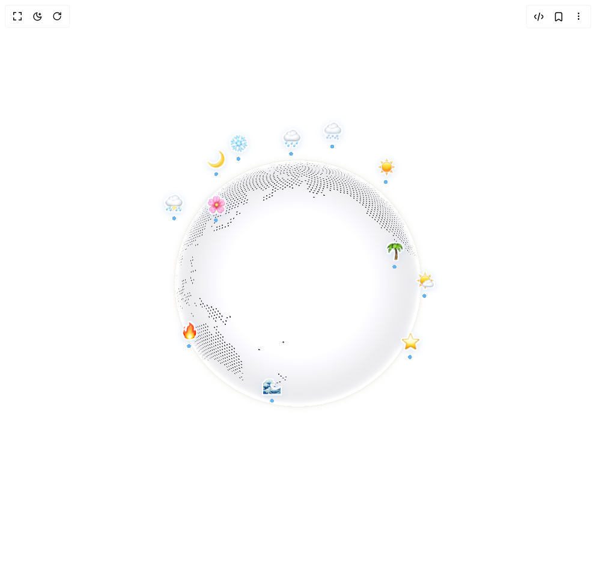

# Build Cobe Globe Weather in BuilderStudio

> Build this component in our Agentic IDE: [BuilderStudio](https://builderstudio.dev).
>
> Join the BuilderStudio community on [Discord](https://discord.gg/QdWeSGCqfe) and [Reddit](https://reddit.com/r/builderstudio).



## Component

- Author group: `shuding`
- Component: `cobe-globe-weather`
- Variant: `default`
- Rendered HTML snapshot: [`rendered.html`](rendered.html)

## BuilderStudio prompt

You are implementing a React component based on a component reference.

## Component identity

- Author: shuding
- Component slug: cobe-globe-weather
- Demo slug: default
- Title: cobe-globe-weather
- Description: 

## Goal

Recreate this component in a React + TypeScript + Tailwind CSS project. Preserve the visual layout, spacing, colors, border radius, shadows, interaction behavior, animation behavior, responsive behavior, and dark mode behavior shown in the rendered demo.

## Implementation requirements

- Use React and TypeScript.
- Use Tailwind CSS classes whenever possible.
- Keep the component self-contained unless the source files require helper components.
- If the source uses CSS variables, custom CSS, animations, or keyframes, include them.
- If the source uses external packages, list and use the required packages.
- Preserve accessibility attributes, button semantics, links, keyboard behavior, and ARIA attributes when visible in the source.
- Do not replace the component with a simplified placeholder.
- Return complete production-ready code.

## Dependencies

No reference metadata available.

## Rendered DOM snapshot

This is the rendered demo HTML extracted from the live preview. Use it to verify structure, class names, visible content, and layout.

```html
<div id="root"><div class="w-screen min-h-screen flex justify-center items-center"><div class="fixed top-4 left-4 z-10"><select class="appearance-none h-8 max-w-[200px] text-sm leading-tight rounded-lg pl-3 pr-7 py-0 border bg-background focus:outline-none focus:ring-0"><option value="default.tsx_GlobeWeatherDemo">default.tsx</option></select><div class="absolute top-1/2 transform -translate-y-1/2 right-2 pointer-events-none"><svg class="w-4 h-4 fill-current" viewBox="0 0 20 20"><path d="M5.516 7.548c.436-.446 1.043-.48 1.576 0L10 10.405l2.908-2.857c.533-.48 1.14-.446 1.576 0 .436.445.408 1.197 0 1.615l-3.734 3.705c-.533.534-1.39.534-1.923 0l-3.734-3.705c-.408-.418-.436-1.17 0-1.615z"></path></svg></div></div><div class="w-screen min-h-screen flex justify-center items-center"><div class="flex items-center justify-center w-full min-h-screen bg-white p-8 overflow-hidden"><div class="w-full max-w-lg"><div class="relative aspect-square select-none "><style>
        @keyframes weather-float {
          0%, 100% { transform: translateY(0); }
          50% { transform: translateY(-4px); }
        }
      </style><svg width="0" height="0" style="position: absolute;"><defs><filter id="sticker-outline-weather"><feMorphology in="SourceAlpha" result="Dilated" operator="dilate" radius="2"></feMorphology><feFlood flood-color="#ffffff" result="OutlineColor"></feFlood><feComposite in="OutlineColor" in2="Dilated" operator="in" result="Outline"></feComposite><feMerge><feMergeNode in="Outline"></feMergeNode><feMergeNode in="SourceGraphic"></feMergeNode></feMerge></filter></defs></svg><div style="position: relative; width: 100%; height: 100%;"><canvas width="512" height="512" style="width: 100%; height: 100%; cursor: grab; opacity: 1; transition: opacity 1.2s; border-radius: 50%; touch-action: none;"></canvas><div style="position: absolute; width: 1px; height: 1px; pointer-events: none; anchor-name: --cobe-weather-1; left: 78.4058%; top: 17.0953%;"></div><div style="position: absolute; width: 1px; height: 1px; pointer-events: none; anchor-name: --cobe-weather-2; left: 48.2142%; top: 7.84034%;"></div><div style="position: absolute; width: 1px; height: 1px; pointer-events: none; anchor-name: --cobe-weather-3; left: 9.9488%; top: 28.6476%;"></div><div style="position: absolute; width: 1px; height: 1px; pointer-events: none; anchor-name: --cobe-weather-4; left: 91.4228%; top: 54.1851%;"></div><div style="position: absolute; width: 1px; height: 1px; pointer-events: none; anchor-name: --cobe-weather-5; left: 30.6041%; top: 9.40228%;"></div><div style="position: absolute; width: 1px; height: 1px; pointer-events: none; anchor-name: --cobe-weather-6; left: 22.8403%; top: 29.3305%;"></div><div style="position: absolute; width: 1px; height: 1px; pointer-events: none; anchor-name: --cobe-weather-7; left: 37.1085%; top: 65.053%;"></div><div style="position: absolute; width: 1px; height: 1px; pointer-events: none; anchor-name: --cobe-weather-8; left: 56.7956%; top: 14.1519%;"></div><div style="position: absolute; width: 1px; height: 1px; pointer-events: none; anchor-name: --cobe-weather-9; left: 40.9695%; top: 88.0866%;"></div><div style="position: absolute; width: 1px; height: 1px; pointer-events: none; anchor-name: --cobe-weather-10; left: 80.799%; top: 44.6943%;"></div><div style="position: absolute; width: 1px; height: 1px; pointer-events: none; anchor-name: --cobe-weather-11; left: 61.34%; top: 5.46919%;"></div><div style="position: absolute; width: 1px; height: 1px; pointer-events: none; anchor-name: --cobe-weather-12; left: 14.114%; top: 70.2067%;"></div><div style="position: absolute; width: 1px; height: 1px; pointer-events: none; anchor-name: --cobe-weather-13; left: 24.454%; top: 38.5126%;"></div><div style="position: absolute; width: 1px; height: 1px; pointer-events: none; anchor-name: --cobe-weather-14; left: 23.7249%; top: 14.3123%;"></div><div style="position: absolute; width: 1px; height: 1px; pointer-events: none; anchor-name: --cobe-weather-15; left: 86.5806%; top: 74.0626%;"></div><div style="position: absolute; width: 1px; height: 1px; pointer-events: none; anchor-name: --cobe-weather-16; left: 69.0296%; top: 26.87%;"></div></div><div style="position: absolute; position-anchor: --cobe-weather-1; bottom: anchor(top); left: anchor(center); translate: -50%; font-size: 1.8rem; filter: url(&quot;#sticker-outline-weather&quot;) drop-shadow(rgba(100, 150, 220, 0.4) 0px 2px 6px); pointer-events: none; opacity: var(--cobe-visible-weather-1, 0); transition: opacity 0.3s, filter 0.3s; animation: 3s ease-in-out 0s infinite normal none running weather-float;">☀️</div><div style="position: absolute; position-anchor: --cobe-weather-2; bottom: anchor(top); left: anchor(center); translate: -50%; font-size: 1.8rem; filter: url(&quot;#sticker-outline-weather&quot;) drop-shadow(rgba(100, 150, 220, 0.4) 0px 2px 6px); pointer-events: none; opacity: var(--cobe-visible-weather-2, 0); transition: opacity 0.3s, filter 0.3s; animation: 3s ease-in-out 0s infinite normal none running weather-float;">🌧️</div><div style="position: absolute; position-anchor: --cobe-weather-3; bottom: anchor(top); left: anchor(center); translate: -50%; font-size: 1.8rem; filter: url(&quot;#sticker-outline-weather&quot;) drop-shadow(rgba(100, 150, 220, 0.4) 0px 2px 6px); pointer-events: none; opacity: var(--cobe-visible-weather-3, 0); transition: opacity 0.3s, filter 0.3s; animation: 3s ease-in-out 0s infinite normal none running weather-float;">⛈️</div><div style="position: absolute; position-anchor: --cobe-weather-4; bottom: anchor(top); left: anchor(center); translate: -50%; font-size: 1.8rem; filter: url(&quot;#sticker-outline-weather&quot;) drop-shadow(rgba(100, 150, 220, 0.4) 0px 2px 6px); pointer-events: none; opacity: var(--cobe-visible-weather-4, 0); transition: opacity 0.3s, filter 0.3s; animation: 3s ease-in-out 0s infinite normal none running weather-float;">🌤️</div><div style="position: absolute; position-anchor: --cobe-weather-5; bottom: anchor(top); left: anchor(center); translate: -50%; font-size: 1.8rem; filter: url(&quot;#sticker-outline-weather&quot;) drop-shadow(rgba(100, 150, 220, 0.4) 0px 2px 6px); pointer-events: none; opacity: var(--cobe-visible-weather-5, 0); transition: opacity 0.3s, filter 0.3s; animation: 3s ease-in-out 0s infinite normal none running weather-float;">❄️</div><div style="position: absolute; position-anchor: --cobe-weather-6; bottom: anchor(top); left: anchor(center); translate: -50%; font-size: 1.8rem; filter: url(&quot;#sticker-outline-weather&quot;) drop-shadow(rgba(100, 150, 220, 0.4) 0px 2px 6px); pointer-events: none; opacity: var(--cobe-visible-weather-6, 0); transition: opacity 0.3s, filter 0.3s; animation: 3s ease-in-out 0s infinite normal none running weather-float;">🌸</div><div style="position: absolute; position-anchor: --cobe-weather-7; bottom: anchor(top); left: anchor(center); translate: -50%; font-size: 1.8rem; filter: url(&quot;#sticker-outline-weather&quot;) drop-shadow(rgba(100, 150, 220, 0.4) 0px 2px 6px); pointer-events: none; opacity: var(--cobe-visible-weather-7, 0); transition: opacity 0.3s, filter 0.3s; animation: 3s ease-in-out 0s infinite normal none running weather-float;">🌈</div><div style="position: absolute; position-anchor: --cobe-weather-8; bottom: anchor(top); left: anchor(center); translate: -50%; font-size: 1.8rem; filter: url(&quot;#sticker-outline-weather&quot;) drop-shadow(rgba(100, 150, 220, 0.4) 0px 2px 6px); pointer-events: none; opacity: var(--cobe-visible-weather-8, 0); transition: opacity 0.3s, filter 0.3s; animation: 3s ease-in-out 0s infinite normal none running weather-float;">☁️</div><div style="position: absolute; position-anchor: --cobe-weather-9; bottom: anchor(top); left: anchor(center); translate: -50%; font-size: 1.8rem; filter: url(&quot;#sticker-outline-weather&quot;) drop-shadow(rgba(100, 150, 220, 0.4) 0px 2px 6px); pointer-events: none; opacity: var(--cobe-visible-weather-9, 0); transition: opacity 0.3s, filter 0.3s; animation: 3s ease-in-out 0s infinite normal none running weather-float;">🌊</div><div style="position: absolute; position-anchor: --cobe-weather-10; bottom: anchor(top); left: anchor(center); translate: -50%; font-size: 1.8rem; filter: url(&quot;#sticker-outline-weather&quot;) drop-shadow(rgba(100, 150, 220, 0.4) 0px 2px 6px); pointer-events: none; opacity: var(--cobe-visible-weather-10, 0); transition: opacity 0.3s, filter 0.3s; animation: 3s ease-in-out 0s infinite normal none running weather-float;">🌴</div><div style="position: absolute; position-anchor: --cobe-weather-11; bottom: anchor(top); left: anchor(center); translate: -50%; font-size: 1.8rem; filter: url(&quot;#sticker-outline-weather&quot;) drop-shadow(rgba(100, 150, 220, 0.4) 0px 2px 6px); pointer-events: none; opacity: var(--cobe-visible-weather-11, 0); transition: opacity 0.3s, filter 0.3s; animation: 3s ease-in-out 0s infinite normal none running weather-float;">🌨️</div><div style="position: absolute; position-anchor: --cobe-weather-12; bottom: anchor(top); left: anchor(center); translate: -50%; font-size: 1.8rem; filter: url(&quot;#sticker-outline-weather&quot;) drop-shadow(rgba(100, 150, 220, 0.4) 0px 2px 6px); pointer-events: none; opacity: var(--cobe-visible-weather-12, 0); transition: opacity 0.3s, filter 0.3s; animation: 3s ease-in-out 0s infinite normal none running weather-float;">🔥</div><div style="position: absolute; position-anchor: --cobe-weather-13; bottom: anchor(top); left: anchor(center); translate: -50%; font-size: 1.8rem; filter: url(&quot;#sticker-outline-weather&quot;) drop-shadow(rgba(100, 150, 220, 0.4) 0px 2px 6px); pointer-events: none; opacity: var(--cobe-visible-weather-13, 0); transition: opacity 0.3s, filter 0.3s; animation: 3s ease-in-out 0s infinite normal none running weather-float;">🌪️</div><div style="position: absolute; position-anchor: --cobe-weather-14; bottom: anchor(top); left: anchor(center); translate: -50%; font-size: 1.8rem; filter: url(&quot;#sticker-outline-weather&quot;) drop-shadow(rgba(100, 150, 220, 0.4) 0px 2px 6px); pointer-events: none; opacity: var(--cobe-visible-weather-14, 0); transition: opacity 0.3s, filter 0.3s; animation: 3s ease-in-out 0s infinite normal none running weather-float;">🌙</div><div style="position: absolute; position-anchor: --cobe-weather-15; bottom: anchor(top); left: anchor(center); translate: -50%; font-size: 1.8rem; filter: url(&quot;#sticker-outline-weather&quot;) drop-shadow(rgba(100, 150, 220, 0.4) 0px 2px 6px); pointer-events: none; opacity: var(--cobe-visible-weather-15, 0); transition: opacity 0.3s, filter 0.3s; animation: 3s ease-in-out 0s infinite normal none running weather-float;">⭐</div><div style="position: absolute; position-anchor: --cobe-weather-16; bottom: anchor(top); left: anchor(center); translate: -50%; font-size: 1.8rem; filter: url(&quot;#sticker-outline-weather&quot;) drop-shadow(rgba(100, 150, 220, 0.4) 0px 2px 6px); pointer-events: none; opacity: var(--cobe-visible-weather-16, 0); transition: opacity 0.3s, filter 0.3s; animation: 3s ease-in-out 0s infinite normal none running weather-float;">🌞</div></div></div></div></div></div></div>
```

## Reference source files

No reference source files were available.
