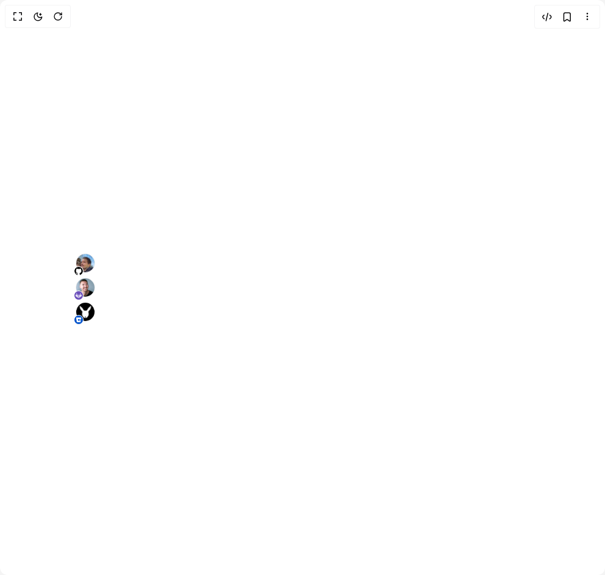

# Build Avatar 1 in BuilderStudio

> Build this component in our Agentic IDE: [BuilderStudio](https://builderstudio.dev).
>
> Join the BuilderStudio community on [Discord](https://discord.gg/QdWeSGCqfe) and [Reddit](https://reddit.com/r/builderstudio).



## Component

- Author group: `shugar`
- Component: `avatar-1`
- Variant: `git`
- Rendered HTML snapshot: [`rendered.html`](rendered.html)

## BuilderStudio prompt

You are implementing a React component based on a component reference.

## Component identity

- Author: shugar
- Component slug: avatar-1
- Demo slug: git
- Title: avatar-1
- Description: 

## Goal

Recreate this component in a React + TypeScript + Tailwind CSS project. Preserve the visual layout, spacing, colors, border radius, shadows, interaction behavior, animation behavior, responsive behavior, and dark mode behavior shown in the rendered demo.

## Implementation requirements

- Use React and TypeScript.
- Use Tailwind CSS classes whenever possible.
- Keep the component self-contained unless the source files require helper components.
- If the source uses CSS variables, custom CSS, animations, or keyframes, include them.
- If the source uses external packages, list and use the required packages.
- Preserve accessibility attributes, button semantics, links, keyboard behavior, and ARIA attributes when visible in the source.
- Do not replace the component with a simplified placeholder.
- Return complete production-ready code.

## Dependencies

No reference metadata available.

## Rendered DOM snapshot

This is the rendered demo HTML extracted from the live preview. Use it to verify structure, class names, visible content, and layout.

```html
<div id="root"><div class="w-screen min-h-screen flex justify-center items-center"><div class="w-screen min-h-screen flex justify-center items-center"><div class="flex flex-col gap-2 w-3/4"><div class="relative" style="width: 32px; height: 32px;"><span class="rounded-full inline-block overflow-hidden border border-gray-alpha-400 duration-200" style="width: 32px; height: 32px;"></span><div class="absolute -left-[3px] -bottom-[5px] flex items-center justify-center rounded-full overflow-hidden bg-white border border-geist-background"><svg class="text-[#000000] h-3.5 w-3.5" height="16" stroke-linejoin="round" viewBox="0 0 16 16" width="16"><g clip-path="url(#clip0_872_3147)"><path fill-rule="evenodd" clip-rule="evenodd" d="M8 0C3.58 0 0 3.57879 0 7.99729C0 11.5361 2.29 14.5251 5.47 15.5847C5.87 15.6547 6.02 15.4148 6.02 15.2049C6.02 15.0149 6.01 14.3851 6.01 13.7154C4 14.0852 3.48 13.2255 3.32 12.7757C3.23 12.5458 2.84 11.836 2.5 11.6461C2.22 11.4961 1.82 11.1262 2.49 11.1162C3.12 11.1062 3.57 11.696 3.72 11.936C4.44 13.1455 5.59 12.8057 6.05 12.5957C6.12 12.0759 6.33 11.726 6.56 11.5261C4.78 11.3262 2.92 10.6364 2.92 7.57743C2.92 6.70773 3.23 5.98797 3.74 5.42816C3.66 5.22823 3.38 4.40851 3.82 3.30888C3.82 3.30888 4.49 3.09895 6.02 4.1286C6.66 3.94866 7.34 3.85869 8.02 3.85869C8.7 3.85869 9.38 3.94866 10.02 4.1286C11.55 3.08895 12.22 3.30888 12.22 3.30888C12.66 4.40851 12.38 5.22823 12.3 5.42816C12.81 5.98797 13.12 6.69773 13.12 7.57743C13.12 10.6464 11.25 11.3262 9.47 11.5261C9.76 11.776 10.01 12.2558 10.01 13.0056C10.01 14.0752 10 14.9349 10 15.2049C10 15.4148 10.15 15.6647 10.55 15.5847C12.1381 15.0488 13.5182 14.0284 14.4958 12.6673C15.4735 11.3062 15.9996 9.67293 16 7.99729C16 3.57879 12.42 0 8 0Z"></path></g><defs><clipPath id="clip0_872_3147"><rect width="16" height="16" fill="white"></rect></clipPath></defs></svg></div></div><div class="relative" style="width: 32px; height: 32px;"><span class="rounded-full inline-block overflow-hidden border border-gray-alpha-400 duration-200" style="width: 32px; height: 32px;"></span><div class="absolute -left-[3px] -bottom-[5px] flex items-center justify-center rounded-full overflow-hidden bg-[#6b4fbb] border border-geist-background"><svg aria-label="gitlab" height="14" viewBox="0 0 24 22" width="14" class="scale-75 fill-white"><path d="M1.279 8.29L.044 12.294c-.117.367 0 .78.325 1.014l11.323 8.23-.009-.012-.03-.039L1.279 8.29zM22.992 13.308a.905.905 0 00.325-1.014L22.085 8.29 11.693 21.52l11.299-8.212z"></path><path d="M1.279 8.29l10.374 13.197.03.039.01-.006L22.085 8.29H1.28z" opacity="0.4"></path><path d="M15.982 8.29l-4.299 13.236-.004.011.014-.017L22.085 8.29h-6.103zM7.376 8.29H1.279l10.374 13.197L7.376 8.29z" opacity="0.6"></path><path d="M18.582.308l-2.6 7.982h6.103L19.48.308c-.133-.41-.764-.41-.897 0zM1.279 8.29L3.88.308c.133-.41.764-.41.897 0l2.6 7.982H1.279z" opacity="0.4"></path></svg></div></div><div class="relative" style="width: 32px; height: 32px;"><span class="rounded-full inline-block overflow-hidden border border-gray-alpha-400 duration-200" style="width: 32px; height: 32px;"></span><div class="absolute -left-[3px] -bottom-[5px] flex items-center justify-center rounded-full overflow-hidden bg-[#0052cc] border border-geist-background"><svg height="14" viewBox="-2 -2 65 59" width="14" class="scale-[65%]"><defs><linearGradient id="bitbucketGradient" x1="104.953%" x2="46.569%" y1="21.921%" y2="75.234%"><stop offset="7%" stop-color="white" stop-opacity=".4"></stop><stop offset="100%" stop-color="white"></stop></linearGradient></defs><path d="M59.696 18.86h-18.77l-3.15 18.39h-13L9.426 55.47a2.71 2.71 0 001.75.66h40.74a2 2 0 002-1.68l5.78-35.59z" fill="url(#bitbucketGradient)" fill-rule="nonzero" transform="translate(-.026 .82)"></path><path d="M2 .82a2 2 0 00-2 2.32l8.49 51.54a2.7 2.7 0 00.91 1.61 2.71 2.71 0 001.75.66l15.76-18.88H24.7l-3.47-18.39h38.44l2.7-16.53a2 2 0 00-2-2.32L2 .82z" fill-rule="nonzero" class="fill-white"></path></svg></div></div></div></div></div></div>
```

## Reference source files

No reference source files were available.
