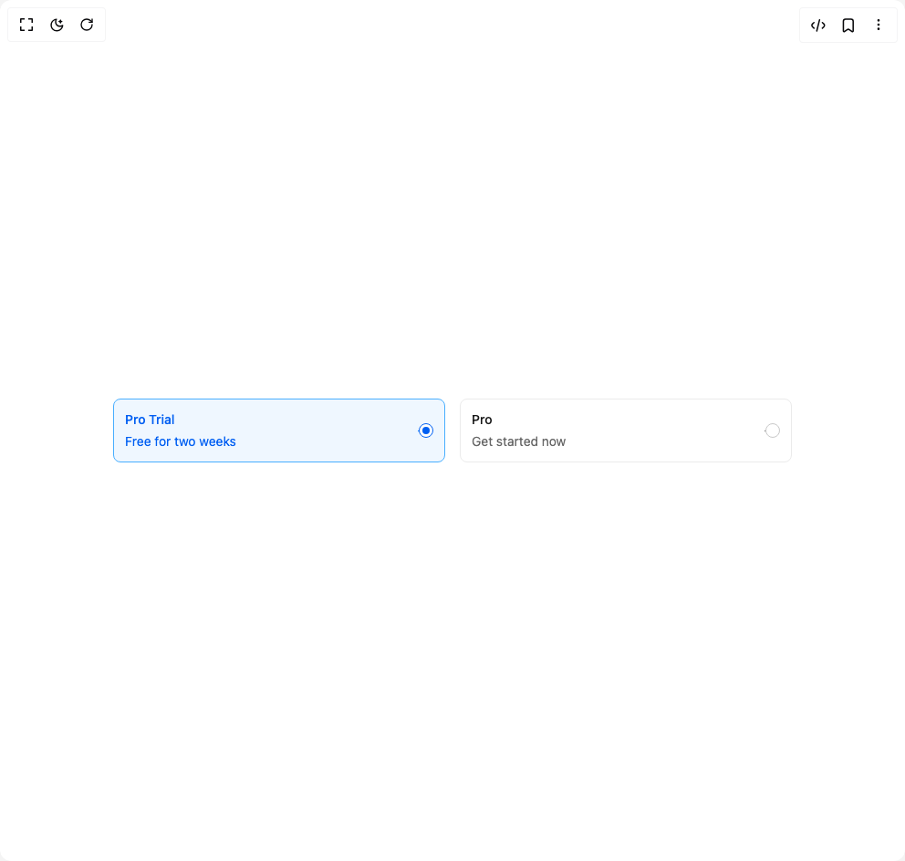

# Build Choicebox 1 in BuilderStudio

> Build this component in our Agentic IDE: [BuilderStudio](https://builderstudio.dev).
>
> Join the BuilderStudio community on [Discord](https://discord.gg/QdWeSGCqfe) and [Reddit](https://reddit.com/r/builderstudio).



## Component

- Author group: `shugar`
- Component: `choicebox-1`
- Variant: `default`
- Rendered HTML snapshot: [`rendered.html`](rendered.html)

## BuilderStudio prompt

You are implementing a React component based on a component reference.

## Component identity

- Author: shugar
- Component slug: choicebox-1
- Demo slug: default
- Title: choicebox-1
- Description: 

## Goal

Recreate this component in a React + TypeScript + Tailwind CSS project. Preserve the visual layout, spacing, colors, border radius, shadows, interaction behavior, animation behavior, responsive behavior, and dark mode behavior shown in the rendered demo.

## Implementation requirements

- Use React and TypeScript.
- Use Tailwind CSS classes whenever possible.
- Keep the component self-contained unless the source files require helper components.
- If the source uses CSS variables, custom CSS, animations, or keyframes, include them.
- If the source uses external packages, list and use the required packages.
- Preserve accessibility attributes, button semantics, links, keyboard behavior, and ARIA attributes when visible in the source.
- Do not replace the component with a simplified placeholder.
- Return complete production-ready code.

## Dependencies

No reference metadata available.

## Rendered DOM snapshot

This is the rendered demo HTML extracted from the live preview. Use it to verify structure, class names, visible content, and layout.

```html
<div id="root"><div class="w-screen min-h-screen flex justify-center items-center"><div class="w-screen min-h-screen flex justify-center items-center"><div class="w-3/4"><div class="flex flex-col gap-2"><div class="flex gap-4 flex-row"><div class="border w-full rounded-md duration-150 border-blue-600 cursor-pointer bg-blue-100"><div class="flex items-center gap-4 p-3"><div class="flex flex-col gap-1 font-sans text-sm"><span class="font-medium text-blue-900">Pro Trial</span><span class="text-blue-900">Free for two weeks</span></div><div class="flex items-center ml-auto"><input class="absolute w-[1px] h-[1px] p-0 m-[-1] overflow-hidden whitespace-nowrap border-none" type="radio" value="trial" checked=""><span class="relative border w-4 h-4 duration-200 rounded-[50%] after:w-2 after:h-2 after:rounded-[50%] after:absolute after:top-1/2 after:left-1/2 after:-translate-x-1/2 after:-translate-y-1/2 bg-background-100 border-blue-900 after:bg-blue-900 after:scale-100"></span></div></div></div><div class="border w-full rounded-md duration-150 border-gray-400 cursor-pointer bg-transparent"><div class="flex items-center gap-4 p-3"><div class="flex flex-col gap-1 font-sans text-sm"><span class="font-medium text-gray-1000">Pro</span><span class="text-gray-900">Get started now</span></div><div class="flex items-center ml-auto"><input class="absolute w-[1px] h-[1px] p-0 m-[-1] overflow-hidden whitespace-nowrap border-none" type="radio" value="pro"><span class="relative border w-4 h-4 duration-200 rounded-[50%] after:w-2 after:h-2 after:rounded-[50%] after:absolute after:top-1/2 after:left-1/2 after:-translate-x-1/2 after:-translate-y-1/2 bg-background-100 border-gray-500 after:bg-gray-500 after:scale-0"></span></div></div></div></div></div></div></div></div></div>
```

## Reference source files

No reference source files were available.
