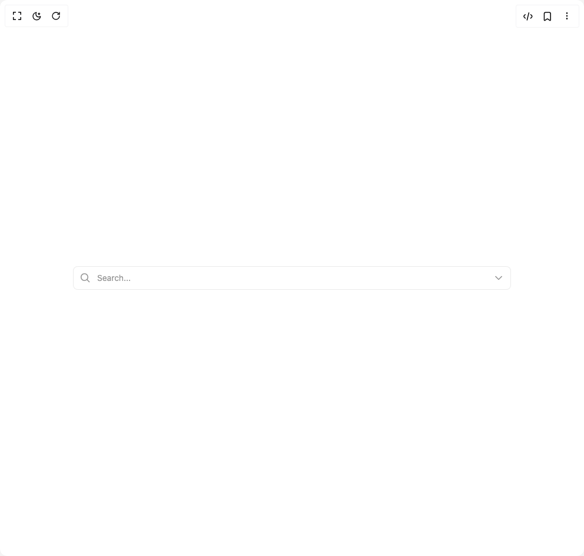

# Build Combobox in BuilderStudio

> Build this component in our Agentic IDE: [BuilderStudio](https://builderstudio.dev).
>
> Join the BuilderStudio community on [Discord](https://discord.gg/QdWeSGCqfe) and [Reddit](https://reddit.com/r/builderstudio).



## Component

- Author group: `shugar`
- Component: `combobox`
- Variant: `custom-width-list`
- Rendered HTML snapshot: [`rendered.html`](rendered.html)

## BuilderStudio prompt

You are implementing a React component based on a component reference.

## Component identity

- Author: shugar
- Component slug: combobox
- Demo slug: custom-width-list
- Title: combobox
- Description: 

## Goal

Recreate this component in a React + TypeScript + Tailwind CSS project. Preserve the visual layout, spacing, colors, border radius, shadows, interaction behavior, animation behavior, responsive behavior, and dark mode behavior shown in the rendered demo.

## Implementation requirements

- Use React and TypeScript.
- Use Tailwind CSS classes whenever possible.
- Keep the component self-contained unless the source files require helper components.
- If the source uses CSS variables, custom CSS, animations, or keyframes, include them.
- If the source uses external packages, list and use the required packages.
- Preserve accessibility attributes, button semantics, links, keyboard behavior, and ARIA attributes when visible in the source.
- Do not replace the component with a simplified placeholder.
- Return complete production-ready code.

## Dependencies

No reference metadata available.

## Rendered DOM snapshot

This is the rendered demo HTML extracted from the live preview. Use it to verify structure, class names, visible content, and layout.

```html
<div id="root"><div class="w-screen min-h-screen flex justify-center items-center"><div class="w-screen min-h-screen flex justify-center items-center"><div class="w-3/4"><div class="relative w-full inline-block text-sm font-sans"><div class="flex flex-col gap-2"><div class="flex items-center duration-150 font-sans border border-gray-alpha-400 hover:border-gray-alpha-500 focus-within:border-transparent focus-within:shadow-focus-input h-10 text-sm rounded-md bg-background-100"><div class="text-gray-700 fill-gray-700 h-full flex items-center justify-center pl-3 rounded-l-md"><svg height="16" stroke-linejoin="round" viewBox="0 0 16 16" width="16"><path fill-rule="evenodd" clip-rule="evenodd" d="M1.5 6.5C1.5 3.73858 3.73858 1.5 6.5 1.5C9.26142 1.5 11.5 3.73858 11.5 6.5C11.5 9.26142 9.26142 11.5 6.5 11.5C3.73858 11.5 1.5 9.26142 1.5 6.5ZM6.5 0C2.91015 0 0 2.91015 0 6.5C0 10.0899 2.91015 13 6.5 13C8.02469 13 9.42677 12.475 10.5353 11.596L13.9697 15.0303L14.5 15.5607L15.5607 14.5L15.0303 13.9697L11.596 10.5353C12.475 9.42677 13 8.02469 13 6.5C13 2.91015 10.0899 0 6.5 0Z"></path></svg></div><input class="w-full inline-flex appearance-none placeholder:text-gray-900 placeholder:opacity-70 outline-none px-3 bg-background-100 text-geist-foreground" placeholder="Search..." value=""><div class="text-gray-700 fill-gray-700 h-full flex items-center justify-center pr-3  cursor-pointer rounded-r-md"><svg height="16" stroke-linejoin="round" viewBox="0 0 16 16" width="16" class="duration-200"><path fill-rule="evenodd" clip-rule="evenodd" d="M14.0607 5.49999L13.5303 6.03032L8.7071 10.8535C8.31658 11.2441 7.68341 11.2441 7.29289 10.8535L2.46966 6.03032L1.93933 5.49999L2.99999 4.43933L3.53032 4.96966L7.99999 9.43933L12.4697 4.96966L13 4.43933L14.0607 5.49999Z"></path></svg></div></div></div><div class="bg-background-100 rounded-xl shadow-menu absolute w-full z-50 left-1/2 -translate-x-1/2 opacity-0 pointer-events-none duration-200" style="max-width: 500px;"><ul class="p-2"><li class="flex justify-between items-center gap-2 cursor-pointer px-2 py-2.5 w-full rounded-md hover:bg-gray-alpha-100 active:bg-gray-alpha-100 font-sans text-gray-1000 fill-gray-1000 text-sm">Lorem ipsum dolor sit amet, consectetur adipiscing elit, sed do eiusmod tempor incididunt ut labore et dolore magna aliqua. </li><li class="flex justify-between items-center gap-2 cursor-pointer px-2 py-2.5 w-full rounded-md hover:bg-gray-alpha-100 active:bg-gray-alpha-100 font-sans text-gray-1000 fill-gray-1000 text-sm">Ut enim ad minim veniam, quis nostrud exercitation ullamco laboris nisi ut aliquip ex ea commodo consequat. Duis aute irure dolor in reprehenderit in voluptate velit esse cillum dolore eu fugiat nulla pariatur.</li><li class="flex justify-between items-center gap-2 cursor-pointer px-2 py-2.5 w-full rounded-md hover:bg-gray-alpha-100 active:bg-gray-alpha-100 font-sans text-gray-1000 fill-gray-1000 text-sm">Excepteur sint occaecat cupidatat non proident, sunt in culpa qui officia deserunt mollit anim id est laborum.</li></ul></div></div></div></div></div></div>
```

## Reference source files

No reference source files were available.
