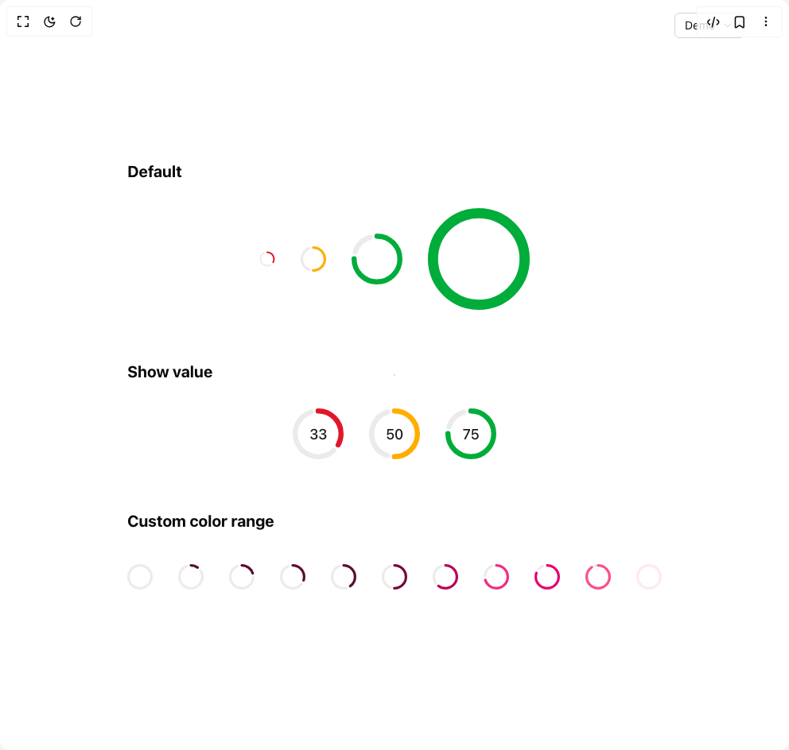

# Build Gauge in BuilderStudio

> Build this component in our Agentic IDE: [BuilderStudio](https://builderstudio.dev).
>
> Join the BuilderStudio community on [Discord](https://discord.gg/QdWeSGCqfe) and [Reddit](https://reddit.com/r/builderstudio).



## Component

- Author group: `shugar`
- Component: `gauge`
- Variant: `default`
- Rendered HTML snapshot: [`rendered.html`](rendered.html)

## BuilderStudio prompt

You are implementing a React component based on a component reference.

## Component identity

- Author: shugar
- Component slug: gauge
- Demo slug: default
- Title: gauge
- Description: 

## Goal

Recreate this component in a React + TypeScript + Tailwind CSS project. Preserve the visual layout, spacing, colors, border radius, shadows, interaction behavior, animation behavior, responsive behavior, and dark mode behavior shown in the rendered demo.

## Implementation requirements

- Use React and TypeScript.
- Use Tailwind CSS classes whenever possible.
- Keep the component self-contained unless the source files require helper components.
- If the source uses CSS variables, custom CSS, animations, or keyframes, include them.
- If the source uses external packages, list and use the required packages.
- Preserve accessibility attributes, button semantics, links, keyboard behavior, and ARIA attributes when visible in the source.
- Do not replace the component with a simplified placeholder.
- Return complete production-ready code.

## Dependencies

No reference metadata available.

## Rendered DOM snapshot

This is the rendered demo HTML extracted from the live preview. Use it to verify structure, class names, visible content, and layout.

```html
<div id="root"><div class="relative flex items-center justify-center h-screen w-full m-auto p-16 bg-background text-foreground"><div class="absolute lab-bg inset-0 size-full"><div class="absolute inset-0 bg-[radial-gradient(#00000021_1px,transparent_1px)] dark:bg-[radial-gradient(#ffffff22_1px,transparent_1px)]"></div></div><div class="absolute z-10 top-4 right-14 flex flex-col items-end gap-1"><button type="button" role="combobox" aria-controls="radix-«r0»" aria-expanded="false" aria-autocomplete="none" dir="ltr" data-state="closed" class="flex w-full items-center justify-between rounded-md border border-input bg-background px-3 py-2 text-sm ring-offset-background placeholder:text-muted-foreground focus:outline-none focus:ring-2 focus:ring-ring focus:ring-offset-2 disabled:cursor-not-allowed disabled:opacity-50 [&amp;&gt;span]:line-clamp-1 gap-2 h-8"><span style="pointer-events: none;">Demo</span><svg xmlns="http://www.w3.org/2000/svg" width="24" height="24" viewBox="0 0 24 24" fill="none" stroke="currentColor" stroke-width="2" stroke-linecap="round" stroke-linejoin="round" class="lucide lucide-chevron-down h-4 w-4 opacity-50" aria-hidden="true"><path d="m6 9 6 6 6-6"></path></svg></button></div><div class="flex w-full justify-center relative"><div class="flex flex-col gap-16"><div class="flex flex-col gap-8"><div class="font-bold text-xl dark:text-white">Default</div><div class="flex gap-8 items-center justify-center"><div aria-valuemax="100" aria-valuemin="0" aria-valuenow="33" class="relative" role="progressbar"><svg aria-hidden="true" fill="none" height="20" width="20" viewBox="0 0 100 100" stroke-width="2"><circle cx="50" cy="50" r="42.5" stroke-width="10" stroke-dashoffset="0" stroke-linecap="round" stroke-linejoin="round" class="rotate-[calc(1turn_-_90deg_-_(9*3.6deg))] scale-y-[-1] origin-center stroke-gray-alpha-400" stroke-dasharray="130.8473340220149 267.0353755551324"></circle><circle cx="50" cy="50" r="42.5" stroke-width="10" stroke-dashoffset="0" stroke-linecap="round" stroke-linejoin="round" class="-rotate-90 origin-center" stroke="#e2162a" stroke-dasharray="88.1216739331937 267.0353755551324"></circle></svg></div><div aria-valuemax="100" aria-valuemin="0" aria-valuenow="50" class="relative" role="progressbar"><svg aria-hidden="true" fill="none" height="32" width="32" viewBox="0 0 100 100" stroke-width="2"><circle cx="50" cy="50" r="45" stroke-width="10" stroke-dashoffset="0" stroke-linecap="round" stroke-linejoin="round" class="rotate-[calc(1turn_-_90deg_-_(6*3.6deg))] scale-y-[-1] origin-center stroke-gray-alpha-400" stroke-dasharray="107.44246875277094 282.7433388230814"></circle><circle cx="50" cy="50" r="45" stroke-width="10" stroke-dashoffset="0" stroke-linecap="round" stroke-linejoin="round" class="-rotate-90 origin-center" stroke="#ffae00" stroke-dasharray="141.3716694115407 282.7433388230814"></circle></svg></div><div aria-valuemax="100" aria-valuemin="0" aria-valuenow="75" class="relative" role="progressbar"><svg aria-hidden="true" fill="none" height="64" width="64" viewBox="0 0 100 100" stroke-width="2"><circle cx="50" cy="50" r="45" stroke-width="10" stroke-dashoffset="0" stroke-linecap="round" stroke-linejoin="round" class="rotate-[calc(1turn_-_90deg_-_(5*3.6deg))] scale-y-[-1] origin-center stroke-gray-alpha-400" stroke-dasharray="42.41150082346221 282.7433388230814"></circle><circle cx="50" cy="50" r="45" stroke-width="10" stroke-dashoffset="0" stroke-linecap="round" stroke-linejoin="round" class="-rotate-90 origin-center" stroke="#00ac3a" stroke-dasharray="212.05750411731103 282.7433388230814"></circle></svg></div><div aria-valuemax="100" aria-valuemin="0" aria-valuenow="100" class="relative" role="progressbar"><svg aria-hidden="true" fill="none" height="128" width="128" viewBox="0 0 100 100" stroke-width="2"><circle cx="50" cy="50" r="45" stroke-width="10" stroke-dashoffset="0" stroke-linecap="round" stroke-linejoin="round" class="rotate-[calc(1turn_-_90deg_-_(5*3.6deg))] scale-y-[-1] origin-center stroke-gray-alpha-400" stroke-dasharray="-28.274333882308138 282.7433388230814"></circle><circle cx="50" cy="50" r="45" stroke-width="10" stroke-dashoffset="0" stroke-linecap="round" stroke-linejoin="round" class="-rotate-90 origin-center" stroke="#00ac3a" stroke-dasharray="282.7433388230814 282.7433388230814"></circle></svg></div></div></div><div class="flex flex-col gap-8"><div class="font-bold text-xl dark:text-white">Show value</div><div class="flex gap-8 items-center justify-center"><div aria-valuemax="100" aria-valuemin="0" aria-valuenow="33" class="relative" role="progressbar"><svg aria-hidden="true" fill="none" height="64" width="64" viewBox="0 0 100 100" stroke-width="2"><circle cx="50" cy="50" r="45" stroke-width="10" stroke-dashoffset="0" stroke-linecap="round" stroke-linejoin="round" class="rotate-[calc(1turn_-_90deg_-_(5*3.6deg))] scale-y-[-1] origin-center stroke-gray-alpha-400" stroke-dasharray="161.16370312915637 282.7433388230814"></circle><circle cx="50" cy="50" r="45" stroke-width="10" stroke-dashoffset="0" stroke-linecap="round" stroke-linejoin="round" class="-rotate-90 origin-center" stroke="#e2162a" stroke-dasharray="93.30530181161686 282.7433388230814"></circle></svg><div aria-hidden="true" class="absolute top-1/2 left-1/2 transform -translate-x-1/2 -translate-y-1/2"><p class="text-gray-1000 font-sans text-[18px] font-medium">33</p></div></div><div aria-valuemax="100" aria-valuemin="0" aria-valuenow="50" class="relative" role="progressbar"><svg aria-hidden="true" fill="none" height="64" width="64" viewBox="0 0 100 100" stroke-width="2"><circle cx="50" cy="50" r="45" stroke-width="10" stroke-dashoffset="0" stroke-linecap="round" stroke-linejoin="round" class="rotate-[calc(1turn_-_90deg_-_(5*3.6deg))] scale-y-[-1] origin-center stroke-gray-alpha-400" stroke-dasharray="113.09733552923255 282.7433388230814"></circle><circle cx="50" cy="50" r="45" stroke-width="10" stroke-dashoffset="0" stroke-linecap="round" stroke-linejoin="round" class="-rotate-90 origin-center" stroke="#ffae00" stroke-dasharray="141.3716694115407 282.7433388230814"></circle></svg><div aria-hidden="true" class="absolute top-1/2 left-1/2 transform -translate-x-1/2 -translate-y-1/2"><p class="text-gray-1000 font-sans text-[18px] font-medium">50</p></div></div><div aria-valuemax="100" aria-valuemin="0" aria-valuenow="75" class="relative" role="progressbar"><svg aria-hidden="true" fill="none" height="64" width="64" viewBox="0 0 100 100" stroke-width="2"><circle cx="50" cy="50" r="45" stroke-width="10" stroke-dashoffset="0" stroke-linecap="round" stroke-linejoin="round" class="rotate-[calc(1turn_-_90deg_-_(5*3.6deg))] scale-y-[-1] origin-center stroke-gray-alpha-400" stroke-dasharray="42.41150082346221 282.7433388230814"></circle><circle cx="50" cy="50" r="45" stroke-width="10" stroke-dashoffset="0" stroke-linecap="round" stroke-linejoin="round" class="-rotate-90 origin-center" stroke="#00ac3a" stroke-dasharray="212.05750411731103 282.7433388230814"></circle></svg><div aria-hidden="true" class="absolute top-1/2 left-1/2 transform -translate-x-1/2 -translate-y-1/2"><p class="text-gray-1000 font-sans text-[18px] font-medium">75</p></div></div></div></div><div class="flex flex-col gap-8"><div class="font-bold text-xl dark:text-white">Custom color range</div><div class="flex gap-8 items-center justify-center mt-2"><div aria-valuemax="100" aria-valuemin="0" aria-valuenow="0" class="relative" role="progressbar"><svg aria-hidden="true" fill="none" height="32" width="32" viewBox="0 0 100 100" stroke-width="2"><circle cx="50" cy="50" r="45" stroke-width="10" stroke-dashoffset="0" stroke-linecap="round" stroke-linejoin="round" class="rotate-[calc(1turn_-_90deg_-_(6*3.6deg))] scale-y-[-1] origin-center stroke-gray-alpha-400" stroke-dasharray="282.7433388230814 282.7433388230814"></circle></svg></div><div aria-valuemax="100" aria-valuemin="0" aria-valuenow="10" class="relative" role="progressbar"><svg aria-hidden="true" fill="none" height="32" width="32" viewBox="0 0 100 100" stroke-width="2"><circle cx="50" cy="50" r="45" stroke-width="10" stroke-dashoffset="0" stroke-linecap="round" stroke-linejoin="round" class="rotate-[calc(1turn_-_90deg_-_(6*3.6deg))] scale-y-[-1] origin-center stroke-gray-alpha-400" stroke-dasharray="220.5398042820035 282.7433388230814"></circle><circle cx="50" cy="50" r="45" stroke-width="10" stroke-dashoffset="0" stroke-linecap="round" stroke-linejoin="round" class="-rotate-90 origin-center" stroke="#571032" stroke-dasharray="28.274333882308138 282.7433388230814"></circle></svg></div><div aria-valuemax="100" aria-valuemin="0" aria-valuenow="20" class="relative" role="progressbar"><svg aria-hidden="true" fill="none" height="32" width="32" viewBox="0 0 100 100" stroke-width="2"><circle cx="50" cy="50" r="45" stroke-width="10" stroke-dashoffset="0" stroke-linecap="round" stroke-linejoin="round" class="rotate-[calc(1turn_-_90deg_-_(6*3.6deg))] scale-y-[-1] origin-center stroke-gray-alpha-400" stroke-dasharray="192.26547039969535 282.7433388230814"></circle><circle cx="50" cy="50" r="45" stroke-width="10" stroke-dashoffset="0" stroke-linecap="round" stroke-linejoin="round" class="-rotate-90 origin-center" stroke="#5d0c34" stroke-dasharray="56.548667764616276 282.7433388230814"></circle></svg></div><div aria-valuemax="100" aria-valuemin="0" aria-valuenow="30" class="relative" role="progressbar"><svg aria-hidden="true" fill="none" height="32" width="32" viewBox="0 0 100 100" stroke-width="2"><circle cx="50" cy="50" r="45" stroke-width="10" stroke-dashoffset="0" stroke-linecap="round" stroke-linejoin="round" class="rotate-[calc(1turn_-_90deg_-_(6*3.6deg))] scale-y-[-1] origin-center stroke-gray-alpha-400" stroke-dasharray="163.9911365173872 282.7433388230814"></circle><circle cx="50" cy="50" r="45" stroke-width="10" stroke-dashoffset="0" stroke-linecap="round" stroke-linejoin="round" class="-rotate-90 origin-center" stroke="#5d0c34" stroke-dasharray="84.82300164692442 282.7433388230814"></circle></svg></div><div aria-valuemax="100" aria-valuemin="0" aria-valuenow="40" class="relative" role="progressbar"><svg aria-hidden="true" fill="none" height="32" width="32" viewBox="0 0 100 100" stroke-width="2"><circle cx="50" cy="50" r="45" stroke-width="10" stroke-dashoffset="0" stroke-linecap="round" stroke-linejoin="round" class="rotate-[calc(1turn_-_90deg_-_(6*3.6deg))] scale-y-[-1] origin-center stroke-gray-alpha-400" stroke-dasharray="135.71680263507906 282.7433388230814"></circle><circle cx="50" cy="50" r="45" stroke-width="10" stroke-dashoffset="0" stroke-linecap="round" stroke-linejoin="round" class="-rotate-90 origin-center" stroke="#5d0c34" stroke-dasharray="113.09733552923255 282.7433388230814"></circle></svg></div><div aria-valuemax="100" aria-valuemin="0" aria-valuenow="50" class="relative" role="progressbar"><svg aria-hidden="true" fill="none" height="32" width="32" viewBox="0 0 100 100" stroke-width="2"><circle cx="50" cy="50" r="45" stroke-width="10" stroke-dashoffset="0" stroke-linecap="round" stroke-linejoin="round" class="rotate-[calc(1turn_-_90deg_-_(6*3.6deg))] scale-y-[-1] origin-center stroke-gray-alpha-400" stroke-dasharray="107.44246875277094 282.7433388230814"></circle><circle cx="50" cy="50" r="45" stroke-width="10" stroke-dashoffset="0" stroke-linecap="round" stroke-linejoin="round" class="-rotate-90 origin-center" stroke="#76063f" stroke-dasharray="141.3716694115407 282.7433388230814"></circle></svg></div><div aria-valuemax="100" aria-valuemin="0" aria-valuenow="60" class="relative" role="progressbar"><svg aria-hidden="true" fill="none" height="32" width="32" viewBox="0 0 100 100" stroke-width="2"><circle cx="50" cy="50" r="45" stroke-width="10" stroke-dashoffset="0" stroke-linecap="round" stroke-linejoin="round" class="rotate-[calc(1turn_-_90deg_-_(6*3.6deg))] scale-y-[-1] origin-center stroke-gray-alpha-400" stroke-dasharray="79.1681348704628 282.7433388230814"></circle><circle cx="50" cy="50" r="45" stroke-width="10" stroke-dashoffset="0" stroke-linecap="round" stroke-linejoin="round" class="-rotate-90 origin-center" stroke="#ba0056" stroke-dasharray="169.64600329384885 282.7433388230814"></circle></svg></div><div aria-valuemax="100" aria-valuemin="0" aria-valuenow="70" class="relative" role="progressbar"><svg aria-hidden="true" fill="none" height="32" width="32" viewBox="0 0 100 100" stroke-width="2"><circle cx="50" cy="50" r="45" stroke-width="10" stroke-dashoffset="0" stroke-linecap="round" stroke-linejoin="round" class="rotate-[calc(1turn_-_90deg_-_(6*3.6deg))] scale-y-[-1] origin-center stroke-gray-alpha-400" stroke-dasharray="50.89380098815465 282.7433388230814"></circle><circle cx="50" cy="50" r="45" stroke-width="10" stroke-dashoffset="0" stroke-linecap="round" stroke-linejoin="round" class="-rotate-90 origin-center" stroke="#f12b82" stroke-dasharray="197.92033717615698 282.7433388230814"></circle></svg></div><div aria-valuemax="100" aria-valuemin="0" aria-valuenow="80" class="relative" role="progressbar"><svg aria-hidden="true" fill="none" height="32" width="32" viewBox="0 0 100 100" stroke-width="2"><circle cx="50" cy="50" r="45" stroke-width="10" stroke-dashoffset="0" stroke-linecap="round" stroke-linejoin="round" class="rotate-[calc(1turn_-_90deg_-_(6*3.6deg))] scale-y-[-1] origin-center stroke-gray-alpha-400" stroke-dasharray="22.61946710584651 282.7433388230814"></circle><circle cx="50" cy="50" r="45" stroke-width="10" stroke-dashoffset="0" stroke-linecap="round" stroke-linejoin="round" class="-rotate-90 origin-center" stroke="#e7006d" stroke-dasharray="226.1946710584651 282.7433388230814"></circle></svg></div><div aria-valuemax="100" aria-valuemin="0" aria-valuenow="90" class="relative" role="progressbar"><svg aria-hidden="true" fill="none" height="32" width="32" viewBox="0 0 100 100" stroke-width="2"><circle cx="50" cy="50" r="45" stroke-width="10" stroke-dashoffset="0" stroke-linecap="round" stroke-linejoin="round" class="rotate-[calc(1turn_-_90deg_-_(6*3.6deg))] scale-y-[-1] origin-center stroke-gray-alpha-400" stroke-dasharray="-5.654866776461628 282.7433388230814"></circle><circle cx="50" cy="50" r="45" stroke-width="10" stroke-dashoffset="0" stroke-linecap="round" stroke-linejoin="round" class="-rotate-90 origin-center" stroke="#ff4d8d" stroke-dasharray="254.46900494077326 282.7433388230814"></circle></svg></div><div aria-valuemax="100" aria-valuemin="0" aria-valuenow="100" class="relative" role="progressbar"><svg aria-hidden="true" fill="none" height="32" width="32" viewBox="0 0 100 100" stroke-width="2"><circle cx="50" cy="50" r="45" stroke-width="10" stroke-dashoffset="0" stroke-linecap="round" stroke-linejoin="round" class="rotate-[calc(1turn_-_90deg_-_(6*3.6deg))] scale-y-[-1] origin-center stroke-gray-alpha-400" stroke-dasharray="-33.929200658769766 282.7433388230814"></circle><circle cx="50" cy="50" r="45" stroke-width="10" stroke-dashoffset="0" stroke-linecap="round" stroke-linejoin="round" class="-rotate-90 origin-center" stroke="#ffe9f4" stroke-dasharray="282.7433388230814 282.7433388230814"></circle></svg></div></div></div></div></div></div></div>
```

## Reference source files

No reference source files were available.
