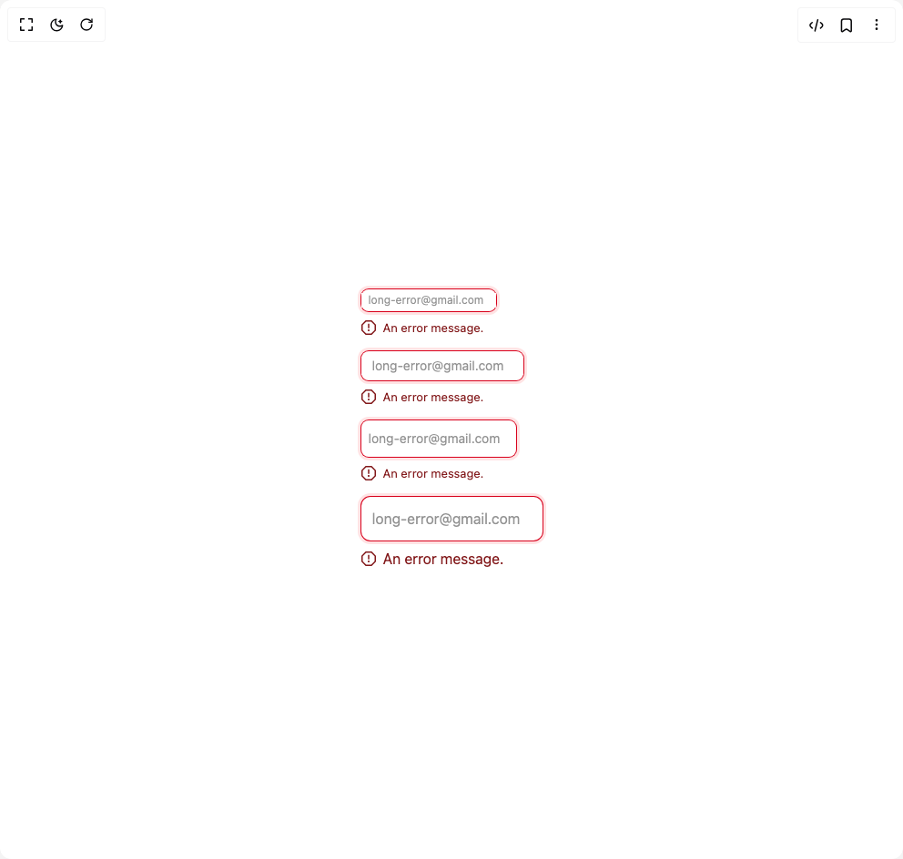

# Build Input in BuilderStudio

> Build this component in our Agentic IDE: [BuilderStudio](https://builderstudio.dev).
>
> Join the BuilderStudio community on [Discord](https://discord.gg/QdWeSGCqfe) and [Reddit](https://reddit.com/r/builderstudio).



## Component

- Author group: `shugar`
- Component: `input`
- Variant: `error`
- Rendered HTML snapshot: [`rendered.html`](rendered.html)

## BuilderStudio prompt

You are implementing a React component based on a component reference.

## Component identity

- Author: shugar
- Component slug: input
- Demo slug: error
- Title: input
- Description: 

## Goal

Recreate this component in a React + TypeScript + Tailwind CSS project. Preserve the visual layout, spacing, colors, border radius, shadows, interaction behavior, animation behavior, responsive behavior, and dark mode behavior shown in the rendered demo.

## Implementation requirements

- Use React and TypeScript.
- Use Tailwind CSS classes whenever possible.
- Keep the component self-contained unless the source files require helper components.
- If the source uses CSS variables, custom CSS, animations, or keyframes, include them.
- If the source uses external packages, list and use the required packages.
- Preserve accessibility attributes, button semantics, links, keyboard behavior, and ARIA attributes when visible in the source.
- Do not replace the component with a simplified placeholder.
- Return complete production-ready code.

## Dependencies

No reference metadata available.

## Rendered DOM snapshot

This is the rendered demo HTML extracted from the live preview. Use it to verify structure, class names, visible content, and layout.

```html
<div id="root"><div class="w-screen min-h-screen flex justify-center items-center"><div class="w-screen min-h-screen flex justify-center items-center"><div class="flex flex-col items-start gap-4"><div class="flex flex-col gap-2"><div class="flex items-center duration-150 font-sans shadow-error-input hover:shadow-error-input-hover h-6 text-xs rounded-md bg-background-100"><input class="w-full inline-flex appearance-none placeholder:text-gray-900 placeholder:opacity-70 outline-none px-2 bg-background-100 text-geist-foreground" placeholder="long-error@gmail.com" aria-labelledby="Demo input" value=""></div><div class="flex items-center gap-2 text-red-900 fill-red-900 font-sans
      text-[13px] leading-5" style="--geist-link-color: var(--ds-red-900);"><svg height="16" stroke-linejoin="round" viewBox="0 0 16 16" width="16"><path fill-rule="evenodd" clip-rule="evenodd" d="M5.30761 1.5L1.5 5.30761L1.5 10.6924L5.30761 14.5H10.6924L14.5 10.6924V5.30761L10.6924 1.5H5.30761ZM5.10051 0C4.83529 0 4.58094 0.105357 4.3934 0.292893L0.292893 4.3934C0.105357 4.58094 0 4.83529 0 5.10051V10.8995C0 11.1647 0.105357 11.4191 0.292894 11.6066L4.3934 15.7071C4.58094 15.8946 4.83529 16 5.10051 16H10.8995C11.1647 16 11.4191 15.8946 11.6066 15.7071L15.7071 11.6066C15.8946 11.4191 16 11.1647 16 10.8995V5.10051C16 4.83529 15.8946 4.58093 15.7071 4.3934L11.6066 0.292893C11.4191 0.105357 11.1647 0 10.8995 0H5.10051ZM8.75 3.75V4.5V8L8.75 8.75H7.25V8V4.5V3.75H8.75ZM8 12C8.55229 12 9 11.5523 9 11C9 10.4477 8.55229 10 8 10C7.44772 10 7 10.4477 7 11C7 11.5523 7.44772 12 8 12Z"></path></svg>An error message.</div></div><div class="flex flex-col gap-2"><div class="flex items-center duration-150 font-sans shadow-error-input hover:shadow-error-input-hover h-8 text-sm rounded-md bg-background-100"><input class="w-full inline-flex appearance-none placeholder:text-gray-900 placeholder:opacity-70 outline-none px-3 bg-background-100 text-geist-foreground" placeholder="long-error@gmail.com" aria-labelledby="Demo input" value=""></div><div class="flex items-center gap-2 text-red-900 fill-red-900 font-sans
      text-[13px] leading-5" style="--geist-link-color: var(--ds-red-900);"><svg height="16" stroke-linejoin="round" viewBox="0 0 16 16" width="16"><path fill-rule="evenodd" clip-rule="evenodd" d="M5.30761 1.5L1.5 5.30761L1.5 10.6924L5.30761 14.5H10.6924L14.5 10.6924V5.30761L10.6924 1.5H5.30761ZM5.10051 0C4.83529 0 4.58094 0.105357 4.3934 0.292893L0.292893 4.3934C0.105357 4.58094 0 4.83529 0 5.10051V10.8995C0 11.1647 0.105357 11.4191 0.292894 11.6066L4.3934 15.7071C4.58094 15.8946 4.83529 16 5.10051 16H10.8995C11.1647 16 11.4191 15.8946 11.6066 15.7071L15.7071 11.6066C15.8946 11.4191 16 11.1647 16 10.8995V5.10051C16 4.83529 15.8946 4.58093 15.7071 4.3934L11.6066 0.292893C11.4191 0.105357 11.1647 0 10.8995 0H5.10051ZM8.75 3.75V4.5V8L8.75 8.75H7.25V8V4.5V3.75H8.75ZM8 12C8.55229 12 9 11.5523 9 11C9 10.4477 8.55229 10 8 10C7.44772 10 7 10.4477 7 11C7 11.5523 7.44772 12 8 12Z"></path></svg>An error message.</div></div><div class="flex flex-col gap-2"><div class="flex items-center duration-150 font-sans shadow-error-input hover:shadow-error-input-hover h-10 text-sm rounded-md bg-background-100"><input class="w-full inline-flex appearance-none placeholder:text-gray-900 placeholder:opacity-70 outline-none px-2 bg-background-100 text-geist-foreground" placeholder="long-error@gmail.com" aria-labelledby="Demo input" value=""></div><div class="flex items-center gap-2 text-red-900 fill-red-900 font-sans
      text-[13px] leading-5" style="--geist-link-color: var(--ds-red-900);"><svg height="16" stroke-linejoin="round" viewBox="0 0 16 16" width="16"><path fill-rule="evenodd" clip-rule="evenodd" d="M5.30761 1.5L1.5 5.30761L1.5 10.6924L5.30761 14.5H10.6924L14.5 10.6924V5.30761L10.6924 1.5H5.30761ZM5.10051 0C4.83529 0 4.58094 0.105357 4.3934 0.292893L0.292893 4.3934C0.105357 4.58094 0 4.83529 0 5.10051V10.8995C0 11.1647 0.105357 11.4191 0.292894 11.6066L4.3934 15.7071C4.58094 15.8946 4.83529 16 5.10051 16H10.8995C11.1647 16 11.4191 15.8946 11.6066 15.7071L15.7071 11.6066C15.8946 11.4191 16 11.1647 16 10.8995V5.10051C16 4.83529 15.8946 4.58093 15.7071 4.3934L11.6066 0.292893C11.4191 0.105357 11.1647 0 10.8995 0H5.10051ZM8.75 3.75V4.5V8L8.75 8.75H7.25V8V4.5V3.75H8.75ZM8 12C8.55229 12 9 11.5523 9 11C9 10.4477 8.55229 10 8 10C7.44772 10 7 10.4477 7 11C7 11.5523 7.44772 12 8 12Z"></path></svg>An error message.</div></div><div class="flex flex-col gap-2"><div class="flex items-center duration-150 font-sans shadow-error-input hover:shadow-error-input-hover h-12 text-base rounded-lg bg-background-100"><input class="w-full inline-flex appearance-none placeholder:text-gray-900 placeholder:opacity-70 outline-none px-3 bg-background-100 text-geist-foreground" placeholder="long-error@gmail.com" aria-labelledby="Demo input" value=""></div><div class="flex items-center gap-2 text-red-900 fill-red-900 font-sans
      text-base" style="--geist-link-color: var(--ds-red-900);"><svg height="16" stroke-linejoin="round" viewBox="0 0 16 16" width="16"><path fill-rule="evenodd" clip-rule="evenodd" d="M5.30761 1.5L1.5 5.30761L1.5 10.6924L5.30761 14.5H10.6924L14.5 10.6924V5.30761L10.6924 1.5H5.30761ZM5.10051 0C4.83529 0 4.58094 0.105357 4.3934 0.292893L0.292893 4.3934C0.105357 4.58094 0 4.83529 0 5.10051V10.8995C0 11.1647 0.105357 11.4191 0.292894 11.6066L4.3934 15.7071C4.58094 15.8946 4.83529 16 5.10051 16H10.8995C11.1647 16 11.4191 15.8946 11.6066 15.7071L15.7071 11.6066C15.8946 11.4191 16 11.1647 16 10.8995V5.10051C16 4.83529 15.8946 4.58093 15.7071 4.3934L11.6066 0.292893C11.4191 0.105357 11.1647 0 10.8995 0H5.10051ZM8.75 3.75V4.5V8L8.75 8.75H7.25V8V4.5V3.75H8.75ZM8 12C8.55229 12 9 11.5523 9 11C9 10.4477 8.55229 10 8 10C7.44772 10 7 10.4477 7 11C7 11.5523 7.44772 12 8 12Z"></path></svg>An error message.</div></div></div></div></div></div>
```

## Reference source files

No reference source files were available.
