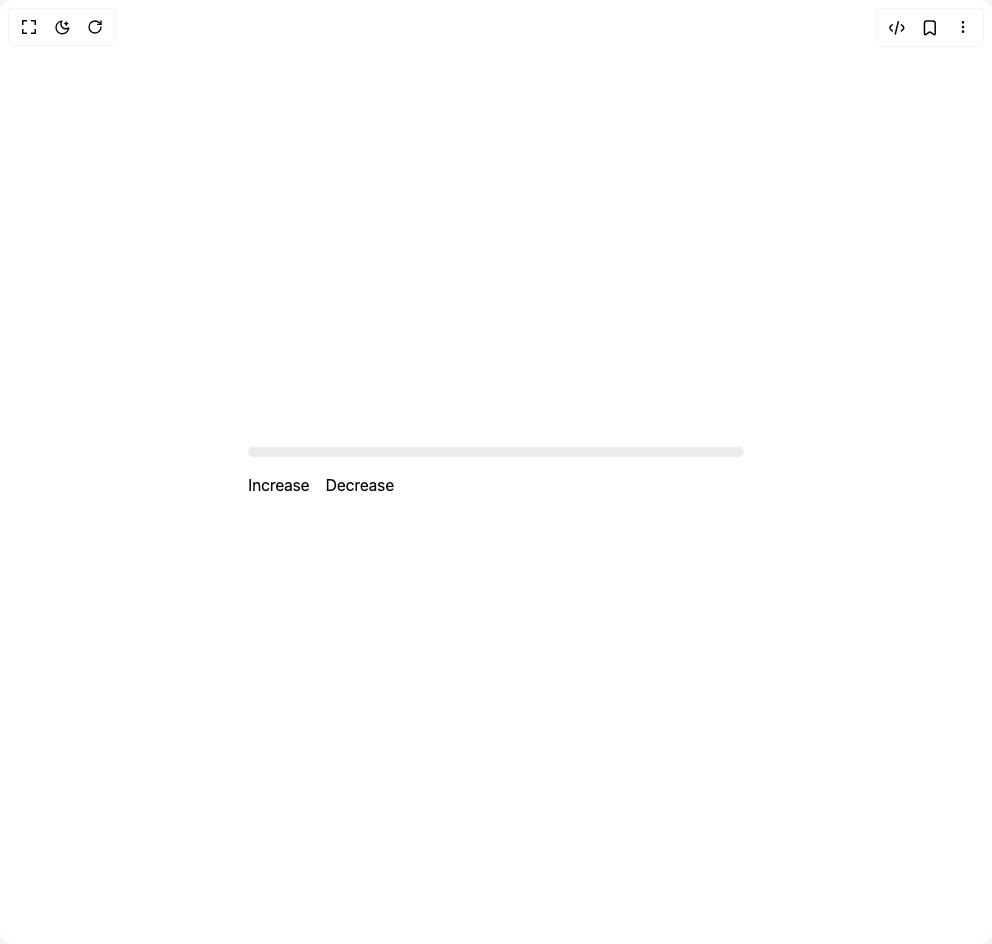

# Build Progress in BuilderStudio

> Build this component in our Agentic IDE: [BuilderStudio](https://builderstudio.dev).
>
> Join the BuilderStudio community on [Discord](https://discord.gg/QdWeSGCqfe) and [Reddit](https://reddit.com/r/builderstudio).



## Component

- Author group: `shugar`
- Component: `progress`
- Variant: `dynamic-colors`
- Rendered HTML snapshot: [`rendered.html`](rendered.html)

## BuilderStudio prompt

You are implementing a React component based on a component reference.

## Component identity

- Author: shugar
- Component slug: progress
- Demo slug: dynamic-colors
- Title: progress
- Description: 

## Goal

Recreate this component in a React + TypeScript + Tailwind CSS project. Preserve the visual layout, spacing, colors, border radius, shadows, interaction behavior, animation behavior, responsive behavior, and dark mode behavior shown in the rendered demo.

## Implementation requirements

- Use React and TypeScript.
- Use Tailwind CSS classes whenever possible.
- Keep the component self-contained unless the source files require helper components.
- If the source uses CSS variables, custom CSS, animations, or keyframes, include them.
- If the source uses external packages, list and use the required packages.
- Preserve accessibility attributes, button semantics, links, keyboard behavior, and ARIA attributes when visible in the source.
- Do not replace the component with a simplified placeholder.
- Return complete production-ready code.

## Dependencies

No reference metadata available.

## Rendered DOM snapshot

This is the rendered demo HTML extracted from the live preview. Use it to verify structure, class names, visible content, and layout.

```html
<div id="root"><div class="w-screen min-h-screen flex justify-center items-center"><div class="w-screen min-h-screen flex justify-center items-center"><div class="flex flex-col gap-4 w-1/2"><progress value="0" max="100" class="text-gray-1000 appearance-none border-none [&amp;::-webkit-progress-bar]:bg-gray-200 [&amp;::-webkit-progress-bar]:rounded-[5px] [&amp;::-webkit-progress-value]:rounded-[5px] [&amp;::-moz-progress-bar]:rounded-[5px] h-2.5 w-full [&amp;::-webkit-progress-value]:transition-all [&amp;::-moz-progress-bar]:transition-all" style="--ds-progress-color: var(--geist-foreground);"></progress><div class="flex gap-4"><button>Increase</button><button>Decrease</button></div></div></div></div></div>
```

## Reference source files

No reference source files were available.
