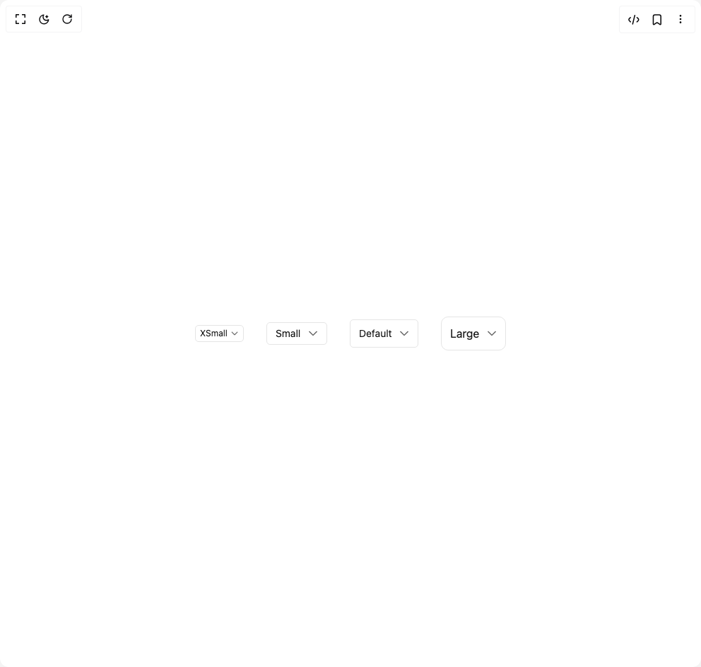

# Build Select 1 in BuilderStudio

> Build this component in our Agentic IDE: [BuilderStudio](https://builderstudio.dev).
>
> Join the BuilderStudio community on [Discord](https://discord.gg/QdWeSGCqfe) and [Reddit](https://reddit.com/r/builderstudio).



## Component

- Author group: `shugar`
- Component: `select-1`
- Variant: `default`
- Rendered HTML snapshot: [`rendered.html`](rendered.html)

## BuilderStudio prompt

You are implementing a React component based on a component reference.

## Component identity

- Author: shugar
- Component slug: select-1
- Demo slug: default
- Title: select-1
- Description: 

## Goal

Recreate this component in a React + TypeScript + Tailwind CSS project. Preserve the visual layout, spacing, colors, border radius, shadows, interaction behavior, animation behavior, responsive behavior, and dark mode behavior shown in the rendered demo.

## Implementation requirements

- Use React and TypeScript.
- Use Tailwind CSS classes whenever possible.
- Keep the component self-contained unless the source files require helper components.
- If the source uses CSS variables, custom CSS, animations, or keyframes, include them.
- If the source uses external packages, list and use the required packages.
- Preserve accessibility attributes, button semantics, links, keyboard behavior, and ARIA attributes when visible in the source.
- Do not replace the component with a simplified placeholder.
- Return complete production-ready code.

## Dependencies

No reference metadata available.

## Rendered DOM snapshot

This is the rendered demo HTML extracted from the live preview. Use it to verify structure, class names, visible content, and layout.

```html
<div id="root"><div class="w-screen min-h-screen flex justify-center items-center"><div class="w-screen min-h-screen flex justify-center items-center"><div class="flex gap-8 items-center justify-center"><div><div class="relative flex items-center fill-[#666666] dark:fill-[#a1a1a1] hover:fill-[#171717] hover:dark:fill-[#ededed]"><style>
          .xsmallIconContainer svg {
              width: 16px;
              height: 12px;
          }
          .smallIconContainer, .mediumIconContainer, .largeIconContainer svg {
              width: 16px;
              height: 16px;
          }
        </style><select id="select" class="font-sans appearance-none w-full border rounded-[5px] duration-200 outline-none h-6 text-xs pl-1.5 pr-[22px] text-gray-1000 bg-background-100 cursor-pointer ring-gray-alpha-500 ring-opacity-100 focus:ring-[3px] border-gray-alpha-400"><option value="" disabled="">XSmall</option></select><span class="inline-flex absolute pointer-events-none duration-150 xsmallIconContainer right-[5px]"><svg height="16" stroke-linejoin="round" viewBox="0 0 16 16" width="16"><path fill-rule="evenodd" clip-rule="evenodd" d="M14.0607 5.49999L13.5303 6.03032L8.7071 10.8535C8.31658 11.2441 7.68341 11.2441 7.29289 10.8535L2.46966 6.03032L1.93933 5.49999L2.99999 4.43933L3.53032 4.96966L7.99999 9.43933L12.4697 4.96966L13 4.43933L14.0607 5.49999Z"></path></svg></span></div></div><div><div class="relative flex items-center fill-[#666666] dark:fill-[#a1a1a1] hover:fill-[#171717] hover:dark:fill-[#ededed]"><style>
          .xsmallIconContainer svg {
              width: 16px;
              height: 12px;
          }
          .smallIconContainer, .mediumIconContainer, .largeIconContainer svg {
              width: 16px;
              height: 16px;
          }
        </style><select id="select" class="font-sans appearance-none w-full border rounded-[5px] duration-200 outline-none h-8 text-sm pl-3 pr-9 text-gray-1000 bg-background-100 cursor-pointer ring-gray-alpha-500 ring-opacity-100 focus:ring-[3px] border-gray-alpha-400"><option value="" disabled="">Small</option></select><span class="inline-flex absolute pointer-events-none duration-150 smallIconContainer right-3"><svg height="16" stroke-linejoin="round" viewBox="0 0 16 16" width="16"><path fill-rule="evenodd" clip-rule="evenodd" d="M14.0607 5.49999L13.5303 6.03032L8.7071 10.8535C8.31658 11.2441 7.68341 11.2441 7.29289 10.8535L2.46966 6.03032L1.93933 5.49999L2.99999 4.43933L3.53032 4.96966L7.99999 9.43933L12.4697 4.96966L13 4.43933L14.0607 5.49999Z"></path></svg></span></div></div><div><div class="relative flex items-center fill-[#666666] dark:fill-[#a1a1a1] hover:fill-[#171717] hover:dark:fill-[#ededed]"><style>
          .xsmallIconContainer svg {
              width: 16px;
              height: 12px;
          }
          .smallIconContainer, .mediumIconContainer, .largeIconContainer svg {
              width: 16px;
              height: 16px;
          }
        </style><select id="select" class="font-sans appearance-none w-full border rounded-[5px] duration-200 outline-none h-10 text-sm pl-3 pr-9 text-gray-1000 bg-background-100 cursor-pointer ring-gray-alpha-500 ring-opacity-100 focus:ring-[3px] border-gray-alpha-400"><option value="" disabled="">Default</option></select><span class="inline-flex absolute pointer-events-none duration-150 mediumIconContainer right-3"><svg height="16" stroke-linejoin="round" viewBox="0 0 16 16" width="16"><path fill-rule="evenodd" clip-rule="evenodd" d="M14.0607 5.49999L13.5303 6.03032L8.7071 10.8535C8.31658 11.2441 7.68341 11.2441 7.29289 10.8535L2.46966 6.03032L1.93933 5.49999L2.99999 4.43933L3.53032 4.96966L7.99999 9.43933L12.4697 4.96966L13 4.43933L14.0607 5.49999Z"></path></svg></span></div></div><div><div class="relative flex items-center fill-[#666666] dark:fill-[#a1a1a1] hover:fill-[#171717] hover:dark:fill-[#ededed]"><style>
          .xsmallIconContainer svg {
              width: 16px;
              height: 12px;
          }
          .smallIconContainer, .mediumIconContainer, .largeIconContainer svg {
              width: 16px;
              height: 16px;
          }
        </style><select id="select" class="font-sans appearance-none w-full border rounded-[5px] duration-200 outline-none h-12 text-base pl-3 pr-9 rounded-lg text-gray-1000 bg-background-100 cursor-pointer ring-gray-alpha-500 ring-opacity-100 focus:ring-[3px] border-gray-alpha-400"><option value="" disabled="">Large</option></select><span class="inline-flex absolute pointer-events-none duration-150 largeIconContainer right-3"><svg height="16" stroke-linejoin="round" viewBox="0 0 16 16" width="16"><path fill-rule="evenodd" clip-rule="evenodd" d="M14.0607 5.49999L13.5303 6.03032L8.7071 10.8535C8.31658 11.2441 7.68341 11.2441 7.29289 10.8535L2.46966 6.03032L1.93933 5.49999L2.99999 4.43933L3.53032 4.96966L7.99999 9.43933L12.4697 4.96966L13 4.43933L14.0607 5.49999Z"></path></svg></span></div></div></div></div></div></div>
```

## Reference source files

No reference source files were available.
