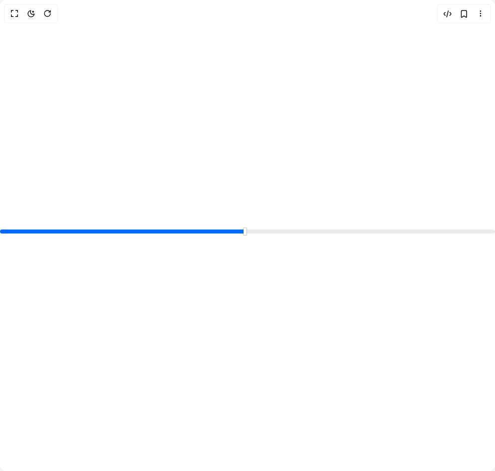

# Build Slider 1 in BuilderStudio

> Build this component in our Agentic IDE: [BuilderStudio](https://builderstudio.dev).
>
> Join the BuilderStudio community on [Discord](https://discord.gg/QdWeSGCqfe) and [Reddit](https://reddit.com/r/builderstudio).



## Component

- Author group: `shugar`
- Component: `slider-1`
- Variant: `default`
- Rendered HTML snapshot: [`rendered.html`](rendered.html)

## BuilderStudio prompt

You are implementing a React component based on a component reference.

## Component identity

- Author: shugar
- Component slug: slider-1
- Demo slug: default
- Title: slider-1
- Description: 

## Goal

Recreate this component in a React + TypeScript + Tailwind CSS project. Preserve the visual layout, spacing, colors, border radius, shadows, interaction behavior, animation behavior, responsive behavior, and dark mode behavior shown in the rendered demo.

## Implementation requirements

- Use React and TypeScript.
- Use Tailwind CSS classes whenever possible.
- Keep the component self-contained unless the source files require helper components.
- If the source uses CSS variables, custom CSS, animations, or keyframes, include them.
- If the source uses external packages, list and use the required packages.
- Preserve accessibility attributes, button semantics, links, keyboard behavior, and ARIA attributes when visible in the source.
- Do not replace the component with a simplified placeholder.
- Return complete production-ready code.

## Dependencies

No reference metadata available.

## Rendered DOM snapshot

This is the rendered demo HTML extracted from the live preview. Use it to verify structure, class names, visible content, and layout.

```html
<div id="root"><div class="w-screen min-h-screen flex justify-center items-center"><div class="w-screen min-h-screen flex justify-center items-center"><div class="w-full"><div class="relative flex justify-center items-center mb-4"><style>
              .slider::-webkit-slider-thumb {
                  -webkit-appearance: none;
                  appearance: none;
                  width: 6px;
                  height: 14px;
                  background: white;
                  cursor: pointer;
                  border-radius: 1px;
                  box-shadow: 0 0 0 1px rgba(0, 0, 0, .21), 0 1px 2px rgba(0, 0, 0, .04);
                  transition: box-shadow .2s, background .2s, transform .2s;
              }

              .slider::-moz-range-thumb {
                  appearance: none;
                  width: 6px;
                  height: 14px;
                  background: white;
                  cursor: pointer;
                  border-radius: 1px;
                  border: none;
                  box-shadow: 0 0 0 1px rgba(0, 0, 0, .21), 0 1px 2px rgba(0, 0, 0, .04);
                  transition: box-shadow .2s, background .2s, transform .2s;
              }
          </style><input min="1" max="100" class="slider w-full h-2 bg-gray-200 rounded-lg appearance-none cursor-pointer focus:outline-none" type="range" value="50" style="background: linear-gradient(to right, rgb(0, 107, 255) 49.5%, rgb(235, 235, 235) 49.5%);"></div></div></div></div></div>
```

## Reference source files

No reference source files were available.
