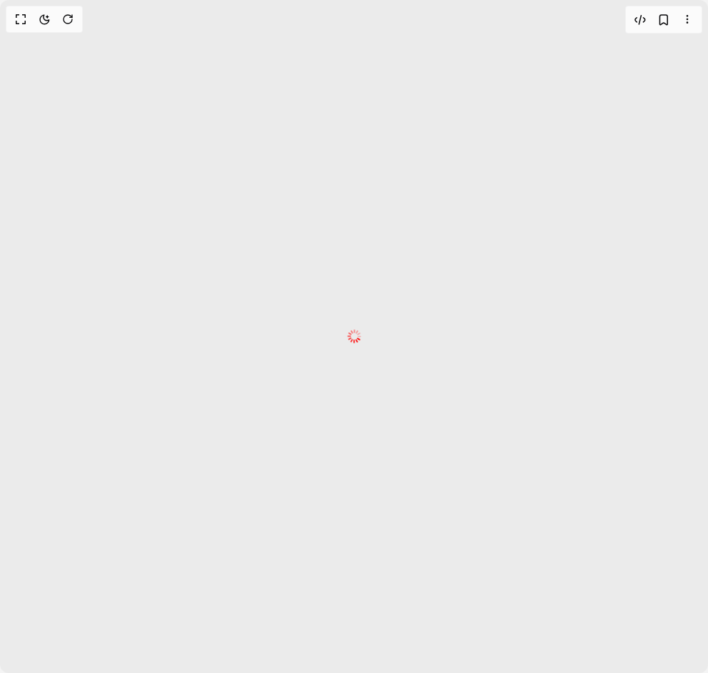

# Build Spinner 1 in BuilderStudio

> Build this component in our Agentic IDE: [BuilderStudio](https://builderstudio.dev).
>
> Join the BuilderStudio community on [Discord](https://discord.gg/QdWeSGCqfe) and [Reddit](https://reddit.com/r/builderstudio).



## Component

- Author group: `shugar`
- Component: `spinner-1`
- Variant: `custom-color`
- Rendered HTML snapshot: [`rendered.html`](rendered.html)

## BuilderStudio prompt

You are implementing a React component based on a component reference.

## Component identity

- Author: shugar
- Component slug: spinner-1
- Demo slug: custom-color
- Title: spinner-1
- Description: 

## Goal

Recreate this component in a React + TypeScript + Tailwind CSS project. Preserve the visual layout, spacing, colors, border radius, shadows, interaction behavior, animation behavior, responsive behavior, and dark mode behavior shown in the rendered demo.

## Implementation requirements

- Use React and TypeScript.
- Use Tailwind CSS classes whenever possible.
- Keep the component self-contained unless the source files require helper components.
- If the source uses CSS variables, custom CSS, animations, or keyframes, include them.
- If the source uses external packages, list and use the required packages.
- Preserve accessibility attributes, button semantics, links, keyboard behavior, and ARIA attributes when visible in the source.
- Do not replace the component with a simplified placeholder.
- Return complete production-ready code.

## Dependencies

No reference metadata available.

## Rendered DOM snapshot

This is the rendered demo HTML extracted from the live preview. Use it to verify structure, class names, visible content, and layout.

```html
<div id="root"><div class="w-screen min-h-screen flex justify-center items-center"><div class="w-screen min-h-screen flex justify-center items-center"><div style="width: 20px; height: 20px;"><div class="relative top-1/2 left-1/2" style="width: 20px; height: 20px;"><div class="absolute h-[8%] w-[24%] -left-[10%] -top-[3.9%] rounded-[5px] animate-fade-spin" style="background-color: red; animation-delay: -1.2s; transform: rotate(0.0001deg) translate(146%);"></div><div class="absolute h-[8%] w-[24%] -left-[10%] -top-[3.9%] rounded-[5px] animate-fade-spin" style="background-color: red; animation-delay: -1.1s; transform: rotate(30deg) translate(146%);"></div><div class="absolute h-[8%] w-[24%] -left-[10%] -top-[3.9%] rounded-[5px] animate-fade-spin" style="background-color: red; animation-delay: -1s; transform: rotate(60deg) translate(146%);"></div><div class="absolute h-[8%] w-[24%] -left-[10%] -top-[3.9%] rounded-[5px] animate-fade-spin" style="background-color: red; animation-delay: -0.9s; transform: rotate(90deg) translate(146%);"></div><div class="absolute h-[8%] w-[24%] -left-[10%] -top-[3.9%] rounded-[5px] animate-fade-spin" style="background-color: red; animation-delay: -0.8s; transform: rotate(120deg) translate(146%);"></div><div class="absolute h-[8%] w-[24%] -left-[10%] -top-[3.9%] rounded-[5px] animate-fade-spin" style="background-color: red; animation-delay: -0.7s; transform: rotate(150deg) translate(146%);"></div><div class="absolute h-[8%] w-[24%] -left-[10%] -top-[3.9%] rounded-[5px] animate-fade-spin" style="background-color: red; animation-delay: -0.6s; transform: rotate(180deg) translate(146%);"></div><div class="absolute h-[8%] w-[24%] -left-[10%] -top-[3.9%] rounded-[5px] animate-fade-spin" style="background-color: red; animation-delay: -0.5s; transform: rotate(210deg) translate(146%);"></div><div class="absolute h-[8%] w-[24%] -left-[10%] -top-[3.9%] rounded-[5px] animate-fade-spin" style="background-color: red; animation-delay: -0.4s; transform: rotate(240deg) translate(146%);"></div><div class="absolute h-[8%] w-[24%] -left-[10%] -top-[3.9%] rounded-[5px] animate-fade-spin" style="background-color: red; animation-delay: -0.3s; transform: rotate(270deg) translate(146%);"></div><div class="absolute h-[8%] w-[24%] -left-[10%] -top-[3.9%] rounded-[5px] animate-fade-spin" style="background-color: red; animation-delay: -0.2s; transform: rotate(300deg) translate(146%);"></div><div class="absolute h-[8%] w-[24%] -left-[10%] -top-[3.9%] rounded-[5px] animate-fade-spin" style="background-color: red; animation-delay: -0.1s; transform: rotate(330deg) translate(146%);"></div></div></div></div></div></div>
```

## Reference source files

No reference source files were available.
