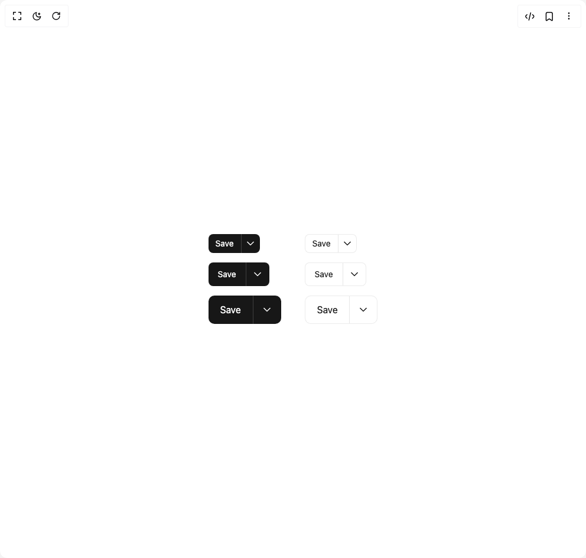

# Build Split Button in BuilderStudio

> Build this component in our Agentic IDE: [BuilderStudio](https://builderstudio.dev).
>
> Join the BuilderStudio community on [Discord](https://discord.gg/QdWeSGCqfe) and [Reddit](https://reddit.com/r/builderstudio).



## Component

- Author group: `shugar`
- Component: `split-button`
- Variant: `default`
- Rendered HTML snapshot: [`rendered.html`](rendered.html)

## BuilderStudio prompt

You are implementing a React component based on a component reference.

## Component identity

- Author: shugar
- Component slug: split-button
- Demo slug: default
- Title: split-button
- Description: 

## Goal

Recreate this component in a React + TypeScript + Tailwind CSS project. Preserve the visual layout, spacing, colors, border radius, shadows, interaction behavior, animation behavior, responsive behavior, and dark mode behavior shown in the rendered demo.

## Implementation requirements

- Use React and TypeScript.
- Use Tailwind CSS classes whenever possible.
- Keep the component self-contained unless the source files require helper components.
- If the source uses CSS variables, custom CSS, animations, or keyframes, include them.
- If the source uses external packages, list and use the required packages.
- Preserve accessibility attributes, button semantics, links, keyboard behavior, and ARIA attributes when visible in the source.
- Do not replace the component with a simplified placeholder.
- Return complete production-ready code.

## Dependencies

No reference metadata available.

## Rendered DOM snapshot

This is the rendered demo HTML extracted from the live preview. Use it to verify structure, class names, visible content, and layout.

```html
<div id="root"><div class="w-screen min-h-screen flex justify-center items-center"><div class="w-screen min-h-screen flex justify-center items-center"><div class="flex gap-10"><div class="flex flex-col gap-4"><div class="relative inline-block"><button type="submit" tabindex="0" class="flex justify-center items-center gap-0.5 duration-150 px-1.5 h-8 text-sm bg-gray-1000 hover:bg-gray-1000-h text-background-100 fill-background-100 rounded-md focus:shadow-focus-ring focus:outline-0 rounded-r-none border-r-0 float-left focus:shadow-none" buttonref="[object Object]" position="bottom-start"><span class="relative overflow-hidden whitespace-nowrap overflow-ellipsis font-sans px-1.5">Save</span></button><button type="submit" tabindex="0" class="flex justify-center items-center gap-0.5 duration-150 w-8 h-8 text-sm bg-gray-1000 hover:bg-gray-1000-h text-background-100 fill-background-100 rounded-md focus:shadow-focus-ring focus:outline-0 rounded-l-none focus:shadow-none border-l border-l-[#404040] dark:border-[#cdcdcd]" aria-label="Select save method" buttonref="[object Object]" position="bottom-start"><span class="relative overflow-hidden whitespace-nowrap overflow-ellipsis font-sans px-1.5"><svg height="16" stroke-linejoin="round" viewBox="0 0 16 16" width="16"><path fill-rule="evenodd" clip-rule="evenodd" d="M14.0607 5.49999L13.5303 6.03032L8.7071 10.8535C8.31658 11.2441 7.68341 11.2441 7.29289 10.8535L2.46966 6.03032L1.93933 5.49999L2.99999 4.43933L3.53032 4.96966L7.99999 9.43933L12.4697 4.96966L13 4.43933L14.0607 5.49999Z"></path></svg></span></button></div><div class="relative inline-block"><button type="submit" tabindex="0" class="flex justify-center items-center gap-0.5 duration-150 px-2.5 h-10 text-sm bg-gray-1000 hover:bg-gray-1000-h text-background-100 fill-background-100 rounded-md focus:shadow-focus-ring focus:outline-0 rounded-r-none border-r-0 float-left focus:shadow-none" buttonref="[object Object]" position="bottom-start"><span class="relative overflow-hidden whitespace-nowrap overflow-ellipsis font-sans px-1.5">Save</span></button><button type="submit" tabindex="0" class="flex justify-center items-center gap-0.5 duration-150 w-10 h-10 text-sm bg-gray-1000 hover:bg-gray-1000-h text-background-100 fill-background-100 rounded-md focus:shadow-focus-ring focus:outline-0 rounded-l-none focus:shadow-none border-l border-l-[#404040] dark:border-[#cdcdcd]" aria-label="Select save method" buttonref="[object Object]" position="bottom-start"><span class="relative overflow-hidden whitespace-nowrap overflow-ellipsis font-sans px-1.5"><svg height="16" stroke-linejoin="round" viewBox="0 0 16 16" width="16"><path fill-rule="evenodd" clip-rule="evenodd" d="M14.0607 5.49999L13.5303 6.03032L8.7071 10.8535C8.31658 11.2441 7.68341 11.2441 7.29289 10.8535L2.46966 6.03032L1.93933 5.49999L2.99999 4.43933L3.53032 4.96966L7.99999 9.43933L12.4697 4.96966L13 4.43933L14.0607 5.49999Z"></path></svg></span></button></div><div class="relative inline-block"><button type="submit" tabindex="0" class="flex justify-center items-center gap-0.5 duration-150 px-3.5 h-12 text-base bg-gray-1000 hover:bg-gray-1000-h text-background-100 fill-background-100 rounded-lg focus:shadow-focus-ring focus:outline-0 rounded-r-none border-r-0 float-left focus:shadow-none" buttonref="[object Object]" position="bottom-start"><span class="relative overflow-hidden whitespace-nowrap overflow-ellipsis font-sans px-1.5">Save</span></button><button type="submit" tabindex="0" class="flex justify-center items-center gap-0.5 duration-150 w-12 h-12 text-base bg-gray-1000 hover:bg-gray-1000-h text-background-100 fill-background-100 rounded-lg focus:shadow-focus-ring focus:outline-0 rounded-l-none focus:shadow-none border-l border-l-[#404040] dark:border-[#cdcdcd]" aria-label="Select save method" buttonref="[object Object]" position="bottom-start"><span class="relative overflow-hidden whitespace-nowrap overflow-ellipsis font-sans px-1.5"><svg height="16" stroke-linejoin="round" viewBox="0 0 16 16" width="16"><path fill-rule="evenodd" clip-rule="evenodd" d="M14.0607 5.49999L13.5303 6.03032L8.7071 10.8535C8.31658 11.2441 7.68341 11.2441 7.29289 10.8535L2.46966 6.03032L1.93933 5.49999L2.99999 4.43933L3.53032 4.96966L7.99999 9.43933L12.4697 4.96966L13 4.43933L14.0607 5.49999Z"></path></svg></span></button></div></div><div class="flex flex-col gap-4"><div class="relative inline-block"><button type="submit" tabindex="0" class="flex justify-center items-center gap-0.5 duration-150 px-1.5 h-8 text-sm bg-background-100 hover:bg-gray-alpha-200 text-gray-1000 fill-gray-1000 border border-gray-alpha-400 rounded-md focus:shadow-focus-ring focus:outline-0 rounded-r-none border-r-0 float-left focus:shadow-none" buttonref="[object Object]" position="bottom-start"><span class="relative overflow-hidden whitespace-nowrap overflow-ellipsis font-sans px-1.5">Save</span></button><button type="submit" tabindex="0" class="flex justify-center items-center gap-0.5 duration-150 w-8 h-8 text-sm bg-background-100 hover:bg-gray-alpha-200 text-gray-1000 fill-gray-1000 border border-gray-alpha-400 rounded-md focus:shadow-focus-ring focus:outline-0 rounded-l-none focus:shadow-none border-l-gray-300" aria-label="Select save method" buttonref="[object Object]" position="bottom-start"><span class="relative overflow-hidden whitespace-nowrap overflow-ellipsis font-sans px-1.5"><svg height="16" stroke-linejoin="round" viewBox="0 0 16 16" width="16"><path fill-rule="evenodd" clip-rule="evenodd" d="M14.0607 5.49999L13.5303 6.03032L8.7071 10.8535C8.31658 11.2441 7.68341 11.2441 7.29289 10.8535L2.46966 6.03032L1.93933 5.49999L2.99999 4.43933L3.53032 4.96966L7.99999 9.43933L12.4697 4.96966L13 4.43933L14.0607 5.49999Z"></path></svg></span></button></div><div class="relative inline-block"><button type="submit" tabindex="0" class="flex justify-center items-center gap-0.5 duration-150 px-2.5 h-10 text-sm bg-background-100 hover:bg-gray-alpha-200 text-gray-1000 fill-gray-1000 border border-gray-alpha-400 rounded-md focus:shadow-focus-ring focus:outline-0 rounded-r-none border-r-0 float-left focus:shadow-none" buttonref="[object Object]" position="bottom-start"><span class="relative overflow-hidden whitespace-nowrap overflow-ellipsis font-sans px-1.5">Save</span></button><button type="submit" tabindex="0" class="flex justify-center items-center gap-0.5 duration-150 w-10 h-10 text-sm bg-background-100 hover:bg-gray-alpha-200 text-gray-1000 fill-gray-1000 border border-gray-alpha-400 rounded-md focus:shadow-focus-ring focus:outline-0 rounded-l-none focus:shadow-none border-l-gray-300" aria-label="Select save method" buttonref="[object Object]" position="bottom-start"><span class="relative overflow-hidden whitespace-nowrap overflow-ellipsis font-sans px-1.5"><svg height="16" stroke-linejoin="round" viewBox="0 0 16 16" width="16"><path fill-rule="evenodd" clip-rule="evenodd" d="M14.0607 5.49999L13.5303 6.03032L8.7071 10.8535C8.31658 11.2441 7.68341 11.2441 7.29289 10.8535L2.46966 6.03032L1.93933 5.49999L2.99999 4.43933L3.53032 4.96966L7.99999 9.43933L12.4697 4.96966L13 4.43933L14.0607 5.49999Z"></path></svg></span></button></div><div class="relative inline-block"><button type="submit" tabindex="0" class="flex justify-center items-center gap-0.5 duration-150 px-3.5 h-12 text-base bg-background-100 hover:bg-gray-alpha-200 text-gray-1000 fill-gray-1000 border border-gray-alpha-400 rounded-lg focus:shadow-focus-ring focus:outline-0 rounded-r-none border-r-0 float-left focus:shadow-none" buttonref="[object Object]" position="bottom-start"><span class="relative overflow-hidden whitespace-nowrap overflow-ellipsis font-sans px-1.5">Save</span></button><button type="submit" tabindex="0" class="flex justify-center items-center gap-0.5 duration-150 w-12 h-12 text-base bg-background-100 hover:bg-gray-alpha-200 text-gray-1000 fill-gray-1000 border border-gray-alpha-400 rounded-lg focus:shadow-focus-ring focus:outline-0 rounded-l-none focus:shadow-none border-l-gray-300" aria-label="Select save method" buttonref="[object Object]" position="bottom-start"><span class="relative overflow-hidden whitespace-nowrap overflow-ellipsis font-sans px-1.5"><svg height="16" stroke-linejoin="round" viewBox="0 0 16 16" width="16"><path fill-rule="evenodd" clip-rule="evenodd" d="M14.0607 5.49999L13.5303 6.03032L8.7071 10.8535C8.31658 11.2441 7.68341 11.2441 7.29289 10.8535L2.46966 6.03032L1.93933 5.49999L2.99999 4.43933L3.53032 4.96966L7.99999 9.43933L12.4697 4.96966L13 4.43933L14.0607 5.49999Z"></path></svg></span></button></div></div></div></div></div></div>
```

## Reference source files

No reference source files were available.
