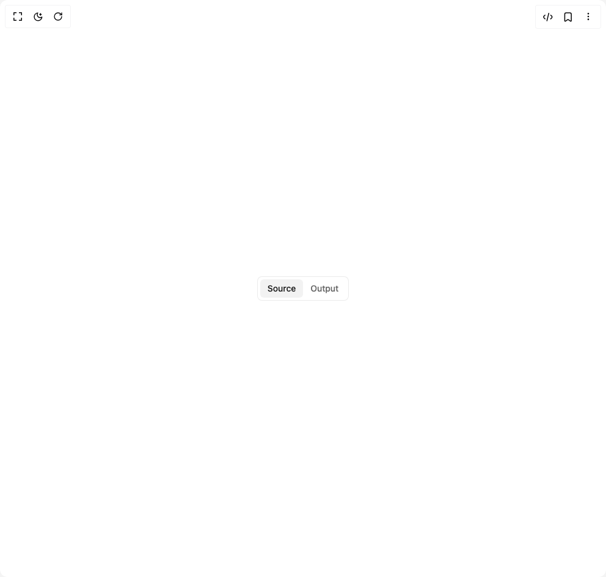

# Build Switch in BuilderStudio

> Build this component in our Agentic IDE: [BuilderStudio](https://builderstudio.dev).
>
> Join the BuilderStudio community on [Discord](https://discord.gg/QdWeSGCqfe) and [Reddit](https://reddit.com/r/builderstudio).



## Component

- Author group: `shugar`
- Component: `switch`
- Variant: `default`
- Rendered HTML snapshot: [`rendered.html`](rendered.html)

## BuilderStudio prompt

You are implementing a React component based on a component reference.

## Component identity

- Author: shugar
- Component slug: switch
- Demo slug: default
- Title: switch
- Description: 

## Goal

Recreate this component in a React + TypeScript + Tailwind CSS project. Preserve the visual layout, spacing, colors, border radius, shadows, interaction behavior, animation behavior, responsive behavior, and dark mode behavior shown in the rendered demo.

## Implementation requirements

- Use React and TypeScript.
- Use Tailwind CSS classes whenever possible.
- Keep the component self-contained unless the source files require helper components.
- If the source uses CSS variables, custom CSS, animations, or keyframes, include them.
- If the source uses external packages, list and use the required packages.
- Preserve accessibility attributes, button semantics, links, keyboard behavior, and ARIA attributes when visible in the source.
- Do not replace the component with a simplified placeholder.
- Return complete production-ready code.

## Dependencies

No reference metadata available.

## Rendered DOM snapshot

This is the rendered demo HTML extracted from the live preview. Use it to verify structure, class names, visible content, and layout.

```html
<div id="root"><div class="w-screen min-h-screen flex justify-center items-center"><div class="w-screen min-h-screen flex justify-center items-center"><div class="flex bg-background-100 p-1 border border-gray-alpha-400 h-10 rounded-md"><label class="flex flex-1 h-full"><input class="hidden" type="radio" value="source" name="default"><span class="flex items-center justify-center flex-1 cursor-pointer font-medium font-sans duration-150 bg-gray-100 text-gray-1000 fill-gray-1000 rounded-sm text-sm px-3">Source</span></label><label class="flex flex-1 h-full"><input class="hidden" type="radio" value="output" name="default"><span class="flex items-center justify-center flex-1 cursor-pointer font-medium font-sans duration-150 text-gray-900 hover:text-gray-1000 fill-gray-900 hover:fill-gray-1000 text-sm px-3">Output</span></label></div></div></div></div>
```

## Reference source files

No reference source files were available.
