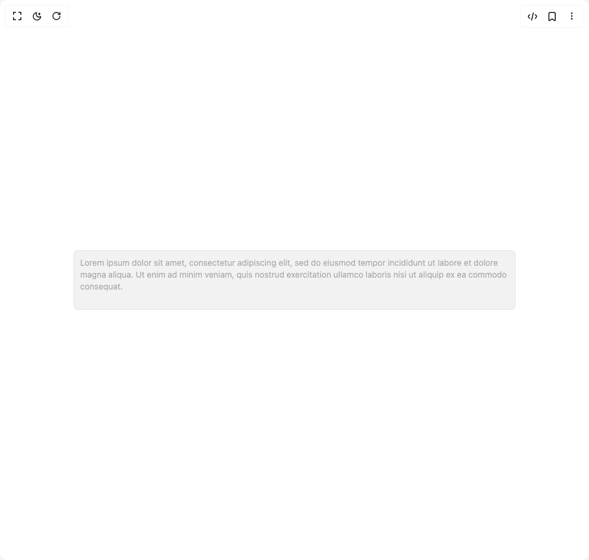

# Build Textarea in BuilderStudio

> Build this component in our Agentic IDE: [BuilderStudio](https://builderstudio.dev).
>
> Join the BuilderStudio community on [Discord](https://discord.gg/QdWeSGCqfe) and [Reddit](https://reddit.com/r/builderstudio).



## Component

- Author group: `shugar`
- Component: `textarea`
- Variant: `disabled`
- Rendered HTML snapshot: [`rendered.html`](rendered.html)

## BuilderStudio prompt

You are implementing a React component based on a component reference.

## Component identity

- Author: shugar
- Component slug: textarea
- Demo slug: disabled
- Title: textarea
- Description: 

## Goal

Recreate this component in a React + TypeScript + Tailwind CSS project. Preserve the visual layout, spacing, colors, border radius, shadows, interaction behavior, animation behavior, responsive behavior, and dark mode behavior shown in the rendered demo.

## Implementation requirements

- Use React and TypeScript.
- Use Tailwind CSS classes whenever possible.
- Keep the component self-contained unless the source files require helper components.
- If the source uses CSS variables, custom CSS, animations, or keyframes, include them.
- If the source uses external packages, list and use the required packages.
- Preserve accessibility attributes, button semantics, links, keyboard behavior, and ARIA attributes when visible in the source.
- Do not replace the component with a simplified placeholder.
- Return complete production-ready code.

## Dependencies

No reference metadata available.

## Rendered DOM snapshot

This is the rendered demo HTML extracted from the live preview. Use it to verify structure, class names, visible content, and layout.

```html
<div id="root"><div class="w-screen min-h-screen flex justify-center items-center"><div class="w-screen min-h-screen flex justify-center items-center"><div class="w-3/4"><div class="w-full flex flex-col gap-2"><textarea class="rounded-md resize-none font-sans bg-background-100 text-geist-foreground placeholder:text-gray-900 outline-none w-full duration-150 border border-gray-alpha-400 hover:border-gray-alpha-500 hover:ring-0 h-10 p-2.5 text-sm bg-gray-100 text-gray-700 placeholder:text-gray-700 placeholder:opacity-50 cursor-not-allowed focus:border-gray-alpha-600 focus:shadow-focus-input" placeholder="Lorem ipsum dolor sit amet, consectetur adipiscing elit, sed do eiusmod tempor incididunt ut labore et dolore magna aliqua. Ut enim ad minim veniam, quis nostrud exercitation ullamco laboris nisi ut aliquip ex ea commodo consequat." disabled="" autocomplete="off" autocorrect="off" autocapitalize="off" spellcheck="false" style="min-height: 100px;"></textarea></div></div></div></div></div>
```

## Reference source files

No reference source files were available.
