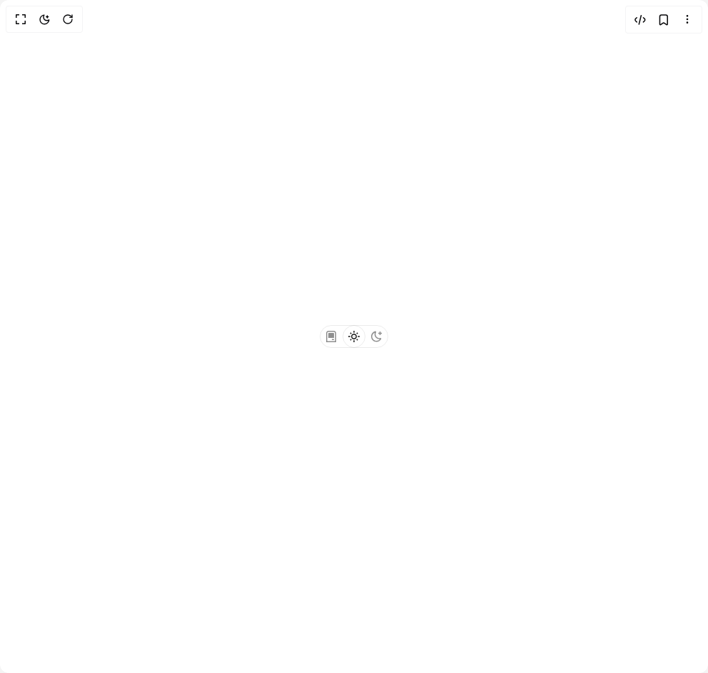

# Build Theme Switcher in BuilderStudio

> Build this component in our Agentic IDE: [BuilderStudio](https://builderstudio.dev).
>
> Join the BuilderStudio community on [Discord](https://discord.gg/QdWeSGCqfe) and [Reddit](https://reddit.com/r/builderstudio).



## Component

- Author group: `shugar`
- Component: `theme-switcher`
- Variant: `default`
- Rendered HTML snapshot: [`rendered.html`](rendered.html)

## BuilderStudio prompt

You are implementing a React component based on a component reference.

## Component identity

- Author: shugar
- Component slug: theme-switcher
- Demo slug: default
- Title: theme-switcher
- Description: 

## Goal

Recreate this component in a React + TypeScript + Tailwind CSS project. Preserve the visual layout, spacing, colors, border radius, shadows, interaction behavior, animation behavior, responsive behavior, and dark mode behavior shown in the rendered demo.

## Implementation requirements

- Use React and TypeScript.
- Use Tailwind CSS classes whenever possible.
- Keep the component self-contained unless the source files require helper components.
- If the source uses CSS variables, custom CSS, animations, or keyframes, include them.
- If the source uses external packages, list and use the required packages.
- Preserve accessibility attributes, button semantics, links, keyboard behavior, and ARIA attributes when visible in the source.
- Do not replace the component with a simplified placeholder.
- Return complete production-ready code.

## Dependencies

No reference metadata available.

## Rendered DOM snapshot

This is the rendered demo HTML extracted from the live preview. Use it to verify structure, class names, visible content, and layout.

```html
<div id="root"><div class="relative flex items-center justify-center h-screen w-full m-auto p-16 bg-background text-foreground"><div class="absolute lab-bg inset-0 size-full"><div class="absolute inset-0 bg-[radial-gradient(#00000021_1px,transparent_1px)] dark:bg-[radial-gradient(#ffffff22_1px,transparent_1px)]"></div></div><div class="flex w-full justify-center relative"><div class="h-[100vh] flex items-center justify-center px-4"><fieldset class="flex h-8 p-0 m-0 rounded-[999999px] border border-shadow"><legend class="sr-only">Select a display theme:</legend><div class="mt-[-1px] ml-[-1px]"><input aria-label="system" id="theme-switch-system" class="appearance-none absolute m-0 p-0" type="radio" value="system"><label for="theme-switch-system" class="flex items-center justify-center h-8 w-8 cursor-pointer rounded-[999999px] group"><span class="sr-only">system</span><svg height="16" stroke-linejoin="round" viewBox="0 0 16 16" width="16"><path fill-rule="evenodd" clip-rule="evenodd" class="group-hover:fill-gray-1000 duration-150 fill-gray-700" d="M1 3.25C1 1.45507 2.45507 0 4.25 0H11.75C13.5449 0 15 1.45507 15 3.25V15.25V16H14.25H1.75H1V15.25V3.25ZM4.25 1.5C3.2835 1.5 2.5 2.2835 2.5 3.25V14.5H13.5V3.25C13.5 2.2835 12.7165 1.5 11.75 1.5H4.25ZM4 4C4 3.44772 4.44772 3 5 3H11C11.5523 3 12 3.44772 12 4V10H4V4ZM9 13H12V11.5H9V13Z"></path></svg></label></div><div class="mt-[-1px]"><input aria-label="light" id="theme-switch-light" class="appearance-none absolute m-0 p-0" type="radio" value="light" checked=""><label for="theme-switch-light" class="flex items-center justify-center h-8 w-8 cursor-pointer rounded-[999999px] group border border-shadow"><span class="sr-only">light</span><svg height="16" stroke-linejoin="round" viewBox="0 0 16 16" width="16"><path fill-rule="evenodd" clip-rule="evenodd" d="M8.75 0.75V0H7.25V0.75V2V2.75H8.75V2V0.75ZM11.182 3.75732L11.7123 3.22699L12.0659 2.87344L12.5962 2.34311L13.6569 3.40377L13.1265 3.9341L12.773 4.28765L12.2426 4.81798L11.182 3.75732ZM8 10.5C9.38071 10.5 10.5 9.38071 10.5 8C10.5 6.61929 9.38071 5.5 8 5.5C6.61929 5.5 5.5 6.61929 5.5 8C5.5 9.38071 6.61929 10.5 8 10.5ZM8 12C10.2091 12 12 10.2091 12 8C12 5.79086 10.2091 4 8 4C5.79086 4 4 5.79086 4 8C4 10.2091 5.79086 12 8 12ZM13.25 7.25H14H15.25H16V8.75H15.25H14H13.25V7.25ZM0.75 7.25H0V8.75H0.75H2H2.75V7.25H2H0.75ZM2.87348 12.0659L2.34315 12.5962L3.40381 13.6569L3.93414 13.1265L4.28769 12.773L4.81802 12.2426L3.75736 11.182L3.22703 11.7123L2.87348 12.0659ZM3.75735 4.81798L3.22702 4.28765L2.87347 3.9341L2.34314 3.40377L3.4038 2.34311L3.93413 2.87344L4.28768 3.22699L4.81802 3.75732L3.75735 4.81798ZM12.0659 13.1265L12.5962 13.6569L13.6569 12.5962L13.1265 12.0659L12.773 11.7123L12.2426 11.182L11.182 12.2426L11.7123 12.773L12.0659 13.1265ZM8.75 13.25V14V15.25V16H7.25V15.25V14V13.25H8.75Z" class="group-hover:fill-gray-1000 duration-150 fill-gray-1000"></path></svg></label></div><div class="mt-[-1px] mr-[-1px]"><input aria-label="dark" id="theme-switch-dark" class="appearance-none absolute m-0 p-0" type="radio" value="dark"><label for="theme-switch-dark" class="flex items-center justify-center h-8 w-8 cursor-pointer rounded-[999999px] group"><span class="sr-only">dark</span><svg height="16" stroke-linejoin="round" viewBox="0 0 16 16" width="16"><path fill-rule="evenodd" clip-rule="evenodd" d="M1.5 8.00005C1.5 5.53089 2.99198 3.40932 5.12349 2.48889C4.88136 3.19858 4.75 3.95936 4.75 4.7501C4.75 8.61609 7.88401 11.7501 11.75 11.7501C11.8995 11.7501 12.048 11.7454 12.1953 11.7361C11.0955 13.1164 9.40047 14.0001 7.5 14.0001C4.18629 14.0001 1.5 11.3138 1.5 8.00005ZM6.41706 0.577759C2.78784 1.1031 0 4.22536 0 8.00005C0 12.1422 3.35786 15.5001 7.5 15.5001C10.5798 15.5001 13.2244 13.6438 14.3792 10.9921L13.4588 9.9797C12.9218 10.155 12.3478 10.2501 11.75 10.2501C8.71243 10.2501 6.25 7.78767 6.25 4.7501C6.25 3.63431 6.58146 2.59823 7.15111 1.73217L6.41706 0.577759ZM13.25 1V1.75V2.75L14.25 2.75H15V4.25H14.25H13.25V5.25V6H11.75V5.25V4.25H10.75L10 4.25V2.75H10.75L11.75 2.75V1.75V1H13.25Z" class="group-hover:fill-gray-1000 duration-150 fill-gray-700"></path></svg></label></div></fieldset></div></div></div></div>
```

## Reference source files

No reference source files were available.
