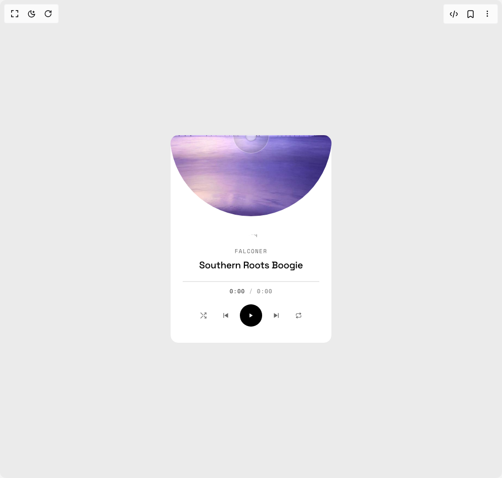

# Build Music Player Widget in BuilderStudio

> Build this component in our Agentic IDE: [BuilderStudio](https://builderstudio.dev).
>
> Join the BuilderStudio community on [Discord](https://discord.gg/QdWeSGCqfe) and [Reddit](https://reddit.com/r/builderstudio).



## Component

- Author group: `smammar100`
- Component: `music-player-widget`
- Variant: `default`
- Rendered HTML snapshot: [`rendered.html`](rendered.html)

## BuilderStudio prompt

You are implementing a React component based on a component reference.

## Component identity

- Author: smammar100
- Component slug: music-player-widget
- Demo slug: default
- Title: music-player-widget
- Description: 

## Goal

Recreate this component in a React + TypeScript + Tailwind CSS project. Preserve the visual layout, spacing, colors, border radius, shadows, interaction behavior, animation behavior, responsive behavior, and dark mode behavior shown in the rendered demo.

## Implementation requirements

- Use React and TypeScript.
- Use Tailwind CSS classes whenever possible.
- Keep the component self-contained unless the source files require helper components.
- If the source uses CSS variables, custom CSS, animations, or keyframes, include them.
- If the source uses external packages, list and use the required packages.
- Preserve accessibility attributes, button semantics, links, keyboard behavior, and ARIA attributes when visible in the source.
- Do not replace the component with a simplified placeholder.
- Return complete production-ready code.

## Dependencies

No reference metadata available.

## Rendered DOM snapshot

This is the rendered demo HTML extracted from the live preview. Use it to verify structure, class names, visible content, and layout.

```html
<div id="root"><div class="w-screen min-h-screen flex justify-center items-center"><div class="w-screen min-h-screen flex justify-center items-center"><div style="min-height: 100vh; display: grid; place-items: center; padding: 32px;"><div class="card  "><audio preload="metadata" crossorigin="anonymous" src="https://www.soundhelix.com/examples/mp3/SoundHelix-Song-1.mp3"></audio><div class="mask "><div class="spin" style="transform: scale(1.01) rotate(0deg);"></div><div class="hole"><div class="hole-inner"></div></div></div><div class="info"><svg class="scales" viewBox="0 0 98 108" aria-hidden="true"><mask id="«r0»"><rect width="10" height="10" fill="#fff"></rect></mask><g style="transform: translate(0px, 8.25px);"><g mask="url(#«r0»)" transform="translate(0 0)"><circle cx="5" cy="5" r="5" style="transform-box: fill-box; transform-origin: center center; transform: translateY(77px) scale(0.133);"></circle></g><g mask="url(#«r0»)" transform="translate(0 10)"><circle cx="5" cy="5" r="5" style="transform-box: fill-box; transform-origin: center center; transform: translateY(61.6px) scale(0.133);"></circle></g><g mask="url(#«r0»)" transform="translate(0 20)"><circle cx="5" cy="5" r="5" style="transform-box: fill-box; transform-origin: center center; transform: translateY(46.2px) scale(0.133);"></circle></g><g mask="url(#«r0»)" transform="translate(0 30)"><circle cx="5" cy="5" r="5" style="transform-box: fill-box; transform-origin: center center; transform: translateY(30.8px) scale(0.133);"></circle></g><g mask="url(#«r0»)" transform="translate(0 40)"><circle cx="5" cy="5" r="5" style="transform-box: fill-box; transform-origin: center center; transform: translateY(15.4px) scale(0.133);"></circle></g><g mask="url(#«r0»)" transform="translate(0 50)"><circle cx="5" cy="5" r="5" style="transform-box: fill-box; transform-origin: center center; transform: translateY(0px) scale(0.133);"></circle></g><g mask="url(#«r0»)" transform="translate(0 60)"><circle cx="5" cy="5" r="5" style="transform-box: fill-box; transform-origin: center center; transform: translateY(-15.4px) scale(0.133);"></circle></g><g mask="url(#«r0»)" transform="translate(0 70)"><circle cx="5" cy="5" r="5" style="transform-box: fill-box; transform-origin: center center; transform: translateY(-30.8px) scale(0.133);"></circle></g><g mask="url(#«r0»)" transform="translate(0 80)"><circle cx="5" cy="5" r="5" style="transform-box: fill-box; transform-origin: center center; transform: translateY(-46.2px) scale(0.133);"></circle></g><g mask="url(#«r0»)" transform="translate(0 90)"><circle cx="5" cy="5" r="5" style="transform-box: fill-box; transform-origin: center center; transform: translateY(-61.6px) scale(0.133);"></circle></g></g><g style="transform: translate(10px, 10.6683px);"><g mask="url(#«r0»)" transform="translate(0 0)"><circle cx="5" cy="5" r="5" style="transform-box: fill-box; transform-origin: center center; transform: translateY(76.0643px) scale(0.141212);"></circle></g><g mask="url(#«r0»)" transform="translate(0 10)"><circle cx="5" cy="5" r="5" style="transform-box: fill-box; transform-origin: center center; transform: translateY(60.8515px) scale(0.141212);"></circle></g><g mask="url(#«r0»)" transform="translate(0 20)"><circle cx="5" cy="5" r="5" style="transform-box: fill-box; transform-origin: center center; transform: translateY(45.6386px) scale(0.141212);"></circle></g><g mask="url(#«r0»)" transform="translate(0 30)"><circle cx="5" cy="5" r="5" style="transform-box: fill-box; transform-origin: center center; transform: translateY(30.4257px) scale(0.141212);"></circle></g><g mask="url(#«r0»)" transform="translate(0 40)"><circle cx="5" cy="5" r="5" style="transform-box: fill-box; transform-origin: center center; transform: translateY(15.2129px) scale(0.141212);"></circle></g><g mask="url(#«r0»)" transform="translate(0 50)"><circle cx="5" cy="5" r="5" style="transform-box: fill-box; transform-origin: center center; transform: translateY(0px) scale(0.141212);"></circle></g><g mask="url(#«r0»)" transform="translate(0 60)"><circle cx="5" cy="5" r="5" style="transform-box: fill-box; transform-origin: center center; transform: translateY(-15.2129px) scale(0.141212);"></circle></g><g mask="url(#«r0»)" transform="translate(0 70)"><circle cx="5" cy="5" r="5" style="transform-box: fill-box; transform-origin: center center; transform: translateY(-30.4257px) scale(0.141212);"></circle></g><g mask="url(#«r0»)" transform="translate(0 80)"><circle cx="5" cy="5" r="5" style="transform-box: fill-box; transform-origin: center center; transform: translateY(-45.6386px) scale(0.141212);"></circle></g><g mask="url(#«r0»)" transform="translate(0 90)"><circle cx="5" cy="5" r="5" style="transform-box: fill-box; transform-origin: center center; transform: translateY(-60.8515px) scale(0.141212);"></circle></g></g><g style="transform: translate(20px, 10.6683px);"><g mask="url(#«r0»)" transform="translate(0 0)"><circle cx="5" cy="5" r="5" style="transform-box: fill-box; transform-origin: center center; transform: translateY(73.3292px) scale(0.165645);"></circle></g><g mask="url(#«r0»)" transform="translate(0 10)"><circle cx="5" cy="5" r="5" style="transform-box: fill-box; transform-origin: center center; transform: translateY(58.6634px) scale(0.165645);"></circle></g><g mask="url(#«r0»)" transform="translate(0 20)"><circle cx="5" cy="5" r="5" style="transform-box: fill-box; transform-origin: center center; transform: translateY(43.9975px) scale(0.165645);"></circle></g><g mask="url(#«r0»)" transform="translate(0 30)"><circle cx="5" cy="5" r="5" style="transform-box: fill-box; transform-origin: center center; transform: translateY(29.3317px) scale(0.165645);"></circle></g><g mask="url(#«r0»)" transform="translate(0 40)"><circle cx="5" cy="5" r="5" style="transform-box: fill-box; transform-origin: center center; transform: translateY(14.6658px) scale(0.165645);"></circle></g><g mask="url(#«r0»)" transform="translate(0 50)"><circle cx="5" cy="5" r="5" style="transform-box: fill-box; transform-origin: center center; transform: translateY(0px) scale(0.165645);"></circle></g><g mask="url(#«r0»)" transform="translate(0 60)"><circle cx="5" cy="5" r="5" style="transform-box: fill-box; transform-origin: center center; transform: translateY(-14.6658px) scale(0.165645);"></circle></g><g mask="url(#«r0»)" transform="translate(0 70)"><circle cx="5" cy="5" r="5" style="transform-box: fill-box; transform-origin: center center; transform: translateY(-29.3317px) scale(0.165645);"></circle></g><g mask="url(#«r0»)" transform="translate(0 80)"><circle cx="5" cy="5" r="5" style="transform-box: fill-box; transform-origin: center center; transform: translateY(-43.9975px) scale(0.165645);"></circle></g><g mask="url(#«r0»)" transform="translate(0 90)"><circle cx="5" cy="5" r="5" style="transform-box: fill-box; transform-origin: center center; transform: translateY(-58.6634px) scale(0.165645);"></circle></g></g><g style="transform: translate(30px, 8.25px);"><g mask="url(#«r0»)" transform="translate(0 0)"><circle cx="5" cy="5" r="5" style="transform-box: fill-box; transform-origin: center center; transform: translateY(68.9345px) scale(0.205699);"></circle></g><g mask="url(#«r0»)" transform="translate(0 10)"><circle cx="5" cy="5" r="5" style="transform-box: fill-box; transform-origin: center center; transform: translateY(55.1476px) scale(0.205699);"></circle></g><g mask="url(#«r0»)" transform="translate(0 20)"><circle cx="5" cy="5" r="5" style="transform-box: fill-box; transform-origin: center center; transform: translateY(41.3607px) scale(0.205699);"></circle></g><g mask="url(#«r0»)" transform="translate(0 30)"><circle cx="5" cy="5" r="5" style="transform-box: fill-box; transform-origin: center center; transform: translateY(27.5738px) scale(0.205699);"></circle></g><g mask="url(#«r0»)" transform="translate(0 40)"><circle cx="5" cy="5" r="5" style="transform-box: fill-box; transform-origin: center center; transform: translateY(13.7869px) scale(0.205699);"></circle></g><g mask="url(#«r0»)" transform="translate(0 50)"><circle cx="5" cy="5" r="5" style="transform-box: fill-box; transform-origin: center center; transform: translateY(0px) scale(0.205699);"></circle></g><g mask="url(#«r0»)" transform="translate(0 60)"><circle cx="5" cy="5" r="5" style="transform-box: fill-box; transform-origin: center center; transform: translateY(-13.7869px) scale(0.205699);"></circle></g><g mask="url(#«r0»)" transform="translate(0 70)"><circle cx="5" cy="5" r="5" style="transform-box: fill-box; transform-origin: center center; transform: translateY(-27.5738px) scale(0.205699);"></circle></g><g mask="url(#«r0»)" transform="translate(0 80)"><circle cx="5" cy="5" r="5" style="transform-box: fill-box; transform-origin: center center; transform: translateY(-41.3607px) scale(0.205699);"></circle></g><g mask="url(#«r0»)" transform="translate(0 90)"><circle cx="5" cy="5" r="5" style="transform-box: fill-box; transform-origin: center center; transform: translateY(-55.1476px) scale(0.205699);"></circle></g></g><g style="transform: translate(40px, 4.54493px);"><g mask="url(#«r0»)" transform="translate(0 0)"><circle cx="5" cy="5" r="5" style="transform-box: fill-box; transform-origin: center center; transform: translateY(63.0582px) scale(0.260386);"></circle></g><g mask="url(#«r0»)" transform="translate(0 10)"><circle cx="5" cy="5" r="5" style="transform-box: fill-box; transform-origin: center center; transform: translateY(50.4466px) scale(0.260386);"></circle></g><g mask="url(#«r0»)" transform="translate(0 20)"><circle cx="5" cy="5" r="5" style="transform-box: fill-box; transform-origin: center center; transform: translateY(37.8349px) scale(0.260386);"></circle></g><g mask="url(#«r0»)" transform="translate(0 30)"><circle cx="5" cy="5" r="5" style="transform-box: fill-box; transform-origin: center center; transform: translateY(25.2233px) scale(0.260386);"></circle></g><g mask="url(#«r0»)" transform="translate(0 40)"><circle cx="5" cy="5" r="5" style="transform-box: fill-box; transform-origin: center center; transform: translateY(12.6116px) scale(0.260386);"></circle></g><g mask="url(#«r0»)" transform="translate(0 50)"><circle cx="5" cy="5" r="5" style="transform-box: fill-box; transform-origin: center center; transform: translateY(0px) scale(0.260386);"></circle></g><g mask="url(#«r0»)" transform="translate(0 60)"><circle cx="5" cy="5" r="5" style="transform-box: fill-box; transform-origin: center center; transform: translateY(-12.6116px) scale(0.260386);"></circle></g><g mask="url(#«r0»)" transform="translate(0 70)"><circle cx="5" cy="5" r="5" style="transform-box: fill-box; transform-origin: center center; transform: translateY(-25.2233px) scale(0.260386);"></circle></g><g mask="url(#«r0»)" transform="translate(0 80)"><circle cx="5" cy="5" r="5" style="transform-box: fill-box; transform-origin: center center; transform: translateY(-37.8349px) scale(0.260386);"></circle></g><g mask="url(#«r0»)" transform="translate(0 90)"><circle cx="5" cy="5" r="5" style="transform-box: fill-box; transform-origin: center center; transform: translateY(-50.4466px) scale(0.260386);"></circle></g></g><g style="transform: translate(50px, 1.28676px);"><g mask="url(#«r0»)" transform="translate(0 0)"><circle cx="5" cy="5" r="5" style="transform-box: fill-box; transform-origin: center center; transform: translateY(55.9117px) scale(0.32836);"></circle></g><g mask="url(#«r0»)" transform="translate(0 10)"><circle cx="5" cy="5" r="5" style="transform-box: fill-box; transform-origin: center center; transform: translateY(44.7294px) scale(0.32836);"></circle></g><g mask="url(#«r0»)" transform="translate(0 20)"><circle cx="5" cy="5" r="5" style="transform-box: fill-box; transform-origin: center center; transform: translateY(33.547px) scale(0.32836);"></circle></g><g mask="url(#«r0»)" transform="translate(0 30)"><circle cx="5" cy="5" r="5" style="transform-box: fill-box; transform-origin: center center; transform: translateY(22.3647px) scale(0.32836);"></circle></g><g mask="url(#«r0»)" transform="translate(0 40)"><circle cx="5" cy="5" r="5" style="transform-box: fill-box; transform-origin: center center; transform: translateY(11.1823px) scale(0.32836);"></circle></g><g mask="url(#«r0»)" transform="translate(0 50)"><circle cx="5" cy="5" r="5" style="transform-box: fill-box; transform-origin: center center; transform: translateY(0px) scale(0.32836);"></circle></g><g mask="url(#«r0»)" transform="translate(0 60)"><circle cx="5" cy="5" r="5" style="transform-box: fill-box; transform-origin: center center; transform: translateY(-11.1823px) scale(0.32836);"></circle></g><g mask="url(#«r0»)" transform="translate(0 70)"><circle cx="5" cy="5" r="5" style="transform-box: fill-box; transform-origin: center center; transform: translateY(-22.3647px) scale(0.32836);"></circle></g><g mask="url(#«r0»)" transform="translate(0 80)"><circle cx="5" cy="5" r="5" style="transform-box: fill-box; transform-origin: center center; transform: translateY(-33.547px) scale(0.32836);"></circle></g><g mask="url(#«r0»)" transform="translate(0 90)"><circle cx="5" cy="5" r="5" style="transform-box: fill-box; transform-origin: center center; transform: translateY(-44.7294px) scale(0.32836);"></circle></g></g><g style="transform: translate(60px, 0px);"><g mask="url(#«r0»)" transform="translate(0 0)"><circle cx="5" cy="5" r="5" style="transform-box: fill-box; transform-origin: center center; transform: translateY(47.7328px) scale(0.407947);"></circle></g><g mask="url(#«r0»)" transform="translate(0 10)"><circle cx="5" cy="5" r="5" style="transform-box: fill-box; transform-origin: center center; transform: translateY(38.1862px) scale(0.407947);"></circle></g><g mask="url(#«r0»)" transform="translate(0 20)"><circle cx="5" cy="5" r="5" style="transform-box: fill-box; transform-origin: center center; transform: translateY(28.6397px) scale(0.407947);"></circle></g><g mask="url(#«r0»)" transform="translate(0 30)"><circle cx="5" cy="5" r="5" style="transform-box: fill-box; transform-origin: center center; transform: translateY(19.0931px) scale(0.407947);"></circle></g><g mask="url(#«r0»)" transform="translate(0 40)"><circle cx="5" cy="5" r="5" style="transform-box: fill-box; transform-origin: center center; transform: translateY(9.54655px) scale(0.407947);"></circle></g><g mask="url(#«r0»)" transform="translate(0 50)"><circle cx="5" cy="5" r="5" style="transform-box: fill-box; transform-origin: center center; transform: translateY(0px) scale(0.407947);"></circle></g><g mask="url(#«r0»)" transform="translate(0 60)"><circle cx="5" cy="5" r="5" style="transform-box: fill-box; transform-origin: center center; transform: translateY(-9.54655px) scale(0.407947);"></circle></g><g mask="url(#«r0»)" transform="translate(0 70)"><circle cx="5" cy="5" r="5" style="transform-box: fill-box; transform-origin: center center; transform: translateY(-19.0931px) scale(0.407947);"></circle></g><g mask="url(#«r0»)" transform="translate(0 80)"><circle cx="5" cy="5" r="5" style="transform-box: fill-box; transform-origin: center center; transform: translateY(-28.6397px) scale(0.407947);"></circle></g><g mask="url(#«r0»)" transform="translate(0 90)"><circle cx="5" cy="5" r="5" style="transform-box: fill-box; transform-origin: center center; transform: translateY(-38.1862px) scale(0.407947);"></circle></g></g><g style="transform: translate(70px, 1.28676px);"><g mask="url(#«r0»)" transform="translate(0 0)"><circle cx="5" cy="5" r="5" style="transform-box: fill-box; transform-origin: center center; transform: translateY(38.7793px) scale(0.497188);"></circle></g><g mask="url(#«r0»)" transform="translate(0 10)"><circle cx="5" cy="5" r="5" style="transform-box: fill-box; transform-origin: center center; transform: translateY(31.0235px) scale(0.497188);"></circle></g><g mask="url(#«r0»)" transform="translate(0 20)"><circle cx="5" cy="5" r="5" style="transform-box: fill-box; transform-origin: center center; transform: translateY(23.2676px) scale(0.497188);"></circle></g><g mask="url(#«r0»)" transform="translate(0 30)"><circle cx="5" cy="5" r="5" style="transform-box: fill-box; transform-origin: center center; transform: translateY(15.5117px) scale(0.497188);"></circle></g><g mask="url(#«r0»)" transform="translate(0 40)"><circle cx="5" cy="5" r="5" style="transform-box: fill-box; transform-origin: center center; transform: translateY(7.75587px) scale(0.497188);"></circle></g><g mask="url(#«r0»)" transform="translate(0 50)"><circle cx="5" cy="5" r="5" style="transform-box: fill-box; transform-origin: center center; transform: translateY(0px) scale(0.497188);"></circle></g><g mask="url(#«r0»)" transform="translate(0 60)"><circle cx="5" cy="5" r="5" style="transform-box: fill-box; transform-origin: center center; transform: translateY(-7.75587px) scale(0.497188);"></circle></g><g mask="url(#«r0»)" transform="translate(0 70)"><circle cx="5" cy="5" r="5" style="transform-box: fill-box; transform-origin: center center; transform: translateY(-15.5117px) scale(0.497188);"></circle></g><g mask="url(#«r0»)" transform="translate(0 80)"><circle cx="5" cy="5" r="5" style="transform-box: fill-box; transform-origin: center center; transform: translateY(-23.2676px) scale(0.497188);"></circle></g><g mask="url(#«r0»)" transform="translate(0 90)"><circle cx="5" cy="5" r="5" style="transform-box: fill-box; transform-origin: center center; transform: translateY(-31.0235px) scale(0.497188);"></circle></g></g><g style="transform: translate(80px, 4.54493px);"><g mask="url(#«r0»)" transform="translate(0 0)"><circle cx="5" cy="5" r="5" style="transform-box: fill-box; transform-origin: center center; transform: translateY(29.3222px) scale(0.593886);"></circle></g><g mask="url(#«r0»)" transform="translate(0 10)"><circle cx="5" cy="5" r="5" style="transform-box: fill-box; transform-origin: center center; transform: translateY(23.4577px) scale(0.593886);"></circle></g><g mask="url(#«r0»)" transform="translate(0 20)"><circle cx="5" cy="5" r="5" style="transform-box: fill-box; transform-origin: center center; transform: translateY(17.5933px) scale(0.593886);"></circle></g><g mask="url(#«r0»)" transform="translate(0 30)"><circle cx="5" cy="5" r="5" style="transform-box: fill-box; transform-origin: center center; transform: translateY(11.7289px) scale(0.593886);"></circle></g><g mask="url(#«r0»)" transform="translate(0 40)"><circle cx="5" cy="5" r="5" style="transform-box: fill-box; transform-origin: center center; transform: translateY(5.86443px) scale(0.593886);"></circle></g><g mask="url(#«r0»)" transform="translate(0 50)"><circle cx="5" cy="5" r="5" style="transform-box: fill-box; transform-origin: center center; transform: translateY(0px) scale(0.593886);"></circle></g><g mask="url(#«r0»)" transform="translate(0 60)"><circle cx="5" cy="5" r="5" style="transform-box: fill-box; transform-origin: center center; transform: translateY(-5.86443px) scale(0.593886);"></circle></g><g mask="url(#«r0»)" transform="translate(0 70)"><circle cx="5" cy="5" r="5" style="transform-box: fill-box; transform-origin: center center; transform: translateY(-11.7289px) scale(0.593886);"></circle></g><g mask="url(#«r0»)" transform="translate(0 80)"><circle cx="5" cy="5" r="5" style="transform-box: fill-box; transform-origin: center center; transform: translateY(-17.5933px) scale(0.593886);"></circle></g><g mask="url(#«r0»)" transform="translate(0 90)"><circle cx="5" cy="5" r="5" style="transform-box: fill-box; transform-origin: center center; transform: translateY(-23.4577px) scale(0.593886);"></circle></g></g><g style="transform: translate(90px, 8.25px);"><g mask="url(#«r0»)" transform="translate(0 0)"><circle cx="5" cy="5" r="5" style="transform-box: fill-box; transform-origin: center center; transform: translateY(19.6375px) scale(0.695658);"></circle></g><g mask="url(#«r0»)" transform="translate(0 10)"><circle cx="5" cy="5" r="5" style="transform-box: fill-box; transform-origin: center center; transform: translateY(15.71px) scale(0.695658);"></circle></g><g mask="url(#«r0»)" transform="translate(0 20)"><circle cx="5" cy="5" r="5" style="transform-box: fill-box; transform-origin: center center; transform: translateY(11.7825px) scale(0.695658);"></circle></g><g mask="url(#«r0»)" transform="translate(0 30)"><circle cx="5" cy="5" r="5" style="transform-box: fill-box; transform-origin: center center; transform: translateY(7.85502px) scale(0.695658);"></circle></g><g mask="url(#«r0»)" transform="translate(0 40)"><circle cx="5" cy="5" r="5" style="transform-box: fill-box; transform-origin: center center; transform: translateY(3.92751px) scale(0.695658);"></circle></g><g mask="url(#«r0»)" transform="translate(0 50)"><circle cx="5" cy="5" r="5" style="transform-box: fill-box; transform-origin: center center; transform: translateY(0px) scale(0.695658);"></circle></g><g mask="url(#«r0»)" transform="translate(0 60)"><circle cx="5" cy="5" r="5" style="transform-box: fill-box; transform-origin: center center; transform: translateY(-3.92751px) scale(0.695658);"></circle></g><g mask="url(#«r0»)" transform="translate(0 70)"><circle cx="5" cy="5" r="5" style="transform-box: fill-box; transform-origin: center center; transform: translateY(-7.85502px) scale(0.695658);"></circle></g><g mask="url(#«r0»)" transform="translate(0 80)"><circle cx="5" cy="5" r="5" style="transform-box: fill-box; transform-origin: center center; transform: translateY(-11.7825px) scale(0.695658);"></circle></g><g mask="url(#«r0»)" transform="translate(0 90)"><circle cx="5" cy="5" r="5" style="transform-box: fill-box; transform-origin: center center; transform: translateY(-15.71px) scale(0.695658);"></circle></g></g></svg><div class="track-info"><div class="ti-layer "><p class="artist " style="--dx: 0px;">Falconer</p><h2 class="track " style="--dx: 0px;">Southern Roots Boogie</h2></div></div><div class="bar"><div class="bar-fill" style="width: 0%;"></div></div><div class="time"><span class="current">0:00</span><span class="sep">/</span><span class="total">0:00</span></div><div class="controls"><button class="ctrl ctrl-toggle " aria-label="Shuffle"><svg viewBox="0 0 24 24" width="14" height="14" fill="none" stroke="currentColor" stroke-width="2" stroke-linecap="round" stroke-linejoin="round"><path d="M16 3h5v5"></path><path d="M21 3l-7 7"></path><path d="M3 21l7-7"></path><path d="M16 21h5v-5"></path><path d="M21 21l-7-7"></path><path d="M3 3l7 7"></path></svg></button><button class="ctrl" aria-label="Previous"><svg viewBox="0 0 24 24" width="16" height="16" fill="currentColor"><path d="M19 5L8 12l11 7zM5 5h2v14H5z"></path></svg></button><button class="ctrl ctrl-play" aria-label="Play"><svg viewBox="0 0 24 24" width="14" height="14" fill="currentColor"><path d="M7 5v14l11-7z"></path></svg></button><button class="ctrl" aria-label="Next"><svg viewBox="0 0 24 24" width="16" height="16" fill="currentColor"><path d="M5 5l11 7L5 19zM17 5h2v14h-2z"></path></svg></button><button class="ctrl ctrl-toggle ctrl-loop  " aria-label="Loop"><svg viewBox="0 0 24 24" width="14" height="14" fill="none" stroke="currentColor" stroke-width="2" stroke-linecap="round" stroke-linejoin="round"><path d="M4 12V8a2 2 0 0 1 2-2h12"></path><path d="M16 3l4 3l-4 3"></path><path d="M20 12v4a2 2 0 0 1-2 2H6"></path><path d="M8 21l-4-3l4-3"></path></svg><span class="loop-one">1</span></button></div></div></div></div></div></div></div>
```

## Reference source files

No reference source files were available.
