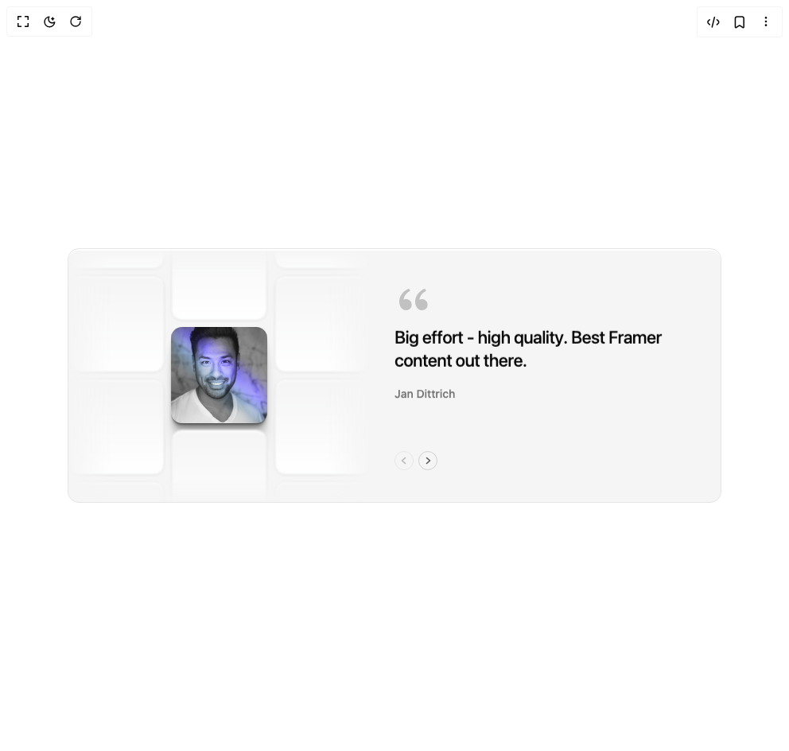

# Build Scroll Reel Testimonials in BuilderStudio

> Build this component in our Agentic IDE: [BuilderStudio](https://builderstudio.dev).
>
> Join the BuilderStudio community on [Discord](https://discord.gg/QdWeSGCqfe) and [Reddit](https://reddit.com/r/builderstudio).



## Component

- Author group: `smammar100`
- Component: `scroll-reel-testimonials`
- Variant: `default`
- Rendered HTML snapshot: [`rendered.html`](rendered.html)

## BuilderStudio prompt

You are implementing a React component based on a component reference.

## Component identity

- Author: smammar100
- Component slug: scroll-reel-testimonials
- Demo slug: default
- Title: scroll-reel-testimonials
- Description: 

## Goal

Recreate this component in a React + TypeScript + Tailwind CSS project. Preserve the visual layout, spacing, colors, border radius, shadows, interaction behavior, animation behavior, responsive behavior, and dark mode behavior shown in the rendered demo.

## Implementation requirements

- Use React and TypeScript.
- Use Tailwind CSS classes whenever possible.
- Keep the component self-contained unless the source files require helper components.
- If the source uses CSS variables, custom CSS, animations, or keyframes, include them.
- If the source uses external packages, list and use the required packages.
- Preserve accessibility attributes, button semantics, links, keyboard behavior, and ARIA attributes when visible in the source.
- Do not replace the component with a simplified placeholder.
- Return complete production-ready code.

## Dependencies

No reference metadata available.

## Rendered DOM snapshot

This is the rendered demo HTML extracted from the live preview. Use it to verify structure, class names, visible content, and layout.

```html
<div id="root"><div class="w-screen min-h-screen flex justify-center items-center"><div class="w-screen min-h-screen flex justify-center items-center"><div class="flex min-h-screen items-center justify-center bg-background p-8"><div role="region" aria-roledescription="carousel" aria-label="Testimonials" tabindex="0" class="relative flex w-full max-w-[1060px] flex-col items-stretch gap-2.5 overflow-hidden rounded-xl border border-border bg-muted shadow-[inset_0_2px_0_rgba(255,255,255,1)] outline-none focus-visible:ring-2 focus-visible:ring-ring md:min-h-[320px] md:flex-row dark:shadow-[inset_0_1px_0_rgba(255,255,255,0.06)]"><div aria-hidden="true" class="relative h-56 w-full shrink-0 self-stretch overflow-hidden md:h-auto md:w-[380px]" style="mask-image: linear-gradient(to right, transparent 0%, black 14%, black 86%, transparent 100%), linear-gradient(transparent 0%, black 10%, black 90%, transparent 100%); mask-composite: intersect;"><div class="absolute inset-0 flex items-center justify-center gap-2"><div class="flex shrink-0 flex-col gap-2 will-change-transform motion-reduce:[transition:none!important]" style="transform: translateY(-387.99px); transition: transform 800ms cubic-bezier(0.65, 0, 0.35, 1);"><div aria-hidden="true" class="shrink-0 rounded-xl border border-border bg-gradient-to-b from-secondary to-card blur-[1px] shadow-[0_1px_2px_rgba(0,0,0,0.05),inset_0_2px_0_rgba(255,255,255,1)] dark:shadow-[0_1px_2px_rgba(0,0,0,0.3),inset_0_1px_0_rgba(255,255,255,0.06)]" style="width: 121.33px; height: 121.33px;"></div><div aria-hidden="true" class="shrink-0 rounded-xl border border-border bg-gradient-to-b from-secondary to-card blur-[1px] shadow-[0_1px_2px_rgba(0,0,0,0.05),inset_0_2px_0_rgba(255,255,255,1)] dark:shadow-[0_1px_2px_rgba(0,0,0,0.3),inset_0_1px_0_rgba(255,255,255,0.06)]" style="width: 121.33px; height: 121.33px;"></div><div aria-hidden="true" class="shrink-0 rounded-xl border border-border bg-gradient-to-b from-secondary to-card blur-[1px] shadow-[0_1px_2px_rgba(0,0,0,0.05),inset_0_2px_0_rgba(255,255,255,1)] dark:shadow-[0_1px_2px_rgba(0,0,0,0.3),inset_0_1px_0_rgba(255,255,255,0.06)]" style="width: 121.33px; height: 121.33px;"></div><div aria-hidden="true" class="shrink-0 rounded-xl border border-border bg-gradient-to-b from-secondary to-card blur-[1px] shadow-[0_1px_2px_rgba(0,0,0,0.05),inset_0_2px_0_rgba(255,255,255,1)] dark:shadow-[0_1px_2px_rgba(0,0,0,0.3),inset_0_1px_0_rgba(255,255,255,0.06)]" style="width: 121.33px; height: 121.33px;"></div><div aria-hidden="true" class="shrink-0 rounded-xl border border-border bg-gradient-to-b from-secondary to-card blur-[1px] shadow-[0_1px_2px_rgba(0,0,0,0.05),inset_0_2px_0_rgba(255,255,255,1)] dark:shadow-[0_1px_2px_rgba(0,0,0,0.3),inset_0_1px_0_rgba(255,255,255,0.06)]" style="width: 121.33px; height: 121.33px;"></div><div aria-hidden="true" class="shrink-0 rounded-xl border border-border bg-gradient-to-b from-secondary to-card blur-[1px] shadow-[0_1px_2px_rgba(0,0,0,0.05),inset_0_2px_0_rgba(255,255,255,1)] dark:shadow-[0_1px_2px_rgba(0,0,0,0.3),inset_0_1px_0_rgba(255,255,255,0.06)]" style="width: 121.33px; height: 121.33px;"></div><div aria-hidden="true" class="shrink-0 rounded-xl border border-border bg-gradient-to-b from-secondary to-card blur-[1px] shadow-[0_1px_2px_rgba(0,0,0,0.05),inset_0_2px_0_rgba(255,255,255,1)] dark:shadow-[0_1px_2px_rgba(0,0,0,0.3),inset_0_1px_0_rgba(255,255,255,0.06)]" style="width: 121.33px; height: 121.33px;"></div><div aria-hidden="true" class="shrink-0 rounded-xl border border-border bg-gradient-to-b from-secondary to-card blur-[1px] shadow-[0_1px_2px_rgba(0,0,0,0.05),inset_0_2px_0_rgba(255,255,255,1)] dark:shadow-[0_1px_2px_rgba(0,0,0,0.3),inset_0_1px_0_rgba(255,255,255,0.06)]" style="width: 121.33px; height: 121.33px;"></div><div aria-hidden="true" class="shrink-0 rounded-xl border border-border bg-gradient-to-b from-secondary to-card blur-[1px] shadow-[0_1px_2px_rgba(0,0,0,0.05),inset_0_2px_0_rgba(255,255,255,1)] dark:shadow-[0_1px_2px_rgba(0,0,0,0.3),inset_0_1px_0_rgba(255,255,255,0.06)]" style="width: 121.33px; height: 121.33px;"></div><div aria-hidden="true" class="shrink-0 rounded-xl border border-border bg-gradient-to-b from-secondary to-card blur-[1px] shadow-[0_1px_2px_rgba(0,0,0,0.05),inset_0_2px_0_rgba(255,255,255,1)] dark:shadow-[0_1px_2px_rgba(0,0,0,0.3),inset_0_1px_0_rgba(255,255,255,0.06)]" style="width: 121.33px; height: 121.33px;"></div></div><div class="flex shrink-0 flex-col gap-2 will-change-transform motion-reduce:[transition:none!important]" style="transform: translateY(387.99px); transition: transform 800ms cubic-bezier(0.65, 0, 0.35, 1);"><div aria-hidden="true" class="shrink-0 rounded-xl border border-border bg-gradient-to-b from-secondary to-card blur-[1px] shadow-[0_1px_2px_rgba(0,0,0,0.05),inset_0_2px_0_rgba(255,255,255,1)] dark:shadow-[0_1px_2px_rgba(0,0,0,0.3),inset_0_1px_0_rgba(255,255,255,0.06)]" style="width: 121.33px; height: 121.33px;"></div><div aria-hidden="true" class="shrink-0 rounded-xl border border-border bg-gradient-to-b from-secondary to-card blur-[1px] shadow-[0_1px_2px_rgba(0,0,0,0.05),inset_0_2px_0_rgba(255,255,255,1)] dark:shadow-[0_1px_2px_rgba(0,0,0,0.3),inset_0_1px_0_rgba(255,255,255,0.06)]" style="width: 121.33px; height: 121.33px;"></div><div aria-hidden="true" class="shrink-0 rounded-xl border border-border bg-gradient-to-b from-secondary to-card blur-[1px] shadow-[0_1px_2px_rgba(0,0,0,0.05),inset_0_2px_0_rgba(255,255,255,1)] dark:shadow-[0_1px_2px_rgba(0,0,0,0.3),inset_0_1px_0_rgba(255,255,255,0.06)]" style="width: 121.33px; height: 121.33px;"></div><div class="relative shrink-0 overflow-hidden rounded-xl bg-muted dark:ring-1 dark:ring-white/10" style="width: 121.33px; height: 121.33px; box-shadow: rgba(0, 0, 0, 0.18) 0px 1.008px 0.705px -0.563px, rgba(0, 0, 0, 0.17) 0px 2.389px 1.672px -1.125px, rgba(0, 0, 0, 0.17) 0px 4.357px 3.05px -1.688px, rgba(0, 0, 0, 0.16) 0px 7.244px 5.07px -2.25px, rgba(0, 0, 0, 0.15) 0px 11.698px 8.188px -2.813px, rgba(0, 0, 0, 0.13) 0px 19.148px 13.404px -3.375px, rgba(0, 0, 0, 0.09) 0px 32.972px 23.08px -3.938px, rgba(0, 0, 0, 0.02) 0px 60px 42px -4.5px, rgba(255, 255, 255, 0.7) 0px 1px 0px inset, rgba(0, 0, 0, 0.6) 0px -1px 0px inset;"><div aria-hidden="true" class="pointer-events-none absolute inset-0 z-[2] bg-white mix-blend-saturation"></div><div aria-hidden="true" class="pointer-events-none absolute inset-0 z-[3] blur-[6px] mix-blend-overlay" style="background: linear-gradient(220.99deg, rgba(108, 92, 255, 0) 32%, rgb(108, 92, 255) 41%, rgb(173, 177, 255) 47%, rgba(130, 189, 237, 0.57) 54%, rgba(130, 189, 237, 0) 65%);"></div></div><div aria-hidden="true" class="shrink-0 rounded-xl border border-border bg-gradient-to-b from-secondary to-card blur-[1px] shadow-[0_1px_2px_rgba(0,0,0,0.05),inset_0_2px_0_rgba(255,255,255,1)] dark:shadow-[0_1px_2px_rgba(0,0,0,0.3),inset_0_1px_0_rgba(255,255,255,0.06)]" style="width: 121.33px; height: 121.33px;"></div><div aria-hidden="true" class="shrink-0 rounded-xl border border-border bg-gradient-to-b from-secondary to-card blur-[1px] shadow-[0_1px_2px_rgba(0,0,0,0.05),inset_0_2px_0_rgba(255,255,255,1)] dark:shadow-[0_1px_2px_rgba(0,0,0,0.3),inset_0_1px_0_rgba(255,255,255,0.06)]" style="width: 121.33px; height: 121.33px;"></div><div class="relative shrink-0 overflow-hidden rounded-xl bg-muted dark:ring-1 dark:ring-white/10" style="width: 121.33px; height: 121.33px; box-shadow: rgba(0, 0, 0, 0.18) 0px 1.008px 0.705px -0.563px, rgba(0, 0, 0, 0.17) 0px 2.389px 1.672px -1.125px, rgba(0, 0, 0, 0.17) 0px 4.357px 3.05px -1.688px, rgba(0, 0, 0, 0.16) 0px 7.244px 5.07px -2.25px, rgba(0, 0, 0, 0.15) 0px 11.698px 8.188px -2.813px, rgba(0, 0, 0, 0.13) 0px 19.148px 13.404px -3.375px, rgba(0, 0, 0, 0.09) 0px 32.972px 23.08px -3.938px, rgba(0, 0, 0, 0.02) 0px 60px 42px -4.5px, rgba(255, 255, 255, 0.7) 0px 1px 0px inset, rgba(0, 0, 0, 0.6) 0px -1px 0px inset;"><div aria-hidden="true" class="pointer-events-none absolute inset-0 z-[2] bg-white mix-blend-saturation"></div><div aria-hidden="true" class="pointer-events-none absolute inset-0 z-[3] blur-[6px] mix-blend-overlay" style="background: linear-gradient(220.99deg, rgba(108, 92, 255, 0) 32%, rgb(108, 92, 255) 41%, rgb(173, 177, 255) 47%, rgba(130, 189, 237, 0.57) 54%, rgba(130, 189, 237, 0) 65%);"></div></div><div aria-hidden="true" class="shrink-0 rounded-xl border border-border bg-gradient-to-b from-secondary to-card blur-[1px] shadow-[0_1px_2px_rgba(0,0,0,0.05),inset_0_2px_0_rgba(255,255,255,1)] dark:shadow-[0_1px_2px_rgba(0,0,0,0.3),inset_0_1px_0_rgba(255,255,255,0.06)]" style="width: 121.33px; height: 121.33px;"></div><div aria-hidden="true" class="shrink-0 rounded-xl border border-border bg-gradient-to-b from-secondary to-card blur-[1px] shadow-[0_1px_2px_rgba(0,0,0,0.05),inset_0_2px_0_rgba(255,255,255,1)] dark:shadow-[0_1px_2px_rgba(0,0,0,0.3),inset_0_1px_0_rgba(255,255,255,0.06)]" style="width: 121.33px; height: 121.33px;"></div><div class="relative shrink-0 overflow-hidden rounded-xl bg-muted dark:ring-1 dark:ring-white/10" style="width: 121.33px; height: 121.33px; box-shadow: rgba(0, 0, 0, 0.18) 0px 1.008px 0.705px -0.563px, rgba(0, 0, 0, 0.17) 0px 2.389px 1.672px -1.125px, rgba(0, 0, 0, 0.17) 0px 4.357px 3.05px -1.688px, rgba(0, 0, 0, 0.16) 0px 7.244px 5.07px -2.25px, rgba(0, 0, 0, 0.15) 0px 11.698px 8.188px -2.813px, rgba(0, 0, 0, 0.13) 0px 19.148px 13.404px -3.375px, rgba(0, 0, 0, 0.09) 0px 32.972px 23.08px -3.938px, rgba(0, 0, 0, 0.02) 0px 60px 42px -4.5px, rgba(255, 255, 255, 0.7) 0px 1px 0px inset, rgba(0, 0, 0, 0.6) 0px -1px 0px inset;"><div aria-hidden="true" class="pointer-events-none absolute inset-0 z-[2] bg-white mix-blend-saturation"></div><div aria-hidden="true" class="pointer-events-none absolute inset-0 z-[3] blur-[6px] mix-blend-overlay" style="background: linear-gradient(220.99deg, rgba(108, 92, 255, 0) 32%, rgb(108, 92, 255) 41%, rgb(173, 177, 255) 47%, rgba(130, 189, 237, 0.57) 54%, rgba(130, 189, 237, 0) 65%);"></div></div><div aria-hidden="true" class="shrink-0 rounded-xl border border-border bg-gradient-to-b from-secondary to-card blur-[1px] shadow-[0_1px_2px_rgba(0,0,0,0.05),inset_0_2px_0_rgba(255,255,255,1)] dark:shadow-[0_1px_2px_rgba(0,0,0,0.3),inset_0_1px_0_rgba(255,255,255,0.06)]" style="width: 121.33px; height: 121.33px;"></div><div aria-hidden="true" class="shrink-0 rounded-xl border border-border bg-gradient-to-b from-secondary to-card blur-[1px] shadow-[0_1px_2px_rgba(0,0,0,0.05),inset_0_2px_0_rgba(255,255,255,1)] dark:shadow-[0_1px_2px_rgba(0,0,0,0.3),inset_0_1px_0_rgba(255,255,255,0.06)]" style="width: 121.33px; height: 121.33px;"></div><div aria-hidden="true" class="shrink-0 rounded-xl border border-border bg-gradient-to-b from-secondary to-card blur-[1px] shadow-[0_1px_2px_rgba(0,0,0,0.05),inset_0_2px_0_rgba(255,255,255,1)] dark:shadow-[0_1px_2px_rgba(0,0,0,0.3),inset_0_1px_0_rgba(255,255,255,0.06)]" style="width: 121.33px; height: 121.33px;"></div></div><div class="flex shrink-0 flex-col gap-2 will-change-transform motion-reduce:[transition:none!important]" style="transform: translateY(-387.99px); transition: transform 800ms cubic-bezier(0.65, 0, 0.35, 1);"><div aria-hidden="true" class="shrink-0 rounded-xl border border-border bg-gradient-to-b from-secondary to-card blur-[1px] shadow-[0_1px_2px_rgba(0,0,0,0.05),inset_0_2px_0_rgba(255,255,255,1)] dark:shadow-[0_1px_2px_rgba(0,0,0,0.3),inset_0_1px_0_rgba(255,255,255,0.06)]" style="width: 121.33px; height: 121.33px;"></div><div aria-hidden="true" class="shrink-0 rounded-xl border border-border bg-gradient-to-b from-secondary to-card blur-[1px] shadow-[0_1px_2px_rgba(0,0,0,0.05),inset_0_2px_0_rgba(255,255,255,1)] dark:shadow-[0_1px_2px_rgba(0,0,0,0.3),inset_0_1px_0_rgba(255,255,255,0.06)]" style="width: 121.33px; height: 121.33px;"></div><div aria-hidden="true" class="shrink-0 rounded-xl border border-border bg-gradient-to-b from-secondary to-card blur-[1px] shadow-[0_1px_2px_rgba(0,0,0,0.05),inset_0_2px_0_rgba(255,255,255,1)] dark:shadow-[0_1px_2px_rgba(0,0,0,0.3),inset_0_1px_0_rgba(255,255,255,0.06)]" style="width: 121.33px; height: 121.33px;"></div><div aria-hidden="true" class="shrink-0 rounded-xl border border-border bg-gradient-to-b from-secondary to-card blur-[1px] shadow-[0_1px_2px_rgba(0,0,0,0.05),inset_0_2px_0_rgba(255,255,255,1)] dark:shadow-[0_1px_2px_rgba(0,0,0,0.3),inset_0_1px_0_rgba(255,255,255,0.06)]" style="width: 121.33px; height: 121.33px;"></div><div aria-hidden="true" class="shrink-0 rounded-xl border border-border bg-gradient-to-b from-secondary to-card blur-[1px] shadow-[0_1px_2px_rgba(0,0,0,0.05),inset_0_2px_0_rgba(255,255,255,1)] dark:shadow-[0_1px_2px_rgba(0,0,0,0.3),inset_0_1px_0_rgba(255,255,255,0.06)]" style="width: 121.33px; height: 121.33px;"></div><div aria-hidden="true" class="shrink-0 rounded-xl border border-border bg-gradient-to-b from-secondary to-card blur-[1px] shadow-[0_1px_2px_rgba(0,0,0,0.05),inset_0_2px_0_rgba(255,255,255,1)] dark:shadow-[0_1px_2px_rgba(0,0,0,0.3),inset_0_1px_0_rgba(255,255,255,0.06)]" style="width: 121.33px; height: 121.33px;"></div><div aria-hidden="true" class="shrink-0 rounded-xl border border-border bg-gradient-to-b from-secondary to-card blur-[1px] shadow-[0_1px_2px_rgba(0,0,0,0.05),inset_0_2px_0_rgba(255,255,255,1)] dark:shadow-[0_1px_2px_rgba(0,0,0,0.3),inset_0_1px_0_rgba(255,255,255,0.06)]" style="width: 121.33px; height: 121.33px;"></div><div aria-hidden="true" class="shrink-0 rounded-xl border border-border bg-gradient-to-b from-secondary to-card blur-[1px] shadow-[0_1px_2px_rgba(0,0,0,0.05),inset_0_2px_0_rgba(255,255,255,1)] dark:shadow-[0_1px_2px_rgba(0,0,0,0.3),inset_0_1px_0_rgba(255,255,255,0.06)]" style="width: 121.33px; height: 121.33px;"></div><div aria-hidden="true" class="shrink-0 rounded-xl border border-border bg-gradient-to-b from-secondary to-card blur-[1px] shadow-[0_1px_2px_rgba(0,0,0,0.05),inset_0_2px_0_rgba(255,255,255,1)] dark:shadow-[0_1px_2px_rgba(0,0,0,0.3),inset_0_1px_0_rgba(255,255,255,0.06)]" style="width: 121.33px; height: 121.33px;"></div><div aria-hidden="true" class="shrink-0 rounded-xl border border-border bg-gradient-to-b from-secondary to-card blur-[1px] shadow-[0_1px_2px_rgba(0,0,0,0.05),inset_0_2px_0_rgba(255,255,255,1)] dark:shadow-[0_1px_2px_rgba(0,0,0,0.3),inset_0_1px_0_rgba(255,255,255,0.06)]" style="width: 121.33px; height: 121.33px;"></div></div></div></div><div class="flex min-w-0 flex-1 flex-col justify-between self-stretch px-5 py-7 md:py-10"><div class="flex flex-col gap-[9px]"><svg class="block h-12 w-12 text-muted-foreground/40" viewBox="0 0 24 24" fill="currentColor" aria-hidden="true"><path d="M4.58 17.32C3.55 16.23 3 15 3 13.01c0-3.5 2.46-6.64 6.03-8.19l.9 1.38c-3.34 1.8-4 4.15-4.25 5.62.54-.28 1.24-.38 1.93-.31 1.8.17 3.23 1.65 3.23 3.49a3.5 3.5 0 0 1-3.5 3.5c-1.07 0-2.1-.49-2.75-1.18zm10 0C13.55 16.23 13 15 13 13.01c0-3.5 2.46-6.64 6.03-8.19l.9 1.38c-3.34 1.8-4 4.15-4.25 5.62.54-.28 1.24-.38 1.93-.31 1.8.17 3.23 1.65 3.23 3.49a3.5 3.5 0 0 1-3.5 3.5c-1.07 0-2.1-.49-2.75-1.18z"></path></svg><div class="relative w-full max-w-[390px] overflow-hidden" aria-live="polite"><div aria-hidden="true" class="invisible flex min-h-[140px] flex-col gap-[19px]"><p class="m-0 text-lg font-medium leading-[1.3] tracking-[-0.02em] text-foreground sm:text-[22px]">Big effort - high quality. Best Framer content out there.</p><p class="m-0 text-sm font-medium leading-[1.3] text-muted-foreground">Jan Dittrich</p></div><div class="absolute inset-x-0 top-0 flex flex-col gap-[19px] will-change-[transform,opacity]"><p class="m-0 text-lg font-medium leading-[1.3] tracking-[-0.02em] text-foreground sm:text-[22px]"><span class="inline-block whitespace-nowrap"><span class="scroll-reel-char" style="animation-delay: 0ms;">B</span><span class="scroll-reel-char" style="animation-delay: 6ms;">i</span><span class="scroll-reel-char" style="animation-delay: 12ms;">g</span></span> <span class="inline-block whitespace-nowrap"><span class="scroll-reel-char" style="animation-delay: 24ms;">e</span><span class="scroll-reel-char" style="animation-delay: 30ms;">f</span><span class="scroll-reel-char" style="animation-delay: 36ms;">f</span><span class="scroll-reel-char" style="animation-delay: 42ms;">o</span><span class="scroll-reel-char" style="animation-delay: 48ms;">r</span><span class="scroll-reel-char" style="animation-delay: 54ms;">t</span></span> <span class="inline-block whitespace-nowrap"><span class="scroll-reel-char" style="animation-delay: 66ms;">-</span></span> <span class="inline-block whitespace-nowrap"><span class="scroll-reel-char" style="animation-delay: 78ms;">h</span><span class="scroll-reel-char" style="animation-delay: 84ms;">i</span><span class="scroll-reel-char" style="animation-delay: 90ms;">g</span><span class="scroll-reel-char" style="animation-delay: 96ms;">h</span></span> <span class="inline-block whitespace-nowrap"><span class="scroll-reel-char" style="animation-delay: 108ms;">q</span><span class="scroll-reel-char" style="animation-delay: 114ms;">u</span><span class="scroll-reel-char" style="animation-delay: 120ms;">a</span><span class="scroll-reel-char" style="animation-delay: 126ms;">l</span><span class="scroll-reel-char" style="animation-delay: 132ms;">i</span><span class="scroll-reel-char" style="animation-delay: 138ms;">t</span><span class="scroll-reel-char" style="animation-delay: 144ms;">y</span><span class="scroll-reel-char" style="animation-delay: 150ms;">.</span></span> <span class="inline-block whitespace-nowrap"><span class="scroll-reel-char" style="animation-delay: 162ms;">B</span><span class="scroll-reel-char" style="animation-delay: 168ms;">e</span><span class="scroll-reel-char" style="animation-delay: 174ms;">s</span><span class="scroll-reel-char" style="animation-delay: 180ms;">t</span></span> <span class="inline-block whitespace-nowrap"><span class="scroll-reel-char" style="animation-delay: 192ms;">F</span><span class="scroll-reel-char" style="animation-delay: 198ms;">r</span><span class="scroll-reel-char" style="animation-delay: 204ms;">a</span><span class="scroll-reel-char" style="animation-delay: 210ms;">m</span><span class="scroll-reel-char" style="animation-delay: 216ms;">e</span><span class="scroll-reel-char" style="animation-delay: 222ms;">r</span></span> <span class="inline-block whitespace-nowrap"><span class="scroll-reel-char" style="animation-delay: 234ms;">c</span><span class="scroll-reel-char" style="animation-delay: 240ms;">o</span><span class="scroll-reel-char" style="animation-delay: 246ms;">n</span><span class="scroll-reel-char" style="animation-delay: 252ms;">t</span><span class="scroll-reel-char" style="animation-delay: 258ms;">e</span><span class="scroll-reel-char" style="animation-delay: 264ms;">n</span><span class="scroll-reel-char" style="animation-delay: 270ms;">t</span></span> <span class="inline-block whitespace-nowrap"><span class="scroll-reel-char" style="animation-delay: 282ms;">o</span><span class="scroll-reel-char" style="animation-delay: 288ms;">u</span><span class="scroll-reel-char" style="animation-delay: 294ms;">t</span></span> <span class="inline-block whitespace-nowrap"><span class="scroll-reel-char" style="animation-delay: 306ms;">t</span><span class="scroll-reel-char" style="animation-delay: 312ms;">h</span><span class="scroll-reel-char" style="animation-delay: 318ms;">e</span><span class="scroll-reel-char" style="animation-delay: 324ms;">r</span><span class="scroll-reel-char" style="animation-delay: 330ms;">e</span><span class="scroll-reel-char" style="animation-delay: 336ms;">.</span></span></p><p class="m-0 text-sm font-medium leading-[1.3] text-muted-foreground"><span class="inline-block whitespace-nowrap"><span class="scroll-reel-char" style="animation-delay: 378ms;">J</span><span class="scroll-reel-char" style="animation-delay: 384ms;">a</span><span class="scroll-reel-char" style="animation-delay: 390ms;">n</span></span> <span class="inline-block whitespace-nowrap"><span class="scroll-reel-char" style="animation-delay: 402ms;">D</span><span class="scroll-reel-char" style="animation-delay: 408ms;">i</span><span class="scroll-reel-char" style="animation-delay: 414ms;">t</span><span class="scroll-reel-char" style="animation-delay: 420ms;">t</span><span class="scroll-reel-char" style="animation-delay: 426ms;">r</span><span class="scroll-reel-char" style="animation-delay: 432ms;">i</span><span class="scroll-reel-char" style="animation-delay: 438ms;">c</span><span class="scroll-reel-char" style="animation-delay: 444ms;">h</span></span></p></div></div></div><div class="mt-6 flex items-center gap-1.5 md:mt-0"><button type="button" disabled="" aria-label="Previous testimonial" class="grid h-6 w-6 cursor-pointer place-items-center rounded-full border border-foreground/15 bg-transparent p-0 text-foreground transition-[opacity,transform] duration-200 ease-[cubic-bezier(0.22,1,0.36,1)] hover:enabled:scale-[1.08] active:enabled:scale-[0.94] disabled:cursor-default disabled:opacity-40 focus-visible:outline-none focus-visible:ring-2 focus-visible:ring-ring"><svg class="h-3 w-3 opacity-70" viewBox="0 0 12 12" fill="none" stroke="currentColor" stroke-width="1.5" stroke-linecap="round" stroke-linejoin="round"><path d="M7.5 2.5 3.5 6l4 3.5"></path></svg></button><button type="button" aria-label="Next testimonial" class="grid h-6 w-6 cursor-pointer place-items-center rounded-full border border-foreground/15 bg-transparent p-0 text-foreground transition-[opacity,transform] duration-200 ease-[cubic-bezier(0.22,1,0.36,1)] hover:enabled:scale-[1.08] active:enabled:scale-[0.94] disabled:cursor-default disabled:opacity-40 focus-visible:outline-none focus-visible:ring-2 focus-visible:ring-ring"><svg class="h-3 w-3 opacity-70" viewBox="0 0 12 12" fill="none" stroke="currentColor" stroke-width="1.5" stroke-linecap="round" stroke-linejoin="round"><path d="m4.5 2.5 4 3.5-4 3.5"></path></svg></button></div></div></div></div></div></div></div>
```

## Reference source files

No reference source files were available.
