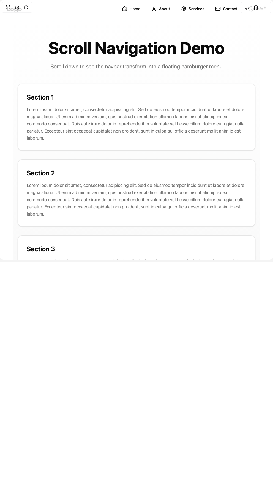

# Build Scroll Navigation Menu in BuilderStudio

> Build this component in our Agentic IDE: [BuilderStudio](https://builderstudio.dev).
>
> Join the BuilderStudio community on [Discord](https://discord.gg/QdWeSGCqfe) and [Reddit](https://reddit.com/r/builderstudio).



## Component

- Author group: `spaceboydavey`
- Component: `scroll-navigation-menu`
- Variant: `default`
- Rendered HTML snapshot: [`rendered.html`](rendered.html)

## BuilderStudio prompt

You are implementing a React component based on a component reference.

## Component identity

- Author: spaceboydavey
- Component slug: scroll-navigation-menu
- Demo slug: default
- Title: scroll-navigation-menu
- Description: 

## Goal

Recreate this component in a React + TypeScript + Tailwind CSS project. Preserve the visual layout, spacing, colors, border radius, shadows, interaction behavior, animation behavior, responsive behavior, and dark mode behavior shown in the rendered demo.

## Implementation requirements

- Use React and TypeScript.
- Use Tailwind CSS classes whenever possible.
- Keep the component self-contained unless the source files require helper components.
- If the source uses CSS variables, custom CSS, animations, or keyframes, include them.
- If the source uses external packages, list and use the required packages.
- Preserve accessibility attributes, button semantics, links, keyboard behavior, and ARIA attributes when visible in the source.
- Do not replace the component with a simplified placeholder.
- Return complete production-ready code.

## Dependencies

No reference metadata available.

## Rendered DOM snapshot

This is the rendered demo HTML extracted from the live preview. Use it to verify structure, class names, visible content, and layout.

```html
<div id="root"><div class="w-screen min-h-screen flex justify-center items-center"><div class="w-screen min-h-screen flex justify-center items-center"><nav class="fixed top-0 left-0 right-0 z-50 bg-background/80 backdrop-blur-md border-b border-border " style="opacity: 1; transform: none;"><div class="max-w-7xl mx-auto px-4 sm:px-6 lg:px-8"><div class="flex items-center justify-between h-16"><div class="flex-shrink-0" tabindex="0"><a href="/" class="text-2xl font-bold text-foreground">Logo</a></div><div class="hidden md:block"><div class="ml-10 flex items-baseline space-x-4"><div class="relative" tabindex="0"><a href="/" class="flex items-center space-x-2 px-3 py-2 rounded-md text-sm font-medium text-foreground hover:text-primary transition-colors"><svg xmlns="http://www.w3.org/2000/svg" width="24" height="24" viewBox="0 0 24 24" fill="none" stroke="currentColor" stroke-width="2" stroke-linecap="round" stroke-linejoin="round" class="lucide lucide-house w-5 h-5" aria-hidden="true"><path d="M15 21v-8a1 1 0 0 0-1-1h-4a1 1 0 0 0-1 1v8"></path><path d="M3 10a2 2 0 0 1 .709-1.528l7-5.999a2 2 0 0 1 2.582 0l7 5.999A2 2 0 0 1 21 10v9a2 2 0 0 1-2 2H5a2 2 0 0 1-2-2z"></path></svg><span>Home</span></a></div><div class="relative" tabindex="0"><a href="/about" class="flex items-center space-x-2 px-3 py-2 rounded-md text-sm font-medium text-foreground hover:text-primary transition-colors"><svg xmlns="http://www.w3.org/2000/svg" width="24" height="24" viewBox="0 0 24 24" fill="none" stroke="currentColor" stroke-width="2" stroke-linecap="round" stroke-linejoin="round" class="lucide lucide-user w-5 h-5" aria-hidden="true"><path d="M19 21v-2a4 4 0 0 0-4-4H9a4 4 0 0 0-4 4v2"></path><circle cx="12" cy="7" r="4"></circle></svg><span>About</span></a></div><div class="relative" tabindex="0"><a href="/services" class="flex items-center space-x-2 px-3 py-2 rounded-md text-sm font-medium text-foreground hover:text-primary transition-colors"><svg xmlns="http://www.w3.org/2000/svg" width="24" height="24" viewBox="0 0 24 24" fill="none" stroke="currentColor" stroke-width="2" stroke-linecap="round" stroke-linejoin="round" class="lucide lucide-settings w-5 h-5" aria-hidden="true"><path d="M12.22 2h-.44a2 2 0 0 0-2 2v.18a2 2 0 0 1-1 1.73l-.43.25a2 2 0 0 1-2 0l-.15-.08a2 2 0 0 0-2.73.73l-.22.38a2 2 0 0 0 .73 2.73l.15.1a2 2 0 0 1 1 1.72v.51a2 2 0 0 1-1 1.74l-.15.09a2 2 0 0 0-.73 2.73l.22.38a2 2 0 0 0 2.73.73l.15-.08a2 2 0 0 1 2 0l.43.25a2 2 0 0 1 1 1.73V20a2 2 0 0 0 2 2h.44a2 2 0 0 0 2-2v-.18a2 2 0 0 1 1-1.73l.43-.25a2 2 0 0 1 2 0l.15.08a2 2 0 0 0 2.73-.73l.22-.39a2 2 0 0 0-.73-2.73l-.15-.08a2 2 0 0 1-1-1.74v-.5a2 2 0 0 1 1-1.74l.15-.09a2 2 0 0 0 .73-2.73l-.22-.38a2 2 0 0 0-2.73-.73l-.15.08a2 2 0 0 1-2 0l-.43-.25a2 2 0 0 1-1-1.73V4a2 2 0 0 0-2-2z"></path><circle cx="12" cy="12" r="3"></circle></svg><span>Services</span></a></div><div class="relative" tabindex="0"><a href="/contact" class="flex items-center space-x-2 px-3 py-2 rounded-md text-sm font-medium text-foreground hover:text-primary transition-colors"><svg xmlns="http://www.w3.org/2000/svg" width="24" height="24" viewBox="0 0 24 24" fill="none" stroke="currentColor" stroke-width="2" stroke-linecap="round" stroke-linejoin="round" class="lucide lucide-mail w-5 h-5" aria-hidden="true"><rect width="20" height="16" x="2" y="4" rx="2"></rect><path d="m22 7-8.97 5.7a1.94 1.94 0 0 1-2.06 0L2 7"></path></svg><span>Contact</span></a></div><div class="relative" tabindex="0"><a href="/info" class="flex items-center space-x-2 px-3 py-2 rounded-md text-sm font-medium text-foreground hover:text-primary transition-colors"><svg xmlns="http://www.w3.org/2000/svg" width="24" height="24" viewBox="0 0 24 24" fill="none" stroke="currentColor" stroke-width="2" stroke-linecap="round" stroke-linejoin="round" class="lucide lucide-info w-5 h-5" aria-hidden="true"><circle cx="12" cy="12" r="10"></circle><path d="M12 16v-4"></path><path d="M12 8h.01"></path></svg><span>Info</span></a></div></div></div><div class="md:hidden"><button class="p-2 rounded-md text-foreground hover:text-primary focus:outline-none" tabindex="0"><svg xmlns="http://www.w3.org/2000/svg" width="24" height="24" viewBox="0 0 24 24" fill="none" stroke="currentColor" stroke-width="2" stroke-linecap="round" stroke-linejoin="round" class="lucide lucide-menu w-6 h-6" aria-hidden="true"><line x1="4" x2="20" y1="12" y2="12"></line><line x1="4" x2="20" y1="6" y2="6"></line><line x1="4" x2="20" y1="18" y2="18"></line></svg></button></div></div></div></nav><div class="fixed top-6 right-6 z-50" style="opacity: 0; transform: scale(0);"><button class="w-14 h-14 bg-primary text-primary-foreground rounded-full shadow-lg flex items-center justify-center" tabindex="0" style="transform: none;"><svg xmlns="http://www.w3.org/2000/svg" width="24" height="24" viewBox="0 0 24 24" fill="none" stroke="currentColor" stroke-width="2" stroke-linecap="round" stroke-linejoin="round" class="lucide lucide-menu w-6 h-6" aria-hidden="true"><line x1="4" x2="20" y1="12" y2="12"></line><line x1="4" x2="20" y1="6" y2="6"></line><line x1="4" x2="20" y1="18" y2="18"></line></svg></button></div><div class="pt-16"><div class="min-h-screen bg-gradient-to-b from-background to-muted"><div class="max-w-4xl mx-auto px-4 py-20"><div class="text-center" style="opacity: 1; transform: none;"><h1 class="text-4xl md:text-6xl font-bold text-foreground mb-6">Scroll Navigation Demo</h1><p class="text-xl text-muted-foreground mb-12">Scroll down to see the navbar transform into a floating hamburger menu</p></div><div class="bg-card border border-border rounded-2xl p-8 mb-8 shadow-sm" style="opacity: 1; transform: none;"><h2 class="text-2xl font-semibold text-foreground mb-4">Section 1</h2><p class="text-muted-foreground leading-relaxed">Lorem ipsum dolor sit amet, consectetur adipiscing elit. Sed do eiusmod tempor incididunt ut labore et dolore magna aliqua. Ut enim ad minim veniam, quis nostrud exercitation ullamco laboris nisi ut aliquip ex ea commodo consequat. Duis aute irure dolor in reprehenderit in voluptate velit esse cillum dolore eu fugiat nulla pariatur. Excepteur sint occaecat cupidatat non proident, sunt in culpa qui officia deserunt mollit anim id est laborum.</p></div><div class="bg-card border border-border rounded-2xl p-8 mb-8 shadow-sm" style="opacity: 1; transform: none;"><h2 class="text-2xl font-semibold text-foreground mb-4">Section 2</h2><p class="text-muted-foreground leading-relaxed">Lorem ipsum dolor sit amet, consectetur adipiscing elit. Sed do eiusmod tempor incididunt ut labore et dolore magna aliqua. Ut enim ad minim veniam, quis nostrud exercitation ullamco laboris nisi ut aliquip ex ea commodo consequat. Duis aute irure dolor in reprehenderit in voluptate velit esse cillum dolore eu fugiat nulla pariatur. Excepteur sint occaecat cupidatat non proident, sunt in culpa qui officia deserunt mollit anim id est laborum.</p></div><div class="bg-card border border-border rounded-2xl p-8 mb-8 shadow-sm" style="opacity: 1; transform: none;"><h2 class="text-2xl font-semibold text-foreground mb-4">Section 3</h2><p class="text-muted-foreground leading-relaxed">Lorem ipsum dolor sit amet, consectetur adipiscing elit. Sed do eiusmod tempor incididunt ut labore et dolore magna aliqua. Ut enim ad minim veniam, quis nostrud exercitation ullamco laboris nisi ut aliquip ex ea commodo consequat. Duis aute irure dolor in reprehenderit in voluptate velit esse cillum dolore eu fugiat nulla pariatur. Excepteur sint occaecat cupidatat non proident, sunt in culpa qui officia deserunt mollit anim id est laborum.</p></div><div class="bg-card border border-border rounded-2xl p-8 mb-8 shadow-sm" style="opacity: 0; transform: translateY(50px);"><h2 class="text-2xl font-semibold text-foreground mb-4">Section 4</h2><p class="text-muted-foreground leading-relaxed">Lorem ipsum dolor sit amet, consectetur adipiscing elit. Sed do eiusmod tempor incididunt ut labore et dolore magna aliqua. Ut enim ad minim veniam, quis nostrud exercitation ullamco laboris nisi ut aliquip ex ea commodo consequat. Duis aute irure dolor in reprehenderit in voluptate velit esse cillum dolore eu fugiat nulla pariatur. Excepteur sint occaecat cupidatat non proident, sunt in culpa qui officia deserunt mollit anim id est laborum.</p></div><div class="bg-card border border-border rounded-2xl p-8 mb-8 shadow-sm" style="opacity: 0; transform: translateY(50px);"><h2 class="text-2xl font-semibold text-foreground mb-4">Section 5</h2><p class="text-muted-foreground leading-relaxed">Lorem ipsum dolor sit amet, consectetur adipiscing elit. Sed do eiusmod tempor incididunt ut labore et dolore magna aliqua. Ut enim ad minim veniam, quis nostrud exercitation ullamco laboris nisi ut aliquip ex ea commodo consequat. Duis aute irure dolor in reprehenderit in voluptate velit esse cillum dolore eu fugiat nulla pariatur. Excepteur sint occaecat cupidatat non proident, sunt in culpa qui officia deserunt mollit anim id est laborum.</p></div></div></div></div></div></div></div>
```

## Reference source files

No reference source files were available.
