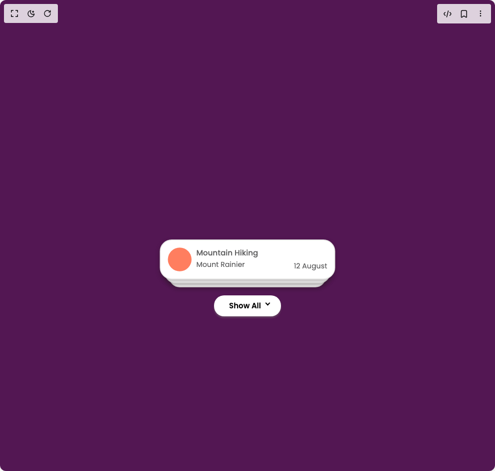

# Build Stacked Activity Cards in BuilderStudio

> Build this component in our Agentic IDE: [BuilderStudio](https://builderstudio.dev).
>
> Join the BuilderStudio community on [Discord](https://discord.gg/QdWeSGCqfe) and [Reddit](https://reddit.com/r/builderstudio).



## Component

- Author group: `spydiecy`
- Component: `stacked-activity-cards`
- Variant: `default`
- Rendered HTML snapshot: [`rendered.html`](rendered.html)

## BuilderStudio prompt

You are implementing a React component based on a component reference.

## Component identity

- Author: spydiecy
- Component slug: stacked-activity-cards
- Demo slug: default
- Title: stacked-activity-cards
- Description: 

## Goal

Recreate this component in a React + TypeScript + Tailwind CSS project. Preserve the visual layout, spacing, colors, border radius, shadows, interaction behavior, animation behavior, responsive behavior, and dark mode behavior shown in the rendered demo.

## Implementation requirements

- Use React and TypeScript.
- Use Tailwind CSS classes whenever possible.
- Keep the component self-contained unless the source files require helper components.
- If the source uses CSS variables, custom CSS, animations, or keyframes, include them.
- If the source uses external packages, list and use the required packages.
- Preserve accessibility attributes, button semantics, links, keyboard behavior, and ARIA attributes when visible in the source.
- Do not replace the component with a simplified placeholder.
- Return complete production-ready code.

## Dependencies

No reference metadata available.

## Rendered DOM snapshot

This is the rendered demo HTML extracted from the live preview. Use it to verify structure, class names, visible content, and layout.

```html
<div id="root"><div class="flex w-full h-screen justify-center items-center"><div class="stacked-cards-container"><div class="inner_container"><div class="park_sec park_sec1"><div class="park_inside"><span class="img" style="background-color: rgb(255, 126, 95);"></span><div class="content_sec"><h2>Mountain Hiking</h2><span>Mount Rainier</span></div></div><span class="date">12 August</span></div><div class="park_sec park_sec2"><div class="park_inside"><span class="img" style="background-color: rgb(3, 150, 255);"></span><div class="content_sec"><h2>Surfing Lesson</h2><span>Malibu Beach</span></div></div><span class="date">8 August</span></div><div class="park_sec park_sec3"><div class="park_inside"><span class="img" style="background-color: rgb(115, 103, 240);"></span><div class="content_sec"><h2>Wine Tasting</h2><span>Napa Valley</span></div></div><span class="date">30 July</span></div><div class="btn_grp"><button class="btn">Show All</button></div></div><style>
        @import url('https://fonts.googleapis.com/css2?family=Poppins:ital,wght@0,100;0,200;0,300;0,400;0,500;0,600;0,700;0,800;0,900;1,100;1,200;1,300;1,400;1,500;1,600;1,700;1,800;1,900&display=swap');
        
        body {
          margin: 0px;
          font-family: "Poppins", sans-serif;
          background: #531753;
        }
        
        .stacked-cards-container {
          position: relative;
          max-width: 700px;
          width: 100%;
          margin: 0px auto;
          min-height: 100vh;
          display: flex;
          align-items: center;
          justify-content: center;
        }
        
        .inner_container {
          position: relative;
          max-width: 400px;
          width: 100%;
          padding: 15px;
          border-radius: 25px;
          box-sizing: border-box;
        }
        
        .park_sec {
          position: relative;
          max-width: 100%;
          width: 100%;
          padding: 15px;
          border: 2px solid #EAEAE9;
          border-radius: 25px;
          box-sizing: border-box;
          display: flex;
          align-items: flex-end;
          justify-content: space-between;
          margin-bottom: 10px;
          transition: all .3s cubic-bezier(.68,-0.55,.27,1.55);
          background: #fff;
          box-shadow: 0px 5px 10px rgba(32, 28, 28, 0.3);
        }
        
        .park_sec.active {
          transform: unset;
        }
        
        .park_sec1 {
          z-index: 2;
          transform: translateY(200%) scale(0.95);
        }
        
        .park_sec2 {
          z-index: 1;
          transform: translateY(100%) scale(0.9);
        }
        
        .park_sec3 {
          z-index: 0;
          transform: translateY(0px) scale(0.85);
        }
        
        .park_inside {
          position: relative;
          display: flex;
        }
        
        .content_sec {
          position: relative;
          margin-left: 10px;
        }
        
        .img {
          position: relative;
          width: 50px;
          height: 50px;
          border-radius: 50%;
          display: flex;
          align-items: center;
          justify-content: center;
        }
        
        .content_sec h2 {
          position: relative;
          margin: 0px;
          font-size: 16px;
          font-weight: 500;
          color: #626263;
        }
        
        .content_sec span,
        .park_sec span {
          position: relative;
          color: #626263;
          font-size: 15px;
        }
        
        .btn_grp {
          position: relative;
          display: flex;
          align-items: center;
          justify-content: center;
          margin-top: 10px;
        }
        
        .btn {
          position: relative;
          padding: 10px 40px 10px 30px;
          background: #fff;
          border-radius: 20px;
          border: 0px;
          box-sizing: border-box;
          box-shadow: 0px 3px 3.5px rgba(119, 113, 113, 0.5);
          font-size: 15px;
          font-weight: 600;
          cursor: pointer;
          transition: all 0.2s ease;
        }
        
        .btn:hover {
          transform: translateY(-2px);
          box-shadow: 0px 5px 5px rgba(119, 113, 113, 0.5);
        }
        
        .btn::after {
          position: absolute;
          content: "";
          border-top: 2px solid #000;
          border-left: 2px solid #000;
          width: 7px;
          height: 7px;
          right: 23px;
          top: 12px;
          transform: rotate(225deg);
          transition: all .3s linear;
        }
        
        .btn.active::after {
          transform: rotate(45deg);
          top: 17px;
        }
      </style></div></div></div>
```

## Reference source files

No reference source files were available.
