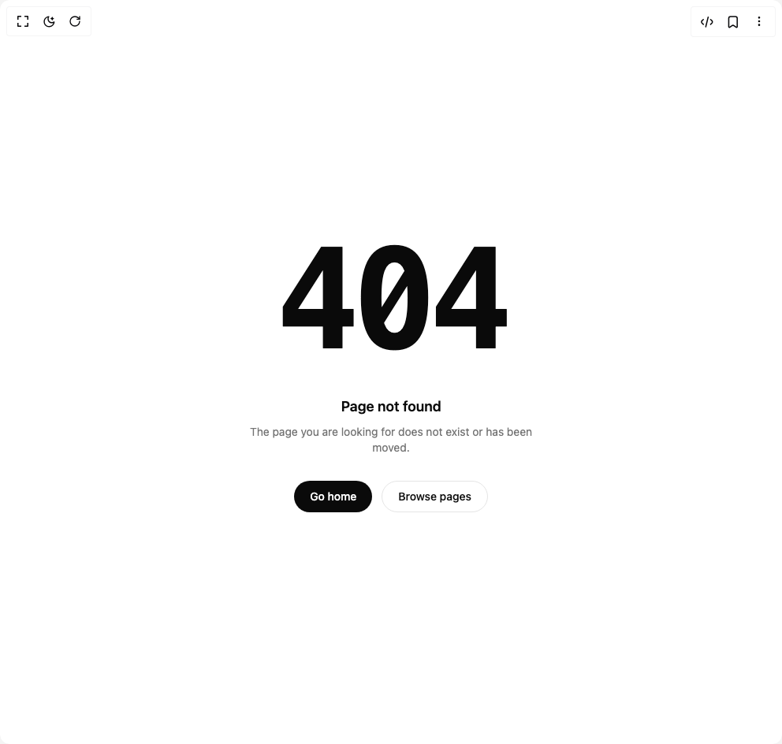

# Build Be Ui 404 Not Found in BuilderStudio

> Build this component in our Agentic IDE: [BuilderStudio](https://builderstudio.dev).
>
> Join the BuilderStudio community on [Discord](https://discord.gg/QdWeSGCqfe) and [Reddit](https://reddit.com/r/builderstudio).



## Component

- Author group: `starc007`
- Component: `be-ui-404-not-found`
- Variant: `default`
- Rendered HTML snapshot: [`rendered.html`](rendered.html)

## BuilderStudio prompt

You are implementing a React component based on a component reference.

## Component identity

- Author: starc007
- Component slug: be-ui-404-not-found
- Demo slug: default
- Title: be-ui-404-not-found
- Description: 

## Goal

Recreate this component in a React + TypeScript + Tailwind CSS project. Preserve the visual layout, spacing, colors, border radius, shadows, interaction behavior, animation behavior, responsive behavior, and dark mode behavior shown in the rendered demo.

## Implementation requirements

- Use React and TypeScript.
- Use Tailwind CSS classes whenever possible.
- Keep the component self-contained unless the source files require helper components.
- If the source uses CSS variables, custom CSS, animations, or keyframes, include them.
- If the source uses external packages, list and use the required packages.
- Preserve accessibility attributes, button semantics, links, keyboard behavior, and ARIA attributes when visible in the source.
- Do not replace the component with a simplified placeholder.
- Return complete production-ready code.

## Dependencies

No reference metadata available.

## Rendered DOM snapshot

This is the rendered demo HTML extracted from the live preview. Use it to verify structure, class names, visible content, and layout.

```html
<div id="root"><div class="w-screen min-h-screen flex justify-center items-center"><div class="w-screen min-h-screen flex justify-center items-center"><div class="w-full"><section class="flex min-h-[520px] w-full flex-col items-center justify-center gap-8 px-6 py-20 text-center"><div class="group relative select-none font-mono font-bold leading-none tracking-tighter text-foreground [font-size:clamp(5rem,18vw,11rem)]"><span aria-hidden="true" class="pointer-events-none absolute inset-0 text-[#ff0040] opacity-0 mix-blend-screen transition-[transform,opacity] duration-150 ease-out group-hover:translate-x-[3px] group-hover:opacity-70 motion-reduce:hidden"><span class="tabular-nums">404</span></span><span aria-hidden="true" class="pointer-events-none absolute inset-0 text-[#00e5ff] opacity-0 mix-blend-screen transition-[transform,opacity] duration-150 ease-out group-hover:-translate-x-[3px] group-hover:opacity-70 motion-reduce:hidden"><span class="tabular-nums">404</span></span><h1 class="relative"><span class="tabular-nums">404</span></h1></div><div class="flex flex-col items-center gap-2"><p class="text-lg font-semibold text-foreground">Page not found</p><p class="max-w-sm text-sm text-muted-foreground">The page you are looking for does not exist or has been moved.</p></div><div class="flex flex-wrap items-center justify-center gap-3"><a href="/" class="inline-flex h-10 items-center justify-center rounded-full bg-foreground px-5 text-sm font-medium text-background transition-transform active:scale-[0.97]">Go home</a><a href="/" class="inline-flex h-10 items-center justify-center rounded-full border border-border bg-card px-5 text-sm font-medium text-foreground transition-transform hover:bg-muted active:scale-[0.97]">Browse pages</a></div></section></div></div></div></div>
```

## Reference source files

No reference source files were available.
