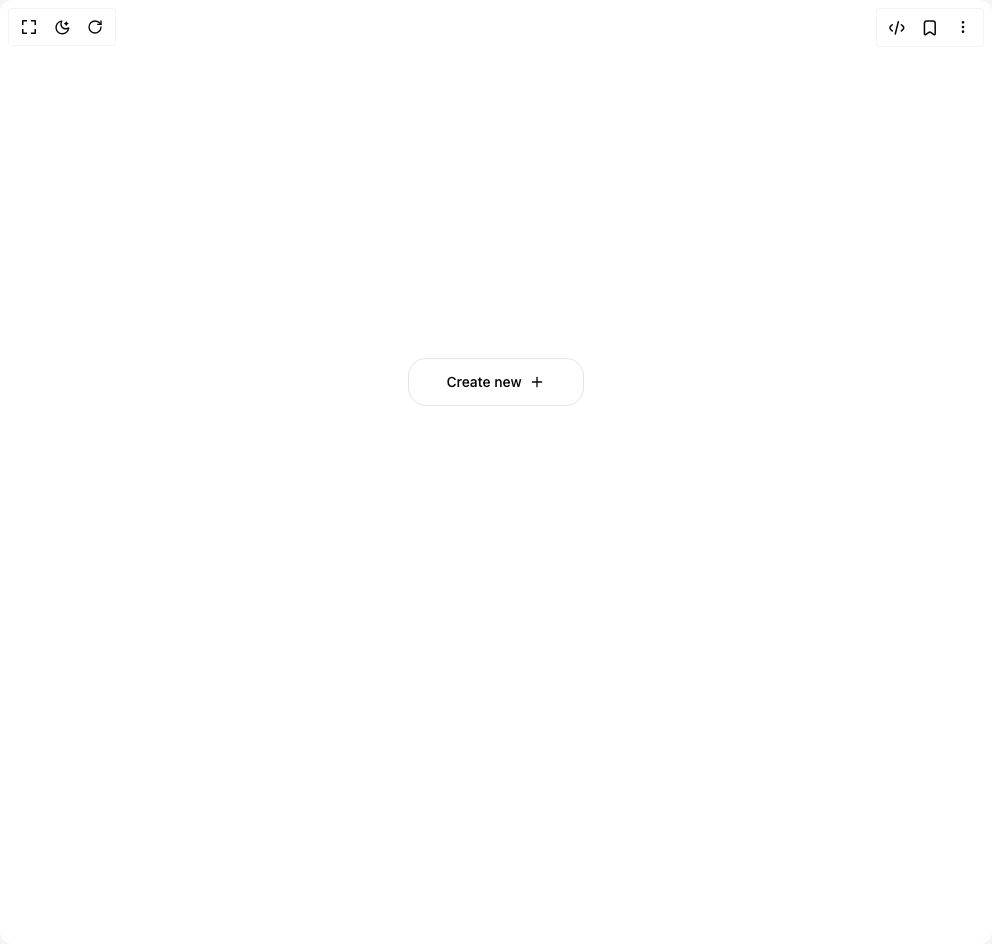

# Build Be Ui Create Menu in BuilderStudio

> Build this component in our Agentic IDE: [BuilderStudio](https://builderstudio.dev).
>
> Join the BuilderStudio community on [Discord](https://discord.gg/QdWeSGCqfe) and [Reddit](https://reddit.com/r/builderstudio).



## Component

- Author group: `starc007`
- Component: `be-ui-create-menu`
- Variant: `default`
- Rendered HTML snapshot: [`rendered.html`](rendered.html)

## BuilderStudio prompt

You are implementing a React component based on a component reference.

## Component identity

- Author: starc007
- Component slug: be-ui-create-menu
- Demo slug: default
- Title: be-ui-create-menu
- Description: 

## Goal

Recreate this component in a React + TypeScript + Tailwind CSS project. Preserve the visual layout, spacing, colors, border radius, shadows, interaction behavior, animation behavior, responsive behavior, and dark mode behavior shown in the rendered demo.

## Implementation requirements

- Use React and TypeScript.
- Use Tailwind CSS classes whenever possible.
- Keep the component self-contained unless the source files require helper components.
- If the source uses CSS variables, custom CSS, animations, or keyframes, include them.
- If the source uses external packages, list and use the required packages.
- Preserve accessibility attributes, button semantics, links, keyboard behavior, and ARIA attributes when visible in the source.
- Do not replace the component with a simplified placeholder.
- Return complete production-ready code.

## Dependencies

No reference metadata available.

## Rendered DOM snapshot

This is the rendered demo HTML extracted from the live preview. Use it to verify structure, class names, visible content, and layout.

```html
<div id="root"><div class="w-screen min-h-screen flex justify-center items-center"><div class="w-screen min-h-screen flex justify-center items-center"><div class="flex min-h-[420px] w-full items-start justify-center pt-24"><div class="relative inline-flex"><div class="h-12 w-44" aria-hidden="true"></div><div class="pointer-events-none absolute left-1/2 top-1/2 z-30 grid h-[360px] w-[min(86vw,520px)] -translate-x-1/2 -translate-y-1/2 place-items-center [&amp;&gt;*]:pointer-events-auto"><button type="button" aria-haspopup="menu" aria-expanded="false" class="inline-flex h-12 w-44 items-center justify-center border border-border bg-card text-sm font-medium text-foreground" tabindex="0" style="border-radius: 18px; opacity: 1;"><span class="inline-flex items-center gap-2 whitespace-nowrap">Create new<svg xmlns="http://www.w3.org/2000/svg" width="24" height="24" viewBox="0 0 24 24" fill="none" stroke="currentColor" stroke-width="2" stroke-linecap="round" stroke-linejoin="round" class="lucide lucide-plus h-4 w-4" aria-hidden="true"><path d="M5 12h14"></path><path d="M12 5v14"></path></svg></span></button></div></div></div></div></div></div>
```

## Reference source files

No reference source files were available.
