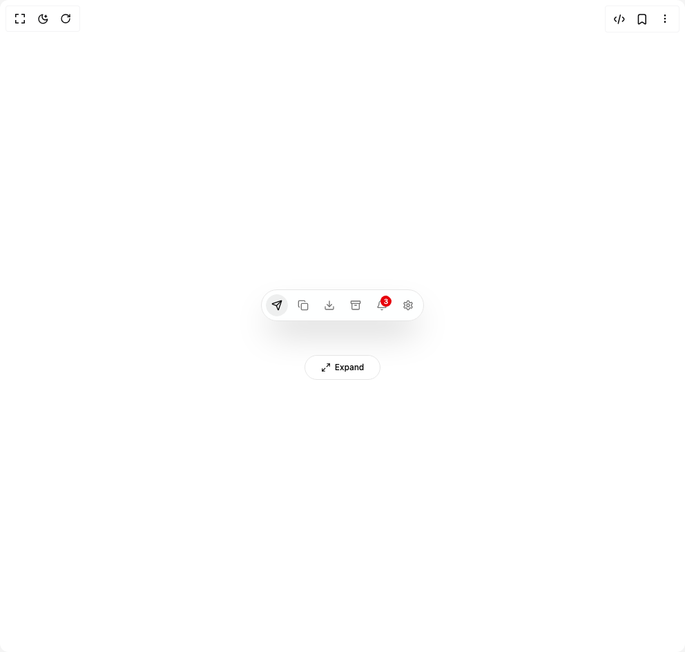

# Build Be Ui Expanable Action Bar in BuilderStudio

> Build this component in our Agentic IDE: [BuilderStudio](https://builderstudio.dev).
>
> Join the BuilderStudio community on [Discord](https://discord.gg/QdWeSGCqfe) and [Reddit](https://reddit.com/r/builderstudio).



## Component

- Author group: `starc007`
- Component: `be-ui-expanable-action-bar`
- Variant: `default`
- Rendered HTML snapshot: [`rendered.html`](rendered.html)

## BuilderStudio prompt

You are implementing a React component based on a component reference.

## Component identity

- Author: starc007
- Component slug: be-ui-expanable-action-bar
- Demo slug: default
- Title: be-ui-expanable-action-bar
- Description: 

## Goal

Recreate this component in a React + TypeScript + Tailwind CSS project. Preserve the visual layout, spacing, colors, border radius, shadows, interaction behavior, animation behavior, responsive behavior, and dark mode behavior shown in the rendered demo.

## Implementation requirements

- Use React and TypeScript.
- Use Tailwind CSS classes whenever possible.
- Keep the component self-contained unless the source files require helper components.
- If the source uses CSS variables, custom CSS, animations, or keyframes, include them.
- If the source uses external packages, list and use the required packages.
- Preserve accessibility attributes, button semantics, links, keyboard behavior, and ARIA attributes when visible in the source.
- Do not replace the component with a simplified placeholder.
- Return complete production-ready code.

## Dependencies

No reference metadata available.

## Rendered DOM snapshot

This is the rendered demo HTML extracted from the live preview. Use it to verify structure, class names, visible content, and layout.

```html
<div id="root"><div class="w-screen min-h-screen flex justify-center items-center"><div class="w-screen min-h-screen flex justify-center items-center"><div class="flex min-h-72 w-full flex-col items-center justify-center gap-6"><div class="flex min-h-24 items-center justify-center"><div class="inline-flex"><div class="relative inline-flex items-center overflow-hidden rounded-full border border-border bg-card/90 shadow-2xl backdrop-blur-xl min-h-11 gap-1.5 p-1.5 text-sm"><button type="button" title="Send" class="relative isolate inline-flex items-center justify-center overflow-hidden rounded-full font-medium outline-none transition-[color,background-color] duration-150 ease-out focus-visible:text-foreground disabled:pointer-events-none disabled:opacity-40 text-foreground h-8 min-w-8 px-2 group" tabindex="0"><span class="absolute inset-0 -z-10 rounded-full bg-primary/[0.07]" style="opacity: 1;"></span><span class="inline-flex shrink-0 items-center justify-center h-4 w-4"><svg xmlns="http://www.w3.org/2000/svg" width="24" height="24" viewBox="0 0 24 24" fill="none" stroke="currentColor" stroke-width="2" stroke-linecap="round" stroke-linejoin="round" class="lucide lucide-send h-4 w-4 motion-safe:group-hover:animate-action-send" aria-hidden="true"><path d="M14.536 21.686a.5.5 0 0 0 .937-.024l6.5-19a.496.496 0 0 0-.635-.635l-19 6.5a.5.5 0 0 0-.024.937l7.93 3.18a2 2 0 0 1 1.112 1.11z"></path><path d="m21.854 2.147-10.94 10.939"></path></svg></span><span aria-hidden="true" class="inline-block overflow-hidden whitespace-nowrap" style="width: 0px; opacity: 0; margin-left: 0px; filter: blur(3px); transform: translateX(-4px);">Send</span><span aria-hidden="true" class="hidden overflow-hidden whitespace-nowrap text-[10px] text-muted-foreground sm:inline-block" style="width: 0px; opacity: 0; margin-left: 0px;">S</span></button><button type="button" title="Copy" class="relative isolate inline-flex items-center justify-center overflow-hidden rounded-full font-medium text-muted-foreground outline-none transition-[color,background-color] duration-150 ease-out focus-visible:text-foreground disabled:pointer-events-none disabled:opacity-40 h-8 min-w-8 px-2 group" tabindex="0"><span class="inline-flex shrink-0 items-center justify-center h-4 w-4"><svg xmlns="http://www.w3.org/2000/svg" width="24" height="24" viewBox="0 0 24 24" fill="none" stroke="currentColor" stroke-width="2" stroke-linecap="round" stroke-linejoin="round" class="lucide lucide-copy h-4 w-4 motion-safe:group-hover:animate-action-copy" aria-hidden="true"><rect width="14" height="14" x="8" y="8" rx="2" ry="2"></rect><path d="M4 16c-1.1 0-2-.9-2-2V4c0-1.1.9-2 2-2h10c1.1 0 2 .9 2 2"></path></svg></span><span aria-hidden="true" class="inline-block overflow-hidden whitespace-nowrap" style="width: 0px; opacity: 0; margin-left: 0px; filter: blur(3px); transform: translateX(-4px);">Copy</span><span aria-hidden="true" class="hidden overflow-hidden whitespace-nowrap text-[10px] text-muted-foreground sm:inline-block" style="width: 0px; opacity: 0; margin-left: 0px;">C</span></button><button type="button" title="Export" class="relative isolate inline-flex items-center justify-center overflow-hidden rounded-full font-medium text-muted-foreground outline-none transition-[color,background-color] duration-150 ease-out focus-visible:text-foreground disabled:pointer-events-none disabled:opacity-40 h-8 min-w-8 px-2 group" tabindex="0"><span class="inline-flex shrink-0 items-center justify-center h-4 w-4"><svg xmlns="http://www.w3.org/2000/svg" width="24" height="24" viewBox="0 0 24 24" fill="none" stroke="currentColor" stroke-width="2" stroke-linecap="round" stroke-linejoin="round" class="lucide lucide-download h-4 w-4 motion-safe:group-hover:animate-action-download" aria-hidden="true"><path d="M21 15v4a2 2 0 0 1-2 2H5a2 2 0 0 1-2-2v-4"></path><polyline points="7 10 12 15 17 10"></polyline><line x1="12" x2="12" y1="15" y2="3"></line></svg></span><span aria-hidden="true" class="inline-block overflow-hidden whitespace-nowrap" style="width: 0px; opacity: 0; margin-left: 0px; filter: blur(3px); transform: translateX(-4px);">Export</span><span aria-hidden="true" class="hidden overflow-hidden whitespace-nowrap text-[10px] text-muted-foreground sm:inline-block" style="width: 0px; opacity: 0; margin-left: 0px;">E</span></button><button type="button" title="Archive" class="relative isolate inline-flex items-center justify-center overflow-hidden rounded-full font-medium text-muted-foreground outline-none transition-[color,background-color] duration-150 ease-out focus-visible:text-foreground disabled:pointer-events-none disabled:opacity-40 h-8 min-w-8 px-2 group" tabindex="0"><span class="inline-flex shrink-0 items-center justify-center h-4 w-4"><svg xmlns="http://www.w3.org/2000/svg" width="24" height="24" viewBox="0 0 24 24" fill="none" stroke="currentColor" stroke-width="2" stroke-linecap="round" stroke-linejoin="round" class="lucide lucide-archive h-4 w-4 motion-safe:group-hover:animate-action-archive" aria-hidden="true"><rect width="20" height="5" x="2" y="3" rx="1"></rect><path d="M4 8v11a2 2 0 0 0 2 2h12a2 2 0 0 0 2-2V8"></path><path d="M10 12h4"></path></svg></span><span aria-hidden="true" class="inline-block overflow-hidden whitespace-nowrap" style="width: 0px; opacity: 0; margin-left: 0px; filter: blur(3px); transform: translateX(-4px);">Archive</span></button><button type="button" title="Alerts" class="relative isolate inline-flex items-center justify-center overflow-hidden rounded-full font-medium text-muted-foreground outline-none transition-[color,background-color] duration-150 ease-out focus-visible:text-foreground disabled:pointer-events-none disabled:opacity-40 h-8 min-w-8 px-2 group" tabindex="0"><span class="inline-flex shrink-0 items-center justify-center h-4 w-4"><svg xmlns="http://www.w3.org/2000/svg" width="24" height="24" viewBox="0 0 24 24" fill="none" stroke="currentColor" stroke-width="2" stroke-linecap="round" stroke-linejoin="round" class="lucide lucide-bell h-4 w-4 origin-top motion-safe:group-hover:animate-action-bell" aria-hidden="true"><path d="M10.268 21a2 2 0 0 0 3.464 0"></path><path d="M3.262 15.326A1 1 0 0 0 4 17h16a1 1 0 0 0 .74-1.673C19.41 13.956 18 12.499 18 8A6 6 0 0 0 6 8c0 4.499-1.411 5.956-2.738 7.326"></path></svg></span><span aria-hidden="true" class="inline-block overflow-hidden whitespace-nowrap" style="width: 0px; opacity: 0; margin-left: 0px; filter: blur(3px); transform: translateX(-4px);">Alerts</span><span class="ml-0.5 inline-flex h-4 min-w-4 items-center justify-center rounded-full bg-destructive px-1 text-[10px] leading-none text-primary-foreground absolute right-0.5 top-0.5">3</span></button><button type="button" title="Settings" class="relative isolate inline-flex items-center justify-center overflow-hidden rounded-full font-medium text-muted-foreground outline-none transition-[color,background-color] duration-150 ease-out focus-visible:text-foreground disabled:pointer-events-none disabled:opacity-40 h-8 min-w-8 px-2 group" tabindex="0"><span class="inline-flex shrink-0 items-center justify-center h-4 w-4"><svg xmlns="http://www.w3.org/2000/svg" width="24" height="24" viewBox="0 0 24 24" fill="none" stroke="currentColor" stroke-width="2" stroke-linecap="round" stroke-linejoin="round" class="lucide lucide-settings h-4 w-4 motion-safe:group-hover:animate-action-settings" aria-hidden="true"><path d="M12.22 2h-.44a2 2 0 0 0-2 2v.18a2 2 0 0 1-1 1.73l-.43.25a2 2 0 0 1-2 0l-.15-.08a2 2 0 0 0-2.73.73l-.22.38a2 2 0 0 0 .73 2.73l.15.1a2 2 0 0 1 1 1.72v.51a2 2 0 0 1-1 1.74l-.15.09a2 2 0 0 0-.73 2.73l.22.38a2 2 0 0 0 2.73.73l.15-.08a2 2 0 0 1 2 0l.43.25a2 2 0 0 1 1 1.73V20a2 2 0 0 0 2 2h.44a2 2 0 0 0 2-2v-.18a2 2 0 0 1 1-1.73l.43-.25a2 2 0 0 1 2 0l.15.08a2 2 0 0 0 2.73-.73l.22-.39a2 2 0 0 0-.73-2.73l-.15-.08a2 2 0 0 1-1-1.74v-.5a2 2 0 0 1 1-1.74l.15-.09a2 2 0 0 0 .73-2.73l-.22-.38a2 2 0 0 0-2.73-.73l-.15.08a2 2 0 0 1-2 0l-.43-.25a2 2 0 0 1-1-1.73V4a2 2 0 0 0-2-2z"></path><circle cx="12" cy="12" r="3"></circle></svg></span><span aria-hidden="true" class="inline-block overflow-hidden whitespace-nowrap" style="width: 0px; opacity: 0; margin-left: 0px; filter: blur(3px); transform: translateX(-4px);">Settings</span></button></div></div></div><div class="flex flex-wrap items-center justify-center gap-2"><button type="button" class="relative flex h-9 w-[110px] items-center justify-center overflow-hidden rounded-full border border-border bg-card text-xs font-medium text-foreground transition-colors hover:border-(--color-border-strong)" tabindex="0"><div class="flex items-center gap-1.5"><svg width="24" height="24" viewBox="0 0 24 24" fill="none" stroke="currentColor" stroke-width="2" stroke-linecap="round" stroke-linejoin="round" class="h-3.5 w-3.5 shrink-0"><path d="M 9 21 L 3 21 L 3 15"></path><path d="M 15 3 L 21 3 L 21 9"></path><line x1="14" x2="21" y1="10" y2="3"></line><line x1="3" x2="10" y1="21" y2="14"></line></svg><span style="opacity: 1; filter: blur(0px); transform: none;">Expand</span></div></button></div></div></div></div></div>
```

## Reference source files

No reference source files were available.
