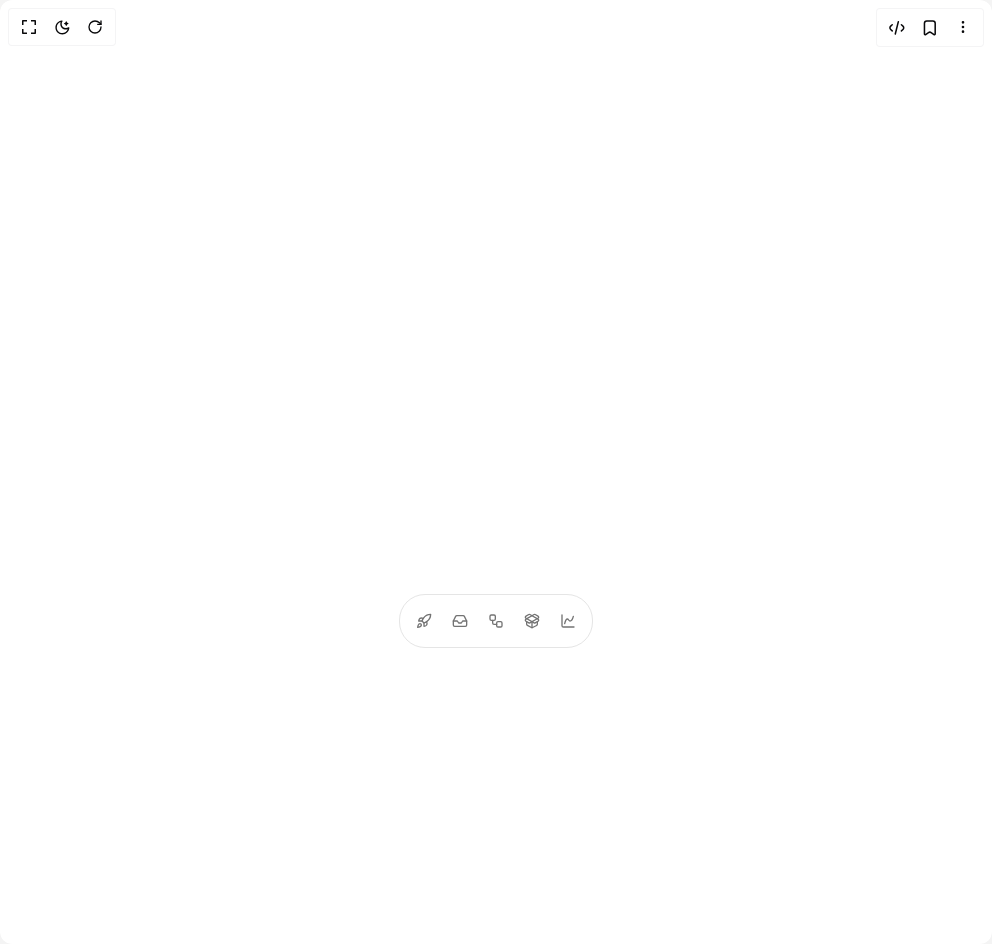

# Build Be Ui Expandable Tabs in BuilderStudio

> Build this component in our Agentic IDE: [BuilderStudio](https://builderstudio.dev).
>
> Join the BuilderStudio community on [Discord](https://discord.gg/QdWeSGCqfe) and [Reddit](https://reddit.com/r/builderstudio).



## Component

- Author group: `starc007`
- Component: `be-ui-expandable-tabs`
- Variant: `default`
- Rendered HTML snapshot: [`rendered.html`](rendered.html)

## BuilderStudio prompt

You are implementing a React component based on a component reference.

## Component identity

- Author: starc007
- Component slug: be-ui-expandable-tabs
- Demo slug: default
- Title: be-ui-expandable-tabs
- Description: 

## Goal

Recreate this component in a React + TypeScript + Tailwind CSS project. Preserve the visual layout, spacing, colors, border radius, shadows, interaction behavior, animation behavior, responsive behavior, and dark mode behavior shown in the rendered demo.

## Implementation requirements

- Use React and TypeScript.
- Use Tailwind CSS classes whenever possible.
- Keep the component self-contained unless the source files require helper components.
- If the source uses CSS variables, custom CSS, animations, or keyframes, include them.
- If the source uses external packages, list and use the required packages.
- Preserve accessibility attributes, button semantics, links, keyboard behavior, and ARIA attributes when visible in the source.
- Do not replace the component with a simplified placeholder.
- Return complete production-ready code.

## Dependencies

No reference metadata available.

## Rendered DOM snapshot

This is the rendered demo HTML extracted from the live preview. Use it to verify structure, class names, visible content, and layout.

```html
<div id="root"><div class="w-screen min-h-screen flex justify-center items-center"><div class="w-screen min-h-screen flex justify-center items-center"><div class="flex min-h-88 w-full items-end justify-center"><div class="relative overflow-hidden rounded-[26px] border border-border bg-card" style="transform-origin: center bottom; width: 194px; height: 54px;"><div aria-hidden="true" class="pointer-events-none invisible absolute left-0 top-0 grid w-max px-2 pt-2" style="padding-bottom: 56px;"><div class="col-start-1 row-start-1 w-max"><div class="flex w-[17.125rem] flex-col gap-0.5"><button type="button" class="flex w-full items-center gap-3 rounded-xl px-3 py-2.5 text-left text-sm font-medium text-foreground transition-colors hover:bg-muted"><svg xmlns="http://www.w3.org/2000/svg" width="24" height="24" viewBox="0 0 24 24" fill="none" stroke="currentColor" stroke-width="2" stroke-linecap="round" stroke-linejoin="round" class="lucide lucide-file-text h-4 w-4 text-muted-foreground" aria-hidden="true"><path d="M15 2H6a2 2 0 0 0-2 2v16a2 2 0 0 0 2 2h12a2 2 0 0 0 2-2V7Z"></path><path d="M14 2v4a2 2 0 0 0 2 2h4"></path><path d="M10 9H8"></path><path d="M16 13H8"></path><path d="M16 17H8"></path></svg><span class="flex-1">Release Brief</span><svg xmlns="http://www.w3.org/2000/svg" width="24" height="24" viewBox="0 0 24 24" fill="none" stroke="currentColor" stroke-width="2" stroke-linecap="round" stroke-linejoin="round" class="lucide lucide-chevron-right h-4 w-4 text-muted-foreground" aria-hidden="true"><path d="m9 18 6-6-6-6"></path></svg></button><button type="button" class="flex w-full items-center gap-3 rounded-xl px-3 py-2.5 text-left text-sm font-medium text-foreground transition-colors hover:bg-muted"><svg xmlns="http://www.w3.org/2000/svg" width="24" height="24" viewBox="0 0 24 24" fill="none" stroke="currentColor" stroke-width="2" stroke-linecap="round" stroke-linejoin="round" class="lucide lucide-clipboard-check h-4 w-4 text-muted-foreground" aria-hidden="true"><rect width="8" height="4" x="8" y="2" rx="1" ry="1"></rect><path d="M16 4h2a2 2 0 0 1 2 2v14a2 2 0 0 1-2 2H6a2 2 0 0 1-2-2V6a2 2 0 0 1 2-2h2"></path><path d="m9 14 2 2 4-4"></path></svg><span class="flex-1">Launch Checklist</span><svg xmlns="http://www.w3.org/2000/svg" width="24" height="24" viewBox="0 0 24 24" fill="none" stroke="currentColor" stroke-width="2" stroke-linecap="round" stroke-linejoin="round" class="lucide lucide-chevron-right h-4 w-4 text-muted-foreground" aria-hidden="true"><path d="m9 18 6-6-6-6"></path></svg></button><button type="button" class="flex w-full items-center gap-3 rounded-xl px-3 py-2.5 text-left text-sm font-medium text-foreground transition-colors hover:bg-muted"><svg xmlns="http://www.w3.org/2000/svg" width="24" height="24" viewBox="0 0 24 24" fill="none" stroke="currentColor" stroke-width="2" stroke-linecap="round" stroke-linejoin="round" class="lucide lucide-megaphone h-4 w-4 text-muted-foreground" aria-hidden="true"><path d="m3 11 18-5v12L3 14v-3z"></path><path d="M11.6 16.8a3 3 0 1 1-5.8-1.6"></path></svg><span class="flex-1">Campaign Notes</span><svg xmlns="http://www.w3.org/2000/svg" width="24" height="24" viewBox="0 0 24 24" fill="none" stroke="currentColor" stroke-width="2" stroke-linecap="round" stroke-linejoin="round" class="lucide lucide-chevron-right h-4 w-4 text-muted-foreground" aria-hidden="true"><path d="m9 18 6-6-6-6"></path></svg></button><button type="button" class="flex w-full items-center gap-3 rounded-xl px-3 py-2.5 text-left text-sm font-medium text-foreground transition-colors hover:bg-muted"><svg xmlns="http://www.w3.org/2000/svg" width="24" height="24" viewBox="0 0 24 24" fill="none" stroke="currentColor" stroke-width="2" stroke-linecap="round" stroke-linejoin="round" class="lucide lucide-calendar-clock h-4 w-4 text-muted-foreground" aria-hidden="true"><path d="M21 7.5V6a2 2 0 0 0-2-2H5a2 2 0 0 0-2 2v14a2 2 0 0 0 2 2h3.5"></path><path d="M16 2v4"></path><path d="M8 2v4"></path><path d="M3 10h5"></path><path d="M17.5 17.5 16 16.3V14"></path><circle cx="16" cy="16" r="6"></circle></svg><span class="flex-1">Rollout Calendar</span><svg xmlns="http://www.w3.org/2000/svg" width="24" height="24" viewBox="0 0 24 24" fill="none" stroke="currentColor" stroke-width="2" stroke-linecap="round" stroke-linejoin="round" class="lucide lucide-chevron-right h-4 w-4 text-muted-foreground" aria-hidden="true"><path d="m9 18 6-6-6-6"></path></svg></button><button type="button" class="flex w-full items-center gap-3 rounded-xl px-3 py-2.5 text-left text-sm font-medium text-foreground transition-colors hover:bg-muted"><svg xmlns="http://www.w3.org/2000/svg" width="24" height="24" viewBox="0 0 24 24" fill="none" stroke="currentColor" stroke-width="2" stroke-linecap="round" stroke-linejoin="round" class="lucide lucide-cloud-upload h-4 w-4 text-muted-foreground" aria-hidden="true"><path d="M12 13v8"></path><path d="M4 14.899A7 7 0 1 1 15.71 8h1.79a4.5 4.5 0 0 1 2.5 8.242"></path><path d="m8 17 4-4 4 4"></path></svg><span class="flex-1">Ship Build</span><svg xmlns="http://www.w3.org/2000/svg" width="24" height="24" viewBox="0 0 24 24" fill="none" stroke="currentColor" stroke-width="2" stroke-linecap="round" stroke-linejoin="round" class="lucide lucide-chevron-right h-4 w-4 text-muted-foreground" aria-hidden="true"><path d="m9 18 6-6-6-6"></path></svg></button></div></div><div class="col-start-1 row-start-1 w-max"><div class="flex w-[17.125rem] flex-col gap-0.5"><button type="button" class="flex w-full items-center gap-3 rounded-xl px-3 py-2.5 text-left text-sm font-medium text-foreground transition-colors hover:bg-muted"><svg xmlns="http://www.w3.org/2000/svg" width="24" height="24" viewBox="0 0 24 24" fill="none" stroke="currentColor" stroke-width="2" stroke-linecap="round" stroke-linejoin="round" class="lucide lucide-message-circle h-4 w-4 text-muted-foreground" aria-hidden="true"><path d="M7.9 20A9 9 0 1 0 4 16.1L2 22Z"></path></svg><span class="flex-1">Client Feedback</span><svg xmlns="http://www.w3.org/2000/svg" width="24" height="24" viewBox="0 0 24 24" fill="none" stroke="currentColor" stroke-width="2" stroke-linecap="round" stroke-linejoin="round" class="lucide lucide-chevron-right h-4 w-4 text-muted-foreground" aria-hidden="true"><path d="m9 18 6-6-6-6"></path></svg></button><button type="button" class="flex w-full items-center gap-3 rounded-xl px-3 py-2.5 text-left text-sm font-medium text-foreground transition-colors hover:bg-muted"><svg xmlns="http://www.w3.org/2000/svg" width="24" height="24" viewBox="0 0 24 24" fill="none" stroke="currentColor" stroke-width="2" stroke-linecap="round" stroke-linejoin="round" class="lucide lucide-users h-4 w-4 text-muted-foreground" aria-hidden="true"><path d="M16 21v-2a4 4 0 0 0-4-4H6a4 4 0 0 0-4 4v2"></path><circle cx="9" cy="7" r="4"></circle><path d="M22 21v-2a4 4 0 0 0-3-3.87"></path><path d="M16 3.13a4 4 0 0 1 0 7.75"></path></svg><span class="flex-1">Team Requests</span><svg xmlns="http://www.w3.org/2000/svg" width="24" height="24" viewBox="0 0 24 24" fill="none" stroke="currentColor" stroke-width="2" stroke-linecap="round" stroke-linejoin="round" class="lucide lucide-chevron-right h-4 w-4 text-muted-foreground" aria-hidden="true"><path d="m9 18 6-6-6-6"></path></svg></button><button type="button" class="flex w-full items-center gap-3 rounded-xl px-3 py-2.5 text-left text-sm font-medium text-foreground transition-colors hover:bg-muted"><svg xmlns="http://www.w3.org/2000/svg" width="24" height="24" viewBox="0 0 24 24" fill="none" stroke="currentColor" stroke-width="2" stroke-linecap="round" stroke-linejoin="round" class="lucide lucide-badge-check h-4 w-4 text-muted-foreground" aria-hidden="true"><path d="M3.85 8.62a4 4 0 0 1 4.78-4.77 4 4 0 0 1 6.74 0 4 4 0 0 1 4.78 4.78 4 4 0 0 1 0 6.74 4 4 0 0 1-4.77 4.78 4 4 0 0 1-6.75 0 4 4 0 0 1-4.78-4.77 4 4 0 0 1 0-6.76Z"></path><path d="m9 12 2 2 4-4"></path></svg><span class="flex-1">Approval Notes</span><svg xmlns="http://www.w3.org/2000/svg" width="24" height="24" viewBox="0 0 24 24" fill="none" stroke="currentColor" stroke-width="2" stroke-linecap="round" stroke-linejoin="round" class="lucide lucide-chevron-right h-4 w-4 text-muted-foreground" aria-hidden="true"><path d="m9 18 6-6-6-6"></path></svg></button></div></div><div class="col-start-1 row-start-1 w-max"><div class="flex w-[17.125rem] flex-col gap-0.5"><button type="button" class="flex w-full items-center gap-3 rounded-xl px-3 py-2.5 text-left text-sm font-medium text-foreground transition-colors hover:bg-muted"><svg xmlns="http://www.w3.org/2000/svg" width="24" height="24" viewBox="0 0 24 24" fill="none" stroke="currentColor" stroke-width="2" stroke-linecap="round" stroke-linejoin="round" class="lucide lucide-git-branch h-4 w-4 text-muted-foreground" aria-hidden="true"><line x1="6" x2="6" y1="3" y2="15"></line><circle cx="18" cy="6" r="3"></circle><circle cx="6" cy="18" r="3"></circle><path d="M18 9a9 9 0 0 1-9 9"></path></svg><span class="flex-1">Trigger Map</span><svg xmlns="http://www.w3.org/2000/svg" width="24" height="24" viewBox="0 0 24 24" fill="none" stroke="currentColor" stroke-width="2" stroke-linecap="round" stroke-linejoin="round" class="lucide lucide-chevron-right h-4 w-4 text-muted-foreground" aria-hidden="true"><path d="m9 18 6-6-6-6"></path></svg></button><button type="button" class="flex w-full items-center gap-3 rounded-xl px-3 py-2.5 text-left text-sm font-medium text-foreground transition-colors hover:bg-muted"><svg xmlns="http://www.w3.org/2000/svg" width="24" height="24" viewBox="0 0 24 24" fill="none" stroke="currentColor" stroke-width="2" stroke-linecap="round" stroke-linejoin="round" class="lucide lucide-webhook h-4 w-4 text-muted-foreground" aria-hidden="true"><path d="M18 16.98h-5.99c-1.1 0-1.95.94-2.48 1.9A4 4 0 0 1 2 17c.01-.7.2-1.4.57-2"></path><path d="m6 17 3.13-5.78c.53-.97.1-2.18-.5-3.1a4 4 0 1 1 6.89-4.06"></path><path d="m12 6 3.13 5.73C15.66 12.7 16.9 13 18 13a4 4 0 0 1 0 8"></path></svg><span class="flex-1">Webhook Runs</span><svg xmlns="http://www.w3.org/2000/svg" width="24" height="24" viewBox="0 0 24 24" fill="none" stroke="currentColor" stroke-width="2" stroke-linecap="round" stroke-linejoin="round" class="lucide lucide-chevron-right h-4 w-4 text-muted-foreground" aria-hidden="true"><path d="m9 18 6-6-6-6"></path></svg></button><button type="button" class="flex w-full items-center gap-3 rounded-xl px-3 py-2.5 text-left text-sm font-medium text-foreground transition-colors hover:bg-muted"><svg xmlns="http://www.w3.org/2000/svg" width="24" height="24" viewBox="0 0 24 24" fill="none" stroke="currentColor" stroke-width="2" stroke-linecap="round" stroke-linejoin="round" class="lucide lucide-refresh-cw h-4 w-4 text-muted-foreground" aria-hidden="true"><path d="M3 12a9 9 0 0 1 9-9 9.75 9.75 0 0 1 6.74 2.74L21 8"></path><path d="M21 3v5h-5"></path><path d="M21 12a9 9 0 0 1-9 9 9.75 9.75 0 0 1-6.74-2.74L3 16"></path><path d="M8 16H3v5"></path></svg><span class="flex-1">Retry Queue</span><svg xmlns="http://www.w3.org/2000/svg" width="24" height="24" viewBox="0 0 24 24" fill="none" stroke="currentColor" stroke-width="2" stroke-linecap="round" stroke-linejoin="round" class="lucide lucide-chevron-right h-4 w-4 text-muted-foreground" aria-hidden="true"><path d="m9 18 6-6-6-6"></path></svg></button></div></div><div class="col-start-1 row-start-1 w-max"><div class="flex w-[17.125rem] flex-col gap-0.5"><button type="button" class="flex w-full items-center gap-3 rounded-xl px-3 py-2.5 text-left text-sm font-medium text-foreground transition-colors hover:bg-muted"><svg xmlns="http://www.w3.org/2000/svg" width="24" height="24" viewBox="0 0 24 24" fill="none" stroke="currentColor" stroke-width="2" stroke-linecap="round" stroke-linejoin="round" class="lucide lucide-swatch-book h-4 w-4 text-muted-foreground" aria-hidden="true"><path d="M11 17a4 4 0 0 1-8 0V5a2 2 0 0 1 2-2h4a2 2 0 0 1 2 2Z"></path><path d="M16.7 13H19a2 2 0 0 1 2 2v4a2 2 0 0 1-2 2H7"></path><path d="M 7 17h.01"></path><path d="m11 8 2.3-2.3a2.4 2.4 0 0 1 3.404.004L18.6 7.6a2.4 2.4 0 0 1 .026 3.434L9.9 19.8"></path></svg><span class="flex-1">Brand Kit</span><svg xmlns="http://www.w3.org/2000/svg" width="24" height="24" viewBox="0 0 24 24" fill="none" stroke="currentColor" stroke-width="2" stroke-linecap="round" stroke-linejoin="round" class="lucide lucide-chevron-right h-4 w-4 text-muted-foreground" aria-hidden="true"><path d="m9 18 6-6-6-6"></path></svg></button><button type="button" class="flex w-full items-center gap-3 rounded-xl px-3 py-2.5 text-left text-sm font-medium text-foreground transition-colors hover:bg-muted"><svg xmlns="http://www.w3.org/2000/svg" width="24" height="24" viewBox="0 0 24 24" fill="none" stroke="currentColor" stroke-width="2" stroke-linecap="round" stroke-linejoin="round" class="lucide lucide-images h-4 w-4 text-muted-foreground" aria-hidden="true"><path d="M18 22H4a2 2 0 0 1-2-2V6"></path><path d="m22 13-1.296-1.296a2.41 2.41 0 0 0-3.408 0L11 18"></path><circle cx="12" cy="8" r="2"></circle><rect width="16" height="16" x="6" y="2" rx="2"></rect></svg><span class="flex-1">Mockup Library</span><svg xmlns="http://www.w3.org/2000/svg" width="24" height="24" viewBox="0 0 24 24" fill="none" stroke="currentColor" stroke-width="2" stroke-linecap="round" stroke-linejoin="round" class="lucide lucide-chevron-right h-4 w-4 text-muted-foreground" aria-hidden="true"><path d="m9 18 6-6-6-6"></path></svg></button><button type="button" class="flex w-full items-center gap-3 rounded-xl px-3 py-2.5 text-left text-sm font-medium text-foreground transition-colors hover:bg-muted"><svg xmlns="http://www.w3.org/2000/svg" width="24" height="24" viewBox="0 0 24 24" fill="none" stroke="currentColor" stroke-width="2" stroke-linecap="round" stroke-linejoin="round" class="lucide lucide-brush h-4 w-4 text-muted-foreground" aria-hidden="true"><path d="m9.06 11.9 8.07-8.06a2.85 2.85 0 1 1 4.03 4.03l-8.06 8.08"></path><path d="M7.07 14.94c-1.66 0-3 1.35-3 3.02 0 1.33-2.5 1.52-2 2.02 1.08 1.1 2.49 2.02 4 2.02 2.2 0 4-1.8 4-4.04a3.01 3.01 0 0 0-3-3.02z"></path></svg><span class="flex-1">Design Tokens</span><svg xmlns="http://www.w3.org/2000/svg" width="24" height="24" viewBox="0 0 24 24" fill="none" stroke="currentColor" stroke-width="2" stroke-linecap="round" stroke-linejoin="round" class="lucide lucide-chevron-right h-4 w-4 text-muted-foreground" aria-hidden="true"><path d="m9 18 6-6-6-6"></path></svg></button><button type="button" class="flex w-full items-center gap-3 rounded-xl px-3 py-2.5 text-left text-sm font-medium text-foreground transition-colors hover:bg-muted"><svg xmlns="http://www.w3.org/2000/svg" width="24" height="24" viewBox="0 0 24 24" fill="none" stroke="currentColor" stroke-width="2" stroke-linecap="round" stroke-linejoin="round" class="lucide lucide-cloud-upload h-4 w-4 text-muted-foreground" aria-hidden="true"><path d="M12 13v8"></path><path d="M4 14.899A7 7 0 1 1 15.71 8h1.79a4.5 4.5 0 0 1 2.5 8.242"></path><path d="m8 17 4-4 4 4"></path></svg><span class="flex-1">Export Queue</span><svg xmlns="http://www.w3.org/2000/svg" width="24" height="24" viewBox="0 0 24 24" fill="none" stroke="currentColor" stroke-width="2" stroke-linecap="round" stroke-linejoin="round" class="lucide lucide-chevron-right h-4 w-4 text-muted-foreground" aria-hidden="true"><path d="m9 18 6-6-6-6"></path></svg></button></div></div><div class="col-start-1 row-start-1 w-max"><div class="flex w-[17.125rem] flex-col gap-0.5"><button type="button" class="flex w-full items-center gap-3 rounded-xl px-3 py-2.5 text-left text-sm font-medium text-foreground transition-colors hover:bg-muted"><svg xmlns="http://www.w3.org/2000/svg" width="24" height="24" viewBox="0 0 24 24" fill="none" stroke="currentColor" stroke-width="2" stroke-linecap="round" stroke-linejoin="round" class="lucide lucide-gauge h-4 w-4 text-muted-foreground" aria-hidden="true"><path d="m12 14 4-4"></path><path d="M3.34 19a10 10 0 1 1 17.32 0"></path></svg><span class="flex-1">Activation</span><svg xmlns="http://www.w3.org/2000/svg" width="24" height="24" viewBox="0 0 24 24" fill="none" stroke="currentColor" stroke-width="2" stroke-linecap="round" stroke-linejoin="round" class="lucide lucide-chevron-right h-4 w-4 text-muted-foreground" aria-hidden="true"><path d="m9 18 6-6-6-6"></path></svg></button><button type="button" class="flex w-full items-center gap-3 rounded-xl px-3 py-2.5 text-left text-sm font-medium text-foreground transition-colors hover:bg-muted"><svg xmlns="http://www.w3.org/2000/svg" width="24" height="24" viewBox="0 0 24 24" fill="none" stroke="currentColor" stroke-width="2" stroke-linecap="round" stroke-linejoin="round" class="lucide lucide-chart-spline h-4 w-4 text-muted-foreground" aria-hidden="true"><path d="M3 3v16a2 2 0 0 0 2 2h16"></path><path d="M7 16c.5-2 1.5-7 4-7 2 0 2 3 4 3 2.5 0 4.5-5 5-7"></path></svg><span class="flex-1">Conversion</span><svg xmlns="http://www.w3.org/2000/svg" width="24" height="24" viewBox="0 0 24 24" fill="none" stroke="currentColor" stroke-width="2" stroke-linecap="round" stroke-linejoin="round" class="lucide lucide-chevron-right h-4 w-4 text-muted-foreground" aria-hidden="true"><path d="m9 18 6-6-6-6"></path></svg></button><button type="button" class="flex w-full items-center gap-3 rounded-xl px-3 py-2.5 text-left text-sm font-medium text-foreground transition-colors hover:bg-muted"><svg xmlns="http://www.w3.org/2000/svg" width="24" height="24" viewBox="0 0 24 24" fill="none" stroke="currentColor" stroke-width="2" stroke-linecap="round" stroke-linejoin="round" class="lucide lucide-siren h-4 w-4 text-muted-foreground" aria-hidden="true"><path d="M7 18v-6a5 5 0 1 1 10 0v6"></path><path d="M5 21a1 1 0 0 0 1 1h12a1 1 0 0 0 1-1v-1a2 2 0 0 0-2-2H7a2 2 0 0 0-2 2z"></path><path d="M21 12h1"></path><path d="M18.5 4.5 18 5"></path><path d="M2 12h1"></path><path d="M12 2v1"></path><path d="m4.929 4.929.707.707"></path><path d="M12 12v6"></path></svg><span class="flex-1">Incidents</span><svg xmlns="http://www.w3.org/2000/svg" width="24" height="24" viewBox="0 0 24 24" fill="none" stroke="currentColor" stroke-width="2" stroke-linecap="round" stroke-linejoin="round" class="lucide lucide-chevron-right h-4 w-4 text-muted-foreground" aria-hidden="true"><path d="m9 18 6-6-6-6"></path></svg></button></div></div></div><div class="absolute left-0 right-0 top-0 z-10 overflow-hidden px-2 pt-2" style="bottom: 56px;"></div><div role="tablist" aria-label="Navigation tabs" aria-orientation="horizontal" class="absolute bottom-0 left-0 z-20 flex w-full items-center justify-between gap-1 p-2" style="height: 52px;"><button type="button" role="tab" aria-selected="false" aria-label="Launch" class="relative isolate flex h-9 min-w-8 shrink-0 items-center justify-center overflow-hidden rounded-[18px] px-2 text-sm font-medium outline-none focus-visible:ring-2 focus-visible:ring-ring focus-visible:ring-offset-2 focus-visible:ring-offset-background text-muted-foreground hover:text-foreground" style="width: 32px;"><span class="grid shrink-0 place-items-center"><svg xmlns="http://www.w3.org/2000/svg" width="24" height="24" viewBox="0 0 24 24" fill="none" stroke="currentColor" stroke-width="2" stroke-linecap="round" stroke-linejoin="round" class="lucide lucide-rocket h-4 w-4" aria-hidden="true"><path d="M4.5 16.5c-1.5 1.26-2 5-2 5s3.74-.5 5-2c.71-.84.7-2.13-.09-2.91a2.18 2.18 0 0 0-2.91-.09z"></path><path d="m12 15-3-3a22 22 0 0 1 2-3.95A12.88 12.88 0 0 1 22 2c0 2.72-.78 7.5-6 11a22.35 22.35 0 0 1-4 2z"></path><path d="M9 12H4s.55-3.03 2-4c1.62-1.08 5 0 5 0"></path><path d="M12 15v5s3.03-.55 4-2c1.08-1.62 0-5 0-5"></path></svg></span><span aria-hidden="true" class="inline-block overflow-hidden whitespace-nowrap" style="width: 0px; opacity: 0; margin-left: 0px; filter: blur(3px);">Launch</span></button><button type="button" role="tab" aria-selected="false" aria-label="Inbox" class="relative isolate flex h-9 min-w-8 shrink-0 items-center justify-center overflow-hidden rounded-[18px] px-2 text-sm font-medium outline-none focus-visible:ring-2 focus-visible:ring-ring focus-visible:ring-offset-2 focus-visible:ring-offset-background text-muted-foreground hover:text-foreground" style="width: 32px;"><span class="grid shrink-0 place-items-center"><svg xmlns="http://www.w3.org/2000/svg" width="24" height="24" viewBox="0 0 24 24" fill="none" stroke="currentColor" stroke-width="2" stroke-linecap="round" stroke-linejoin="round" class="lucide lucide-inbox h-4 w-4" aria-hidden="true"><polyline points="22 12 16 12 14 15 10 15 8 12 2 12"></polyline><path d="M5.45 5.11 2 12v6a2 2 0 0 0 2 2h16a2 2 0 0 0 2-2v-6l-3.45-6.89A2 2 0 0 0 16.76 4H7.24a2 2 0 0 0-1.79 1.11z"></path></svg></span><span aria-hidden="true" class="inline-block overflow-hidden whitespace-nowrap" style="width: 0px; opacity: 0; margin-left: 0px; filter: blur(3px);">Inbox</span></button><button type="button" role="tab" aria-selected="false" aria-label="Flows" class="relative isolate flex h-9 min-w-8 shrink-0 items-center justify-center overflow-hidden rounded-[18px] px-2 text-sm font-medium outline-none focus-visible:ring-2 focus-visible:ring-ring focus-visible:ring-offset-2 focus-visible:ring-offset-background text-muted-foreground hover:text-foreground" style="width: 32px;"><span class="grid shrink-0 place-items-center"><svg xmlns="http://www.w3.org/2000/svg" width="24" height="24" viewBox="0 0 24 24" fill="none" stroke="currentColor" stroke-width="2" stroke-linecap="round" stroke-linejoin="round" class="lucide lucide-workflow h-4 w-4" aria-hidden="true"><rect width="8" height="8" x="3" y="3" rx="2"></rect><path d="M7 11v4a2 2 0 0 0 2 2h4"></path><rect width="8" height="8" x="13" y="13" rx="2"></rect></svg></span><span aria-hidden="true" class="inline-block overflow-hidden whitespace-nowrap" style="width: 0px; opacity: 0; margin-left: 0px; filter: blur(3px);">Flows</span></button><button type="button" role="tab" aria-selected="false" aria-label="Assets" class="relative isolate flex h-9 min-w-8 shrink-0 items-center justify-center overflow-hidden rounded-[18px] px-2 text-sm font-medium outline-none focus-visible:ring-2 focus-visible:ring-ring focus-visible:ring-offset-2 focus-visible:ring-offset-background text-muted-foreground hover:text-foreground" style="width: 32px;"><span class="grid shrink-0 place-items-center"><svg xmlns="http://www.w3.org/2000/svg" width="24" height="24" viewBox="0 0 24 24" fill="none" stroke="currentColor" stroke-width="2" stroke-linecap="round" stroke-linejoin="round" class="lucide lucide-package-open h-4 w-4" aria-hidden="true"><path d="M12 22v-9"></path><path d="M15.17 2.21a1.67 1.67 0 0 1 1.63 0L21 4.57a1.93 1.93 0 0 1 0 3.36L8.82 14.79a1.655 1.655 0 0 1-1.64 0L3 12.43a1.93 1.93 0 0 1 0-3.36z"></path><path d="M20 13v3.87a2.06 2.06 0 0 1-1.11 1.83l-6 3.08a1.93 1.93 0 0 1-1.78 0l-6-3.08A2.06 2.06 0 0 1 4 16.87V13"></path><path d="M21 12.43a1.93 1.93 0 0 0 0-3.36L8.83 2.2a1.64 1.64 0 0 0-1.63 0L3 4.57a1.93 1.93 0 0 0 0 3.36l12.18 6.86a1.636 1.636 0 0 0 1.63 0z"></path></svg></span><span aria-hidden="true" class="inline-block overflow-hidden whitespace-nowrap" style="width: 0px; opacity: 0; margin-left: 0px; filter: blur(3px);">Assets</span></button><button type="button" role="tab" aria-selected="false" aria-label="Status" class="relative isolate flex h-9 min-w-8 shrink-0 items-center justify-center overflow-hidden rounded-[18px] px-2 text-sm font-medium outline-none focus-visible:ring-2 focus-visible:ring-ring focus-visible:ring-offset-2 focus-visible:ring-offset-background text-muted-foreground hover:text-foreground" style="width: 32px;"><span class="grid shrink-0 place-items-center"><svg xmlns="http://www.w3.org/2000/svg" width="24" height="24" viewBox="0 0 24 24" fill="none" stroke="currentColor" stroke-width="2" stroke-linecap="round" stroke-linejoin="round" class="lucide lucide-chart-spline h-4 w-4" aria-hidden="true"><path d="M3 3v16a2 2 0 0 0 2 2h16"></path><path d="M7 16c.5-2 1.5-7 4-7 2 0 2 3 4 3 2.5 0 4.5-5 5-7"></path></svg></span><span aria-hidden="true" class="inline-block overflow-hidden whitespace-nowrap" style="width: 0px; opacity: 0; margin-left: 0px; filter: blur(3px);">Status</span></button></div></div><div aria-hidden="true" class="pointer-events-none fixed left-0 top-0 -z-10 flex opacity-0"><span class="whitespace-nowrap text-sm font-medium leading-none">Launch</span><span class="whitespace-nowrap text-sm font-medium leading-none">Inbox</span><span class="whitespace-nowrap text-sm font-medium leading-none">Flows</span><span class="whitespace-nowrap text-sm font-medium leading-none">Assets</span><span class="whitespace-nowrap text-sm font-medium leading-none">Status</span></div></div></div></div></div>
```

## Reference source files

No reference source files were available.
