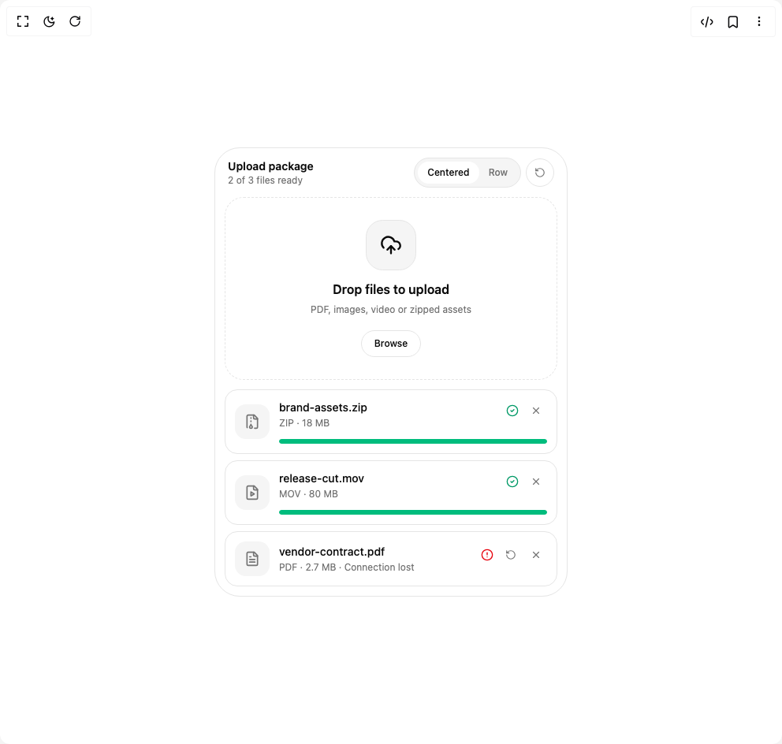

# Build Be Ui File Upload in BuilderStudio

> Build this component in our Agentic IDE: [BuilderStudio](https://builderstudio.dev).
>
> Join the BuilderStudio community on [Discord](https://discord.gg/QdWeSGCqfe) and [Reddit](https://reddit.com/r/builderstudio).



## Component

- Author group: `starc007`
- Component: `be-ui-file-upload`
- Variant: `default`
- Rendered HTML snapshot: [`rendered.html`](rendered.html)

## BuilderStudio prompt

You are implementing a React component based on a component reference.

## Component identity

- Author: starc007
- Component slug: be-ui-file-upload
- Demo slug: default
- Title: be-ui-file-upload
- Description: 

## Goal

Recreate this component in a React + TypeScript + Tailwind CSS project. Preserve the visual layout, spacing, colors, border radius, shadows, interaction behavior, animation behavior, responsive behavior, and dark mode behavior shown in the rendered demo.

## Implementation requirements

- Use React and TypeScript.
- Use Tailwind CSS classes whenever possible.
- Keep the component self-contained unless the source files require helper components.
- If the source uses CSS variables, custom CSS, animations, or keyframes, include them.
- If the source uses external packages, list and use the required packages.
- Preserve accessibility attributes, button semantics, links, keyboard behavior, and ARIA attributes when visible in the source.
- Do not replace the component with a simplified placeholder.
- Return complete production-ready code.

## Dependencies

No reference metadata available.

## Rendered DOM snapshot

This is the rendered demo HTML extracted from the live preview. Use it to verify structure, class names, visible content, and layout.

```html
<div id="root"><div class="w-screen min-h-screen flex justify-center items-center"><div class="w-screen min-h-screen flex justify-center items-center"><div class="flex min-h-[30rem] w-full items-center justify-center"><div class="w-full max-w-md rounded-[2rem] border border-border bg-background p-3"><div class="mb-3 flex flex-wrap items-center justify-between gap-2 px-1"><div><p class="text-sm font-semibold text-foreground">Upload package</p><p class="text-xs text-muted-foreground">2 of 3 files ready</p></div><div class="flex items-center gap-1.5"><div class="flex rounded-full border border-border bg-muted p-1"><button type="button" data-selected="true" class="h-7 rounded-full px-3 text-xs font-medium text-muted-foreground transition-[background-color,color,transform] duration-150 hover:text-foreground active:scale-95 data-[selected=true]:bg-background data-[selected=true]:text-foreground">Centered</button><button type="button" data-selected="false" class="h-7 rounded-full px-3 text-xs font-medium text-muted-foreground transition-[background-color,color,transform] duration-150 hover:text-foreground active:scale-95 data-[selected=true]:bg-background data-[selected=true]:text-foreground">Row</button></div><button type="button" class="grid h-9 w-9 place-items-center rounded-full border border-border text-muted-foreground transition-colors hover:text-foreground active:scale-95" aria-label="Reset upload queue"><svg xmlns="http://www.w3.org/2000/svg" width="24" height="24" viewBox="0 0 24 24" fill="none" stroke="currentColor" stroke-width="2" stroke-linecap="round" stroke-linejoin="round" class="lucide lucide-rotate-ccw h-3.5 w-3.5" aria-hidden="true"><path d="M3 12a9 9 0 1 0 9-9 9.75 9.75 0 0 0-6.74 2.74L3 8"></path><path d="M3 3v5h5"></path></svg></button></div></div><div class="w-full space-y-3"><input id="«r0»" aria-label="Upload files" multiple="" tabindex="-1" class="sr-only" type="file"><button type="button" data-dragging="false" class="group relative flex w-full overflow-hidden rounded-3xl border border-dashed border-border bg-background outline-none transition-[border-color,transform] duration-200 active:scale-[0.99] hover:border-foreground/40 focus-visible:ring-2 focus-visible:ring-ring focus-visible:ring-offset-2 focus-visible:ring-offset-background data-[dragging=true]:border-foreground disabled:pointer-events-none disabled:opacity-55 min-h-56 flex-col items-center justify-center gap-3 p-7 text-center"><span aria-hidden="true" class="grid shrink-0 place-items-center bg-muted text-foreground h-16 w-16 rounded-[1.35rem] border border-border" style="transform: translateY(0px);"><svg xmlns="http://www.w3.org/2000/svg" width="24" height="24" viewBox="0 0 24 24" fill="none" stroke="currentColor" stroke-width="2" stroke-linecap="round" stroke-linejoin="round" class="lucide lucide-cloud-upload h-7 w-7" aria-hidden="true"><path d="M12 13v8"></path><path d="M4 14.899A7 7 0 1 1 15.71 8h1.79a4.5 4.5 0 0 1 2.5 8.242"></path><path d="m8 17 4-4 4 4"></path></svg></span><span class="min-w-0 max-w-xs"><span class="block font-semibold text-foreground text-base">Drop files to upload</span><span class="block text-xs text-muted-foreground mt-1 leading-5">PDF, images, video or zipped assets</span></span><span class="shrink-0 rounded-full border border-border text-xs font-medium text-foreground transition-colors duration-150 group-hover:bg-muted mt-1 px-4 py-2">Browse</span></button><div class="space-y-2"><li class="relative overflow-hidden rounded-2xl border border-border bg-background p-3" style="opacity: 1; transform: translateY(0px);"><div class="flex items-center gap-3"><div class="grid h-11 w-11 shrink-0 place-items-center rounded-xl bg-muted text-muted-foreground"><svg xmlns="http://www.w3.org/2000/svg" width="24" height="24" viewBox="0 0 24 24" fill="none" stroke="currentColor" stroke-width="2" stroke-linecap="round" stroke-linejoin="round" class="lucide lucide-file-archive h-5 w-5" aria-hidden="true"><path d="M10 12v-1"></path><path d="M10 18v-2"></path><path d="M10 7V6"></path><path d="M14 2v4a2 2 0 0 0 2 2h4"></path><path d="M15.5 22H18a2 2 0 0 0 2-2V7l-5-5H6a2 2 0 0 0-2 2v16a2 2 0 0 0 .274 1.01"></path><circle cx="10" cy="20" r="2"></circle></svg></div><div class="min-w-0 flex-1"><div class="flex items-start justify-between gap-3"><div class="min-w-0"><p class="truncate text-sm font-medium text-foreground">brand-assets.zip</p><p class="mt-0.5 text-xs text-muted-foreground">ZIP · 18 MB</p></div><div class="flex shrink-0 items-center gap-1"><span class="grid h-6 w-6 place-items-center text-emerald-600 dark:text-emerald-400" style="opacity: 1; transform: translateY(0px);"><svg xmlns="http://www.w3.org/2000/svg" width="24" height="24" viewBox="0 0 24 24" fill="none" stroke="currentColor" stroke-width="2" stroke-linecap="round" stroke-linejoin="round" class="lucide lucide-circle-check h-4 w-4" aria-hidden="true"><circle cx="12" cy="12" r="10"></circle><path d="m9 12 2 2 4-4"></path></svg><span class="sr-only">Uploaded</span></span><button type="button" aria-label="Remove brand-assets.zip" class="grid h-7 w-7 place-items-center rounded-full text-muted-foreground transition-colors duration-150 hover:bg-muted hover:text-foreground active:scale-95"><svg xmlns="http://www.w3.org/2000/svg" width="24" height="24" viewBox="0 0 24 24" fill="none" stroke="currentColor" stroke-width="2" stroke-linecap="round" stroke-linejoin="round" class="lucide lucide-x h-3.5 w-3.5" aria-hidden="true"><path d="M18 6 6 18"></path><path d="m6 6 12 12"></path></svg></button></div></div><div role="progressbar" aria-valuemin="0" aria-valuemax="100" aria-valuenow="100" aria-label="brand-assets.zip upload progress" class="mt-3 h-1.5 overflow-hidden rounded-full bg-muted"><div class="h-full rounded-full bg-emerald-500" style="transform-origin: left center; transform: scaleX(1);"></div></div></div></div></li><li class="relative overflow-hidden rounded-2xl border border-border bg-background p-3" style="opacity: 1; transform: translateY(0px);"><div class="flex items-center gap-3"><div class="grid h-11 w-11 shrink-0 place-items-center rounded-xl bg-muted text-muted-foreground"><svg xmlns="http://www.w3.org/2000/svg" width="24" height="24" viewBox="0 0 24 24" fill="none" stroke="currentColor" stroke-width="2" stroke-linecap="round" stroke-linejoin="round" class="lucide lucide-file-video h-5 w-5" aria-hidden="true"><path d="M15 2H6a2 2 0 0 0-2 2v16a2 2 0 0 0 2 2h12a2 2 0 0 0 2-2V7Z"></path><path d="M14 2v4a2 2 0 0 0 2 2h4"></path><path d="m10 11 5 3-5 3v-6Z"></path></svg></div><div class="min-w-0 flex-1"><div class="flex items-start justify-between gap-3"><div class="min-w-0"><p class="truncate text-sm font-medium text-foreground">release-cut.mov</p><p class="mt-0.5 text-xs text-muted-foreground">MOV · 80 MB</p></div><div class="flex shrink-0 items-center gap-1"><span class="grid h-6 w-6 place-items-center text-emerald-600 dark:text-emerald-400" style="opacity: 1; transform: translateY(0px);"><svg xmlns="http://www.w3.org/2000/svg" width="24" height="24" viewBox="0 0 24 24" fill="none" stroke="currentColor" stroke-width="2" stroke-linecap="round" stroke-linejoin="round" class="lucide lucide-circle-check h-4 w-4" aria-hidden="true"><circle cx="12" cy="12" r="10"></circle><path d="m9 12 2 2 4-4"></path></svg><span class="sr-only">Uploaded</span></span><button type="button" aria-label="Remove release-cut.mov" class="grid h-7 w-7 place-items-center rounded-full text-muted-foreground transition-colors duration-150 hover:bg-muted hover:text-foreground active:scale-95"><svg xmlns="http://www.w3.org/2000/svg" width="24" height="24" viewBox="0 0 24 24" fill="none" stroke="currentColor" stroke-width="2" stroke-linecap="round" stroke-linejoin="round" class="lucide lucide-x h-3.5 w-3.5" aria-hidden="true"><path d="M18 6 6 18"></path><path d="m6 6 12 12"></path></svg></button></div></div><div role="progressbar" aria-valuemin="0" aria-valuemax="100" aria-valuenow="100" aria-label="release-cut.mov upload progress" class="mt-3 h-1.5 overflow-hidden rounded-full bg-muted"><div class="h-full rounded-full bg-emerald-500" style="transform-origin: left center; transform: scaleX(1);"></div></div></div></div></li><li class="relative overflow-hidden rounded-2xl border border-border bg-background p-3" style="opacity: 1; transform: translateY(0px);"><div class="flex items-center gap-3"><div class="grid h-11 w-11 shrink-0 place-items-center rounded-xl bg-muted text-muted-foreground"><svg xmlns="http://www.w3.org/2000/svg" width="24" height="24" viewBox="0 0 24 24" fill="none" stroke="currentColor" stroke-width="2" stroke-linecap="round" stroke-linejoin="round" class="lucide lucide-file-text h-5 w-5" aria-hidden="true"><path d="M15 2H6a2 2 0 0 0-2 2v16a2 2 0 0 0 2 2h12a2 2 0 0 0 2-2V7Z"></path><path d="M14 2v4a2 2 0 0 0 2 2h4"></path><path d="M10 9H8"></path><path d="M16 13H8"></path><path d="M16 17H8"></path></svg></div><div class="min-w-0 flex-1"><div class="flex items-start justify-between gap-3"><div class="min-w-0"><p class="truncate text-sm font-medium text-foreground">vendor-contract.pdf</p><p class="mt-0.5 text-xs text-muted-foreground">PDF · 2.7 MB · Connection lost</p></div><div class="flex shrink-0 items-center gap-1"><span class="grid h-6 w-6 place-items-center text-destructive" style="opacity: 1; transform: translateY(0px);"><svg xmlns="http://www.w3.org/2000/svg" width="24" height="24" viewBox="0 0 24 24" fill="none" stroke="currentColor" stroke-width="2" stroke-linecap="round" stroke-linejoin="round" class="lucide lucide-circle-alert h-4 w-4" aria-hidden="true"><circle cx="12" cy="12" r="10"></circle><line x1="12" x2="12" y1="8" y2="12"></line><line x1="12" x2="12.01" y1="16" y2="16"></line></svg><span class="sr-only">Failed</span></span><button type="button" aria-label="Retry vendor-contract.pdf" class="grid h-7 w-7 place-items-center rounded-full text-muted-foreground transition-colors duration-150 hover:bg-muted hover:text-foreground active:scale-95"><svg xmlns="http://www.w3.org/2000/svg" width="24" height="24" viewBox="0 0 24 24" fill="none" stroke="currentColor" stroke-width="2" stroke-linecap="round" stroke-linejoin="round" class="lucide lucide-rotate-ccw h-3.5 w-3.5" aria-hidden="true"><path d="M3 12a9 9 0 1 0 9-9 9.75 9.75 0 0 0-6.74 2.74L3 8"></path><path d="M3 3v5h5"></path></svg></button><button type="button" aria-label="Remove vendor-contract.pdf" class="grid h-7 w-7 place-items-center rounded-full text-muted-foreground transition-colors duration-150 hover:bg-muted hover:text-foreground active:scale-95"><svg xmlns="http://www.w3.org/2000/svg" width="24" height="24" viewBox="0 0 24 24" fill="none" stroke="currentColor" stroke-width="2" stroke-linecap="round" stroke-linejoin="round" class="lucide lucide-x h-3.5 w-3.5" aria-hidden="true"><path d="M18 6 6 18"></path><path d="m6 6 12 12"></path></svg></button></div></div></div></div></li></div></div></div></div></div></div></div>
```

## Reference source files

No reference source files were available.
