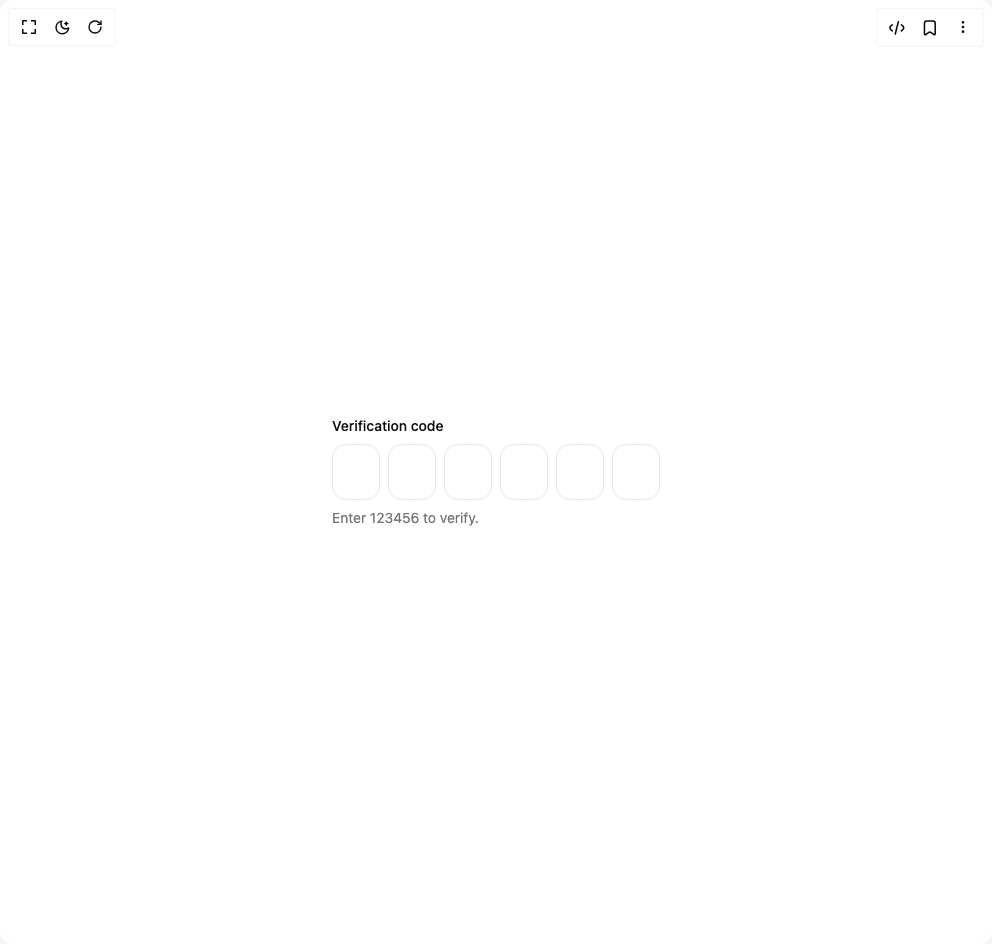

# Build Be Ui Otp Input in BuilderStudio

> Build this component in our Agentic IDE: [BuilderStudio](https://builderstudio.dev).
>
> Join the BuilderStudio community on [Discord](https://discord.gg/QdWeSGCqfe) and [Reddit](https://reddit.com/r/builderstudio).



## Component

- Author group: `starc007`
- Component: `be-ui-otp-input`
- Variant: `default`
- Rendered HTML snapshot: [`rendered.html`](rendered.html)

## BuilderStudio prompt

You are implementing a React component based on a component reference.

## Component identity

- Author: starc007
- Component slug: be-ui-otp-input
- Demo slug: default
- Title: be-ui-otp-input
- Description: 

## Goal

Recreate this component in a React + TypeScript + Tailwind CSS project. Preserve the visual layout, spacing, colors, border radius, shadows, interaction behavior, animation behavior, responsive behavior, and dark mode behavior shown in the rendered demo.

## Implementation requirements

- Use React and TypeScript.
- Use Tailwind CSS classes whenever possible.
- Keep the component self-contained unless the source files require helper components.
- If the source uses CSS variables, custom CSS, animations, or keyframes, include them.
- If the source uses external packages, list and use the required packages.
- Preserve accessibility attributes, button semantics, links, keyboard behavior, and ARIA attributes when visible in the source.
- Do not replace the component with a simplified placeholder.
- Return complete production-ready code.

## Dependencies

No reference metadata available.

## Rendered DOM snapshot

This is the rendered demo HTML extracted from the live preview. Use it to verify structure, class names, visible content, and layout.

```html
<div id="root"><div class="w-screen min-h-screen flex justify-center items-center"><div class="w-screen min-h-screen flex justify-center items-center"><div class="flex flex-col items-center gap-4"><div class="inline-flex flex-col gap-2"><label for="«r0»-input" class="text-sm font-medium text-foreground">Verification code</label><div class="relative inline-flex w-max"><input id="«r0»-input" inputmode="numeric" autocomplete="one-time-code" aria-label="One-time passcode" aria-invalid="false" maxlength="6" class="absolute inset-0 z-20 h-full w-full cursor-text bg-transparent text-transparent caret-transparent opacity-0 outline-none disabled:cursor-not-allowed" value=""><div class="flex items-center gap-2"><div data-active="false" data-filled="false" class="relative grid h-14 w-12 place-items-center overflow-hidden rounded-xl border text-xl font-semibold tabular-nums transition-colors duration-200 border-border text-muted-foreground"></div><div data-active="false" data-filled="false" class="relative grid h-14 w-12 place-items-center overflow-hidden rounded-xl border text-xl font-semibold tabular-nums transition-colors duration-200 border-border text-muted-foreground"></div><div data-active="false" data-filled="false" class="relative grid h-14 w-12 place-items-center overflow-hidden rounded-xl border text-xl font-semibold tabular-nums transition-colors duration-200 border-border text-muted-foreground"></div><div data-active="false" data-filled="false" class="relative grid h-14 w-12 place-items-center overflow-hidden rounded-xl border text-xl font-semibold tabular-nums transition-colors duration-200 border-border text-muted-foreground"></div><div data-active="false" data-filled="false" class="relative grid h-14 w-12 place-items-center overflow-hidden rounded-xl border text-xl font-semibold tabular-nums transition-colors duration-200 border-border text-muted-foreground"></div><div data-active="false" data-filled="false" class="relative grid h-14 w-12 place-items-center overflow-hidden rounded-xl border text-xl font-semibold tabular-nums transition-colors duration-200 border-border text-muted-foreground"></div></div></div><p aria-live="polite" class="text-sm text-muted-foreground">Enter 123456 to verify.</p></div></div></div></div></div>
```

## Reference source files

No reference source files were available.
