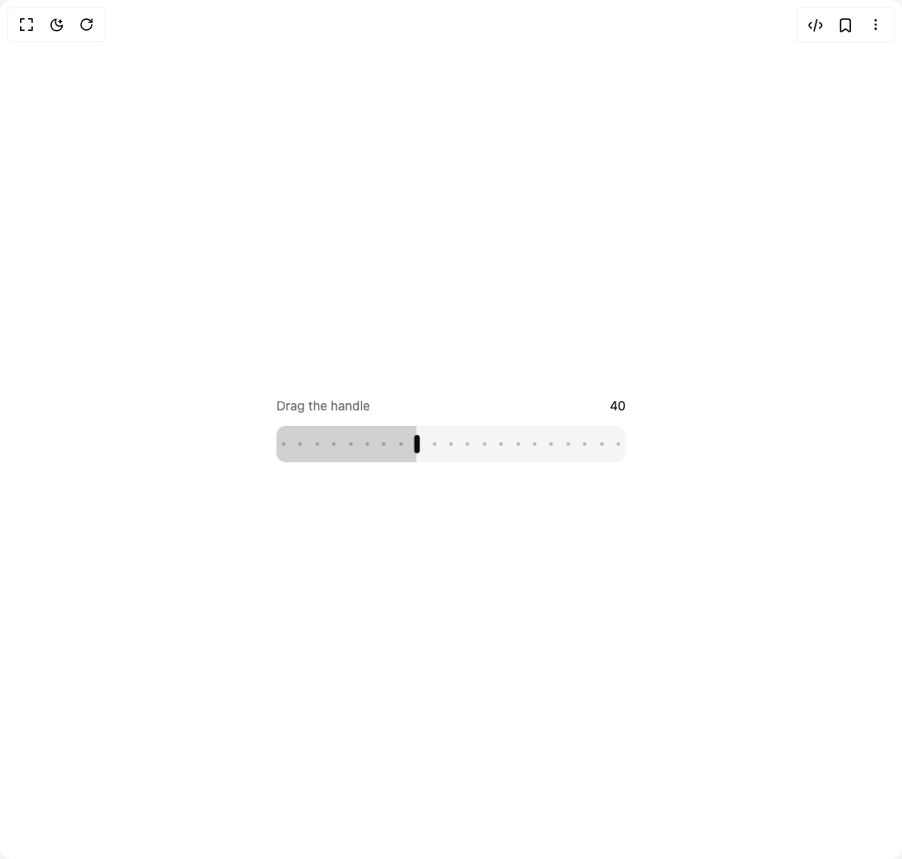

# Build Be Ui Range Slider in BuilderStudio

> Build this component in our Agentic IDE: [BuilderStudio](https://builderstudio.dev).
>
> Join the BuilderStudio community on [Discord](https://discord.gg/QdWeSGCqfe) and [Reddit](https://reddit.com/r/builderstudio).



## Component

- Author group: `starc007`
- Component: `be-ui-range-slider`
- Variant: `default`
- Rendered HTML snapshot: [`rendered.html`](rendered.html)

## BuilderStudio prompt

You are implementing a React component based on a component reference.

## Component identity

- Author: starc007
- Component slug: be-ui-range-slider
- Demo slug: default
- Title: be-ui-range-slider
- Description: 

## Goal

Recreate this component in a React + TypeScript + Tailwind CSS project. Preserve the visual layout, spacing, colors, border radius, shadows, interaction behavior, animation behavior, responsive behavior, and dark mode behavior shown in the rendered demo.

## Implementation requirements

- Use React and TypeScript.
- Use Tailwind CSS classes whenever possible.
- Keep the component self-contained unless the source files require helper components.
- If the source uses CSS variables, custom CSS, animations, or keyframes, include them.
- If the source uses external packages, list and use the required packages.
- Preserve accessibility attributes, button semantics, links, keyboard behavior, and ARIA attributes when visible in the source.
- Do not replace the component with a simplified placeholder.
- Return complete production-ready code.

## Dependencies

No reference metadata available.

## Rendered DOM snapshot

This is the rendered demo HTML extracted from the live preview. Use it to verify structure, class names, visible content, and layout.

```html
<div id="root"><div class="w-screen min-h-screen flex justify-center items-center"><div class="w-screen min-h-screen flex justify-center items-center"><div class="flex w-full max-w-sm flex-col gap-3"><div class="flex items-center justify-between text-sm text-muted-foreground"><span>Drag the handle</span><span class="tabular-nums text-foreground">40</span></div><div class="relative flex h-10 w-full touch-none select-none items-center overflow-hidden rounded-lg bg-muted cursor-grab active:cursor-grabbing"><div class="absolute inset-y-0 left-0 bg-foreground/15" style="width: 40%;"></div><div class="pointer-events-none absolute inset-x-2 inset-y-0"><span class="absolute top-1/2 size-1 -translate-x-1/2 -translate-y-1/2 rounded-full bg-foreground/25" style="left: 0%;"></span><span class="absolute top-1/2 size-1 -translate-x-1/2 -translate-y-1/2 rounded-full bg-foreground/25" style="left: 5%;"></span><span class="absolute top-1/2 size-1 -translate-x-1/2 -translate-y-1/2 rounded-full bg-foreground/25" style="left: 10%;"></span><span class="absolute top-1/2 size-1 -translate-x-1/2 -translate-y-1/2 rounded-full bg-foreground/25" style="left: 15%;"></span><span class="absolute top-1/2 size-1 -translate-x-1/2 -translate-y-1/2 rounded-full bg-foreground/25" style="left: 20%;"></span><span class="absolute top-1/2 size-1 -translate-x-1/2 -translate-y-1/2 rounded-full bg-foreground/25" style="left: 25%;"></span><span class="absolute top-1/2 size-1 -translate-x-1/2 -translate-y-1/2 rounded-full bg-foreground/25" style="left: 30%;"></span><span class="absolute top-1/2 size-1 -translate-x-1/2 -translate-y-1/2 rounded-full bg-foreground/25" style="left: 35%;"></span><span class="absolute top-1/2 size-1 -translate-x-1/2 -translate-y-1/2 rounded-full bg-foreground/25" style="left: 40%;"></span><span class="absolute top-1/2 size-1 -translate-x-1/2 -translate-y-1/2 rounded-full bg-foreground/25" style="left: 45%;"></span><span class="absolute top-1/2 size-1 -translate-x-1/2 -translate-y-1/2 rounded-full bg-foreground/25" style="left: 50%;"></span><span class="absolute top-1/2 size-1 -translate-x-1/2 -translate-y-1/2 rounded-full bg-foreground/25" style="left: 55%;"></span><span class="absolute top-1/2 size-1 -translate-x-1/2 -translate-y-1/2 rounded-full bg-foreground/25" style="left: 60%;"></span><span class="absolute top-1/2 size-1 -translate-x-1/2 -translate-y-1/2 rounded-full bg-foreground/25" style="left: 65%;"></span><span class="absolute top-1/2 size-1 -translate-x-1/2 -translate-y-1/2 rounded-full bg-foreground/25" style="left: 70%;"></span><span class="absolute top-1/2 size-1 -translate-x-1/2 -translate-y-1/2 rounded-full bg-foreground/25" style="left: 75%;"></span><span class="absolute top-1/2 size-1 -translate-x-1/2 -translate-y-1/2 rounded-full bg-foreground/25" style="left: 80%;"></span><span class="absolute top-1/2 size-1 -translate-x-1/2 -translate-y-1/2 rounded-full bg-foreground/25" style="left: 85%;"></span><span class="absolute top-1/2 size-1 -translate-x-1/2 -translate-y-1/2 rounded-full bg-foreground/25" style="left: 90%;"></span><span class="absolute top-1/2 size-1 -translate-x-1/2 -translate-y-1/2 rounded-full bg-foreground/25" style="left: 95%;"></span><span class="absolute top-1/2 size-1 -translate-x-1/2 -translate-y-1/2 rounded-full bg-foreground/25" style="left: 100%;"></span></div><div role="slider" tabindex="0" aria-label="Value" aria-valuemin="0" aria-valuemax="100" aria-valuenow="40" class="absolute top-1/2 h-5 w-1.5 rounded-sm bg-foreground shadow-sm outline-none ring-foreground/30 focus-visible:ring-4" style="left: 40%; transform: translateX(-40%) translateY(-50%);"></div></div></div></div></div></div>
```

## Reference source files

No reference source files were available.
