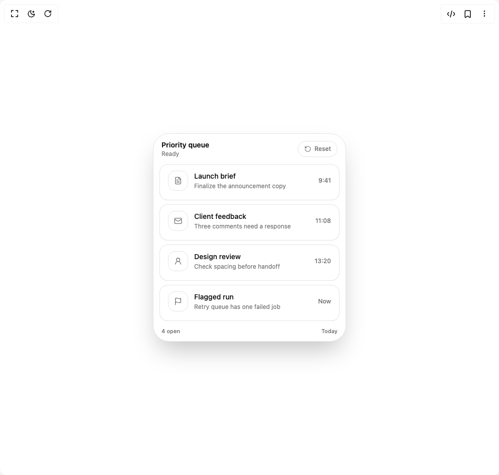

# Build Be Ui Swipeable List in BuilderStudio

> Build this component in our Agentic IDE: [BuilderStudio](https://builderstudio.dev).
>
> Join the BuilderStudio community on [Discord](https://discord.gg/QdWeSGCqfe) and [Reddit](https://reddit.com/r/builderstudio).



## Component

- Author group: `starc007`
- Component: `be-ui-swipeable-list`
- Variant: `default`
- Rendered HTML snapshot: [`rendered.html`](rendered.html)

## BuilderStudio prompt

You are implementing a React component based on a component reference.

## Component identity

- Author: starc007
- Component slug: be-ui-swipeable-list
- Demo slug: default
- Title: be-ui-swipeable-list
- Description: 

## Goal

Recreate this component in a React + TypeScript + Tailwind CSS project. Preserve the visual layout, spacing, colors, border radius, shadows, interaction behavior, animation behavior, responsive behavior, and dark mode behavior shown in the rendered demo.

## Implementation requirements

- Use React and TypeScript.
- Use Tailwind CSS classes whenever possible.
- Keep the component self-contained unless the source files require helper components.
- If the source uses CSS variables, custom CSS, animations, or keyframes, include them.
- If the source uses external packages, list and use the required packages.
- Preserve accessibility attributes, button semantics, links, keyboard behavior, and ARIA attributes when visible in the source.
- Do not replace the component with a simplified placeholder.
- Return complete production-ready code.

## Dependencies

No reference metadata available.

## Rendered DOM snapshot

This is the rendered demo HTML extracted from the live preview. Use it to verify structure, class names, visible content, and layout.

```html
<div id="root"><div class="w-screen min-h-screen flex justify-center items-center"><div class="w-screen min-h-screen flex justify-center items-center"><div class="flex min-h-96 w-full items-center justify-center"><div class="w-full max-w-sm rounded-[2rem] border border-border bg-background p-3 shadow-2xl"><div class="mb-3 flex items-center justify-between px-1"><div><p class="text-sm font-semibold text-foreground">Priority queue</p><p class="text-xs text-muted-foreground">Ready</p></div><button type="button" class="inline-flex h-8 items-center gap-1.5 rounded-full border border-border px-3 text-xs font-medium text-muted-foreground transition-colors hover:text-foreground"><svg xmlns="http://www.w3.org/2000/svg" width="24" height="24" viewBox="0 0 24 24" fill="none" stroke="currentColor" stroke-width="2" stroke-linecap="round" stroke-linejoin="round" class="lucide lucide-rotate-ccw h-3.5 w-3.5" aria-hidden="true"><path d="M3 12a9 9 0 1 0 9-9 9.75 9.75 0 0 0-6.74 2.74L3 8"></path><path d="M3 3v5h5"></path></svg>Reset</button></div><div class="flex w-full flex-col gap-2"><div class="relative isolate overflow-hidden rounded-2xl bg-muted"><div aria-hidden="true" class="absolute inset-0 z-0 flex overflow-hidden rounded-2xl"><div class="flex h-full overflow-hidden rounded-l-2xl"><button type="button" tabindex="-1" aria-label="Done" class="group flex h-full shrink-0 items-center justify-center outline-none focus-visible:ring-2 focus-visible:ring-ring focus-visible:ring-offset-2 focus-visible:ring-offset-background disabled:pointer-events-none disabled:opacity-50" style="width: 56px;"><span class="grid h-9 w-9 place-items-center rounded-full transition-[background-color,color,transform] duration-150 group-hover:bg-background group-active:scale-95 text-emerald-600 dark:text-emerald-400"><svg xmlns="http://www.w3.org/2000/svg" width="24" height="24" viewBox="0 0 24 24" fill="none" stroke="currentColor" stroke-width="2" stroke-linecap="round" stroke-linejoin="round" class="lucide lucide-check h-4 w-4" aria-hidden="true"><path d="M20 6 9 17l-5-5"></path></svg></span><span class="sr-only">Done</span></button><button type="button" tabindex="-1" aria-label="Pin" class="group flex h-full shrink-0 items-center justify-center outline-none focus-visible:ring-2 focus-visible:ring-ring focus-visible:ring-offset-2 focus-visible:ring-offset-background disabled:pointer-events-none disabled:opacity-50" style="width: 56px;"><span class="grid h-9 w-9 place-items-center rounded-full transition-[background-color,color,transform] duration-150 group-hover:bg-background group-active:scale-95 text-foreground"><svg xmlns="http://www.w3.org/2000/svg" width="24" height="24" viewBox="0 0 24 24" fill="none" stroke="currentColor" stroke-width="2" stroke-linecap="round" stroke-linejoin="round" class="lucide lucide-pin h-4 w-4" aria-hidden="true"><path d="M12 17v5"></path><path d="M9 10.76a2 2 0 0 1-1.11 1.79l-1.78.9A2 2 0 0 0 5 15.24V16a1 1 0 0 0 1 1h12a1 1 0 0 0 1-1v-.76a2 2 0 0 0-1.11-1.79l-1.78-.9A2 2 0 0 1 15 10.76V7a1 1 0 0 1 1-1 2 2 0 0 0 0-4H8a2 2 0 0 0 0 4 1 1 0 0 1 1 1z"></path></svg></span><span class="sr-only">Pin</span></button></div><div class="ml-auto flex h-full overflow-hidden rounded-r-2xl"><button type="button" tabindex="-1" aria-label="Later" class="group flex h-full shrink-0 items-center justify-center outline-none focus-visible:ring-2 focus-visible:ring-ring focus-visible:ring-offset-2 focus-visible:ring-offset-background disabled:pointer-events-none disabled:opacity-50" style="width: 56px;"><span class="grid h-9 w-9 place-items-center rounded-full transition-[background-color,color,transform] duration-150 group-hover:bg-background group-active:scale-95 text-amber-600 dark:text-amber-400"><svg xmlns="http://www.w3.org/2000/svg" width="24" height="24" viewBox="0 0 24 24" fill="none" stroke="currentColor" stroke-width="2" stroke-linecap="round" stroke-linejoin="round" class="lucide lucide-clock3 lucide-clock-3 h-4 w-4" aria-hidden="true"><circle cx="12" cy="12" r="10"></circle><polyline points="12 6 12 12 16.5 12"></polyline></svg></span><span class="sr-only">Later</span></button><button type="button" tabindex="-1" aria-label="Trash" class="group flex h-full shrink-0 items-center justify-center outline-none focus-visible:ring-2 focus-visible:ring-ring focus-visible:ring-offset-2 focus-visible:ring-offset-background disabled:pointer-events-none disabled:opacity-50" style="width: 56px;"><span class="grid h-9 w-9 place-items-center rounded-full transition-[background-color,color,transform] duration-150 group-hover:bg-background group-active:scale-95 text-destructive"><svg xmlns="http://www.w3.org/2000/svg" width="24" height="24" viewBox="0 0 24 24" fill="none" stroke="currentColor" stroke-width="2" stroke-linecap="round" stroke-linejoin="round" class="lucide lucide-trash2 lucide-trash-2 h-4 w-4" aria-hidden="true"><path d="M3 6h18"></path><path d="M19 6v14c0 1-1 2-2 2H7c-1 0-2-1-2-2V6"></path><path d="M8 6V4c0-1 1-2 2-2h4c1 0 2 1 2 2v2"></path><line x1="10" x2="10" y1="11" y2="17"></line><line x1="14" x2="14" y1="11" y2="17"></line></svg></span><span class="sr-only">Trash</span></button></div></div><div class="relative z-10 min-h-[72px] cursor-grab touch-pan-y select-none rounded-2xl border border-border bg-card px-4 py-3 shadow-sm active:cursor-grabbing" draggable="false" style="transform: none; user-select: none; touch-action: pan-y;"><div class="flex min-w-0 items-center gap-3"><div class="shrink-0"><div class="grid h-10 w-10 place-items-center rounded-xl border border-border bg-background text-muted-foreground"><svg xmlns="http://www.w3.org/2000/svg" width="24" height="24" viewBox="0 0 24 24" fill="none" stroke="currentColor" stroke-width="2" stroke-linecap="round" stroke-linejoin="round" class="lucide lucide-file-text h-4 w-4" aria-hidden="true"><path d="M15 2H6a2 2 0 0 0-2 2v16a2 2 0 0 0 2 2h12a2 2 0 0 0 2-2V7Z"></path><path d="M14 2v4a2 2 0 0 0 2 2h4"></path><path d="M10 9H8"></path><path d="M16 13H8"></path><path d="M16 17H8"></path></svg></div></div><div class="min-w-0 flex-1"><div class="truncate text-sm font-medium text-foreground">Launch brief</div><div class="mt-0.5 truncate text-xs text-muted-foreground">Finalize the announcement copy</div></div><div class="shrink-0 text-xs font-medium text-muted-foreground">9:41</div></div></div></div><div class="relative isolate overflow-hidden rounded-2xl bg-muted"><div aria-hidden="true" class="absolute inset-0 z-0 flex overflow-hidden rounded-2xl"><div class="flex h-full overflow-hidden rounded-l-2xl"><button type="button" tabindex="-1" aria-label="Done" class="group flex h-full shrink-0 items-center justify-center outline-none focus-visible:ring-2 focus-visible:ring-ring focus-visible:ring-offset-2 focus-visible:ring-offset-background disabled:pointer-events-none disabled:opacity-50" style="width: 56px;"><span class="grid h-9 w-9 place-items-center rounded-full transition-[background-color,color,transform] duration-150 group-hover:bg-background group-active:scale-95 text-emerald-600 dark:text-emerald-400"><svg xmlns="http://www.w3.org/2000/svg" width="24" height="24" viewBox="0 0 24 24" fill="none" stroke="currentColor" stroke-width="2" stroke-linecap="round" stroke-linejoin="round" class="lucide lucide-check h-4 w-4" aria-hidden="true"><path d="M20 6 9 17l-5-5"></path></svg></span><span class="sr-only">Done</span></button><button type="button" tabindex="-1" aria-label="Pin" class="group flex h-full shrink-0 items-center justify-center outline-none focus-visible:ring-2 focus-visible:ring-ring focus-visible:ring-offset-2 focus-visible:ring-offset-background disabled:pointer-events-none disabled:opacity-50" style="width: 56px;"><span class="grid h-9 w-9 place-items-center rounded-full transition-[background-color,color,transform] duration-150 group-hover:bg-background group-active:scale-95 text-foreground"><svg xmlns="http://www.w3.org/2000/svg" width="24" height="24" viewBox="0 0 24 24" fill="none" stroke="currentColor" stroke-width="2" stroke-linecap="round" stroke-linejoin="round" class="lucide lucide-pin h-4 w-4" aria-hidden="true"><path d="M12 17v5"></path><path d="M9 10.76a2 2 0 0 1-1.11 1.79l-1.78.9A2 2 0 0 0 5 15.24V16a1 1 0 0 0 1 1h12a1 1 0 0 0 1-1v-.76a2 2 0 0 0-1.11-1.79l-1.78-.9A2 2 0 0 1 15 10.76V7a1 1 0 0 1 1-1 2 2 0 0 0 0-4H8a2 2 0 0 0 0 4 1 1 0 0 1 1 1z"></path></svg></span><span class="sr-only">Pin</span></button></div><div class="ml-auto flex h-full overflow-hidden rounded-r-2xl"><button type="button" tabindex="-1" aria-label="Later" class="group flex h-full shrink-0 items-center justify-center outline-none focus-visible:ring-2 focus-visible:ring-ring focus-visible:ring-offset-2 focus-visible:ring-offset-background disabled:pointer-events-none disabled:opacity-50" style="width: 56px;"><span class="grid h-9 w-9 place-items-center rounded-full transition-[background-color,color,transform] duration-150 group-hover:bg-background group-active:scale-95 text-amber-600 dark:text-amber-400"><svg xmlns="http://www.w3.org/2000/svg" width="24" height="24" viewBox="0 0 24 24" fill="none" stroke="currentColor" stroke-width="2" stroke-linecap="round" stroke-linejoin="round" class="lucide lucide-clock3 lucide-clock-3 h-4 w-4" aria-hidden="true"><circle cx="12" cy="12" r="10"></circle><polyline points="12 6 12 12 16.5 12"></polyline></svg></span><span class="sr-only">Later</span></button><button type="button" tabindex="-1" aria-label="Trash" class="group flex h-full shrink-0 items-center justify-center outline-none focus-visible:ring-2 focus-visible:ring-ring focus-visible:ring-offset-2 focus-visible:ring-offset-background disabled:pointer-events-none disabled:opacity-50" style="width: 56px;"><span class="grid h-9 w-9 place-items-center rounded-full transition-[background-color,color,transform] duration-150 group-hover:bg-background group-active:scale-95 text-destructive"><svg xmlns="http://www.w3.org/2000/svg" width="24" height="24" viewBox="0 0 24 24" fill="none" stroke="currentColor" stroke-width="2" stroke-linecap="round" stroke-linejoin="round" class="lucide lucide-trash2 lucide-trash-2 h-4 w-4" aria-hidden="true"><path d="M3 6h18"></path><path d="M19 6v14c0 1-1 2-2 2H7c-1 0-2-1-2-2V6"></path><path d="M8 6V4c0-1 1-2 2-2h4c1 0 2 1 2 2v2"></path><line x1="10" x2="10" y1="11" y2="17"></line><line x1="14" x2="14" y1="11" y2="17"></line></svg></span><span class="sr-only">Trash</span></button></div></div><div class="relative z-10 min-h-[72px] cursor-grab touch-pan-y select-none rounded-2xl border border-border bg-card px-4 py-3 shadow-sm active:cursor-grabbing" draggable="false" style="transform: none; user-select: none; touch-action: pan-y;"><div class="flex min-w-0 items-center gap-3"><div class="shrink-0"><div class="grid h-10 w-10 place-items-center rounded-xl border border-border bg-background text-muted-foreground"><svg xmlns="http://www.w3.org/2000/svg" width="24" height="24" viewBox="0 0 24 24" fill="none" stroke="currentColor" stroke-width="2" stroke-linecap="round" stroke-linejoin="round" class="lucide lucide-mail h-4 w-4" aria-hidden="true"><rect width="20" height="16" x="2" y="4" rx="2"></rect><path d="m22 7-8.97 5.7a1.94 1.94 0 0 1-2.06 0L2 7"></path></svg></div></div><div class="min-w-0 flex-1"><div class="truncate text-sm font-medium text-foreground">Client feedback</div><div class="mt-0.5 truncate text-xs text-muted-foreground">Three comments need a response</div></div><div class="shrink-0 text-xs font-medium text-muted-foreground">11:08</div></div></div></div><div class="relative isolate overflow-hidden rounded-2xl bg-muted"><div aria-hidden="true" class="absolute inset-0 z-0 flex overflow-hidden rounded-2xl"><div class="flex h-full overflow-hidden rounded-l-2xl"><button type="button" tabindex="-1" aria-label="Done" class="group flex h-full shrink-0 items-center justify-center outline-none focus-visible:ring-2 focus-visible:ring-ring focus-visible:ring-offset-2 focus-visible:ring-offset-background disabled:pointer-events-none disabled:opacity-50" style="width: 56px;"><span class="grid h-9 w-9 place-items-center rounded-full transition-[background-color,color,transform] duration-150 group-hover:bg-background group-active:scale-95 text-emerald-600 dark:text-emerald-400"><svg xmlns="http://www.w3.org/2000/svg" width="24" height="24" viewBox="0 0 24 24" fill="none" stroke="currentColor" stroke-width="2" stroke-linecap="round" stroke-linejoin="round" class="lucide lucide-check h-4 w-4" aria-hidden="true"><path d="M20 6 9 17l-5-5"></path></svg></span><span class="sr-only">Done</span></button><button type="button" tabindex="-1" aria-label="Pin" class="group flex h-full shrink-0 items-center justify-center outline-none focus-visible:ring-2 focus-visible:ring-ring focus-visible:ring-offset-2 focus-visible:ring-offset-background disabled:pointer-events-none disabled:opacity-50" style="width: 56px;"><span class="grid h-9 w-9 place-items-center rounded-full transition-[background-color,color,transform] duration-150 group-hover:bg-background group-active:scale-95 text-foreground"><svg xmlns="http://www.w3.org/2000/svg" width="24" height="24" viewBox="0 0 24 24" fill="none" stroke="currentColor" stroke-width="2" stroke-linecap="round" stroke-linejoin="round" class="lucide lucide-pin h-4 w-4" aria-hidden="true"><path d="M12 17v5"></path><path d="M9 10.76a2 2 0 0 1-1.11 1.79l-1.78.9A2 2 0 0 0 5 15.24V16a1 1 0 0 0 1 1h12a1 1 0 0 0 1-1v-.76a2 2 0 0 0-1.11-1.79l-1.78-.9A2 2 0 0 1 15 10.76V7a1 1 0 0 1 1-1 2 2 0 0 0 0-4H8a2 2 0 0 0 0 4 1 1 0 0 1 1 1z"></path></svg></span><span class="sr-only">Pin</span></button></div><div class="ml-auto flex h-full overflow-hidden rounded-r-2xl"><button type="button" tabindex="-1" aria-label="Later" class="group flex h-full shrink-0 items-center justify-center outline-none focus-visible:ring-2 focus-visible:ring-ring focus-visible:ring-offset-2 focus-visible:ring-offset-background disabled:pointer-events-none disabled:opacity-50" style="width: 56px;"><span class="grid h-9 w-9 place-items-center rounded-full transition-[background-color,color,transform] duration-150 group-hover:bg-background group-active:scale-95 text-amber-600 dark:text-amber-400"><svg xmlns="http://www.w3.org/2000/svg" width="24" height="24" viewBox="0 0 24 24" fill="none" stroke="currentColor" stroke-width="2" stroke-linecap="round" stroke-linejoin="round" class="lucide lucide-clock3 lucide-clock-3 h-4 w-4" aria-hidden="true"><circle cx="12" cy="12" r="10"></circle><polyline points="12 6 12 12 16.5 12"></polyline></svg></span><span class="sr-only">Later</span></button><button type="button" tabindex="-1" aria-label="Trash" class="group flex h-full shrink-0 items-center justify-center outline-none focus-visible:ring-2 focus-visible:ring-ring focus-visible:ring-offset-2 focus-visible:ring-offset-background disabled:pointer-events-none disabled:opacity-50" style="width: 56px;"><span class="grid h-9 w-9 place-items-center rounded-full transition-[background-color,color,transform] duration-150 group-hover:bg-background group-active:scale-95 text-destructive"><svg xmlns="http://www.w3.org/2000/svg" width="24" height="24" viewBox="0 0 24 24" fill="none" stroke="currentColor" stroke-width="2" stroke-linecap="round" stroke-linejoin="round" class="lucide lucide-trash2 lucide-trash-2 h-4 w-4" aria-hidden="true"><path d="M3 6h18"></path><path d="M19 6v14c0 1-1 2-2 2H7c-1 0-2-1-2-2V6"></path><path d="M8 6V4c0-1 1-2 2-2h4c1 0 2 1 2 2v2"></path><line x1="10" x2="10" y1="11" y2="17"></line><line x1="14" x2="14" y1="11" y2="17"></line></svg></span><span class="sr-only">Trash</span></button></div></div><div class="relative z-10 min-h-[72px] cursor-grab touch-pan-y select-none rounded-2xl border border-border bg-card px-4 py-3 shadow-sm active:cursor-grabbing" draggable="false" style="transform: none; user-select: none; touch-action: pan-y;"><div class="flex min-w-0 items-center gap-3"><div class="shrink-0"><div class="grid h-10 w-10 place-items-center rounded-xl border border-border bg-background text-muted-foreground"><svg xmlns="http://www.w3.org/2000/svg" width="24" height="24" viewBox="0 0 24 24" fill="none" stroke="currentColor" stroke-width="2" stroke-linecap="round" stroke-linejoin="round" class="lucide lucide-user-round h-4 w-4" aria-hidden="true"><circle cx="12" cy="8" r="5"></circle><path d="M20 21a8 8 0 0 0-16 0"></path></svg></div></div><div class="min-w-0 flex-1"><div class="truncate text-sm font-medium text-foreground">Design review</div><div class="mt-0.5 truncate text-xs text-muted-foreground">Check spacing before handoff</div></div><div class="shrink-0 text-xs font-medium text-muted-foreground">13:20</div></div></div></div><div class="relative isolate overflow-hidden rounded-2xl bg-muted"><div aria-hidden="true" class="absolute inset-0 z-0 flex overflow-hidden rounded-2xl"><div class="flex h-full overflow-hidden rounded-l-2xl"><button type="button" tabindex="-1" aria-label="Done" class="group flex h-full shrink-0 items-center justify-center outline-none focus-visible:ring-2 focus-visible:ring-ring focus-visible:ring-offset-2 focus-visible:ring-offset-background disabled:pointer-events-none disabled:opacity-50" style="width: 56px;"><span class="grid h-9 w-9 place-items-center rounded-full transition-[background-color,color,transform] duration-150 group-hover:bg-background group-active:scale-95 text-emerald-600 dark:text-emerald-400"><svg xmlns="http://www.w3.org/2000/svg" width="24" height="24" viewBox="0 0 24 24" fill="none" stroke="currentColor" stroke-width="2" stroke-linecap="round" stroke-linejoin="round" class="lucide lucide-check h-4 w-4" aria-hidden="true"><path d="M20 6 9 17l-5-5"></path></svg></span><span class="sr-only">Done</span></button><button type="button" tabindex="-1" aria-label="Pin" class="group flex h-full shrink-0 items-center justify-center outline-none focus-visible:ring-2 focus-visible:ring-ring focus-visible:ring-offset-2 focus-visible:ring-offset-background disabled:pointer-events-none disabled:opacity-50" style="width: 56px;"><span class="grid h-9 w-9 place-items-center rounded-full transition-[background-color,color,transform] duration-150 group-hover:bg-background group-active:scale-95 text-foreground"><svg xmlns="http://www.w3.org/2000/svg" width="24" height="24" viewBox="0 0 24 24" fill="none" stroke="currentColor" stroke-width="2" stroke-linecap="round" stroke-linejoin="round" class="lucide lucide-pin h-4 w-4" aria-hidden="true"><path d="M12 17v5"></path><path d="M9 10.76a2 2 0 0 1-1.11 1.79l-1.78.9A2 2 0 0 0 5 15.24V16a1 1 0 0 0 1 1h12a1 1 0 0 0 1-1v-.76a2 2 0 0 0-1.11-1.79l-1.78-.9A2 2 0 0 1 15 10.76V7a1 1 0 0 1 1-1 2 2 0 0 0 0-4H8a2 2 0 0 0 0 4 1 1 0 0 1 1 1z"></path></svg></span><span class="sr-only">Pin</span></button></div><div class="ml-auto flex h-full overflow-hidden rounded-r-2xl"><button type="button" tabindex="-1" aria-label="Later" class="group flex h-full shrink-0 items-center justify-center outline-none focus-visible:ring-2 focus-visible:ring-ring focus-visible:ring-offset-2 focus-visible:ring-offset-background disabled:pointer-events-none disabled:opacity-50" style="width: 56px;"><span class="grid h-9 w-9 place-items-center rounded-full transition-[background-color,color,transform] duration-150 group-hover:bg-background group-active:scale-95 text-amber-600 dark:text-amber-400"><svg xmlns="http://www.w3.org/2000/svg" width="24" height="24" viewBox="0 0 24 24" fill="none" stroke="currentColor" stroke-width="2" stroke-linecap="round" stroke-linejoin="round" class="lucide lucide-clock3 lucide-clock-3 h-4 w-4" aria-hidden="true"><circle cx="12" cy="12" r="10"></circle><polyline points="12 6 12 12 16.5 12"></polyline></svg></span><span class="sr-only">Later</span></button><button type="button" tabindex="-1" aria-label="Trash" class="group flex h-full shrink-0 items-center justify-center outline-none focus-visible:ring-2 focus-visible:ring-ring focus-visible:ring-offset-2 focus-visible:ring-offset-background disabled:pointer-events-none disabled:opacity-50" style="width: 56px;"><span class="grid h-9 w-9 place-items-center rounded-full transition-[background-color,color,transform] duration-150 group-hover:bg-background group-active:scale-95 text-destructive"><svg xmlns="http://www.w3.org/2000/svg" width="24" height="24" viewBox="0 0 24 24" fill="none" stroke="currentColor" stroke-width="2" stroke-linecap="round" stroke-linejoin="round" class="lucide lucide-trash2 lucide-trash-2 h-4 w-4" aria-hidden="true"><path d="M3 6h18"></path><path d="M19 6v14c0 1-1 2-2 2H7c-1 0-2-1-2-2V6"></path><path d="M8 6V4c0-1 1-2 2-2h4c1 0 2 1 2 2v2"></path><line x1="10" x2="10" y1="11" y2="17"></line><line x1="14" x2="14" y1="11" y2="17"></line></svg></span><span class="sr-only">Trash</span></button></div></div><div class="relative z-10 min-h-[72px] cursor-grab touch-pan-y select-none rounded-2xl border border-border bg-card px-4 py-3 shadow-sm active:cursor-grabbing" draggable="false" style="transform: none; user-select: none; touch-action: pan-y;"><div class="flex min-w-0 items-center gap-3"><div class="shrink-0"><div class="grid h-10 w-10 place-items-center rounded-xl border border-border bg-background text-muted-foreground"><svg xmlns="http://www.w3.org/2000/svg" width="24" height="24" viewBox="0 0 24 24" fill="none" stroke="currentColor" stroke-width="2" stroke-linecap="round" stroke-linejoin="round" class="lucide lucide-flag h-4 w-4" aria-hidden="true"><path d="M4 15s1-1 4-1 5 2 8 2 4-1 4-1V3s-1 1-4 1-5-2-8-2-4 1-4 1z"></path><line x1="4" x2="4" y1="22" y2="15"></line></svg></div></div><div class="min-w-0 flex-1"><div class="truncate text-sm font-medium text-foreground">Flagged run</div><div class="mt-0.5 truncate text-xs text-muted-foreground">Retry queue has one failed job</div></div><div class="shrink-0 text-xs font-medium text-muted-foreground">Now</div></div></div></div></div><div class="mt-3 flex items-center justify-between px-1 text-[11px] font-medium text-muted-foreground"><span>4 open</span><span>Today</span></div></div></div></div></div></div>
```

## Reference source files

No reference source files were available.
