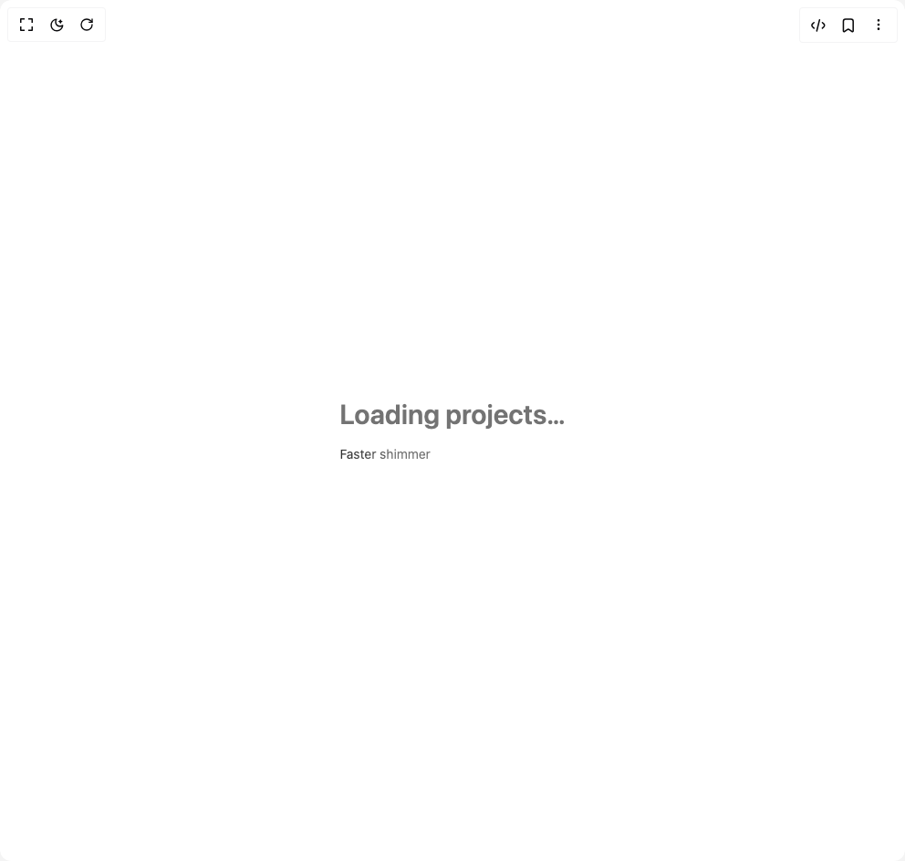

# Build Be Ui Text Animation in BuilderStudio

> Build this component in our Agentic IDE: [BuilderStudio](https://builderstudio.dev).
>
> Join the BuilderStudio community on [Discord](https://discord.gg/QdWeSGCqfe) and [Reddit](https://reddit.com/r/builderstudio).



## Component

- Author group: `starc007`
- Component: `be-ui-text-animation`
- Variant: `default`
- Rendered HTML snapshot: [`rendered.html`](rendered.html)

## BuilderStudio prompt

You are implementing a React component based on a component reference.

## Component identity

- Author: starc007
- Component slug: be-ui-text-animation
- Demo slug: default
- Title: be-ui-text-animation
- Description: 

## Goal

Recreate this component in a React + TypeScript + Tailwind CSS project. Preserve the visual layout, spacing, colors, border radius, shadows, interaction behavior, animation behavior, responsive behavior, and dark mode behavior shown in the rendered demo.

## Implementation requirements

- Use React and TypeScript.
- Use Tailwind CSS classes whenever possible.
- Keep the component self-contained unless the source files require helper components.
- If the source uses CSS variables, custom CSS, animations, or keyframes, include them.
- If the source uses external packages, list and use the required packages.
- Preserve accessibility attributes, button semantics, links, keyboard behavior, and ARIA attributes when visible in the source.
- Do not replace the component with a simplified placeholder.
- Return complete production-ready code.

## Dependencies

No reference metadata available.

## Rendered DOM snapshot

This is the rendered demo HTML extracted from the live preview. Use it to verify structure, class names, visible content, and layout.

```html
<div id="root"><div class="w-screen min-h-screen flex justify-center items-center"><div class="w-screen min-h-screen flex justify-center items-center"><div class="flex flex-col gap-4"><style>@keyframes beui-text-shimmer{from{background-position:200% 0}to{background-position:-200% 0}}</style><span class="inline-block bg-[length:200%_100%] bg-clip-text text-transparent bg-[linear-gradient(110deg,var(--muted-foreground)_30%,var(--foreground)_50%,var(--muted-foreground)_70%)] text-3xl font-semibold" style="animation: 2.5s linear 0s infinite normal none running beui-text-shimmer;">Loading projects…</span><style>@keyframes beui-text-shimmer{from{background-position:200% 0}to{background-position:-200% 0}}</style><span class="inline-block bg-[length:200%_100%] bg-clip-text text-transparent bg-[linear-gradient(110deg,var(--muted-foreground)_30%,var(--foreground)_50%,var(--muted-foreground)_70%)] text-sm" style="animation: 1.5s linear 0s infinite normal none running beui-text-shimmer;">Faster shimmer</span></div></div></div></div>
```

## Reference source files

No reference source files were available.
