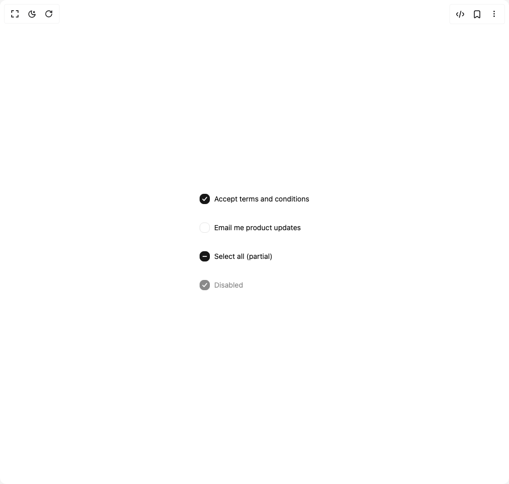

# Build Beui Checkbox in BuilderStudio

> Build this component in our Agentic IDE: [BuilderStudio](https://builderstudio.dev).
>
> Join the BuilderStudio community on [Discord](https://discord.gg/QdWeSGCqfe) and [Reddit](https://reddit.com/r/builderstudio).



## Component

- Author group: `starc007`
- Component: `beui-checkbox`
- Variant: `default`
- Rendered HTML snapshot: [`rendered.html`](rendered.html)

## BuilderStudio prompt

You are implementing a React component based on a component reference.

## Component identity

- Author: starc007
- Component slug: beui-checkbox
- Demo slug: default
- Title: beui-checkbox
- Description: 

## Goal

Recreate this component in a React + TypeScript + Tailwind CSS project. Preserve the visual layout, spacing, colors, border radius, shadows, interaction behavior, animation behavior, responsive behavior, and dark mode behavior shown in the rendered demo.

## Implementation requirements

- Use React and TypeScript.
- Use Tailwind CSS classes whenever possible.
- Keep the component self-contained unless the source files require helper components.
- If the source uses CSS variables, custom CSS, animations, or keyframes, include them.
- If the source uses external packages, list and use the required packages.
- Preserve accessibility attributes, button semantics, links, keyboard behavior, and ARIA attributes when visible in the source.
- Do not replace the component with a simplified placeholder.
- Return complete production-ready code.

## Dependencies

No reference metadata available.

## Rendered DOM snapshot

This is the rendered demo HTML extracted from the live preview. Use it to verify structure, class names, visible content, and layout.

```html
<div id="root"><div class="w-screen min-h-screen flex justify-center items-center"><div class="w-screen min-h-screen flex justify-center items-center"><div class="flex flex-col gap-3"><label for="«r0»" class="inline-flex min-h-[44px] cursor-pointer items-center gap-2 text-sm"><button id="«r0»" type="button" role="checkbox" aria-checked="true" class="flex h-5 w-5 shrink-0 items-center justify-center rounded-md border transition-colors focus-visible:outline-none focus-visible:ring-2 focus-visible:ring-ring focus-visible:ring-offset-2 border-primary bg-primary text-primary-foreground"><svg viewBox="0 0 16 16" class="h-3.5 w-3.5" fill="none" aria-hidden="true"><path d="M3.5 8.5 6.5 11.5 12.5 4.5" stroke="currentColor" stroke-width="2" stroke-linecap="round" stroke-linejoin="round"></path></svg></button><span>Accept terms and conditions</span></label><label for="«r1»" class="inline-flex min-h-[44px] cursor-pointer items-center gap-2 text-sm"><button id="«r1»" type="button" role="checkbox" aria-checked="false" class="flex h-5 w-5 shrink-0 items-center justify-center rounded-md border border-input bg-background transition-colors focus-visible:outline-none focus-visible:ring-2 focus-visible:ring-ring focus-visible:ring-offset-2"></button><span>Email me product updates</span></label><label for="«r2»" class="inline-flex min-h-[44px] cursor-pointer items-center gap-2 text-sm"><button id="«r2»" type="button" role="checkbox" aria-checked="mixed" class="flex h-5 w-5 shrink-0 items-center justify-center rounded-md border transition-colors focus-visible:outline-none focus-visible:ring-2 focus-visible:ring-ring focus-visible:ring-offset-2 border-primary bg-primary text-primary-foreground"><svg viewBox="0 0 16 16" class="h-3.5 w-3.5" fill="none" aria-hidden="true"><path d="M4 8h8" stroke="currentColor" stroke-width="2" stroke-linecap="round"></path></svg></button><span>Select all (partial)</span></label><label for="«r3»" class="inline-flex min-h-[44px] items-center gap-2 text-sm cursor-not-allowed opacity-50"><button id="«r3»" type="button" role="checkbox" aria-checked="true" disabled="" class="flex h-5 w-5 shrink-0 items-center justify-center rounded-md border transition-colors focus-visible:outline-none focus-visible:ring-2 focus-visible:ring-ring focus-visible:ring-offset-2 border-primary bg-primary text-primary-foreground cursor-not-allowed"><svg viewBox="0 0 16 16" class="h-3.5 w-3.5" fill="none" aria-hidden="true"><path d="M3.5 8.5 6.5 11.5 12.5 4.5" stroke="currentColor" stroke-width="2" stroke-linecap="round" stroke-linejoin="round"></path></svg></button><span>Disabled</span></label></div></div></div></div>
```

## Reference source files

No reference source files were available.
