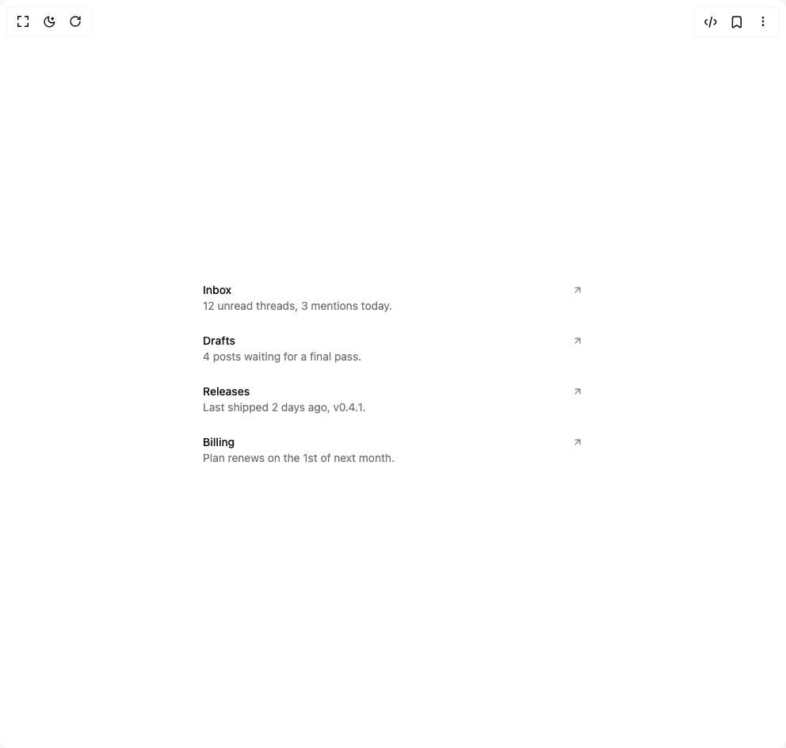

# Build Beui Dock in BuilderStudio

> Build this component in our Agentic IDE: [BuilderStudio](https://builderstudio.dev).
>
> Join the BuilderStudio community on [Discord](https://discord.gg/QdWeSGCqfe) and [Reddit](https://reddit.com/r/builderstudio).



## Component

- Author group: `starc007`
- Component: `beui-dock`
- Variant: `default`
- Rendered HTML snapshot: [`rendered.html`](rendered.html)

## BuilderStudio prompt

You are implementing a React component based on a component reference.

## Component identity

- Author: starc007
- Component slug: beui-dock
- Demo slug: default
- Title: beui-dock
- Description: 

## Goal

Recreate this component in a React + TypeScript + Tailwind CSS project. Preserve the visual layout, spacing, colors, border radius, shadows, interaction behavior, animation behavior, responsive behavior, and dark mode behavior shown in the rendered demo.

## Implementation requirements

- Use React and TypeScript.
- Use Tailwind CSS classes whenever possible.
- Keep the component self-contained unless the source files require helper components.
- If the source uses CSS variables, custom CSS, animations, or keyframes, include them.
- If the source uses external packages, list and use the required packages.
- Preserve accessibility attributes, button semantics, links, keyboard behavior, and ARIA attributes when visible in the source.
- Do not replace the component with a simplified placeholder.
- Return complete production-ready code.

## Dependencies

No reference metadata available.

## Rendered DOM snapshot

This is the rendered demo HTML extracted from the live preview. Use it to verify structure, class names, visible content, and layout.

```html
<div id="root"><div class="w-screen min-h-screen flex justify-center items-center"><div class="w-screen min-h-screen flex justify-center items-center"><div class="w-full max-w-lg px-2"><div class="flex w-full flex-col"><button type="button" class="relative group flex flex-col gap-1 px-2 py-3 text-left"><div class="pointer-events-none absolute inset-y-0" style="left: -20px; right: -20px; opacity: 0; filter: blur(6px); transition: opacity 180ms cubic-bezier(0.16, 1, 0.3, 1), filter 180ms cubic-bezier(0.16, 1, 0.3, 1);"><div class="pointer-events-none h-full w-full rounded-2xl bg-primary/[0.06]"></div></div><div class="relative z-10"><div class="flex items-center justify-between gap-3"><span class="text-sm font-medium text-foreground">Inbox</span><svg xmlns="http://www.w3.org/2000/svg" width="24" height="24" viewBox="0 0 24 24" fill="none" stroke="currentColor" stroke-width="2" stroke-linecap="round" stroke-linejoin="round" class="lucide lucide-arrow-up-right h-3.5 w-3.5 text-muted-foreground transition-transform group-hover:translate-x-0.5 group-hover:-translate-y-0.5" aria-hidden="true"><path d="M7 7h10v10"></path><path d="M7 17 17 7"></path></svg></div><p class="text-sm text-muted-foreground">12 unread threads, 3 mentions today.</p></div></button><button type="button" class="relative group flex flex-col gap-1 px-2 py-3 text-left"><div class="pointer-events-none absolute inset-y-0" style="left: -20px; right: -20px; opacity: 0; filter: blur(6px); transition: opacity 180ms cubic-bezier(0.16, 1, 0.3, 1), filter 180ms cubic-bezier(0.16, 1, 0.3, 1);"><div class="pointer-events-none h-full w-full rounded-2xl bg-primary/[0.06]"></div></div><div class="relative z-10"><div class="flex items-center justify-between gap-3"><span class="text-sm font-medium text-foreground">Drafts</span><svg xmlns="http://www.w3.org/2000/svg" width="24" height="24" viewBox="0 0 24 24" fill="none" stroke="currentColor" stroke-width="2" stroke-linecap="round" stroke-linejoin="round" class="lucide lucide-arrow-up-right h-3.5 w-3.5 text-muted-foreground transition-transform group-hover:translate-x-0.5 group-hover:-translate-y-0.5" aria-hidden="true"><path d="M7 7h10v10"></path><path d="M7 17 17 7"></path></svg></div><p class="text-sm text-muted-foreground">4 posts waiting for a final pass.</p></div></button><button type="button" class="relative group flex flex-col gap-1 px-2 py-3 text-left"><div class="pointer-events-none absolute inset-y-0" style="left: -20px; right: -20px; opacity: 0; filter: blur(6px); transition: opacity 180ms cubic-bezier(0.16, 1, 0.3, 1), filter 180ms cubic-bezier(0.16, 1, 0.3, 1);"><div class="pointer-events-none h-full w-full rounded-2xl bg-primary/[0.06]"></div></div><div class="relative z-10"><div class="flex items-center justify-between gap-3"><span class="text-sm font-medium text-foreground">Releases</span><svg xmlns="http://www.w3.org/2000/svg" width="24" height="24" viewBox="0 0 24 24" fill="none" stroke="currentColor" stroke-width="2" stroke-linecap="round" stroke-linejoin="round" class="lucide lucide-arrow-up-right h-3.5 w-3.5 text-muted-foreground transition-transform group-hover:translate-x-0.5 group-hover:-translate-y-0.5" aria-hidden="true"><path d="M7 7h10v10"></path><path d="M7 17 17 7"></path></svg></div><p class="text-sm text-muted-foreground">Last shipped 2 days ago, v0.4.1.</p></div></button><button type="button" class="relative group flex flex-col gap-1 px-2 py-3 text-left"><div class="pointer-events-none absolute inset-y-0" style="left: -20px; right: -20px; opacity: 0; filter: blur(6px); transition: opacity 180ms cubic-bezier(0.16, 1, 0.3, 1), filter 180ms cubic-bezier(0.16, 1, 0.3, 1);"><div class="pointer-events-none h-full w-full rounded-2xl bg-primary/[0.06]"></div></div><div class="relative z-10"><div class="flex items-center justify-between gap-3"><span class="text-sm font-medium text-foreground">Billing</span><svg xmlns="http://www.w3.org/2000/svg" width="24" height="24" viewBox="0 0 24 24" fill="none" stroke="currentColor" stroke-width="2" stroke-linecap="round" stroke-linejoin="round" class="lucide lucide-arrow-up-right h-3.5 w-3.5 text-muted-foreground transition-transform group-hover:translate-x-0.5 group-hover:-translate-y-0.5" aria-hidden="true"><path d="M7 7h10v10"></path><path d="M7 17 17 7"></path></svg></div><p class="text-sm text-muted-foreground">Plan renews on the 1st of next month.</p></div></button></div></div></div></div></div>
```

## Reference source files

No reference source files were available.
