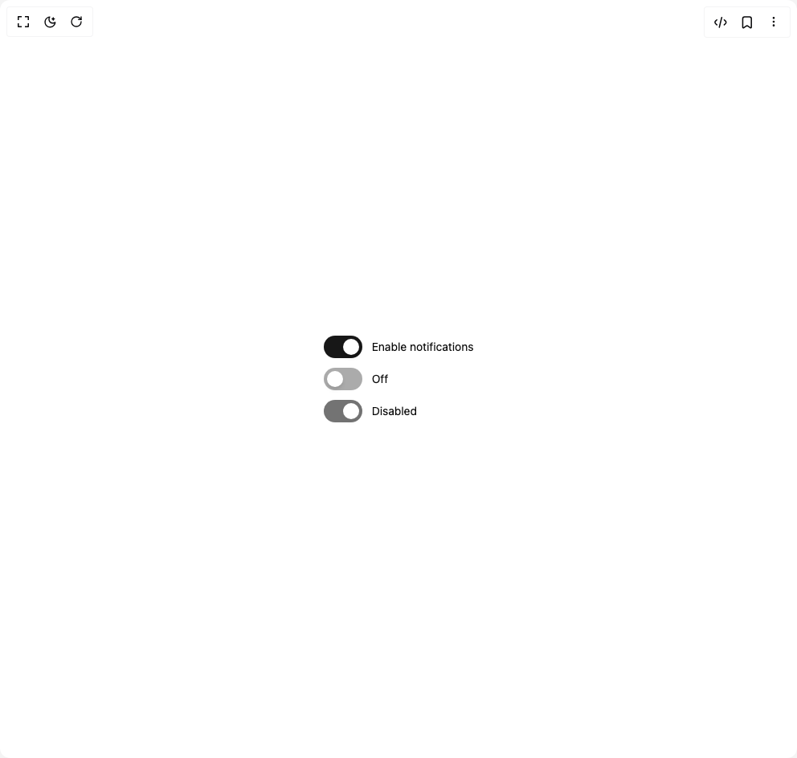

# Build Beui Switch in BuilderStudio

> Build this component in our Agentic IDE: [BuilderStudio](https://builderstudio.dev).
>
> Join the BuilderStudio community on [Discord](https://discord.gg/QdWeSGCqfe) and [Reddit](https://reddit.com/r/builderstudio).



## Component

- Author group: `starc007`
- Component: `beui-switch`
- Variant: `default`
- Rendered HTML snapshot: [`rendered.html`](rendered.html)

## BuilderStudio prompt

You are implementing a React component based on a component reference.

## Component identity

- Author: starc007
- Component slug: beui-switch
- Demo slug: default
- Title: beui-switch
- Description: 

## Goal

Recreate this component in a React + TypeScript + Tailwind CSS project. Preserve the visual layout, spacing, colors, border radius, shadows, interaction behavior, animation behavior, responsive behavior, and dark mode behavior shown in the rendered demo.

## Implementation requirements

- Use React and TypeScript.
- Use Tailwind CSS classes whenever possible.
- Keep the component self-contained unless the source files require helper components.
- If the source uses CSS variables, custom CSS, animations, or keyframes, include them.
- If the source uses external packages, list and use the required packages.
- Preserve accessibility attributes, button semantics, links, keyboard behavior, and ARIA attributes when visible in the source.
- Do not replace the component with a simplified placeholder.
- Return complete production-ready code.

## Dependencies

No reference metadata available.

## Rendered DOM snapshot

This is the rendered demo HTML extracted from the live preview. Use it to verify structure, class names, visible content, and layout.

```html
<div id="root"><div class="w-screen min-h-screen flex justify-center items-center"><div class="w-screen min-h-screen flex justify-center items-center"><div class="flex flex-col gap-3"><span class="inline-flex items-center gap-3"><button id="«r0»" type="button" role="switch" aria-checked="true" data-state="checked" class="group peer inline-flex h-7 w-12 shrink-0 cursor-pointer items-center px-1 rounded-full outline-none transition-colors duration-200 focus-visible:ring-2 focus-visible:ring-ring focus-visible:ring-offset-2 focus-visible:ring-offset-background disabled:cursor-not-allowed disabled:opacity-60 justify-end bg-primary"><div class="pointer-events-none block h-5 w-5 rounded-full bg-background shadow-md" style="transform: none;"><div class="size-5"></div></div></button><label for="«r0»" class="cursor-pointer text-sm text-foreground">Enable notifications</label></span><span class="inline-flex items-center gap-3"><button id="«r1»" type="button" role="switch" aria-checked="false" data-state="unchecked" class="group peer inline-flex h-7 w-12 shrink-0 cursor-pointer items-center px-1 rounded-full outline-none transition-colors duration-200 focus-visible:ring-2 focus-visible:ring-ring focus-visible:ring-offset-2 focus-visible:ring-offset-background disabled:cursor-not-allowed disabled:opacity-60 justify-start bg-muted-foreground/60"><div class="pointer-events-none block h-5 w-5 rounded-full bg-background shadow-md" style="transform: none;"><div class="size-5"></div></div></button><label for="«r1»" class="cursor-pointer text-sm text-foreground">Off</label></span><span class="inline-flex items-center gap-3"><button id="«r2»" type="button" role="switch" aria-checked="true" disabled="" data-state="checked" class="group peer inline-flex h-7 w-12 shrink-0 cursor-pointer items-center px-1 rounded-full outline-none transition-colors duration-200 focus-visible:ring-2 focus-visible:ring-ring focus-visible:ring-offset-2 focus-visible:ring-offset-background disabled:cursor-not-allowed disabled:opacity-60 justify-end bg-primary"><div class="pointer-events-none block h-5 w-5 rounded-full bg-background shadow-md" style="transform: none;"><div class="size-5"></div></div></button><label for="«r2»" class="cursor-pointer text-sm text-foreground">Disabled</label></span></div></div></div></div>
```

## Reference source files

No reference source files were available.
