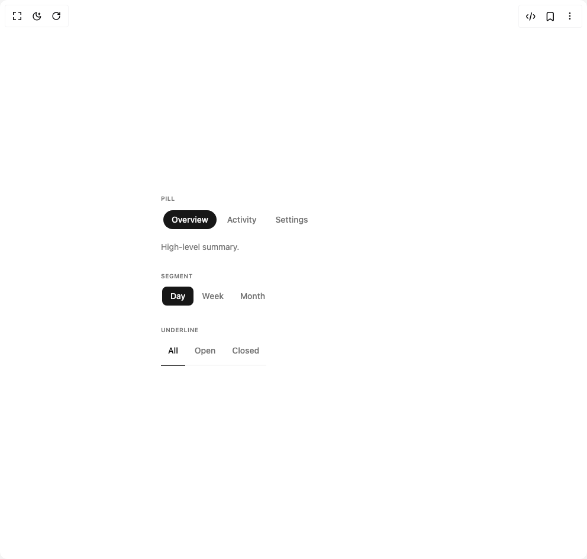

# Build Beui Tabs in BuilderStudio

> Build this component in our Agentic IDE: [BuilderStudio](https://builderstudio.dev).
>
> Join the BuilderStudio community on [Discord](https://discord.gg/QdWeSGCqfe) and [Reddit](https://reddit.com/r/builderstudio).



## Component

- Author group: `starc007`
- Component: `beui-tabs`
- Variant: `default`
- Rendered HTML snapshot: [`rendered.html`](rendered.html)

## BuilderStudio prompt

You are implementing a React component based on a component reference.

## Component identity

- Author: starc007
- Component slug: beui-tabs
- Demo slug: default
- Title: beui-tabs
- Description: 

## Goal

Recreate this component in a React + TypeScript + Tailwind CSS project. Preserve the visual layout, spacing, colors, border radius, shadows, interaction behavior, animation behavior, responsive behavior, and dark mode behavior shown in the rendered demo.

## Implementation requirements

- Use React and TypeScript.
- Use Tailwind CSS classes whenever possible.
- Keep the component self-contained unless the source files require helper components.
- If the source uses CSS variables, custom CSS, animations, or keyframes, include them.
- If the source uses external packages, list and use the required packages.
- Preserve accessibility attributes, button semantics, links, keyboard behavior, and ARIA attributes when visible in the source.
- Do not replace the component with a simplified placeholder.
- Return complete production-ready code.

## Dependencies

No reference metadata available.

## Rendered DOM snapshot

This is the rendered demo HTML extracted from the live preview. Use it to verify structure, class names, visible content, and layout.

```html
<div id="root"><div class="w-screen min-h-screen flex justify-center items-center"><div class="w-screen min-h-screen flex justify-center items-center"><div class="flex w-full max-w-md flex-col gap-8"><div class="flex flex-col gap-2"><span class="text-[10px] font-semibold uppercase tracking-wider text-muted-foreground">Pill</span><div><div role="tablist" class="inline-flex items-center gap-1 rounded-full bg-card p-1"><div class="relative"><span class="absolute inset-0 bg-primary rounded-full" style="border-radius: 9999px; opacity: 1;"></span><button type="button" role="tab" aria-selected="true" class="relative z-10 inline-flex items-center justify-center whitespace-nowrap bg-transparent px-3.5 py-1.5 text-sm font-medium outline-none transition-colors text-primary-foreground rounded-full">Overview</button></div><div class="relative"><button type="button" role="tab" aria-selected="false" class="relative z-10 inline-flex items-center justify-center whitespace-nowrap bg-transparent px-3.5 py-1.5 text-sm font-medium outline-none transition-colors text-muted-foreground hover:text-foreground rounded-full">Activity</button></div><div class="relative"><button type="button" role="tab" aria-selected="false" class="relative z-10 inline-flex items-center justify-center whitespace-nowrap bg-transparent px-3.5 py-1.5 text-sm font-medium outline-none transition-colors text-muted-foreground hover:text-foreground rounded-full">Settings</button></div></div><div class="mt-4 text-sm text-muted-foreground" style="opacity: 1; transform: none;">High-level summary.</div><div hidden="" class="text-sm text-muted-foreground">Recent events.</div><div hidden="" class="text-sm text-muted-foreground">Preferences.</div></div></div><div class="flex flex-col gap-2"><span class="text-[10px] font-semibold uppercase tracking-wider text-muted-foreground">Segment</span><div><div role="tablist" class="inline-flex items-center gap-0 rounded-lg bg-card p-0.5"><div class="relative"><span class="absolute inset-0 bg-primary rounded-md" style="border-radius: 8px; opacity: 1;"></span><button type="button" role="tab" aria-selected="true" class="relative z-10 inline-flex items-center justify-center whitespace-nowrap bg-transparent px-3.5 py-1.5 text-sm font-medium outline-none transition-colors text-primary-foreground rounded-md">Day</button></div><div class="relative"><button type="button" role="tab" aria-selected="false" class="relative z-10 inline-flex items-center justify-center whitespace-nowrap bg-transparent px-3.5 py-1.5 text-sm font-medium outline-none transition-colors text-muted-foreground hover:text-foreground rounded-md">Week</button></div><div class="relative"><button type="button" role="tab" aria-selected="false" class="relative z-10 inline-flex items-center justify-center whitespace-nowrap bg-transparent px-3.5 py-1.5 text-sm font-medium outline-none transition-colors text-muted-foreground hover:text-foreground rounded-md">Month</button></div></div></div></div><div class="flex flex-col gap-2"><span class="text-[10px] font-semibold uppercase tracking-wider text-muted-foreground">Underline</span><div><div role="tablist" class="inline-flex items-center gap-1 border-b border-border"><button type="button" role="tab" aria-selected="true" class="relative isolate -mb-px inline-flex min-h-[44px] items-center px-3 pb-2.5 pt-1 text-sm font-medium transition-colors text-foreground">All<span class="absolute -bottom-px left-0 right-0 h-px bg-primary" style="opacity: 1;"></span></button><button type="button" role="tab" aria-selected="false" class="relative isolate -mb-px inline-flex min-h-[44px] items-center px-3 pb-2.5 pt-1 text-sm font-medium transition-colors text-muted-foreground hover:text-foreground">Open</button><button type="button" role="tab" aria-selected="false" class="relative isolate -mb-px inline-flex min-h-[44px] items-center px-3 pb-2.5 pt-1 text-sm font-medium transition-colors text-muted-foreground hover:text-foreground">Closed</button></div></div></div></div></div></div></div>
```

## Reference source files

No reference source files were available.
