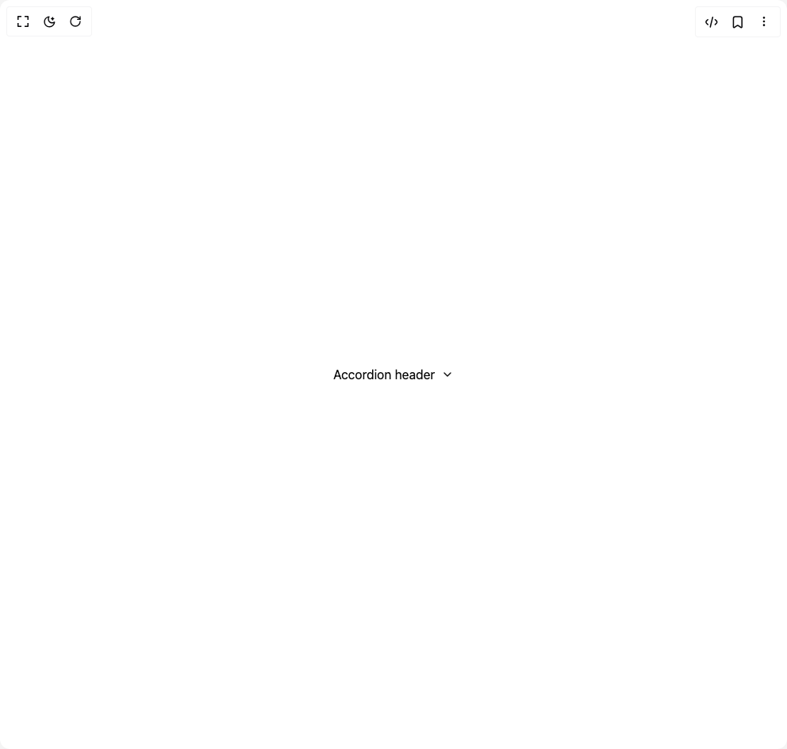

# Build Accordion 1 in BuilderStudio

> Build this component in our Agentic IDE: [BuilderStudio](https://builderstudio.dev).
>
> Join the BuilderStudio community on [Discord](https://discord.gg/QdWeSGCqfe) and [Reddit](https://reddit.com/r/builderstudio).



## Component

- Author group: `subframeapp`
- Component: `accordion-1`
- Variant: `default`
- Rendered HTML snapshot: [`rendered.html`](rendered.html)

## BuilderStudio prompt

You are implementing a React component based on a component reference.

## Component identity

- Author: SubframeApp
- Component slug: accordion-1
- Demo slug: default
- Title: accordion-1
- Description: 

## Goal

Recreate this component in a React + TypeScript + Tailwind CSS project. Preserve the visual layout, spacing, colors, border radius, shadows, interaction behavior, animation behavior, responsive behavior, and dark mode behavior shown in the rendered demo.

## Implementation requirements

- Use React and TypeScript.
- Use Tailwind CSS classes whenever possible.
- Keep the component self-contained unless the source files require helper components.
- If the source uses CSS variables, custom CSS, animations, or keyframes, include them.
- If the source uses external packages, list and use the required packages.
- Preserve accessibility attributes, button semantics, links, keyboard behavior, and ARIA attributes when visible in the source.
- Do not replace the component with a simplified placeholder.
- Return complete production-ready code.

## Dependencies

No reference metadata available.

## Rendered DOM snapshot

This is the rendered demo HTML extracted from the live preview. Use it to verify structure, class names, visible content, and layout.

```html
<div id="root"><div class="w-screen min-h-screen flex justify-center items-center"><div class="w-screen min-h-screen flex justify-center items-center"><div class="group/d2e81e20 flex w-auto flex-col items-start rounded-md" data-state="closed"><div class="collapsible-module_trigger__n3w0L flex w-auto cursor-pointer flex-col items-start gap-2" type="button" aria-controls="radix-«r0»" aria-expanded="false" data-state="closed"><div class="flex w-auto flex-col items-start group-data-[state=open]/d2e81e20:h-auto"><div class="flex w-full items-center gap-2 px-3 py-2"><span class="grow shrink-0 basis-0 text-body font-body text-default-font">Accordion header</span><span class="collapsible-module_chevron__ds-v8 text-body font-body text-default-font icon-wrapper-module_root__-l6uP"><svg xmlns="http://www.w3.org/2000/svg" width="1em" height="1em" viewBox="0 0 24 24" fill="none" stroke="currentColor" stroke-width="2" stroke-linecap="round" stroke-linejoin="round"><path d="m6 9 6 6 6-6"></path></svg></span></div></div></div></div></div></div></div>
```

## Reference source files

No reference source files were available.
