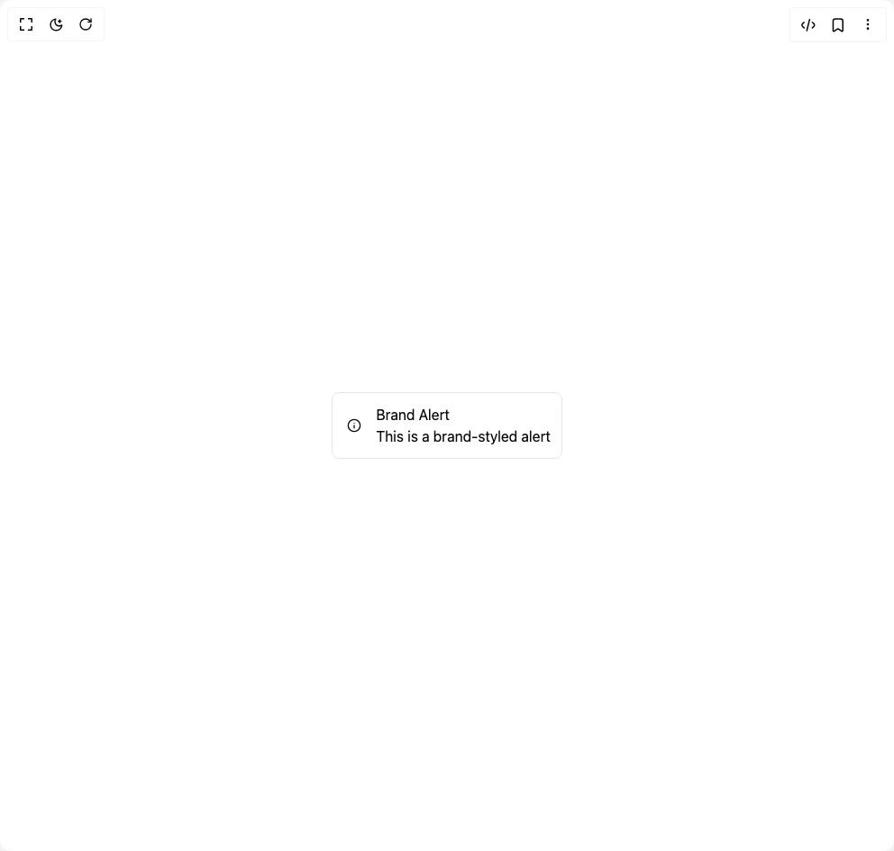

# Build Alert in BuilderStudio

> Build this component in our Agentic IDE: [BuilderStudio](https://builderstudio.dev).
>
> Join the BuilderStudio community on [Discord](https://discord.gg/QdWeSGCqfe) and [Reddit](https://reddit.com/r/builderstudio).



## Component

- Author group: `subframeapp`
- Component: `alert`
- Variant: `default`
- Rendered HTML snapshot: [`rendered.html`](rendered.html)

## BuilderStudio prompt

You are implementing a React component based on a component reference.

## Component identity

- Author: SubframeApp
- Component slug: alert
- Demo slug: default
- Title: alert
- Description: 

## Goal

Recreate this component in a React + TypeScript + Tailwind CSS project. Preserve the visual layout, spacing, colors, border radius, shadows, interaction behavior, animation behavior, responsive behavior, and dark mode behavior shown in the rendered demo.

## Implementation requirements

- Use React and TypeScript.
- Use Tailwind CSS classes whenever possible.
- Keep the component self-contained unless the source files require helper components.
- If the source uses CSS variables, custom CSS, animations, or keyframes, include them.
- If the source uses external packages, list and use the required packages.
- Preserve accessibility attributes, button semantics, links, keyboard behavior, and ARIA attributes when visible in the source.
- Do not replace the component with a simplified placeholder.
- Return complete production-ready code.

## Dependencies

No reference metadata available.

## Rendered DOM snapshot

This is the rendered demo HTML extracted from the live preview. Use it to verify structure, class names, visible content, and layout.

```html
<div id="root"><div class="w-screen min-h-screen flex justify-center items-center"><div class="w-screen min-h-screen flex justify-center items-center"><div class="flex flex-col gap-4 p-4"><div class="group/3a65613d flex w-full flex-col items-start gap-2 rounded-md border border-solid pl-4 pr-3 py-3 border-brand-100 bg-brand-50"><div class="flex w-full items-center gap-4"><span class="text-heading-3 font-heading-3 text-brand-800 icon-wrapper-module_root__-l6uP"><span class="icon-wrapper-module_root__-l6uP"><svg xmlns="http://www.w3.org/2000/svg" width="1em" height="1em" viewBox="0 0 24 24" fill="none" stroke="currentColor" stroke-width="2" stroke-linecap="round" stroke-linejoin="round"><circle cx="12" cy="12" r="10"></circle><path d="M12 16v-4"></path><path d="M12 8h.01"></path></svg></span></span><div class="flex grow shrink-0 basis-0 flex-col items-start"><span class="w-full whitespace-pre-wrap text-body-bold font-body-bold text-brand-900">Brand Alert</span><span class="w-full whitespace-pre-wrap text-caption font-caption text-brand-800">This is a brand-styled alert</span></div></div></div></div></div></div></div>
```

## Reference source files

No reference source files were available.
