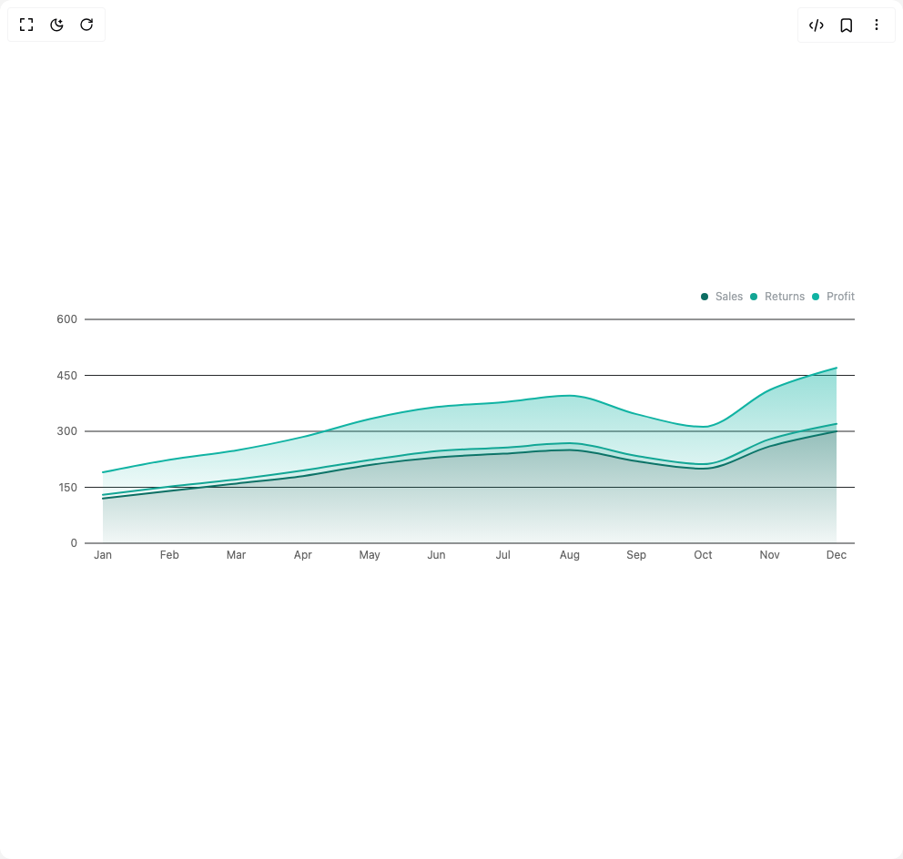

# Build Area Chart in BuilderStudio

> Build this component in our Agentic IDE: [BuilderStudio](https://builderstudio.dev).
>
> Join the BuilderStudio community on [Discord](https://discord.gg/QdWeSGCqfe) and [Reddit](https://reddit.com/r/builderstudio).



## Component

- Author group: `subframeapp`
- Component: `area-chart`
- Variant: `area-chart-one`
- Rendered HTML snapshot: [`rendered.html`](rendered.html)

## BuilderStudio prompt

You are implementing a React component based on a component reference.

## Component identity

- Author: SubframeApp
- Component slug: area-chart
- Demo slug: area-chart-one
- Title: area-chart
- Description: 

## Goal

Recreate this component in a React + TypeScript + Tailwind CSS project. Preserve the visual layout, spacing, colors, border radius, shadows, interaction behavior, animation behavior, responsive behavior, and dark mode behavior shown in the rendered demo.

## Implementation requirements

- Use React and TypeScript.
- Use Tailwind CSS classes whenever possible.
- Keep the component self-contained unless the source files require helper components.
- If the source uses CSS variables, custom CSS, animations, or keyframes, include them.
- If the source uses external packages, list and use the required packages.
- Preserve accessibility attributes, button semantics, links, keyboard behavior, and ARIA attributes when visible in the source.
- Do not replace the component with a simplified placeholder.
- Return complete production-ready code.

## Dependencies

No reference metadata available.

## Rendered DOM snapshot

This is the rendered demo HTML extracted from the live preview. Use it to verify structure, class names, visible content, and layout.

```html
<div id="root"><div class="w-screen min-h-screen flex justify-center items-center"><div class="w-screen min-h-screen flex justify-center items-center"><div class="h-80 w-full max-w-4xl charts-module_root__sHdN1" style="min-height: 200px; min-width: 300px;"><div style="overflow: visible; height: 0px; width: 0px;"><div class="recharts-wrapper" style="position: relative; cursor: default; width: 896px; height: 320px;"><svg class="recharts-surface" width="896" height="320" viewBox="0 0 896 320" style="width: 100%; height: 100%;"><title></title><desc></desc><defs><clipPath id="recharts1-clip"><rect x="45" y="39" height="246" width="846"></rect></clipPath></defs><g class="recharts-cartesian-grid"><g class="recharts-cartesian-grid-horizontal"><line class="charts-module_grid__RLwqa charts-module_dark__mMKTE" stroke-width="1" stroke="#ccc" fill="none" x="45" y="39" width="846" height="246" x1="45" y1="285" x2="891" y2="285"></line><line class="charts-module_grid__RLwqa charts-module_dark__mMKTE" stroke-width="1" stroke="#ccc" fill="none" x="45" y="39" width="846" height="246" x1="45" y1="223.5" x2="891" y2="223.5"></line><line class="charts-module_grid__RLwqa charts-module_dark__mMKTE" stroke-width="1" stroke="#ccc" fill="none" x="45" y="39" width="846" height="246" x1="45" y1="162" x2="891" y2="162"></line><line class="charts-module_grid__RLwqa charts-module_dark__mMKTE" stroke-width="1" stroke="#ccc" fill="none" x="45" y="39" width="846" height="246" x1="45" y1="100.5" x2="891" y2="100.5"></line><line class="charts-module_grid__RLwqa charts-module_dark__mMKTE" stroke-width="1" stroke="#ccc" fill="none" x="45" y="39" width="846" height="246" x1="45" y1="39" x2="891" y2="39"></line></g></g><g class="recharts-layer recharts-cartesian-axis recharts-xAxis xAxis"><g class="recharts-cartesian-axis-ticks"><g class="recharts-layer recharts-cartesian-axis-tick"><text orientation="bottom" width="846" height="30" stroke="none" x="65.00000000000006" y="293" class="recharts-text recharts-cartesian-axis-tick-value" text-anchor="middle" fill="#666"><tspan x="65.00000000000006" dy="0.71em">Jan</tspan></text></g><g class="recharts-layer recharts-cartesian-axis-tick"><text orientation="bottom" width="846" height="30" stroke="none" x="138.2727272727273" y="293" class="recharts-text recharts-cartesian-axis-tick-value" text-anchor="middle" fill="#666"><tspan x="138.2727272727273" dy="0.71em">Feb</tspan></text></g><g class="recharts-layer recharts-cartesian-axis-tick"><text orientation="bottom" width="846" height="30" stroke="none" x="211.5454545454546" y="293" class="recharts-text recharts-cartesian-axis-tick-value" text-anchor="middle" fill="#666"><tspan x="211.5454545454546" dy="0.71em">Mar</tspan></text></g><g class="recharts-layer recharts-cartesian-axis-tick"><text orientation="bottom" width="846" height="30" stroke="none" x="284.81818181818187" y="293" class="recharts-text recharts-cartesian-axis-tick-value" text-anchor="middle" fill="#666"><tspan x="284.81818181818187" dy="0.71em">Apr</tspan></text></g><g class="recharts-layer recharts-cartesian-axis-tick"><text orientation="bottom" width="846" height="30" stroke="none" x="358.0909090909091" y="293" class="recharts-text recharts-cartesian-axis-tick-value" text-anchor="middle" fill="#666"><tspan x="358.0909090909091" dy="0.71em">May</tspan></text></g><g class="recharts-layer recharts-cartesian-axis-tick"><text orientation="bottom" width="846" height="30" stroke="none" x="431.3636363636364" y="293" class="recharts-text recharts-cartesian-axis-tick-value" text-anchor="middle" fill="#666"><tspan x="431.3636363636364" dy="0.71em">Jun</tspan></text></g><g class="recharts-layer recharts-cartesian-axis-tick"><text orientation="bottom" width="846" height="30" stroke="none" x="504.6363636363637" y="293" class="recharts-text recharts-cartesian-axis-tick-value" text-anchor="middle" fill="#666"><tspan x="504.6363636363637" dy="0.71em">Jul</tspan></text></g><g class="recharts-layer recharts-cartesian-axis-tick"><text orientation="bottom" width="846" height="30" stroke="none" x="577.909090909091" y="293" class="recharts-text recharts-cartesian-axis-tick-value" text-anchor="middle" fill="#666"><tspan x="577.909090909091" dy="0.71em">Aug</tspan></text></g><g class="recharts-layer recharts-cartesian-axis-tick"><text orientation="bottom" width="846" height="30" stroke="none" x="651.1818181818182" y="293" class="recharts-text recharts-cartesian-axis-tick-value" text-anchor="middle" fill="#666"><tspan x="651.1818181818182" dy="0.71em">Sep</tspan></text></g><g class="recharts-layer recharts-cartesian-axis-tick"><text orientation="bottom" width="846" height="30" stroke="none" x="724.4545454545455" y="293" class="recharts-text recharts-cartesian-axis-tick-value" text-anchor="middle" fill="#666"><tspan x="724.4545454545455" dy="0.71em">Oct</tspan></text></g><g class="recharts-layer recharts-cartesian-axis-tick"><text orientation="bottom" width="846" height="30" stroke="none" x="797.7272727272727" y="293" class="recharts-text recharts-cartesian-axis-tick-value" text-anchor="middle" fill="#666"><tspan x="797.7272727272727" dy="0.71em">Nov</tspan></text></g><g class="recharts-layer recharts-cartesian-axis-tick"><text orientation="bottom" width="846" height="30" stroke="none" x="871" y="293" class="recharts-text recharts-cartesian-axis-tick-value" text-anchor="middle" fill="#666"><tspan x="871" dy="0.71em">Dec</tspan></text></g></g></g><g class="recharts-layer recharts-cartesian-axis recharts-yAxis yAxis"><g class="recharts-cartesian-axis-ticks"><g class="recharts-layer recharts-cartesian-axis-tick"><text orientation="left" width="40" height="246" stroke="none" x="37" y="285" class="recharts-text recharts-cartesian-axis-tick-value" text-anchor="end" fill="#666"><tspan x="37" dy="0.355em">0</tspan></text></g><g class="recharts-layer recharts-cartesian-axis-tick"><text orientation="left" width="40" height="246" stroke="none" x="37" y="223.5" class="recharts-text recharts-cartesian-axis-tick-value" text-anchor="end" fill="#666"><tspan x="37" dy="0.355em">150</tspan></text></g><g class="recharts-layer recharts-cartesian-axis-tick"><text orientation="left" width="40" height="246" stroke="none" x="37" y="162" class="recharts-text recharts-cartesian-axis-tick-value" text-anchor="end" fill="#666"><tspan x="37" dy="0.355em">300</tspan></text></g><g class="recharts-layer recharts-cartesian-axis-tick"><text orientation="left" width="40" height="246" stroke="none" x="37" y="100.5" class="recharts-text recharts-cartesian-axis-tick-value" text-anchor="end" fill="#666"><tspan x="37" dy="0.355em">450</tspan></text></g><g class="recharts-layer recharts-cartesian-axis-tick"><text orientation="left" width="40" height="246" stroke="none" x="37" y="39" class="recharts-text recharts-cartesian-axis-tick-value" text-anchor="end" fill="#666"><tspan x="37" dy="0.355em">600</tspan></text></g></g></g><defs><linearGradient id="#0c6d62" x1="0" x2="0" y1="0" y2="1" style="color: rgb(12, 109, 98);"><stop offset="5%" stop-color="currentColor" stop-opacity="0.7"></stop><stop offset="98%" stop-color="currentColor" stop-opacity="0.1"></stop></linearGradient></defs><defs><linearGradient id="#12a594" x1="0" x2="0" y1="0" y2="1" style="color: rgb(18, 165, 148);"><stop offset="5%" stop-color="currentColor" stop-opacity="0.7"></stop><stop offset="98%" stop-color="currentColor" stop-opacity="0.1"></stop></linearGradient></defs><defs><linearGradient id="#10b3a3" x1="0" x2="0" y1="0" y2="1" style="color: rgb(16, 179, 163);"><stop offset="5%" stop-color="currentColor" stop-opacity="0.7"></stop><stop offset="98%" stop-color="currentColor" stop-opacity="0.1"></stop></linearGradient></defs><g class="recharts-layer recharts-area"><g class="recharts-layer"><path fill="url(##0c6d62)" stroke-linejoin="round" stroke-linecap="round" stroke-width="2" fill-opacity="0.6" width="846" height="246" stroke="none" class="recharts-curve recharts-area-area" d="M65,235.8C89.424,233.067,113.848,230.333,138.273,227.6C162.697,224.867,187.121,222.133,211.545,219.4C235.97,216.667,260.394,214.617,284.818,211.2C309.242,207.783,333.667,202.317,358.091,198.9C382.515,195.483,406.939,192.75,431.364,190.7C455.788,188.65,480.212,187.967,504.636,186.6C529.061,185.233,553.485,182.5,577.909,182.5C602.333,182.5,626.758,191.383,651.182,194.8C675.606,198.217,700.03,203,724.455,203C748.879,203,773.303,185.233,797.727,178.4C822.152,171.567,846.576,166.783,871,162L871,285C846.576,285,822.152,285,797.727,285C773.303,285,748.879,285,724.455,285C700.03,285,675.606,285,651.182,285C626.758,285,602.333,285,577.909,285C553.485,285,529.061,285,504.636,285C480.212,285,455.788,285,431.364,285C406.939,285,382.515,285,358.091,285C333.667,285,309.242,285,284.818,285C260.394,285,235.97,285,211.545,285C187.121,285,162.697,285,138.273,285C113.848,285,89.424,285,65,285Z"></path><path fill="none" stroke="#0c6d62" stroke-linejoin="round" stroke-linecap="round" stroke-width="2" fill-opacity="0.6" width="846" height="246" class="recharts-curve recharts-area-curve" d="M65,235.8C89.424,233.067,113.848,230.333,138.273,227.6C162.697,224.867,187.121,222.133,211.545,219.4C235.97,216.667,260.394,214.617,284.818,211.2C309.242,207.783,333.667,202.317,358.091,198.9C382.515,195.483,406.939,192.75,431.364,190.7C455.788,188.65,480.212,187.967,504.636,186.6C529.061,185.233,553.485,182.5,577.909,182.5C602.333,182.5,626.758,191.383,651.182,194.8C675.606,198.217,700.03,203,724.455,203C748.879,203,773.303,185.233,797.727,178.4C822.152,171.567,846.576,166.783,871,162"></path></g></g><g class="recharts-layer recharts-area"><g class="recharts-layer"><path fill="url(##12a594)" stroke-linejoin="round" stroke-linecap="round" stroke-width="2" fill-opacity="0.6" width="846" height="246" stroke="none" class="recharts-curve recharts-area-area" d="M65,231.7C89.424,228.591,113.848,225.482,138.273,222.68C162.697,219.878,187.121,217.828,211.545,214.89C235.97,211.952,260.394,208.603,284.818,205.05C309.242,201.497,333.667,197.123,358.091,193.57C382.515,190.017,406.939,185.985,431.364,183.73C455.788,181.475,480.212,181.475,504.636,180.04C529.061,178.605,553.485,175.12,577.909,175.12C602.333,175.12,626.758,185.233,651.182,189.06C675.606,192.887,700.03,198.08,724.455,198.08C748.879,198.08,773.303,177.99,797.727,170.61C822.152,163.23,846.576,158.515,871,153.8L871,162C846.576,166.783,822.152,171.567,797.727,178.4C773.303,185.233,748.879,203,724.455,203C700.03,203,675.606,198.217,651.182,194.8C626.758,191.383,602.333,182.5,577.909,182.5C553.485,182.5,529.061,185.233,504.636,186.6C480.212,187.967,455.788,188.65,431.364,190.7C406.939,192.75,382.515,195.483,358.091,198.9C333.667,202.317,309.242,207.783,284.818,211.2C260.394,214.617,235.97,216.667,211.545,219.4C187.121,222.133,162.697,224.867,138.273,227.6C113.848,230.333,89.424,233.067,65,235.8Z"></path><path fill="none" stroke="#12a594" stroke-linejoin="round" stroke-linecap="round" stroke-width="2" fill-opacity="0.6" width="846" height="246" class="recharts-curve recharts-area-curve" d="M65,231.7C89.424,228.591,113.848,225.482,138.273,222.68C162.697,219.878,187.121,217.828,211.545,214.89C235.97,211.952,260.394,208.603,284.818,205.05C309.242,201.497,333.667,197.123,358.091,193.57C382.515,190.017,406.939,185.985,431.364,183.73C455.788,181.475,480.212,181.475,504.636,180.04C529.061,178.605,553.485,175.12,577.909,175.12C602.333,175.12,626.758,185.233,651.182,189.06C675.606,192.887,700.03,198.08,724.455,198.08C748.879,198.08,773.303,177.99,797.727,170.61C822.152,163.23,846.576,158.515,871,153.8"></path></g></g><g class="recharts-layer recharts-area"><g class="recharts-layer"><path fill="url(##10b3a3)" stroke-linejoin="round" stroke-linecap="round" stroke-width="2" fill-opacity="0.6" width="846" height="246" stroke="none" class="recharts-curve recharts-area-area" d="M65,207.1C89.424,202.146,113.848,197.192,138.273,193.16C162.697,189.128,187.121,187.078,211.545,182.91C235.97,178.742,260.394,173.89,284.818,168.15C309.242,162.41,333.667,153.937,358.091,148.47C382.515,143.003,406.939,138.425,431.364,135.35C455.788,132.275,480.212,132.138,504.636,130.02C529.061,127.902,553.485,122.64,577.909,122.64C602.333,122.64,626.758,137.4,651.182,143.14C675.606,148.88,700.03,157.08,724.455,157.08C748.879,157.08,773.303,127.287,797.727,116.49C822.152,105.693,846.576,98.997,871,92.3L871,153.8C846.576,158.515,822.152,163.23,797.727,170.61C773.303,177.99,748.879,198.08,724.455,198.08C700.03,198.08,675.606,192.887,651.182,189.06C626.758,185.233,602.333,175.12,577.909,175.12C553.485,175.12,529.061,178.605,504.636,180.04C480.212,181.475,455.788,181.475,431.364,183.73C406.939,185.985,382.515,190.017,358.091,193.57C333.667,197.123,309.242,201.497,284.818,205.05C260.394,208.603,235.97,211.952,211.545,214.89C187.121,217.828,162.697,219.878,138.273,222.68C113.848,225.482,89.424,228.591,65,231.7Z"></path><path fill="none" stroke="#10b3a3" stroke-linejoin="round" stroke-linecap="round" stroke-width="2" fill-opacity="0.6" width="846" height="246" class="recharts-curve recharts-area-curve" d="M65,207.1C89.424,202.146,113.848,197.192,138.273,193.16C162.697,189.128,187.121,187.078,211.545,182.91C235.97,178.742,260.394,173.89,284.818,168.15C309.242,162.41,333.667,153.937,358.091,148.47C382.515,143.003,406.939,138.425,431.364,135.35C455.788,132.275,480.212,132.138,504.636,130.02C529.061,127.902,553.485,122.64,577.909,122.64C602.333,122.64,626.758,137.4,651.182,143.14C675.606,148.88,700.03,157.08,724.455,157.08C748.879,157.08,773.303,127.287,797.727,116.49C822.152,105.693,846.576,98.997,871,92.3"></path></g></g></svg><div class="recharts-legend-wrapper" style="position: absolute; width: 886px; height: auto; right: 5px; top: 5px;"><div class="charts-module_legend__v4s06 charts-module_dark__mMKTE charts-module_right__RvrHp"><div class="charts-module_row__79RiF"><span class="charts-module_dot__u-M1W" style="background-color: rgb(12, 109, 98);"></span><span class="charts-module_name__tWzsw">Sales</span></div><div class="charts-module_row__79RiF"><span class="charts-module_dot__u-M1W" style="background-color: rgb(18, 165, 148);"></span><span class="charts-module_name__tWzsw">Returns</span></div><div class="charts-module_row__79RiF"><span class="charts-module_dot__u-M1W" style="background-color: rgb(16, 179, 163);"></span><span class="charts-module_name__tWzsw">Profit</span></div></div></div><div tabindex="-1" class="recharts-tooltip-wrapper" style="visibility: hidden; pointer-events: none; position: absolute; top: 0px; left: 0px;"></div></div></div></div></div></div></div>
```

## Reference source files

No reference source files were available.
