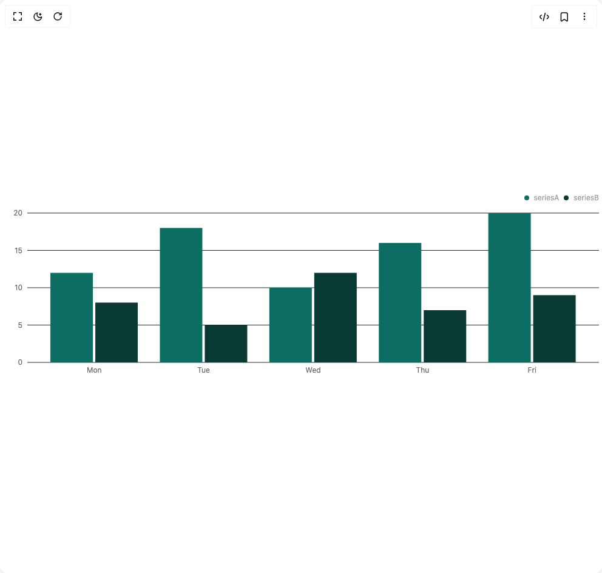

# Build Bar Chart in BuilderStudio

> Build this component in our Agentic IDE: [BuilderStudio](https://builderstudio.dev).
>
> Join the BuilderStudio community on [Discord](https://discord.gg/QdWeSGCqfe) and [Reddit](https://reddit.com/r/builderstudio).



## Component

- Author group: `subframeapp`
- Component: `bar-chart`
- Variant: `default`
- Rendered HTML snapshot: [`rendered.html`](rendered.html)

## BuilderStudio prompt

You are implementing a React component based on a component reference.

## Component identity

- Author: SubframeApp
- Component slug: bar-chart
- Demo slug: default
- Title: bar-chart
- Description: 

## Goal

Recreate this component in a React + TypeScript + Tailwind CSS project. Preserve the visual layout, spacing, colors, border radius, shadows, interaction behavior, animation behavior, responsive behavior, and dark mode behavior shown in the rendered demo.

## Implementation requirements

- Use React and TypeScript.
- Use Tailwind CSS classes whenever possible.
- Keep the component self-contained unless the source files require helper components.
- If the source uses CSS variables, custom CSS, animations, or keyframes, include them.
- If the source uses external packages, list and use the required packages.
- Preserve accessibility attributes, button semantics, links, keyboard behavior, and ARIA attributes when visible in the source.
- Do not replace the component with a simplified placeholder.
- Return complete production-ready code.

## Dependencies

No reference metadata available.

## Rendered DOM snapshot

This is the rendered demo HTML extracted from the live preview. Use it to verify structure, class names, visible content, and layout.

```html
<div id="root"><div class="w-screen min-h-screen flex justify-center items-center"><div class="w-screen min-h-screen flex justify-center items-center"><div class="h-80 w-full charts-module_root__sHdN1" style="min-height: 200px; min-width: 300px;"><div style="overflow: visible; height: 0px; width: 0px;"><div class="recharts-wrapper" style="position: relative; cursor: default; width: 992px; height: 320px;"><svg class="recharts-surface" width="992" height="320" viewBox="0 0 992 320" style="width: 100%; height: 100%;"><title></title><desc></desc><defs><clipPath id="recharts1-clip"><rect x="45" y="39" height="246" width="942"></rect></clipPath></defs><g class="recharts-cartesian-grid"><g class="recharts-cartesian-grid-horizontal"><line class="charts-module_grid__RLwqa charts-module_dark__mMKTE" stroke-width="1" stroke="#ccc" fill="none" x="45" y="39" width="942" height="246" x1="45" y1="285" x2="987" y2="285"></line><line class="charts-module_grid__RLwqa charts-module_dark__mMKTE" stroke-width="1" stroke="#ccc" fill="none" x="45" y="39" width="942" height="246" x1="45" y1="223.5" x2="987" y2="223.5"></line><line class="charts-module_grid__RLwqa charts-module_dark__mMKTE" stroke-width="1" stroke="#ccc" fill="none" x="45" y="39" width="942" height="246" x1="45" y1="162" x2="987" y2="162"></line><line class="charts-module_grid__RLwqa charts-module_dark__mMKTE" stroke-width="1" stroke="#ccc" fill="none" x="45" y="39" width="942" height="246" x1="45" y1="100.5" x2="987" y2="100.5"></line><line class="charts-module_grid__RLwqa charts-module_dark__mMKTE" stroke-width="1" stroke="#ccc" fill="none" x="45" y="39" width="942" height="246" x1="45" y1="39" x2="987" y2="39"></line></g></g><g class="recharts-layer recharts-cartesian-axis recharts-xAxis xAxis"><g class="recharts-cartesian-axis-ticks"><g class="recharts-layer recharts-cartesian-axis-tick"><text orientation="bottom" width="942" height="30" stroke="none" x="155.2" y="293" class="recharts-text recharts-cartesian-axis-tick-value" text-anchor="middle" fill="#666"><tspan x="155.2" dy="0.71em">Mon</tspan></text></g><g class="recharts-layer recharts-cartesian-axis-tick"><text orientation="bottom" width="942" height="30" stroke="none" x="335.6" y="293" class="recharts-text recharts-cartesian-axis-tick-value" text-anchor="middle" fill="#666"><tspan x="335.6" dy="0.71em">Tue</tspan></text></g><g class="recharts-layer recharts-cartesian-axis-tick"><text orientation="bottom" width="942" height="30" stroke="none" x="516" y="293" class="recharts-text recharts-cartesian-axis-tick-value" text-anchor="middle" fill="#666"><tspan x="516" dy="0.71em">Wed</tspan></text></g><g class="recharts-layer recharts-cartesian-axis-tick"><text orientation="bottom" width="942" height="30" stroke="none" x="696.4000000000001" y="293" class="recharts-text recharts-cartesian-axis-tick-value" text-anchor="middle" fill="#666"><tspan x="696.4000000000001" dy="0.71em">Thu</tspan></text></g><g class="recharts-layer recharts-cartesian-axis-tick"><text orientation="bottom" width="942" height="30" stroke="none" x="876.8000000000001" y="293" class="recharts-text recharts-cartesian-axis-tick-value" text-anchor="middle" fill="#666"><tspan x="876.8000000000001" dy="0.71em">Fri</tspan></text></g></g></g><g class="recharts-layer recharts-cartesian-axis recharts-yAxis yAxis"><g class="recharts-cartesian-axis-ticks"><g class="recharts-layer recharts-cartesian-axis-tick"><text orientation="left" width="40" height="246" stroke="none" x="37" y="285" class="recharts-text recharts-cartesian-axis-tick-value" text-anchor="end" fill="#666"><tspan x="37" dy="0.355em">0</tspan></text></g><g class="recharts-layer recharts-cartesian-axis-tick"><text orientation="left" width="40" height="246" stroke="none" x="37" y="223.5" class="recharts-text recharts-cartesian-axis-tick-value" text-anchor="end" fill="#666"><tspan x="37" dy="0.355em">5</tspan></text></g><g class="recharts-layer recharts-cartesian-axis-tick"><text orientation="left" width="40" height="246" stroke="none" x="37" y="162" class="recharts-text recharts-cartesian-axis-tick-value" text-anchor="end" fill="#666"><tspan x="37" dy="0.355em">10</tspan></text></g><g class="recharts-layer recharts-cartesian-axis-tick"><text orientation="left" width="40" height="246" stroke="none" x="37" y="100.5" class="recharts-text recharts-cartesian-axis-tick-value" text-anchor="end" fill="#666"><tspan x="37" dy="0.355em">15</tspan></text></g><g class="recharts-layer recharts-cartesian-axis-tick"><text orientation="left" width="40" height="246" stroke="none" x="37" y="39" class="recharts-text recharts-cartesian-axis-tick-value" text-anchor="end" fill="#666"><tspan x="37" dy="0.355em">20</tspan></text></g></g></g><g class="recharts-layer recharts-bar"><g class="recharts-layer recharts-bar-rectangles"><g class="recharts-layer recharts-bar-rectangle"><path x="83.03999999999999" y="137.4" width="70" height="147.6" radius="0" fill="#0c6d62" name="Mon" class="recharts-rectangle" d="M 83.03999999999999,137.4 h 70 v 147.6 h -70 Z"></path></g><g class="recharts-layer recharts-bar-rectangle"><path x="263.44" y="63.599999999999994" width="70" height="221.4" radius="0" fill="#0c6d62" name="Tue" class="recharts-rectangle" d="M 263.44,63.599999999999994 h 70 v 221.4 h -70 Z"></path></g><g class="recharts-layer recharts-bar-rectangle"><path x="443.84000000000003" y="162" width="70" height="123" radius="0" fill="#0c6d62" name="Wed" class="recharts-rectangle" d="M 443.84000000000003,162 h 70 v 123 h -70 Z"></path></g><g class="recharts-layer recharts-bar-rectangle"><path x="624.24" y="88.19999999999999" width="70" height="196.8" radius="0" fill="#0c6d62" name="Thu" class="recharts-rectangle" d="M 624.24,88.19999999999999 h 70 v 196.8 h -70 Z"></path></g><g class="recharts-layer recharts-bar-rectangle"><path x="804.64" y="39" width="70" height="246" radius="0" fill="#0c6d62" name="Fri" class="recharts-rectangle" d="M 804.64,39 h 70 v 246 h -70 Z"></path></g></g><g class="recharts-layer"></g></g><g class="recharts-layer recharts-bar"><g class="recharts-layer recharts-bar-rectangles"><g class="recharts-layer recharts-bar-rectangle"><path x="157.04" y="186.6" width="70" height="98.4" radius="0" fill="#083932" name="Mon" class="recharts-rectangle" d="M 157.04,186.6 h 70 v 98.4 h -70 Z"></path></g><g class="recharts-layer recharts-bar-rectangle"><path x="337.44" y="223.5" width="70" height="61.5" radius="0" fill="#083932" name="Tue" class="recharts-rectangle" d="M 337.44,223.5 h 70 v 61.5 h -70 Z"></path></g><g class="recharts-layer recharts-bar-rectangle"><path x="517.84" y="137.4" width="70" height="147.6" radius="0" fill="#083932" name="Wed" class="recharts-rectangle" d="M 517.84,137.4 h 70 v 147.6 h -70 Z"></path></g><g class="recharts-layer recharts-bar-rectangle"><path x="698.24" y="198.9" width="70" height="86.1" radius="0" fill="#083932" name="Thu" class="recharts-rectangle" d="M 698.24,198.9 h 70 v 86.1 h -70 Z"></path></g><g class="recharts-layer recharts-bar-rectangle"><path x="878.64" y="174.3" width="70" height="110.69999999999999" radius="0" fill="#083932" name="Fri" class="recharts-rectangle" d="M 878.64,174.3 h 70 v 110.69999999999999 h -70 Z"></path></g></g><g class="recharts-layer"></g></g></svg><div class="recharts-legend-wrapper" style="position: absolute; width: 982px; height: auto; right: 5px; top: 5px;"><div class="charts-module_legend__v4s06 charts-module_dark__mMKTE charts-module_right__RvrHp"><div class="charts-module_row__79RiF"><span class="charts-module_dot__u-M1W" style="background-color: rgb(12, 109, 98);"></span><span class="charts-module_name__tWzsw">seriesA</span></div><div class="charts-module_row__79RiF"><span class="charts-module_dot__u-M1W" style="background-color: rgb(8, 57, 50);"></span><span class="charts-module_name__tWzsw">seriesB</span></div></div></div><div tabindex="-1" class="recharts-tooltip-wrapper" style="visibility: hidden; pointer-events: none; position: absolute; top: 0px; left: 0px;"></div></div></div></div></div></div></div>
```

## Reference source files

No reference source files were available.
