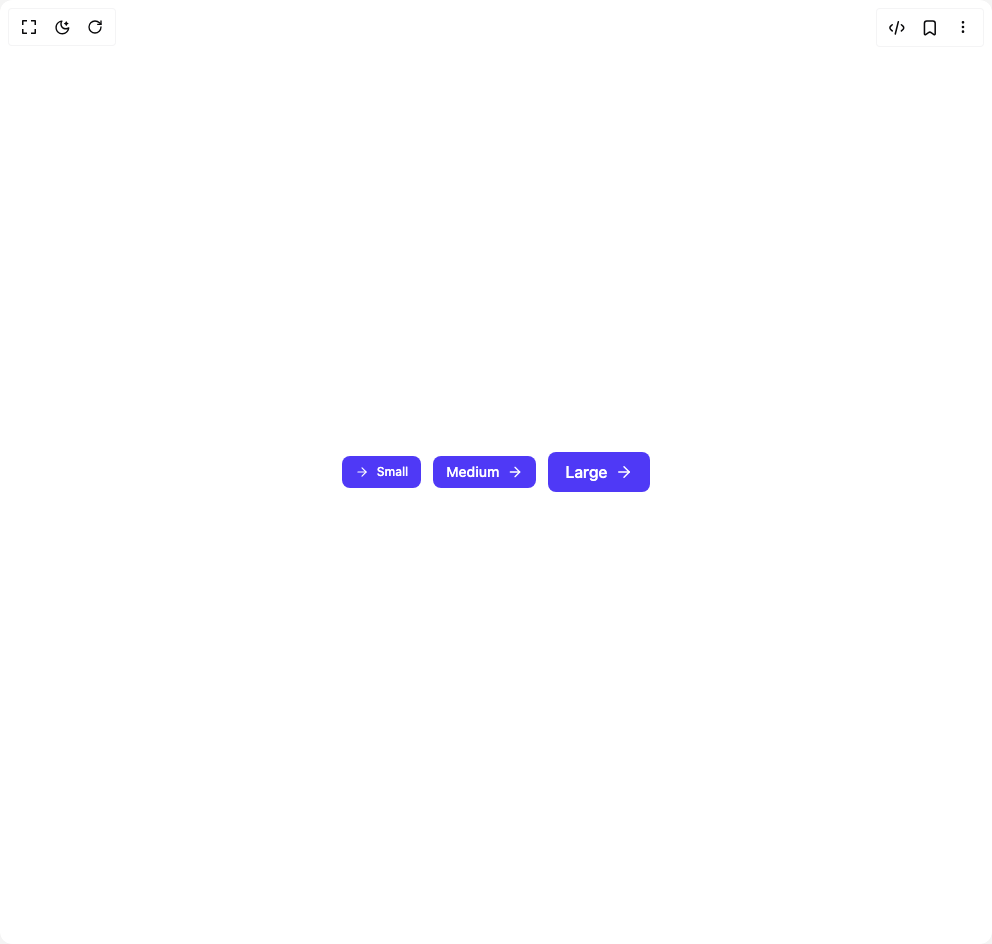

# Build Button 1 in BuilderStudio

> Build this component in our Agentic IDE: [BuilderStudio](https://builderstudio.dev).
>
> Join the BuilderStudio community on [Discord](https://discord.gg/QdWeSGCqfe) and [Reddit](https://reddit.com/r/builderstudio).



## Component

- Author group: `subframeapp`
- Component: `button-1`
- Variant: `buton-sizes`
- Rendered HTML snapshot: [`rendered.html`](rendered.html)

## BuilderStudio prompt

You are implementing a React component based on a component reference.

## Component identity

- Author: SubframeApp
- Component slug: button-1
- Demo slug: buton-sizes
- Title: button-1
- Description: 

## Goal

Recreate this component in a React + TypeScript + Tailwind CSS project. Preserve the visual layout, spacing, colors, border radius, shadows, interaction behavior, animation behavior, responsive behavior, and dark mode behavior shown in the rendered demo.

## Implementation requirements

- Use React and TypeScript.
- Use Tailwind CSS classes whenever possible.
- Keep the component self-contained unless the source files require helper components.
- If the source uses CSS variables, custom CSS, animations, or keyframes, include them.
- If the source uses external packages, list and use the required packages.
- Preserve accessibility attributes, button semantics, links, keyboard behavior, and ARIA attributes when visible in the source.
- Do not replace the component with a simplified placeholder.
- Return complete production-ready code.

## Dependencies

No reference metadata available.

## Rendered DOM snapshot

This is the rendered demo HTML extracted from the live preview. Use it to verify structure, class names, visible content, and layout.

```html
<div id="root"><div class="w-screen min-h-screen flex justify-center items-center"><div class="w-screen min-h-screen flex justify-center items-center"><div class="flex items-center gap-3"><button type="button" class="inline-flex items-center justify-center gap-2 rounded-md px-3 border transition-colors focus:outline-none focus:ring-2 focus:ring-offset-2 disabled:cursor-not-allowed disabled:opacity-60 h-8 border-transparent bg-indigo-600 text-white hover:bg-indigo-500 active:bg-indigo-600 focus:ring-indigo-500 h-6 px-2 text-xs"><span class="text-current icon-wrapper-module_root__-l6uP"><svg xmlns="http://www.w3.org/2000/svg" width="14" height="14" viewBox="0 0 24 24" fill="none" stroke="currentColor" stroke-width="2" stroke-linecap="round" stroke-linejoin="round" class="lucide lucide-arrow-right" aria-hidden="true"><path d="M5 12h14"></path><path d="m12 5 7 7-7 7"></path></svg></span><span class="hidden items-center justify-center"><div class="text-current loader-module_root__-0Kak"></div></span><span class="text-xs font-medium">Small</span></button><button type="button" class="inline-flex items-center justify-center gap-2 rounded-md px-3 border transition-colors focus:outline-none focus:ring-2 focus:ring-offset-2 disabled:cursor-not-allowed disabled:opacity-60 h-8 border-transparent bg-indigo-600 text-white hover:bg-indigo-500 active:bg-indigo-600 focus:ring-indigo-500 h-8 px-3 text-sm"><span class="hidden items-center justify-center"><div class="text-current loader-module_root__-0Kak"></div></span><span class="text-sm font-medium">Medium</span><span class="text-current icon-wrapper-module_root__-l6uP"><svg xmlns="http://www.w3.org/2000/svg" width="16" height="16" viewBox="0 0 24 24" fill="none" stroke="currentColor" stroke-width="2" stroke-linecap="round" stroke-linejoin="round" class="lucide lucide-arrow-right" aria-hidden="true"><path d="M5 12h14"></path><path d="m12 5 7 7-7 7"></path></svg></span></button><button type="button" class="inline-flex items-center justify-center gap-2 rounded-md px-3 border transition-colors focus:outline-none focus:ring-2 focus:ring-offset-2 disabled:cursor-not-allowed disabled:opacity-60 h-8 border-transparent bg-indigo-600 text-white hover:bg-indigo-500 active:bg-indigo-600 focus:ring-indigo-500 h-10 px-4 text-base"><span class="hidden items-center justify-center"><div class="text-current loader-module_root__-0Kak"></div></span><span class="text-base font-medium">Large</span><span class="text-current icon-wrapper-module_root__-l6uP"><svg xmlns="http://www.w3.org/2000/svg" width="18" height="18" viewBox="0 0 24 24" fill="none" stroke="currentColor" stroke-width="2" stroke-linecap="round" stroke-linejoin="round" class="lucide lucide-arrow-right" aria-hidden="true"><path d="M5 12h14"></path><path d="m12 5 7 7-7 7"></path></svg></span></button></div></div></div></div>
```

## Reference source files

No reference source files were available.
