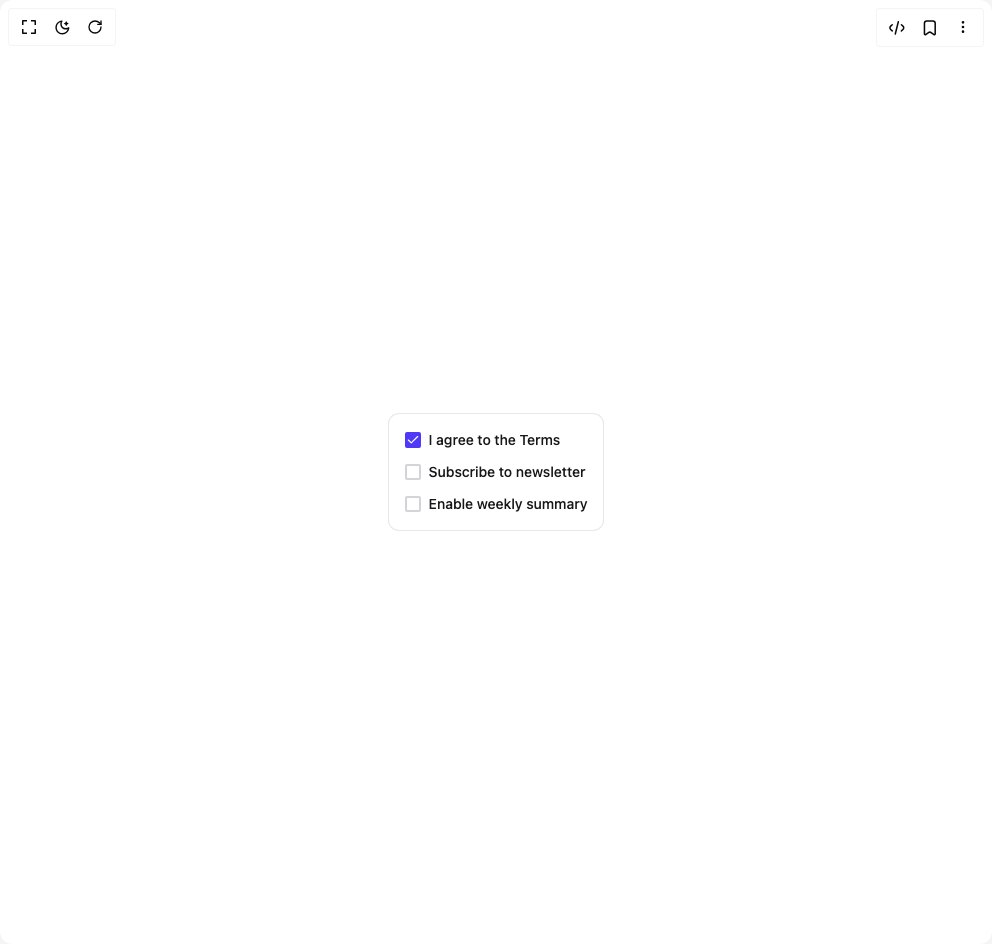

# Build Checkbox 1 in BuilderStudio

> Build this component in our Agentic IDE: [BuilderStudio](https://builderstudio.dev).
>
> Join the BuilderStudio community on [Discord](https://discord.gg/QdWeSGCqfe) and [Reddit](https://reddit.com/r/builderstudio).



## Component

- Author group: `subframeapp`
- Component: `checkbox-1`
- Variant: `default`
- Rendered HTML snapshot: [`rendered.html`](rendered.html)

## BuilderStudio prompt

You are implementing a React component based on a component reference.

## Component identity

- Author: SubframeApp
- Component slug: checkbox-1
- Demo slug: default
- Title: checkbox-1
- Description: 

## Goal

Recreate this component in a React + TypeScript + Tailwind CSS project. Preserve the visual layout, spacing, colors, border radius, shadows, interaction behavior, animation behavior, responsive behavior, and dark mode behavior shown in the rendered demo.

## Implementation requirements

- Use React and TypeScript.
- Use Tailwind CSS classes whenever possible.
- Keep the component self-contained unless the source files require helper components.
- If the source uses CSS variables, custom CSS, animations, or keyframes, include them.
- If the source uses external packages, list and use the required packages.
- Preserve accessibility attributes, button semantics, links, keyboard behavior, and ARIA attributes when visible in the source.
- Do not replace the component with a simplified placeholder.
- Return complete production-ready code.

## Dependencies

No reference metadata available.

## Rendered DOM snapshot

This is the rendered demo HTML extracted from the live preview. Use it to verify structure, class names, visible content, and layout.

```html
<div id="root"><div class="w-screen min-h-screen flex justify-center items-center"><div class="w-screen min-h-screen flex justify-center items-center"><div class="flex flex-col gap-3 rounded-lg p-4 ring-1 bg-white text-gray-900 ring-gray-200 dark:bg-gray-800 dark:text-gray-100 dark:ring-gray-700"><button class="group flex cursor-pointer items-center gap-2 text-left enabled:text-zinc-900 dark:enabled:text-zinc-100 disabled:text-zinc-400" type="button" role="checkbox" aria-checked="true" data-state="checked" value="on"><div class="flex h-4 w-4 flex-none items-center justify-center rounded-[2px] border-2 border-zinc-300 bg-white dark:bg-zinc-900 focus-visible:outline-none focus-visible:ring-2 focus-visible:ring-indigo-500 focus-visible:ring-offset-2 focus-visible:ring-offset-white dark:focus-visible:ring-offset-zinc-900 group-active:border-indigo-600 group-focus-within:border-indigo-600 group-aria-[checked=true]:border-indigo-600 group-aria-[checked=true]:bg-indigo-600 group-disabled:border-zinc-200 group-disabled:bg-zinc-100 dark:group-disabled:bg-zinc-800"><span class="hidden group-aria-[checked=true]:inline-flex text-[14px] leading-[14px] text-white icon-wrapper-module_root__-l6uP"><svg xmlns="http://www.w3.org/2000/svg" width="1em" height="1em" viewBox="0 0 24 24" fill="none" stroke="currentColor" stroke-width="2" stroke-linecap="round" stroke-linejoin="round"><polyline points="20 6 9 17 4 12"></polyline></svg></span></div><span class="text-sm font-medium text-zinc-900 dark:text-zinc-100 group-disabled:text-zinc-400">I agree to the Terms</span></button><button class="group flex cursor-pointer items-center gap-2 text-left enabled:text-zinc-900 dark:enabled:text-zinc-100 disabled:text-zinc-400" type="button" role="checkbox" aria-checked="false" data-state="unchecked" value="on"><div class="flex h-4 w-4 flex-none items-center justify-center rounded-[2px] border-2 border-zinc-300 bg-white dark:bg-zinc-900 focus-visible:outline-none focus-visible:ring-2 focus-visible:ring-indigo-500 focus-visible:ring-offset-2 focus-visible:ring-offset-white dark:focus-visible:ring-offset-zinc-900 group-active:border-indigo-600 group-focus-within:border-indigo-600 group-aria-[checked=true]:border-indigo-600 group-aria-[checked=true]:bg-indigo-600 group-disabled:border-zinc-200 group-disabled:bg-zinc-100 dark:group-disabled:bg-zinc-800"><span class="hidden group-aria-[checked=true]:inline-flex text-[14px] leading-[14px] text-white icon-wrapper-module_root__-l6uP"><svg xmlns="http://www.w3.org/2000/svg" width="1em" height="1em" viewBox="0 0 24 24" fill="none" stroke="currentColor" stroke-width="2" stroke-linecap="round" stroke-linejoin="round"><polyline points="20 6 9 17 4 12"></polyline></svg></span></div><span class="text-sm font-medium text-zinc-900 dark:text-zinc-100 group-disabled:text-zinc-400">Subscribe to newsletter</span></button><button class="group flex cursor-pointer items-center gap-2 text-left enabled:text-zinc-900 dark:enabled:text-zinc-100 disabled:text-zinc-400" type="button" role="checkbox" aria-checked="false" data-state="unchecked" value="on"><div class="flex h-4 w-4 flex-none items-center justify-center rounded-[2px] border-2 border-zinc-300 bg-white dark:bg-zinc-900 focus-visible:outline-none focus-visible:ring-2 focus-visible:ring-indigo-500 focus-visible:ring-offset-2 focus-visible:ring-offset-white dark:focus-visible:ring-offset-zinc-900 group-active:border-indigo-600 group-focus-within:border-indigo-600 group-aria-[checked=true]:border-indigo-600 group-aria-[checked=true]:bg-indigo-600 group-disabled:border-zinc-200 group-disabled:bg-zinc-100 dark:group-disabled:bg-zinc-800"><span class="hidden group-aria-[checked=true]:inline-flex text-[14px] leading-[14px] text-white icon-wrapper-module_root__-l6uP"><svg xmlns="http://www.w3.org/2000/svg" width="1em" height="1em" viewBox="0 0 24 24" fill="none" stroke="currentColor" stroke-width="2" stroke-linecap="round" stroke-linejoin="round"><polyline points="20 6 9 17 4 12"></polyline></svg></span></div><span class="text-sm font-medium text-zinc-900 dark:text-zinc-100 group-disabled:text-zinc-400">Enable weekly summary</span></button></div></div></div></div>
```

## Reference source files

No reference source files were available.
