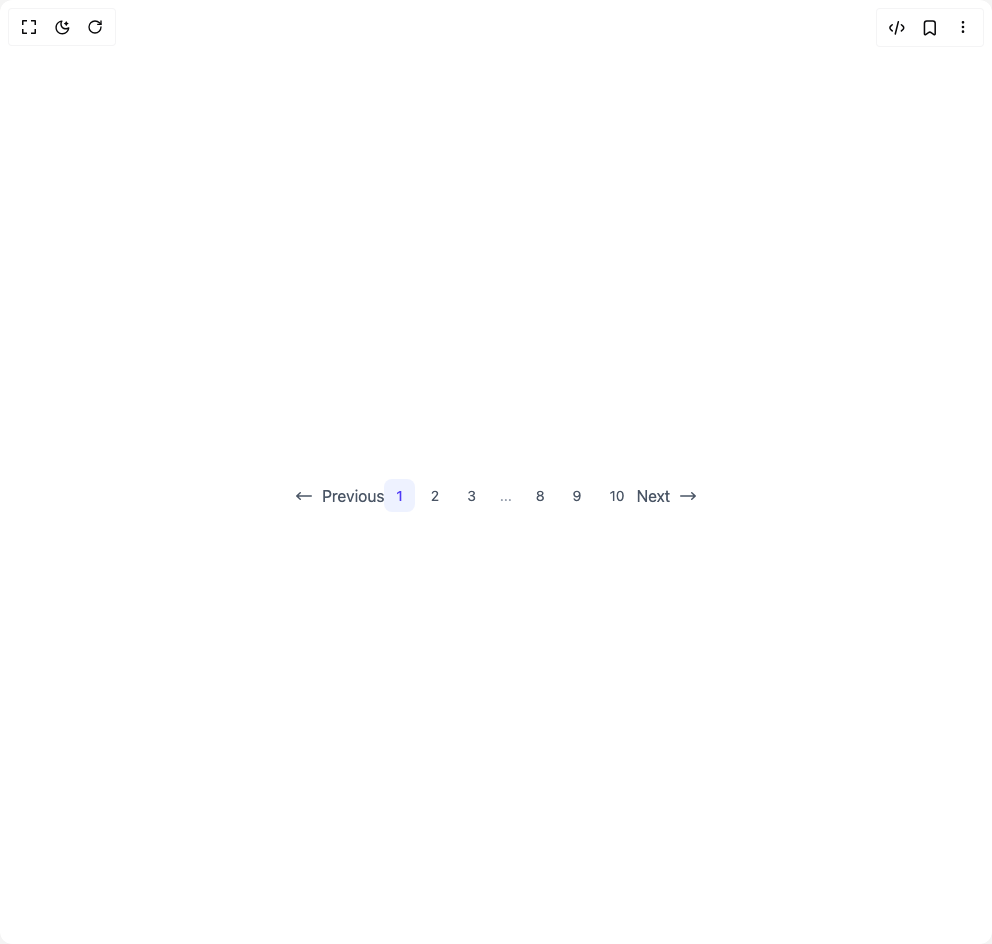

# Build Pagination in BuilderStudio

> Build this component in our Agentic IDE: [BuilderStudio](https://builderstudio.dev).
>
> Join the BuilderStudio community on [Discord](https://discord.gg/QdWeSGCqfe) and [Reddit](https://reddit.com/r/builderstudio).



## Component

- Author group: `subframeapp`
- Component: `pagination`
- Variant: `default`
- Rendered HTML snapshot: [`rendered.html`](rendered.html)

## BuilderStudio prompt

You are implementing a React component based on a component reference.

## Component identity

- Author: SubframeApp
- Component slug: pagination
- Demo slug: default
- Title: pagination
- Description: 

## Goal

Recreate this component in a React + TypeScript + Tailwind CSS project. Preserve the visual layout, spacing, colors, border radius, shadows, interaction behavior, animation behavior, responsive behavior, and dark mode behavior shown in the rendered demo.

## Implementation requirements

- Use React and TypeScript.
- Use Tailwind CSS classes whenever possible.
- Keep the component self-contained unless the source files require helper components.
- If the source uses CSS variables, custom CSS, animations, or keyframes, include them.
- If the source uses external packages, list and use the required packages.
- Preserve accessibility attributes, button semantics, links, keyboard behavior, and ARIA attributes when visible in the source.
- Do not replace the component with a simplified placeholder.
- Return complete production-ready code.

## Dependencies

No reference metadata available.

## Rendered DOM snapshot

This is the rendered demo HTML extracted from the live preview. Use it to verify structure, class names, visible content, and layout.

```html
<div id="root"><div class="w-screen min-h-screen flex justify-center items-center"><div class="w-screen min-h-screen flex justify-center items-center"><div class="max-w-screen-xl mx-auto mt-12 px-4 text-gray-600 md:px-8"><div class="hidden items-center justify-between sm:flex" aria-label="Pagination"><a href="javascript:throw new Error('React has blocked a javascript: URL as a security precaution.')" class="hover:text-indigo-600 flex items-center gap-x-2"><svg xmlns="http://www.w3.org/2000/svg" viewBox="0 0 20 20" fill="currentColor" class="w-5 h-5"><path fill-rule="evenodd" d="M18 10a.75.75 0 01-.75.75H4.66l2.1 1.95a.75.75 0 11-1.02 1.1l-3.5-3.25a.75.75 0 010-1.1l3.5-3.25a.75.75 0 111.02 1.1l-2.1 1.95h12.59A.75.75 0 0118 10z" clip-rule="evenodd"></path></svg>Previous</a><ul class="flex items-center gap-1"><li class="text-sm"><a href="javascript:throw new Error('React has blocked a javascript: URL as a security precaution.')" aria-current="page" class="px-2.5 py-1.5 sm:px-3 sm:py-2 rounded-md duration-150 hover:text-indigo-600 hover:bg-indigo-50 bg-indigo-50 text-indigo-600 font-medium">1</a></li><li class="text-sm"><a href="javascript:throw new Error('React has blocked a javascript: URL as a security precaution.')" class="px-2.5 py-1.5 sm:px-3 sm:py-2 rounded-md duration-150 hover:text-indigo-600 hover:bg-indigo-50 ">2</a></li><li class="text-sm"><a href="javascript:throw new Error('React has blocked a javascript: URL as a security precaution.')" class="px-2.5 py-1.5 sm:px-3 sm:py-2 rounded-md duration-150 hover:text-indigo-600 hover:bg-indigo-50 ">3</a></li><li class="text-sm"><div class="px-2 py-1 text-gray-400">...</div></li><li class="text-sm"><a href="javascript:throw new Error('React has blocked a javascript: URL as a security precaution.')" class="px-2.5 py-1.5 sm:px-3 sm:py-2 rounded-md duration-150 hover:text-indigo-600 hover:bg-indigo-50 ">8</a></li><li class="text-sm"><a href="javascript:throw new Error('React has blocked a javascript: URL as a security precaution.')" class="px-2.5 py-1.5 sm:px-3 sm:py-2 rounded-md duration-150 hover:text-indigo-600 hover:bg-indigo-50 ">9</a></li><li class="text-sm"><a href="javascript:throw new Error('React has blocked a javascript: URL as a security precaution.')" class="px-2.5 py-1.5 sm:px-3 sm:py-2 rounded-md duration-150 hover:text-indigo-600 hover:bg-indigo-50 ">10</a></li></ul><a href="javascript:throw new Error('React has blocked a javascript: URL as a security precaution.')" class="hover:text-indigo-600 flex items-center gap-x-2">Next<svg xmlns="http://www.w3.org/2000/svg" viewBox="0 0 20 20" fill="currentColor" class="w-5 h-5"><path fill-rule="evenodd" d="M2 10a.75.75 0 01.75-.75h12.59l-2.1-1.95a.75.75 0 111.02-1.1l3.5 3.25a.75.75 0 010 1.1l-3.5 3.25a.75.75 0 11-1.02-1.1l2.1-1.95H2.75A.75.75 0 012 10z" clip-rule="evenodd"></path></svg></a></div><div class="flex items-center justify-between text-sm text-gray-600 font-medium sm:hidden"><a href="javascript:throw new Error('React has blocked a javascript: URL as a security precaution.')" class="px-3 py-1.5 border rounded-md duration-150 hover:bg-gray-50">Previous</a><div class="px-3 py-1.5 border rounded-md bg-white">Page 1 of 7</div><a href="javascript:throw new Error('React has blocked a javascript: URL as a security precaution.')" class="px-3 py-1.5 border rounded-md duration-150 hover:bg-gray-50">Next</a></div></div></div></div></div>
```

## Reference source files

No reference source files were available.
