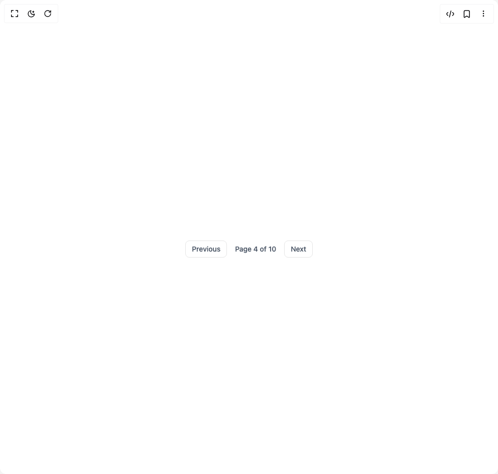

# Build Pagination in BuilderStudio

> Build this component in our Agentic IDE: [BuilderStudio](https://builderstudio.dev).
>
> Join the BuilderStudio community on [Discord](https://discord.gg/QdWeSGCqfe) and [Reddit](https://reddit.com/r/builderstudio).



## Component

- Author group: `subframeapp`
- Component: `pagination`
- Variant: `pagination-with-next-n-previous-link`
- Rendered HTML snapshot: [`rendered.html`](rendered.html)

## BuilderStudio prompt

You are implementing a React component based on a component reference.

## Component identity

- Author: SubframeApp
- Component slug: pagination
- Demo slug: pagination-with-next-n-previous-link
- Title: pagination
- Description: 

## Goal

Recreate this component in a React + TypeScript + Tailwind CSS project. Preserve the visual layout, spacing, colors, border radius, shadows, interaction behavior, animation behavior, responsive behavior, and dark mode behavior shown in the rendered demo.

## Implementation requirements

- Use React and TypeScript.
- Use Tailwind CSS classes whenever possible.
- Keep the component self-contained unless the source files require helper components.
- If the source uses CSS variables, custom CSS, animations, or keyframes, include them.
- If the source uses external packages, list and use the required packages.
- Preserve accessibility attributes, button semantics, links, keyboard behavior, and ARIA attributes when visible in the source.
- Do not replace the component with a simplified placeholder.
- Return complete production-ready code.

## Dependencies

No reference metadata available.

## Rendered DOM snapshot

This is the rendered demo HTML extracted from the live preview. Use it to verify structure, class names, visible content, and layout.

```html
<div id="root"><div class="w-screen min-h-screen flex justify-center items-center"><div class="w-screen min-h-screen flex justify-center items-center"><div class="max-w-screen-xl mx-auto mt-12 px-4 text-gray-600 md:px-8"><div class="flex items-center justify-between text-sm font-medium px-6 md:px-10"><button type="button" class="px-3 py-1.5 border rounded-md duration-150 hover:bg-gray-50 disabled:text-gray-400 disabled:border-gray-200 disabled:cursor-not-allowed">Previous</button><div class="px-4">Page 4 of 10</div><button type="button" class="px-3 py-1.5 border rounded-md duration-150 hover:bg-gray-50 disabled:text-gray-400 disabled:border-gray-200 disabled:cursor-not-allowed">Next</button></div></div></div></div></div>
```

## Reference source files

No reference source files were available.
