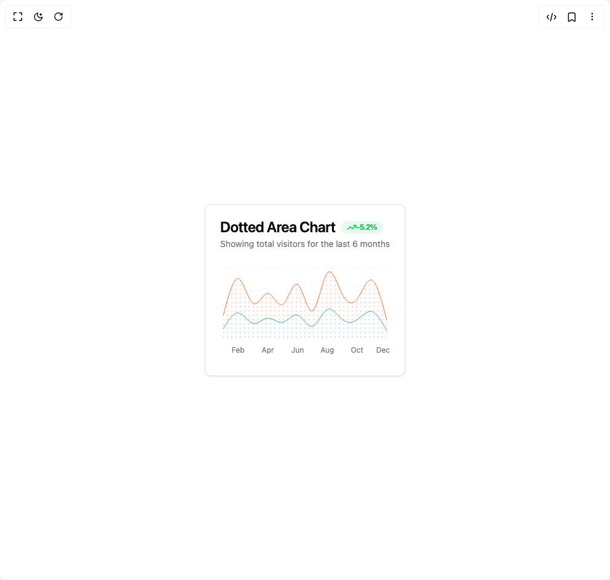

# Build Area Chart in BuilderStudio

> Build this component in our Agentic IDE: [BuilderStudio](https://builderstudio.dev).
>
> Join the BuilderStudio community on [Discord](https://discord.gg/QdWeSGCqfe) and [Reddit](https://reddit.com/r/builderstudio).



## Component

- Author group: `svg-ui`
- Component: `area-chart`
- Variant: `dotted-area-chart`
- Rendered HTML snapshot: [`rendered.html`](rendered.html)

## BuilderStudio prompt

You are implementing a React component based on a component reference.

## Component identity

- Author: svg-ui
- Component slug: area-chart
- Demo slug: dotted-area-chart
- Title: area-chart
- Description: 

## Goal

Recreate this component in a React + TypeScript + Tailwind CSS project. Preserve the visual layout, spacing, colors, border radius, shadows, interaction behavior, animation behavior, responsive behavior, and dark mode behavior shown in the rendered demo.

## Implementation requirements

- Use React and TypeScript.
- Use Tailwind CSS classes whenever possible.
- Keep the component self-contained unless the source files require helper components.
- If the source uses CSS variables, custom CSS, animations, or keyframes, include them.
- If the source uses external packages, list and use the required packages.
- Preserve accessibility attributes, button semantics, links, keyboard behavior, and ARIA attributes when visible in the source.
- Do not replace the component with a simplified placeholder.
- Return complete production-ready code.

## Dependencies

No reference metadata available.

## Rendered DOM snapshot

This is the rendered demo HTML extracted from the live preview. Use it to verify structure, class names, visible content, and layout.

```html
<div id="root"><div class="w-screen min-h-screen flex justify-center items-center"><div class="w-screen min-h-screen flex justify-center items-center"><div class="rounded-lg border bg-card text-card-foreground shadow-sm"><div class="flex flex-col space-y-1.5 p-6"><h3 class="text-2xl font-semibold leading-none tracking-tight">Dotted Area Chart<div class="inline-flex items-center rounded-full border px-2.5 py-0.5 text-xs font-semibold transition-colors focus:outline-none focus:ring-2 focus:ring-ring focus:ring-offset-2 text-green-500 bg-green-500/10 border-none ml-2"><svg xmlns="http://www.w3.org/2000/svg" width="24" height="24" viewBox="0 0 24 24" fill="none" stroke="currentColor" stroke-width="2" stroke-linecap="round" stroke-linejoin="round" class="lucide lucide-trending-up h-4 w-4" aria-hidden="true"><polyline points="22 7 13.5 15.5 8.5 10.5 2 17"></polyline><polyline points="16 7 22 7 22 13"></polyline></svg><span>-5.2%</span></div></h3><p class="text-sm text-muted-foreground">Showing total visitors for the last 6 months</p></div><div class="p-6 pt-0"><div data-slot="chart" data-chart="chart-«r0»" class="[&amp;_.recharts-cartesian-axis-tick_text]:fill-muted-foreground [&amp;_.recharts-cartesian-grid_line[stroke='#ccc']]:stroke-border/50 [&amp;_.recharts-curve.recharts-tooltip-cursor]:stroke-border [&amp;_.recharts-polar-grid_[stroke='#ccc']]:stroke-border [&amp;_.recharts-radial-bar-background-sector]:fill-muted [&amp;_.recharts-rectangle.recharts-tooltip-cursor]:fill-muted [&amp;_.recharts-reference-line_[stroke='#ccc']]:stroke-border flex aspect-video justify-center text-xs [&amp;_.recharts-dot[stroke='#fff']]:stroke-transparent [&amp;_.recharts-layer]:outline-hidden [&amp;_.recharts-sector]:outline-hidden [&amp;_.recharts-sector[stroke='#fff']]:stroke-transparent [&amp;_.recharts-surface]:outline-hidden"><style>
 [data-chart=chart-«r0»] {
  --color-desktop: var(--chart-1);
  --color-mobile: var(--chart-2);
}


.dark [data-chart=chart-«r0»] {
  --color-desktop: var(--chart-1);
  --color-mobile: var(--chart-2);
}
</style><div class="recharts-responsive-container" style="width: 100%; height: 100%; min-width: 0px;"><div style="width: 0px; height: 0px; overflow: visible;"><div class="recharts-wrapper" style="position: relative; cursor: default; width: 276px; height: 155px;"><div xmlns="http://www.w3.org/1999/xhtml" tabindex="-1" class="recharts-tooltip-wrapper" style="visibility: hidden; pointer-events: none; position: absolute; top: 0px; left: 0px;"></div><svg role="application" tabindex="0" class="recharts-surface" width="276" height="155" viewBox="0 0 276 155" style="width: 100%; height: 100%;"><title></title><desc></desc><defs><clipPath id="recharts1-clip"><rect x="5" y="5" height="115" width="266"></rect></clipPath></defs><g class="recharts-cartesian-grid"><g class="recharts-cartesian-grid-horizontal"><line stroke-dasharray="3 3" stroke="#ccc" fill="none" x="5" y="5" width="266" height="115" x1="5" y1="120" x2="271" y2="120"></line><line stroke-dasharray="3 3" stroke="#ccc" fill="none" x="5" y="5" width="266" height="115" x1="5" y1="62.5" x2="271" y2="62.5"></line><line stroke-dasharray="3 3" stroke="#ccc" fill="none" x="5" y="5" width="266" height="115" x1="5" y1="5" x2="271" y2="5"></line></g></g><g class="recharts-layer recharts-cartesian-axis recharts-xAxis xAxis"><g class="recharts-cartesian-axis-ticks"><g class="recharts-layer recharts-cartesian-axis-tick"><text height="30" orientation="bottom" width="266" stroke="none" x="29.181818181818183" y="134" class="recharts-text recharts-cartesian-axis-tick-value" text-anchor="middle" fill="#666"><tspan x="29.181818181818183" dy="0.71em">Feb</tspan></text></g><g class="recharts-layer recharts-cartesian-axis-tick"><text height="30" orientation="bottom" width="266" stroke="none" x="77.54545454545455" y="134" class="recharts-text recharts-cartesian-axis-tick-value" text-anchor="middle" fill="#666"><tspan x="77.54545454545455" dy="0.71em">Apr</tspan></text></g><g class="recharts-layer recharts-cartesian-axis-tick"><text height="30" orientation="bottom" width="266" stroke="none" x="125.90909090909092" y="134" class="recharts-text recharts-cartesian-axis-tick-value" text-anchor="middle" fill="#666"><tspan x="125.90909090909092" dy="0.71em">Jun</tspan></text></g><g class="recharts-layer recharts-cartesian-axis-tick"><text height="30" orientation="bottom" width="266" stroke="none" x="174.27272727272728" y="134" class="recharts-text recharts-cartesian-axis-tick-value" text-anchor="middle" fill="#666"><tspan x="174.27272727272728" dy="0.71em">Aug</tspan></text></g><g class="recharts-layer recharts-cartesian-axis-tick"><text height="30" orientation="bottom" width="266" stroke="none" x="222.63636363636365" y="134" class="recharts-text recharts-cartesian-axis-tick-value" text-anchor="middle" fill="#666"><tspan x="222.63636363636365" dy="0.71em">Oct</tspan></text></g><g class="recharts-layer recharts-cartesian-axis-tick"><text height="30" orientation="bottom" width="266" stroke="none" x="264.8515625" y="134" class="recharts-text recharts-cartesian-axis-tick-value" text-anchor="middle" fill="#666"><tspan x="264.8515625" dy="0.71em">Dec</tspan></text></g></g></g><defs><pattern id="dotted-background-pattern-desktop" x="0" y="0" width="7" height="7" patternUnits="userSpaceOnUse"><circle cx="5" cy="5" r="1.5" fill="var(--chart-1)" opacity="0.5"></circle></pattern><pattern id="dotted-background-pattern-mobile" x="0" y="0" width="7" height="7" patternUnits="userSpaceOnUse"><circle cx="5" cy="5" r="1.5" fill="var(--chart-2)" opacity="0.5"></circle></pattern></defs><g class="recharts-layer recharts-area"><g class="recharts-layer"><path stroke-width="0.8" fill="url(#dotted-background-pattern-mobile)" fill-opacity="0.4" height="115" width="266" stroke="none" class="recharts-curve recharts-area-area" d="M5,104.347C13.061,91.013,21.121,77.68,29.182,78.217C37.242,78.754,45.303,93.162,53.364,95.275C61.424,97.388,69.485,87.208,77.545,86.714C85.606,86.22,93.667,95.414,101.727,93.678C109.788,91.942,117.848,79.276,125.909,81.794C133.97,84.313,142.03,102.015,150.091,100.067C158.152,98.119,166.212,76.52,174.273,72.531C182.333,68.541,190.394,82.16,198.455,88.758C206.515,95.357,214.576,94.936,222.636,89.589C230.697,84.242,238.758,73.969,246.818,76.108C254.879,78.248,262.939,92.799,271,107.35L271,120C262.939,120,254.879,120,246.818,120C238.758,120,230.697,120,222.636,120C214.576,120,206.515,120,198.455,120C190.394,120,182.333,120,174.273,120C166.212,120,158.152,120,150.091,120C142.03,120,133.97,120,125.909,120C117.848,120,109.788,120,101.727,120C93.667,120,85.606,120,77.545,120C69.485,120,61.424,120,53.364,120C45.303,120,37.242,120,29.182,120C21.121,120,13.061,120,5,120Z"></path><path stroke-width="0.8" fill="none" fill-opacity="0.4" height="115" stroke="var(--color-mobile)" width="266" class="recharts-curve recharts-area-curve" d="M5,104.347C13.061,91.013,21.121,77.68,29.182,78.217C37.242,78.754,45.303,93.162,53.364,95.275C61.424,97.388,69.485,87.208,77.545,86.714C85.606,86.22,93.667,95.414,101.727,93.678C109.788,91.942,117.848,79.276,125.909,81.794C133.97,84.313,142.03,102.015,150.091,100.067C158.152,98.119,166.212,76.52,174.273,72.531C182.333,68.541,190.394,82.16,198.455,88.758C206.515,95.357,214.576,94.936,222.636,89.589C230.697,84.242,238.758,73.969,246.818,76.108C254.879,78.248,262.939,92.799,271,107.35"></path></g></g><g class="recharts-layer recharts-area"><g class="recharts-layer"><path stroke-width="0.8" fill="url(#dotted-background-pattern-desktop)" fill-opacity="0.4" height="115" width="266" stroke="none" class="recharts-curve recharts-area-area" d="M5,82.497C13.061,51.729,21.121,20.962,29.182,22.25C37.242,23.538,45.303,56.883,53.364,62.564C61.424,68.245,69.485,46.262,77.545,46.528C85.606,46.793,93.667,69.307,101.727,64.417C109.788,59.526,117.848,27.232,125.909,31.897C133.97,36.563,142.03,78.188,150.091,74.894C158.152,71.601,166.212,23.388,174.273,13.433C182.333,3.479,190.394,31.782,198.455,47.422C206.515,63.063,214.576,66.04,222.636,55.6C230.697,45.16,238.758,21.302,246.818,24.806C254.879,28.309,262.939,59.172,271,90.036L271,107.35C262.939,92.799,254.879,78.248,246.818,76.108C238.758,73.969,230.697,84.242,222.636,89.589C214.576,94.936,206.515,95.357,198.455,88.758C190.394,82.16,182.333,68.541,174.273,72.531C166.212,76.52,158.152,98.119,150.091,100.067C142.03,102.015,133.97,84.313,125.909,81.794C117.848,79.276,109.788,91.942,101.727,93.678C93.667,95.414,85.606,86.22,77.545,86.714C69.485,87.208,61.424,97.388,53.364,95.275C45.303,93.162,37.242,78.754,29.182,78.217C21.121,77.68,13.061,91.013,5,104.347Z"></path><path stroke-width="0.8" fill="none" fill-opacity="0.4" height="115" stroke="var(--color-desktop)" width="266" class="recharts-curve recharts-area-curve" d="M5,82.497C13.061,51.729,21.121,20.962,29.182,22.25C37.242,23.538,45.303,56.883,53.364,62.564C61.424,68.245,69.485,46.262,77.545,46.528C85.606,46.793,93.667,69.307,101.727,64.417C109.788,59.526,117.848,27.232,125.909,31.897C133.97,36.563,142.03,78.188,150.091,74.894C158.152,71.601,166.212,23.388,174.273,13.433C182.333,3.479,190.394,31.782,198.455,47.422C206.515,63.063,214.576,66.04,222.636,55.6C230.697,45.16,238.758,21.302,246.818,24.806C254.879,28.309,262.939,59.172,271,90.036"></path></g></g></svg></div></div></div></div></div></div></div></div></div>
```

## Reference source files

No reference source files were available.
