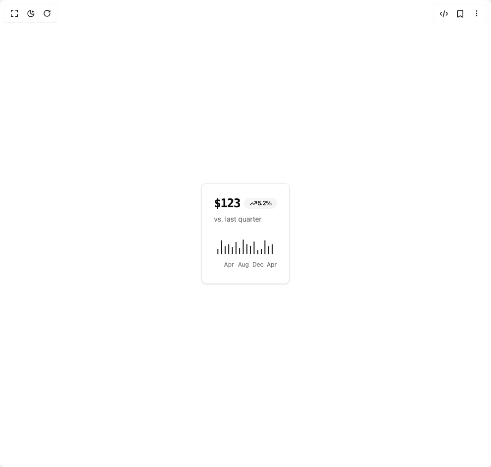

# Build Bar Chart in BuilderStudio

> Build this component in our Agentic IDE: [BuilderStudio](https://builderstudio.dev).
>
> Join the BuilderStudio community on [Discord](https://discord.gg/QdWeSGCqfe) and [Reddit](https://reddit.com/r/builderstudio).



## Component

- Author group: `svg-ui`
- Component: `bar-chart`
- Variant: `monospace-bar-chart`
- Rendered HTML snapshot: [`rendered.html`](rendered.html)

## BuilderStudio prompt

You are implementing a React component based on a component reference.

## Component identity

- Author: svg-ui
- Component slug: bar-chart
- Demo slug: monospace-bar-chart
- Title: bar-chart
- Description: 

## Goal

Recreate this component in a React + TypeScript + Tailwind CSS project. Preserve the visual layout, spacing, colors, border radius, shadows, interaction behavior, animation behavior, responsive behavior, and dark mode behavior shown in the rendered demo.

## Implementation requirements

- Use React and TypeScript.
- Use Tailwind CSS classes whenever possible.
- Keep the component self-contained unless the source files require helper components.
- If the source uses CSS variables, custom CSS, animations, or keyframes, include them.
- If the source uses external packages, list and use the required packages.
- Preserve accessibility attributes, button semantics, links, keyboard behavior, and ARIA attributes when visible in the source.
- Do not replace the component with a simplified placeholder.
- Return complete production-ready code.

## Dependencies

No reference metadata available.

## Rendered DOM snapshot

This is the rendered demo HTML extracted from the live preview. Use it to verify structure, class names, visible content, and layout.

```html
<div id="root"><div class="w-screen min-h-screen flex justify-center items-center"><div class="w-screen min-h-screen flex justify-center items-center"><div class="rounded-lg border bg-card text-card-foreground shadow-sm"><div class="flex flex-col space-y-1.5 p-6"><h3 class="text-2xl font-semibold leading-none tracking-tight flex items-center gap-2"><span class="font-mono text-2xl tracking-tighter">$123</span><div class="inline-flex items-center rounded-full border px-2.5 py-0.5 text-xs font-semibold transition-colors focus:outline-none focus:ring-2 focus:ring-ring focus:ring-offset-2 border-transparent bg-secondary text-secondary-foreground hover:bg-secondary/80"><svg xmlns="http://www.w3.org/2000/svg" width="24" height="24" viewBox="0 0 24 24" fill="none" stroke="currentColor" stroke-width="2" stroke-linecap="round" stroke-linejoin="round" class="lucide lucide-trending-up h-4 w-4" aria-hidden="true"><polyline points="22 7 13.5 15.5 8.5 10.5 2 17"></polyline><polyline points="16 7 22 7 22 13"></polyline></svg><span>5.2%</span></div></h3><p class="text-sm text-muted-foreground">vs. last quarter</p></div><div class="p-6 pt-0"><div data-slot="chart" data-chart="chart-«r1»" class="[&amp;_.recharts-cartesian-axis-tick_text]:fill-muted-foreground [&amp;_.recharts-cartesian-grid_line[stroke='#ccc']]:stroke-border/50 [&amp;_.recharts-curve.recharts-tooltip-cursor]:stroke-border [&amp;_.recharts-polar-grid_[stroke='#ccc']]:stroke-border [&amp;_.recharts-radial-bar-background-sector]:fill-muted [&amp;_.recharts-rectangle.recharts-tooltip-cursor]:fill-muted [&amp;_.recharts-reference-line_[stroke='#ccc']]:stroke-border flex aspect-video justify-center text-xs [&amp;_.recharts-dot[stroke='#fff']]:stroke-transparent [&amp;_.recharts-layer]:outline-hidden [&amp;_.recharts-sector]:outline-hidden [&amp;_.recharts-sector[stroke='#fff']]:stroke-transparent [&amp;_.recharts-surface]:outline-hidden"><style>
 [data-chart=chart-«r1»] {
  --color-desktop: var(--secondary-foreground);
}


.dark [data-chart=chart-«r1»] {
  --color-desktop: var(--secondary-foreground);
}
</style><div class="recharts-responsive-container" style="width: 100%; height: 100%; min-width: 0px;"><div style="width: 0px; height: 0px; overflow: visible;"><div class="recharts-wrapper" style="position: relative; cursor: default; width: 127px; height: 72px;"><svg role="application" tabindex="0" class="recharts-surface" width="127" height="72" viewBox="0 0 127 72" style="width: 100%; height: 100%;"><title></title><desc></desc><defs><clipPath id="recharts1-clip"><rect x="5" y="5" height="32" width="117"></rect></clipPath></defs><g class="recharts-layer recharts-cartesian-axis recharts-xAxis xAxis"><g class="recharts-cartesian-axis-ticks"><g class="recharts-layer recharts-cartesian-axis-tick"><text height="30" orientation="bottom" width="117" stroke="none" x="30.59375" y="53" class="recharts-text recharts-cartesian-axis-tick-value" text-anchor="middle" fill="#666"><tspan x="30.59375" dy="0.71em">Apr</tspan></text></g><g class="recharts-layer recharts-cartesian-axis-tick"><text height="30" orientation="bottom" width="117" stroke="none" x="59.84375" y="53" class="recharts-text recharts-cartesian-axis-tick-value" text-anchor="middle" fill="#666"><tspan x="59.84375" dy="0.71em">Aug</tspan></text></g><g class="recharts-layer recharts-cartesian-axis-tick"><text height="30" orientation="bottom" width="117" stroke="none" x="89.09375" y="53" class="recharts-text recharts-cartesian-axis-tick-value" text-anchor="middle" fill="#666"><tspan x="89.09375" dy="0.71em">Dec</tspan></text></g><g class="recharts-layer recharts-cartesian-axis-tick"><text height="30" orientation="bottom" width="117" stroke="none" x="117.0078125" y="53" class="recharts-text recharts-cartesian-axis-tick-value" text-anchor="middle" fill="#666"><tspan x="117.0078125" dy="0.71em">Apr</tspan></text></g></g></g><g class="recharts-layer recharts-bar"><g class="recharts-layer recharts-bar-rectangles"><g class="recharts-layer"><g class="recharts-layer recharts-bar-rectangle"><g><rect y="26.055999999999997" height="10.944000000000003" fill="var(--secondary-foreground)" width="2px" style="will-change: transform, width; transform: translateX(7.23125px); transform-origin: 50% 50%; transform-box: fill-box;"></rect></g></g><g class="recharts-layer recharts-bar-rectangle"><g><rect y="8.968" height="28.032" fill="var(--secondary-foreground)" width="2px" style="will-change: transform, width; transform: translateX(14.5437px); transform-origin: 50% 50%; transform-box: fill-box;"></rect></g></g><g class="recharts-layer recharts-bar-rectangle"><g><rect y="20.616" height="16.384" fill="var(--secondary-foreground)" width="2px" style="will-change: transform, width; transform: translateX(21.8562px); transform-origin: 50% 50%; transform-box: fill-box;"></rect></g></g><g class="recharts-layer recharts-bar-rectangle"><g><rect y="16.872" height="20.128" fill="var(--secondary-foreground)" width="2px" style="will-change: transform, width; transform: translateX(29.1687px); transform-origin: 50% 50%; transform-box: fill-box;"></rect></g></g><g class="recharts-layer recharts-bar-rectangle"><g><rect y="22.344" height="14.655999999999999" fill="var(--secondary-foreground)" width="2px" style="will-change: transform, width; transform: translateX(36.4813px); transform-origin: 50% 50%; transform-box: fill-box;"></rect></g></g><g class="recharts-layer recharts-bar-rectangle"><g><rect y="12.008" height="24.992" fill="var(--secondary-foreground)" width="2px" style="will-change: transform, width; transform: translateX(43.7938px); transform-origin: 50% 50%; transform-box: fill-box;"></rect></g></g><g class="recharts-layer recharts-bar-rectangle"><g><rect y="24.392" height="12.608" fill="var(--secondary-foreground)" width="2px" style="will-change: transform, width; transform: translateX(51.1063px); transform-origin: 50% 50%; transform-box: fill-box;"></rect></g></g><g class="recharts-layer recharts-bar-rectangle"><g><rect y="7.399999999999999" height="29.6" fill="var(--secondary-foreground)" width="2px" style="will-change: transform, width; transform: translateX(58.4188px); transform-origin: 50% 50%; transform-box: fill-box;"></rect></g></g><g class="recharts-layer recharts-bar-rectangle"><g><rect y="16.296" height="20.704" fill="var(--secondary-foreground)" width="2px" style="will-change: transform, width; transform: translateX(65.7313px); transform-origin: 50% 50%; transform-box: fill-box;"></rect></g></g><g class="recharts-layer recharts-bar-rectangle"><g><rect y="19.976" height="17.024" fill="var(--secondary-foreground)" width="2px" style="will-change: transform, width; transform: translateX(73.0438px); transform-origin: 50% 50%; transform-box: fill-box;"></rect></g></g><g class="recharts-layer recharts-bar-rectangle"><g><rect y="11.303999999999998" height="25.696" fill="var(--secondary-foreground)" width="2px" style="will-change: transform, width; transform: translateX(80.3563px); transform-origin: 50% 50%; transform-box: fill-box;"></rect></g></g><g class="recharts-layer recharts-bar-rectangle"><g><rect y="28.328" height="8.672" fill="var(--secondary-foreground)" width="2px" style="will-change: transform, width; transform: translateX(87.6688px); transform-origin: 50% 50%; transform-box: fill-box;"></rect></g></g><g class="recharts-layer recharts-bar-rectangle"><g><rect y="26.055999999999997" height="10.944000000000003" fill="var(--secondary-foreground)" width="2px" style="will-change: transform, width; transform: translateX(94.9813px); transform-origin: 50% 50%; transform-box: fill-box;"></rect></g></g><g class="recharts-layer recharts-bar-rectangle"><g><rect y="8.968" height="28.032" fill="var(--secondary-foreground)" width="2px" style="will-change: transform, width; transform: translateX(102.294px); transform-origin: 50% 50%; transform-box: fill-box;"></rect></g></g><g class="recharts-layer recharts-bar-rectangle"><g><rect y="20.616" height="16.384" fill="var(--secondary-foreground)" width="2px" style="will-change: transform, width; transform: translateX(109.606px); transform-origin: 50% 50%; transform-box: fill-box;"></rect></g></g><g class="recharts-layer recharts-bar-rectangle"><g><rect y="16.872" height="20.128" fill="var(--secondary-foreground)" width="2px" style="will-change: transform, width; transform: translateX(116.919px); transform-origin: 50% 50%; transform-box: fill-box;"></rect></g></g></g></g></g></svg></div></div></div></div></div></div></div></div></div>
```

## Reference source files

No reference source files were available.
