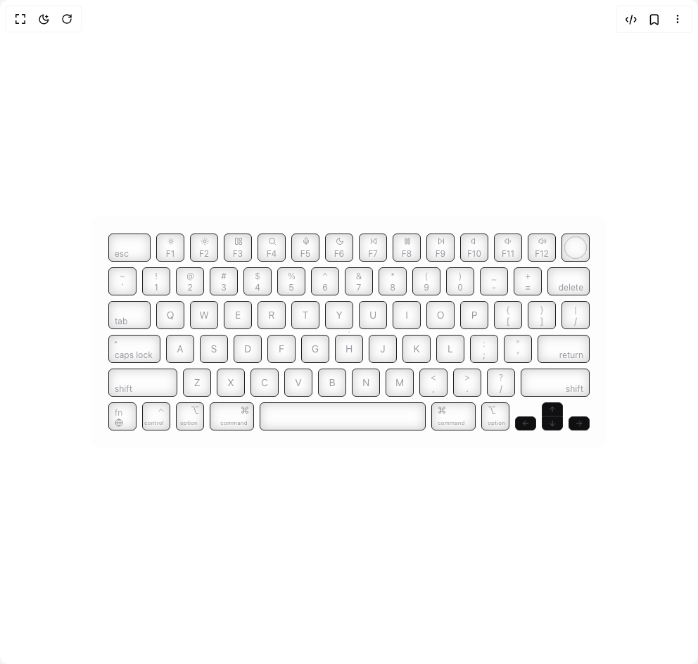

# Build Legion Web Dev in BuilderStudio

> Build this component in our Agentic IDE: [BuilderStudio](https://builderstudio.dev).
>
> Join the BuilderStudio community on [Discord](https://discord.gg/QdWeSGCqfe) and [Reddit](https://reddit.com/r/builderstudio).



## Component

- Author group: `svg-ui`
- Component: `legion-web-dev`
- Variant: `default`
- Rendered HTML snapshot: [`rendered.html`](rendered.html)

## BuilderStudio prompt

You are implementing a React component based on a component reference.

## Component identity

- Author: svg-ui
- Component slug: legion-web-dev
- Demo slug: default
- Title: legion-web-dev
- Description: 

## Goal

Recreate this component in a React + TypeScript + Tailwind CSS project. Preserve the visual layout, spacing, colors, border radius, shadows, interaction behavior, animation behavior, responsive behavior, and dark mode behavior shown in the rendered demo.

## Implementation requirements

- Use React and TypeScript.
- Use Tailwind CSS classes whenever possible.
- Keep the component self-contained unless the source files require helper components.
- If the source uses CSS variables, custom CSS, animations, or keyframes, include them.
- If the source uses external packages, list and use the required packages.
- Preserve accessibility attributes, button semantics, links, keyboard behavior, and ARIA attributes when visible in the source.
- Do not replace the component with a simplified placeholder.
- Return complete production-ready code.

## Dependencies

No reference metadata available.

## Rendered DOM snapshot

This is the rendered demo HTML extracted from the live preview. Use it to verify structure, class names, visible content, and layout.

```html
<div id="root"><div class="relative flex items-center justify-center h-screen w-full m-auto p-16 bg-background text-foreground"><div class="absolute lab-bg inset-0 size-full"><div class="absolute inset-0 bg-[radial-gradient(#00000021_1px,transparent_1px)] dark:bg-[radial-gradient(#ffffff22_1px,transparent_1px)]"></div></div><div class="flex w-full justify-center relative"><div class="p-4 rounded-xl bg-accent/20 w-fit"><div class="card-color flex w-[700px] flex-col gap-2 rounded-md p-2"><div class="flex flex-row gap-2"><div class="!basis-full hover:!border-white/20 shadow-[inset_0px_0px_15px_rgba(0,0,0,0.2)] group relative flex select-none flex-col items-center justify-center gap-1.5 rounded-md border border-x-[1px] border-b-[0.1px] border-t-[1.5px] border-border/80 px-2 duration-200 first:items-start last:items-end active:!scale-[0.98] bg-transparent" style="width: 40px; height: 40px; min-width: 40px; flex-basis: 40px; color: rgb(33, 33, 33); border-color: rgb(33, 33, 33);"><div class="mt-0.5 h-[10px] w-[10px] text-center text-xs font-light text-muted-foreground/70 duration-200 group-hover:text-muted-foreground"></div><div class="text-xs text-center text-muted-foreground/70 duration-200 group-hover:text-white/60">esc</div></div><div class="hover:!border-white/20 shadow-[inset_0px_0px_15px_rgba(0,0,0,0.2)] group relative flex select-none flex-col items-center justify-center gap-1.5 rounded-md border border-x-[1px] border-b-[0.1px] border-t-[1.5px] border-border/80 px-2 duration-200 first:items-start last:items-end active:!scale-[0.98] bg-transparent" style="width: 40px; height: 40px; min-width: 40px; flex-basis: 40px; color: rgb(33, 33, 33); border-color: rgb(33, 33, 33);"><div class="mt-0.5 h-[10px] w-[10px] text-center text-xs font-light text-muted-foreground/70 duration-200 group-hover:text-muted-foreground"><svg xmlns="http://www.w3.org/2000/svg" width="12" height="12" viewBox="0 0 24 24" fill="none" stroke="currentColor" stroke-width="2" stroke-linecap="round" stroke-linejoin="round" class="lucide lucide-sun-dim" aria-hidden="true"><circle cx="12" cy="12" r="4"></circle><path d="M12 4h.01"></path><path d="M20 12h.01"></path><path d="M12 20h.01"></path><path d="M4 12h.01"></path><path d="M17.657 6.343h.01"></path><path d="M17.657 17.657h.01"></path><path d="M6.343 17.657h.01"></path><path d="M6.343 6.343h.01"></path></svg></div><div class="text-xs text-center text-muted-foreground/70 duration-200 group-hover:text-white/60">F1</div></div><div class="hover:!border-white/20 shadow-[inset_0px_0px_15px_rgba(0,0,0,0.2)] group relative flex select-none flex-col items-center justify-center gap-1.5 rounded-md border border-x-[1px] border-b-[0.1px] border-t-[1.5px] border-border/80 px-2 duration-200 first:items-start last:items-end active:!scale-[0.98] bg-transparent" style="width: 40px; height: 40px; min-width: 40px; flex-basis: 40px; color: rgb(33, 33, 33); border-color: rgb(33, 33, 33);"><div class="mt-0.5 h-[10px] w-[10px] text-center text-xs font-light text-muted-foreground/70 duration-200 group-hover:text-muted-foreground"><svg xmlns="http://www.w3.org/2000/svg" width="12" height="12" viewBox="0 0 24 24" fill="none" stroke="currentColor" stroke-width="2" stroke-linecap="round" stroke-linejoin="round" class="lucide lucide-sun" aria-hidden="true"><circle cx="12" cy="12" r="4"></circle><path d="M12 2v2"></path><path d="M12 20v2"></path><path d="m4.93 4.93 1.41 1.41"></path><path d="m17.66 17.66 1.41 1.41"></path><path d="M2 12h2"></path><path d="M20 12h2"></path><path d="m6.34 17.66-1.41 1.41"></path><path d="m19.07 4.93-1.41 1.41"></path></svg></div><div class="text-xs text-center text-muted-foreground/70 duration-200 group-hover:text-white/60">F2</div></div><div class="hover:!border-white/20 shadow-[inset_0px_0px_15px_rgba(0,0,0,0.2)] group relative flex select-none flex-col items-center justify-center gap-1.5 rounded-md border border-x-[1px] border-b-[0.1px] border-t-[1.5px] border-border/80 px-2 duration-200 first:items-start last:items-end active:!scale-[0.98] bg-transparent" style="width: 40px; height: 40px; min-width: 40px; flex-basis: 40px; color: rgb(33, 33, 33); border-color: rgb(33, 33, 33);"><div class="mt-0.5 h-[10px] w-[10px] text-center text-xs font-light text-muted-foreground/70 duration-200 group-hover:text-muted-foreground"><svg xmlns="http://www.w3.org/2000/svg" width="12" height="12" viewBox="0 0 24 24" fill="none" stroke="currentColor" stroke-width="2" stroke-linecap="round" stroke-linejoin="round" class="lucide lucide-layout-panel-left" aria-hidden="true"><rect width="7" height="18" x="3" y="3" rx="1"></rect><rect width="7" height="7" x="14" y="3" rx="1"></rect><rect width="7" height="7" x="14" y="14" rx="1"></rect></svg></div><div class="text-xs text-center text-muted-foreground/70 duration-200 group-hover:text-white/60">F3</div></div><div class="hover:!border-white/20 shadow-[inset_0px_0px_15px_rgba(0,0,0,0.2)] group relative flex select-none flex-col items-center justify-center gap-1.5 rounded-md border border-x-[1px] border-b-[0.1px] border-t-[1.5px] border-border/80 px-2 duration-200 first:items-start last:items-end active:!scale-[0.98] bg-transparent" style="width: 40px; height: 40px; min-width: 40px; flex-basis: 40px; color: rgb(33, 33, 33); border-color: rgb(33, 33, 33);"><div class="mt-0.5 h-[10px] w-[10px] text-center text-xs font-light text-muted-foreground/70 duration-200 group-hover:text-muted-foreground"><svg xmlns="http://www.w3.org/2000/svg" width="12" height="12" viewBox="0 0 24 24" fill="none" stroke="currentColor" stroke-width="2" stroke-linecap="round" stroke-linejoin="round" class="lucide lucide-search" aria-hidden="true"><path d="m21 21-4.34-4.34"></path><circle cx="11" cy="11" r="8"></circle></svg></div><div class="text-xs text-center text-muted-foreground/70 duration-200 group-hover:text-white/60">F4</div></div><div class="hover:!border-white/20 shadow-[inset_0px_0px_15px_rgba(0,0,0,0.2)] group relative flex select-none flex-col items-center justify-center gap-1.5 rounded-md border border-x-[1px] border-b-[0.1px] border-t-[1.5px] border-border/80 px-2 duration-200 first:items-start last:items-end active:!scale-[0.98] bg-transparent" style="width: 40px; height: 40px; min-width: 40px; flex-basis: 40px; color: rgb(33, 33, 33); border-color: rgb(33, 33, 33);"><div class="mt-0.5 h-[10px] w-[10px] text-center text-xs font-light text-muted-foreground/70 duration-200 group-hover:text-muted-foreground"><svg xmlns="http://www.w3.org/2000/svg" width="12" height="12" viewBox="0 0 24 24" fill="none" stroke="currentColor" stroke-width="2" stroke-linecap="round" stroke-linejoin="round" class="lucide lucide-mic" aria-hidden="true"><path d="M12 2a3 3 0 0 0-3 3v7a3 3 0 0 0 6 0V5a3 3 0 0 0-3-3Z"></path><path d="M19 10v2a7 7 0 0 1-14 0v-2"></path><line x1="12" x2="12" y1="19" y2="22"></line></svg></div><div class="text-xs text-center text-muted-foreground/70 duration-200 group-hover:text-white/60">F5</div></div><div class="hover:!border-white/20 shadow-[inset_0px_0px_15px_rgba(0,0,0,0.2)] group relative flex select-none flex-col items-center justify-center gap-1.5 rounded-md border border-x-[1px] border-b-[0.1px] border-t-[1.5px] border-border/80 px-2 duration-200 first:items-start last:items-end active:!scale-[0.98] bg-transparent" style="width: 40px; height: 40px; min-width: 40px; flex-basis: 40px; color: rgb(33, 33, 33); border-color: rgb(33, 33, 33);"><div class="mt-0.5 h-[10px] w-[10px] text-center text-xs font-light text-muted-foreground/70 duration-200 group-hover:text-muted-foreground"><svg xmlns="http://www.w3.org/2000/svg" width="12" height="12" viewBox="0 0 24 24" fill="none" stroke="currentColor" stroke-width="2" stroke-linecap="round" stroke-linejoin="round" class="lucide lucide-moon" aria-hidden="true"><path d="M12 3a6 6 0 0 0 9 9 9 9 0 1 1-9-9Z"></path></svg></div><div class="text-xs text-center text-muted-foreground/70 duration-200 group-hover:text-white/60">F6</div></div><div class="hover:!border-white/20 shadow-[inset_0px_0px_15px_rgba(0,0,0,0.2)] group relative flex select-none flex-col items-center justify-center gap-1.5 rounded-md border border-x-[1px] border-b-[0.1px] border-t-[1.5px] border-border/80 px-2 duration-200 first:items-start last:items-end active:!scale-[0.98] bg-transparent" style="width: 40px; height: 40px; min-width: 40px; flex-basis: 40px; color: rgb(33, 33, 33); border-color: rgb(33, 33, 33);"><div class="mt-0.5 h-[10px] w-[10px] text-center text-xs font-light text-muted-foreground/70 duration-200 group-hover:text-muted-foreground"><svg xmlns="http://www.w3.org/2000/svg" width="12" height="12" viewBox="0 0 24 24" fill="none" stroke="currentColor" stroke-width="2" stroke-linecap="round" stroke-linejoin="round" class="lucide lucide-skip-back" aria-hidden="true"><polygon points="19 20 9 12 19 4 19 20"></polygon><line x1="5" x2="5" y1="19" y2="5"></line></svg></div><div class="text-xs text-center text-muted-foreground/70 duration-200 group-hover:text-white/60">F7</div></div><div class="hover:!border-white/20 shadow-[inset_0px_0px_15px_rgba(0,0,0,0.2)] group relative flex select-none flex-col items-center justify-center gap-1.5 rounded-md border border-x-[1px] border-b-[0.1px] border-t-[1.5px] border-border/80 px-2 duration-200 first:items-start last:items-end active:!scale-[0.98] bg-transparent" style="width: 40px; height: 40px; min-width: 40px; flex-basis: 40px; color: rgb(33, 33, 33); border-color: rgb(33, 33, 33);"><div class="mt-0.5 h-[10px] w-[10px] text-center text-xs font-light text-muted-foreground/70 duration-200 group-hover:text-muted-foreground"><svg xmlns="http://www.w3.org/2000/svg" width="12" height="12" viewBox="0 0 24 24" fill="none" stroke="currentColor" stroke-width="2" stroke-linecap="round" stroke-linejoin="round" class="lucide lucide-pause" aria-hidden="true"><rect x="14" y="4" width="4" height="16" rx="1"></rect><rect x="6" y="4" width="4" height="16" rx="1"></rect></svg></div><div class="text-xs text-center text-muted-foreground/70 duration-200 group-hover:text-white/60">F8</div></div><div class="hover:!border-white/20 shadow-[inset_0px_0px_15px_rgba(0,0,0,0.2)] group relative flex select-none flex-col items-center justify-center gap-1.5 rounded-md border border-x-[1px] border-b-[0.1px] border-t-[1.5px] border-border/80 px-2 duration-200 first:items-start last:items-end active:!scale-[0.98] bg-transparent" style="width: 40px; height: 40px; min-width: 40px; flex-basis: 40px; color: rgb(33, 33, 33); border-color: rgb(33, 33, 33);"><div class="mt-0.5 h-[10px] w-[10px] text-center text-xs font-light text-muted-foreground/70 duration-200 group-hover:text-muted-foreground"><svg xmlns="http://www.w3.org/2000/svg" width="12" height="12" viewBox="0 0 24 24" fill="none" stroke="currentColor" stroke-width="2" stroke-linecap="round" stroke-linejoin="round" class="lucide lucide-skip-forward" aria-hidden="true"><polygon points="5 4 15 12 5 20 5 4"></polygon><line x1="19" x2="19" y1="5" y2="19"></line></svg></div><div class="text-xs text-center text-muted-foreground/70 duration-200 group-hover:text-white/60">F9</div></div><div class="hover:!border-white/20 shadow-[inset_0px_0px_15px_rgba(0,0,0,0.2)] group relative flex select-none flex-col items-center justify-center gap-1.5 rounded-md border border-x-[1px] border-b-[0.1px] border-t-[1.5px] border-border/80 px-2 duration-200 first:items-start last:items-end active:!scale-[0.98] bg-transparent" style="width: 40px; height: 40px; min-width: 40px; flex-basis: 40px; color: rgb(33, 33, 33); border-color: rgb(33, 33, 33);"><div class="mt-0.5 h-[10px] w-[10px] text-center text-xs font-light text-muted-foreground/70 duration-200 group-hover:text-muted-foreground"><svg xmlns="http://www.w3.org/2000/svg" width="12" height="12" viewBox="0 0 24 24" fill="none" stroke="currentColor" stroke-width="2" stroke-linecap="round" stroke-linejoin="round" class="lucide lucide-volume" aria-hidden="true"><path d="M11 4.702a.705.705 0 0 0-1.203-.498L6.413 7.587A1.4 1.4 0 0 1 5.416 8H3a1 1 0 0 0-1 1v6a1 1 0 0 0 1 1h2.416a1.4 1.4 0 0 1 .997.413l3.383 3.384A.705.705 0 0 0 11 19.298z"></path></svg></div><div class="text-xs text-center text-muted-foreground/70 duration-200 group-hover:text-white/60">F10</div></div><div class="hover:!border-white/20 shadow-[inset_0px_0px_15px_rgba(0,0,0,0.2)] group relative flex select-none flex-col items-center justify-center gap-1.5 rounded-md border border-x-[1px] border-b-[0.1px] border-t-[1.5px] border-border/80 px-2 duration-200 first:items-start last:items-end active:!scale-[0.98] bg-transparent" style="width: 40px; height: 40px; min-width: 40px; flex-basis: 40px; color: rgb(33, 33, 33); border-color: rgb(33, 33, 33);"><div class="mt-0.5 h-[10px] w-[10px] text-center text-xs font-light text-muted-foreground/70 duration-200 group-hover:text-muted-foreground"><svg xmlns="http://www.w3.org/2000/svg" width="12" height="12" viewBox="0 0 24 24" fill="none" stroke="currentColor" stroke-width="2" stroke-linecap="round" stroke-linejoin="round" class="lucide lucide-volume1 lucide-volume-1" aria-hidden="true"><path d="M11 4.702a.705.705 0 0 0-1.203-.498L6.413 7.587A1.4 1.4 0 0 1 5.416 8H3a1 1 0 0 0-1 1v6a1 1 0 0 0 1 1h2.416a1.4 1.4 0 0 1 .997.413l3.383 3.384A.705.705 0 0 0 11 19.298z"></path><path d="M16 9a5 5 0 0 1 0 6"></path></svg></div><div class="text-xs text-center text-muted-foreground/70 duration-200 group-hover:text-white/60">F11</div></div><div class="hover:!border-white/20 shadow-[inset_0px_0px_15px_rgba(0,0,0,0.2)] group relative flex select-none flex-col items-center justify-center gap-1.5 rounded-md border border-x-[1px] border-b-[0.1px] border-t-[1.5px] border-border/80 px-2 duration-200 first:items-start last:items-end active:!scale-[0.98] bg-transparent" style="width: 40px; height: 40px; min-width: 40px; flex-basis: 40px; color: rgb(33, 33, 33); border-color: rgb(33, 33, 33);"><div class="mt-0.5 h-[10px] w-[10px] text-center text-xs font-light text-muted-foreground/70 duration-200 group-hover:text-muted-foreground"><svg xmlns="http://www.w3.org/2000/svg" width="12" height="12" viewBox="0 0 24 24" fill="none" stroke="currentColor" stroke-width="2" stroke-linecap="round" stroke-linejoin="round" class="lucide lucide-volume2 lucide-volume-2" aria-hidden="true"><path d="M11 4.702a.705.705 0 0 0-1.203-.498L6.413 7.587A1.4 1.4 0 0 1 5.416 8H3a1 1 0 0 0-1 1v6a1 1 0 0 0 1 1h2.416a1.4 1.4 0 0 1 .997.413l3.383 3.384A.705.705 0 0 0 11 19.298z"></path><path d="M16 9a5 5 0 0 1 0 6"></path><path d="M19.364 18.364a9 9 0 0 0 0-12.728"></path></svg></div><div class="text-xs text-center text-muted-foreground/70 duration-200 group-hover:text-white/60">F12</div></div><div class="shadow-[inset_0px_0px_15px_rgba(0,0,0,0.2)] group relative flex flex-col items-center justify-center gap-1.5 rounded-md border border-x-[1px] border-b-[0.1px] border-t-[1.5px] border-border/80 duration-200 hover:border-white/20 bg-transparent" style="width: 40px; height: 40px; min-width: 40px; border-color: rgb(33, 33, 33);"><div class="shadow-[inset_0px_0px_2px_rgba(0,0,0,0.6)] h-8 w-8 rounded-full bg-muted/20 duration-200 group-hover:bg-muted/35"></div></div></div><div class="flex flex-row gap-2"><div class="first:!items-center hover:!border-white/20 shadow-[inset_0px_0px_15px_rgba(0,0,0,0.2)] group relative flex select-none flex-col items-center justify-center gap-1.5 rounded-md border border-x-[1px] border-b-[0.1px] border-t-[1.5px] border-border/80 px-2 duration-200 first:items-start last:items-end active:!scale-[0.98] bg-transparent" style="width: 40px; height: 40px; min-width: 40px; flex-basis: 40px; color: rgb(33, 33, 33); border-color: rgb(33, 33, 33);"><div class="mt-0.5 h-[10px] w-[10px] text-center text-xs font-light text-muted-foreground/70 duration-200 group-hover:text-muted-foreground">~</div><div class="text-xs text-center text-muted-foreground/70 duration-200 group-hover:text-white/60">`</div></div><div class="hover:!border-white/20 shadow-[inset_0px_0px_15px_rgba(0,0,0,0.2)] group relative flex select-none flex-col items-center justify-center gap-1.5 rounded-md border border-x-[1px] border-b-[0.1px] border-t-[1.5px] border-border/80 px-2 duration-200 first:items-start last:items-end active:!scale-[0.98] bg-transparent" style="width: 40px; height: 40px; min-width: 40px; flex-basis: 40px; color: rgb(33, 33, 33); border-color: rgb(33, 33, 33);"><div class="mt-0.5 h-[10px] w-[10px] text-center text-xs font-light text-muted-foreground/70 duration-200 group-hover:text-muted-foreground">!</div><div class="text-xs text-center text-muted-foreground/70 duration-200 group-hover:text-white/60">1</div></div><div class="hover:!border-white/20 shadow-[inset_0px_0px_15px_rgba(0,0,0,0.2)] group relative flex select-none flex-col items-center justify-center gap-1.5 rounded-md border border-x-[1px] border-b-[0.1px] border-t-[1.5px] border-border/80 px-2 duration-200 first:items-start last:items-end active:!scale-[0.98] bg-transparent" style="width: 40px; height: 40px; min-width: 40px; flex-basis: 40px; color: rgb(33, 33, 33); border-color: rgb(33, 33, 33);"><div class="mt-0.5 h-[10px] w-[10px] text-center text-xs font-light text-muted-foreground/70 duration-200 group-hover:text-muted-foreground">@</div><div class="text-xs text-center text-muted-foreground/70 duration-200 group-hover:text-white/60">2</div></div><div class="hover:!border-white/20 shadow-[inset_0px_0px_15px_rgba(0,0,0,0.2)] group relative flex select-none flex-col items-center justify-center gap-1.5 rounded-md border border-x-[1px] border-b-[0.1px] border-t-[1.5px] border-border/80 px-2 duration-200 first:items-start last:items-end active:!scale-[0.98] bg-transparent" style="width: 40px; height: 40px; min-width: 40px; flex-basis: 40px; color: rgb(33, 33, 33); border-color: rgb(33, 33, 33);"><div class="mt-0.5 h-[10px] w-[10px] text-center text-xs font-light text-muted-foreground/70 duration-200 group-hover:text-muted-foreground">#</div><div class="text-xs text-center text-muted-foreground/70 duration-200 group-hover:text-white/60">3</div></div><div class="hover:!border-white/20 shadow-[inset_0px_0px_15px_rgba(0,0,0,0.2)] group relative flex select-none flex-col items-center justify-center gap-1.5 rounded-md border border-x-[1px] border-b-[0.1px] border-t-[1.5px] border-border/80 px-2 duration-200 first:items-start last:items-end active:!scale-[0.98] bg-transparent" style="width: 40px; height: 40px; min-width: 40px; flex-basis: 40px; color: rgb(33, 33, 33); border-color: rgb(33, 33, 33);"><div class="mt-0.5 h-[10px] w-[10px] text-center text-xs font-light text-muted-foreground/70 duration-200 group-hover:text-muted-foreground">$</div><div class="text-xs text-center text-muted-foreground/70 duration-200 group-hover:text-white/60">4</div></div><div class="hover:!border-white/20 shadow-[inset_0px_0px_15px_rgba(0,0,0,0.2)] group relative flex select-none flex-col items-center justify-center gap-1.5 rounded-md border border-x-[1px] border-b-[0.1px] border-t-[1.5px] border-border/80 px-2 duration-200 first:items-start last:items-end active:!scale-[0.98] bg-transparent" style="width: 40px; height: 40px; min-width: 40px; flex-basis: 40px; color: rgb(33, 33, 33); border-color: rgb(33, 33, 33);"><div class="mt-0.5 h-[10px] w-[10px] text-center text-xs font-light text-muted-foreground/70 duration-200 group-hover:text-muted-foreground">%</div><div class="text-xs text-center text-muted-foreground/70 duration-200 group-hover:text-white/60">5</div></div><div class="hover:!border-white/20 shadow-[inset_0px_0px_15px_rgba(0,0,0,0.2)] group relative flex select-none flex-col items-center justify-center gap-1.5 rounded-md border border-x-[1px] border-b-[0.1px] border-t-[1.5px] border-border/80 px-2 duration-200 first:items-start last:items-end active:!scale-[0.98] bg-transparent" style="width: 40px; height: 40px; min-width: 40px; flex-basis: 40px; color: rgb(33, 33, 33); border-color: rgb(33, 33, 33);"><div class="mt-0.5 h-[10px] w-[10px] text-center text-xs font-light text-muted-foreground/70 duration-200 group-hover:text-muted-foreground">^</div><div class="text-xs text-center text-muted-foreground/70 duration-200 group-hover:text-white/60">6</div></div><div class="hover:!border-white/20 shadow-[inset_0px_0px_15px_rgba(0,0,0,0.2)] group relative flex select-none flex-col items-center justify-center gap-1.5 rounded-md border border-x-[1px] border-b-[0.1px] border-t-[1.5px] border-border/80 px-2 duration-200 first:items-start last:items-end active:!scale-[0.98] bg-transparent" style="width: 40px; height: 40px; min-width: 40px; flex-basis: 40px; color: rgb(33, 33, 33); border-color: rgb(33, 33, 33);"><div class="mt-0.5 h-[10px] w-[10px] text-center text-xs font-light text-muted-foreground/70 duration-200 group-hover:text-muted-foreground">&amp;</div><div class="text-xs text-center text-muted-foreground/70 duration-200 group-hover:text-white/60">7</div></div><div class="hover:!border-white/20 shadow-[inset_0px_0px_15px_rgba(0,0,0,0.2)] group relative flex select-none flex-col items-center justify-center gap-1.5 rounded-md border border-x-[1px] border-b-[0.1px] border-t-[1.5px] border-border/80 px-2 duration-200 first:items-start last:items-end active:!scale-[0.98] bg-transparent" style="width: 40px; height: 40px; min-width: 40px; flex-basis: 40px; color: rgb(33, 33, 33); border-color: rgb(33, 33, 33);"><div class="mt-0.5 h-[10px] w-[10px] text-center text-xs font-light text-muted-foreground/70 duration-200 group-hover:text-muted-foreground">*</div><div class="text-xs text-center text-muted-foreground/70 duration-200 group-hover:text-white/60">8</div></div><div class="hover:!border-white/20 shadow-[inset_0px_0px_15px_rgba(0,0,0,0.2)] group relative flex select-none flex-col items-center justify-center gap-1.5 rounded-md border border-x-[1px] border-b-[0.1px] border-t-[1.5px] border-border/80 px-2 duration-200 first:items-start last:items-end active:!scale-[0.98] bg-transparent" style="width: 40px; height: 40px; min-width: 40px; flex-basis: 40px; color: rgb(33, 33, 33); border-color: rgb(33, 33, 33);"><div class="mt-0.5 h-[10px] w-[10px] text-center text-xs font-light text-muted-foreground/70 duration-200 group-hover:text-muted-foreground">(</div><div class="text-xs text-center text-muted-foreground/70 duration-200 group-hover:text-white/60">9</div></div><div class="hover:!border-white/20 shadow-[inset_0px_0px_15px_rgba(0,0,0,0.2)] group relative flex select-none flex-col items-center justify-center gap-1.5 rounded-md border border-x-[1px] border-b-[0.1px] border-t-[1.5px] border-border/80 px-2 duration-200 first:items-start last:items-end active:!scale-[0.98] bg-transparent" style="width: 40px; height: 40px; min-width: 40px; flex-basis: 40px; color: rgb(33, 33, 33); border-color: rgb(33, 33, 33);"><div class="mt-0.5 h-[10px] w-[10px] text-center text-xs font-light text-muted-foreground/70 duration-200 group-hover:text-muted-foreground">)</div><div class="text-xs text-center text-muted-foreground/70 duration-200 group-hover:text-white/60">0</div></div><div class="hover:!border-white/20 shadow-[inset_0px_0px_15px_rgba(0,0,0,0.2)] group relative flex select-none flex-col items-center justify-center gap-1.5 rounded-md border border-x-[1px] border-b-[0.1px] border-t-[1.5px] border-border/80 px-2 duration-200 first:items-start last:items-end active:!scale-[0.98] bg-transparent" style="width: 40px; height: 40px; min-width: 40px; flex-basis: 40px; color: rgb(33, 33, 33); border-color: rgb(33, 33, 33);"><div class="mt-0.5 h-[10px] w-[10px] text-center text-xs font-light text-muted-foreground/70 duration-200 group-hover:text-muted-foreground">_</div><div class="text-xs text-center text-muted-foreground/70 duration-200 group-hover:text-white/60">-</div></div><div class="hover:!border-white/20 shadow-[inset_0px_0px_15px_rgba(0,0,0,0.2)] group relative flex select-none flex-col items-center justify-center gap-1.5 rounded-md border border-x-[1px] border-b-[0.1px] border-t-[1.5px] border-border/80 px-2 duration-200 first:items-start last:items-end active:!scale-[0.98] bg-transparent" style="width: 40px; height: 40px; min-width: 40px; flex-basis: 40px; color: rgb(33, 33, 33); border-color: rgb(33, 33, 33);"><div class="mt-0.5 h-[10px] w-[10px] text-center text-xs font-light text-muted-foreground/70 duration-200 group-hover:text-muted-foreground">+</div><div class="text-xs text-center text-muted-foreground/70 duration-200 group-hover:text-white/60">=</div></div><div class="!basis-full hover:!border-white/20 shadow-[inset_0px_0px_15px_rgba(0,0,0,0.2)] group relative flex select-none flex-col items-center justify-center gap-1.5 rounded-md border border-x-[1px] border-b-[0.1px] border-t-[1.5px] border-border/80 px-2 duration-200 first:items-start last:items-end active:!scale-[0.98] bg-transparent" style="width: 40px; height: 40px; min-width: 40px; flex-basis: 40px; color: rgb(33, 33, 33); border-color: rgb(33, 33, 33);"><div class="mt-0.5 h-[10px] w-[10px] text-center text-xs font-light text-muted-foreground/70 duration-200 group-hover:text-muted-foreground"></div><div class="text-xs text-center text-muted-foreground/70 duration-200 group-hover:text-white/60">delete</div></div></div><div class="flex flex-row gap-2"><div class="!basis-full hover:!border-white/20 shadow-[inset_0px_0px_15px_rgba(0,0,0,0.2)] group relative flex select-none flex-col items-center justify-center gap-1.5 rounded-md border border-x-[1px] border-b-[0.1px] border-t-[1.5px] border-border/80 px-2 duration-200 first:items-start last:items-end active:!scale-[0.98] bg-transparent" style="width: 40px; height: 40px; min-width: 40px; flex-basis: 40px; color: rgb(33, 33, 33); border-color: rgb(33, 33, 33);"><div class="mt-0.5 h-[10px] w-[10px] text-center text-xs font-light text-muted-foreground/70 duration-200 group-hover:text-muted-foreground"></div><div class="text-xs text-center text-muted-foreground/70 duration-200 group-hover:text-white/60">tab</div></div><div class="hover:!border-white/20 shadow-[inset_0px_0px_15px_rgba(0,0,0,0.2)] group relative flex select-none flex-col items-center justify-center gap-1.5 rounded-md border border-x-[1px] border-b-[0.1px] border-t-[1.5px] border-border/80 px-2 duration-200 first:items-start last:items-end active:!scale-[0.98] bg-transparent" style="width: 40px; height: 40px; min-width: 40px; flex-basis: 40px; color: rgb(33, 33, 33); border-color: rgb(33, 33, 33);"><div class="text-sm text-center text-muted-foreground/70 duration-200 group-hover:text-white/60">Q</div></div><div class="hover:!border-white/20 shadow-[inset_0px_0px_15px_rgba(0,0,0,0.2)] group relative flex select-none flex-col items-center justify-center gap-1.5 rounded-md border border-x-[1px] border-b-[0.1px] border-t-[1.5px] border-border/80 px-2 duration-200 first:items-start last:items-end active:!scale-[0.98] bg-transparent" style="width: 40px; height: 40px; min-width: 40px; flex-basis: 40px; color: rgb(33, 33, 33); border-color: rgb(33, 33, 33);"><div class="text-sm text-center text-muted-foreground/70 duration-200 group-hover:text-white/60">W</div></div><div class="hover:!border-white/20 shadow-[inset_0px_0px_15px_rgba(0,0,0,0.2)] group relative flex select-none flex-col items-center justify-center gap-1.5 rounded-md border border-x-[1px] border-b-[0.1px] border-t-[1.5px] border-border/80 px-2 duration-200 first:items-start last:items-end active:!scale-[0.98] bg-transparent" style="width: 40px; height: 40px; min-width: 40px; flex-basis: 40px; color: rgb(33, 33, 33); border-color: rgb(33, 33, 33);"><div class="text-sm text-center text-muted-foreground/70 duration-200 group-hover:text-white/60">E</div></div><div class="hover:!border-white/20 shadow-[inset_0px_0px_15px_rgba(0,0,0,0.2)] group relative flex select-none flex-col items-center justify-center gap-1.5 rounded-md border border-x-[1px] border-b-[0.1px] border-t-[1.5px] border-border/80 px-2 duration-200 first:items-start last:items-end active:!scale-[0.98] bg-transparent" style="width: 40px; height: 40px; min-width: 40px; flex-basis: 40px; color: rgb(33, 33, 33); border-color: rgb(33, 33, 33);"><div class="text-sm text-center text-muted-foreground/70 duration-200 group-hover:text-white/60">R</div></div><div class="hover:!border-white/20 shadow-[inset_0px_0px_15px_rgba(0,0,0,0.2)] group relative flex select-none flex-col items-center justify-center gap-1.5 rounded-md border border-x-[1px] border-b-[0.1px] border-t-[1.5px] border-border/80 px-2 duration-200 first:items-start last:items-end active:!scale-[0.98] bg-transparent" style="width: 40px; height: 40px; min-width: 40px; flex-basis: 40px; color: rgb(33, 33, 33); border-color: rgb(33, 33, 33);"><div class="text-sm text-center text-muted-foreground/70 duration-200 group-hover:text-white/60">T</div></div><div class="hover:!border-white/20 shadow-[inset_0px_0px_15px_rgba(0,0,0,0.2)] group relative flex select-none flex-col items-center justify-center gap-1.5 rounded-md border border-x-[1px] border-b-[0.1px] border-t-[1.5px] border-border/80 px-2 duration-200 first:items-start last:items-end active:!scale-[0.98] bg-transparent" style="width: 40px; height: 40px; min-width: 40px; flex-basis: 40px; color: rgb(33, 33, 33); border-color: rgb(33, 33, 33);"><div class="text-sm text-center text-muted-foreground/70 duration-200 group-hover:text-white/60">Y</div></div><div class="hover:!border-white/20 shadow-[inset_0px_0px_15px_rgba(0,0,0,0.2)] group relative flex select-none flex-col items-center justify-center gap-1.5 rounded-md border border-x-[1px] border-b-[0.1px] border-t-[1.5px] border-border/80 px-2 duration-200 first:items-start last:items-end active:!scale-[0.98] bg-transparent" style="width: 40px; height: 40px; min-width: 40px; flex-basis: 40px; color: rgb(33, 33, 33); border-color: rgb(33, 33, 33);"><div class="text-sm text-center text-muted-foreground/70 duration-200 group-hover:text-white/60">U</div></div><div class="hover:!border-white/20 shadow-[inset_0px_0px_15px_rgba(0,0,0,0.2)] group relative flex select-none flex-col items-center justify-center gap-1.5 rounded-md border border-x-[1px] border-b-[0.1px] border-t-[1.5px] border-border/80 px-2 duration-200 first:items-start last:items-end active:!scale-[0.98] bg-transparent" style="width: 40px; height: 40px; min-width: 40px; flex-basis: 40px; color: rgb(33, 33, 33); border-color: rgb(33, 33, 33);"><div class="text-sm text-center text-muted-foreground/70 duration-200 group-hover:text-white/60">I</div></div><div class="hover:!border-white/20 shadow-[inset_0px_0px_15px_rgba(0,0,0,0.2)] group relative flex select-none flex-col items-center justify-center gap-1.5 rounded-md border border-x-[1px] border-b-[0.1px] border-t-[1.5px] border-border/80 px-2 duration-200 first:items-start last:items-end active:!scale-[0.98] bg-transparent" style="width: 40px; height: 40px; min-width: 40px; flex-basis: 40px; color: rgb(33, 33, 33); border-color: rgb(33, 33, 33);"><div class="text-sm text-center text-muted-foreground/70 duration-200 group-hover:text-white/60">O</div></div><div class="hover:!border-white/20 shadow-[inset_0px_0px_15px_rgba(0,0,0,0.2)] group relative flex select-none flex-col items-center justify-center gap-1.5 rounded-md border border-x-[1px] border-b-[0.1px] border-t-[1.5px] border-border/80 px-2 duration-200 first:items-start last:items-end active:!scale-[0.98] bg-transparent" style="width: 40px; height: 40px; min-width: 40px; flex-basis: 40px; color: rgb(33, 33, 33); border-color: rgb(33, 33, 33);"><div class="text-sm text-center text-muted-foreground/70 duration-200 group-hover:text-white/60">P</div></div><div class="hover:!border-white/20 shadow-[inset_0px_0px_15px_rgba(0,0,0,0.2)] group relative flex select-none flex-col items-center justify-center gap-1.5 rounded-md border border-x-[1px] border-b-[0.1px] border-t-[1.5px] border-border/80 px-2 duration-200 first:items-start last:items-end active:!scale-[0.98] bg-transparent" style="width: 40px; height: 40px; min-width: 40px; flex-basis: 40px; color: rgb(33, 33, 33); border-color: rgb(33, 33, 33);"><div class="mt-0.5 h-[10px] w-[10px] text-center text-xs font-light text-muted-foreground/70 duration-200 group-hover:text-muted-foreground">{</div><div class="text-xs text-center text-muted-foreground/70 duration-200 group-hover:text-white/60">[</div></div><div class="hover:!border-white/20 shadow-[inset_0px_0px_15px_rgba(0,0,0,0.2)] group relative flex select-none flex-col items-center justify-center gap-1.5 rounded-md border border-x-[1px] border-b-[0.1px] border-t-[1.5px] border-border/80 px-2 duration-200 first:items-start last:items-end active:!scale-[0.98] bg-transparent" style="width: 40px; height: 40px; min-width: 40px; flex-basis: 40px; color: rgb(33, 33, 33); border-color: rgb(33, 33, 33);"><div class="mt-0.5 h-[10px] w-[10px] text-center text-xs font-light text-muted-foreground/70 duration-200 group-hover:text-muted-foreground">}</div><div class="text-xs text-center text-muted-foreground/70 duration-200 group-hover:text-white/60">]</div></div><div class="last:!items-center hover:!border-white/20 shadow-[inset_0px_0px_15px_rgba(0,0,0,0.2)] group relative flex select-none flex-col items-center justify-center gap-1.5 rounded-md border border-x-[1px] border-b-[0.1px] border-t-[1.5px] border-border/80 px-2 duration-200 first:items-start last:items-end active:!scale-[0.98] bg-transparent" style="width: 40px; height: 40px; min-width: 40px; flex-basis: 40px; color: rgb(33, 33, 33); border-color: rgb(33, 33, 33);"><div class="mt-0.5 h-[10px] w-[10px] text-center text-xs font-light text-muted-foreground/70 duration-200 group-hover:text-muted-foreground">|</div><div class="text-xs text-center text-muted-foreground/70 duration-200 group-hover:text-white/60">/</div></div></div><div class="flex flex-row gap-2"><div class="!basis-full hover:!border-white/20 shadow-[inset_0px_0px_15px_rgba(0,0,0,0.2)] group relative flex select-none flex-col items-center justify-center gap-1.5 rounded-md border border-x-[1px] border-b-[0.1px] border-t-[1.5px] border-border/80 px-2 duration-200 first:items-start last:items-end active:!scale-[0.98] bg-transparent" style="width: 40px; height: 40px; min-width: 40px; flex-basis: 40px; color: rgb(33, 33, 33); border-color: rgb(33, 33, 33);"><div class="mt-0.5 h-[10px] w-[10px] text-center text-xs font-light text-muted-foreground/70 duration-200 group-hover:text-muted-foreground"><svg xmlns="http://www.w3.org/2000/svg" width="15" height="15" viewBox="0 0 24 24" fill="none" stroke="currentColor" stroke-width="2" stroke-linecap="round" stroke-linejoin="round" class="lucide lucide-dot -ml-1.5 -mt-0.5" aria-hidden="true"><circle cx="12.1" cy="12.1" r="1"></circle></svg></div><div class="text-xs text-center text-muted-foreground/70 duration-200 group-hover:text-white/60">caps lock</div></div><div class="hover:!border-white/20 shadow-[inset_0px_0px_15px_rgba(0,0,0,0.2)] group relative flex select-none flex-col items-center justify-center gap-1.5 rounded-md border border-x-[1px] border-b-[0.1px] border-t-[1.5px] border-border/80 px-2 duration-200 first:items-start last:items-end active:!scale-[0.98] bg-transparent" style="width: 40px; height: 40px; min-width: 40px; flex-basis: 40px; color: rgb(33, 33, 33); border-color: rgb(33, 33, 33);"><div class="text-sm text-center text-muted-foreground/70 duration-200 group-hover:text-white/60">A</div></div><div class="hover:!border-white/20 shadow-[inset_0px_0px_15px_rgba(0,0,0,0.2)] group relative flex select-none flex-col items-center justify-center gap-1.5 rounded-md border border-x-[1px] border-b-[0.1px] border-t-[1.5px] border-border/80 px-2 duration-200 first:items-start last:items-end active:!scale-[0.98] bg-transparent" style="width: 40px; height: 40px; min-width: 40px; flex-basis: 40px; color: rgb(33, 33, 33); border-color: rgb(33, 33, 33);"><div class="text-sm text-center text-muted-foreground/70 duration-200 group-hover:text-white/60">S</div></div><div class="hover:!border-white/20 shadow-[inset_0px_0px_15px_rgba(0,0,0,0.2)] group relative flex select-none flex-col items-center justify-center gap-1.5 rounded-md border border-x-[1px] border-b-[0.1px] border-t-[1.5px] border-border/80 px-2 duration-200 first:items-start last:items-end active:!scale-[0.98] bg-transparent" style="width: 40px; height: 40px; min-width: 40px; flex-basis: 40px; color: rgb(33, 33, 33); border-color: rgb(33, 33, 33);"><div class="text-sm text-center text-muted-foreground/70 duration-200 group-hover:text-white/60">D</div></div><div class="hover:!border-white/20 shadow-[inset_0px_0px_15px_rgba(0,0,0,0.2)] group relative flex select-none flex-col items-center justify-center gap-1.5 rounded-md border border-x-[1px] border-b-[0.1px] border-t-[1.5px] border-border/80 px-2 duration-200 first:items-start last:items-end active:!scale-[0.98] bg-transparent" style="width: 40px; height: 40px; min-width: 40px; flex-basis: 40px; color: rgb(33, 33, 33); border-color: rgb(33, 33, 33);"><div class="text-sm text-center text-muted-foreground/70 duration-200 group-hover:text-white/60">F</div></div><div class="hover:!border-white/20 shadow-[inset_0px_0px_15px_rgba(0,0,0,0.2)] group relative flex select-none flex-col items-center justify-center gap-1.5 rounded-md border border-x-[1px] border-b-[0.1px] border-t-[1.5px] border-border/80 px-2 duration-200 first:items-start last:items-end active:!scale-[0.98] bg-transparent" style="width: 40px; height: 40px; min-width: 40px; flex-basis: 40px; color: rgb(33, 33, 33); border-color: rgb(33, 33, 33);"><div class="text-sm text-center text-muted-foreground/70 duration-200 group-hover:text-white/60">G</div></div><div class="hover:!border-white/20 shadow-[inset_0px_0px_15px_rgba(0,0,0,0.2)] group relative flex select-none flex-col items-center justify-center gap-1.5 rounded-md border border-x-[1px] border-b-[0.1px] border-t-[1.5px] border-border/80 px-2 duration-200 first:items-start last:items-end active:!scale-[0.98] bg-transparent" style="width: 40px; height: 40px; min-width: 40px; flex-basis: 40px; color: rgb(33, 33, 33); border-color: rgb(33, 33, 33);"><div class="text-sm text-center text-muted-foreground/70 duration-200 group-hover:text-white/60">H</div></div><div class="hover:!border-white/20 shadow-[inset_0px_0px_15px_rgba(0,0,0,0.2)] group relative flex select-none flex-col items-center justify-center gap-1.5 rounded-md border border-x-[1px] border-b-[0.1px] border-t-[1.5px] border-border/80 px-2 duration-200 first:items-start last:items-end active:!scale-[0.98] bg-transparent" style="width: 40px; height: 40px; min-width: 40px; flex-basis: 40px; color: rgb(33, 33, 33); border-color: rgb(33, 33, 33);"><div class="text-sm text-center text-muted-foreground/70 duration-200 group-hover:text-white/60">J</div></div><div class="hover:!border-white/20 shadow-[inset_0px_0px_15px_rgba(0,0,0,0.2)] group relative flex select-none flex-col items-center justify-center gap-1.5 rounded-md border border-x-[1px] border-b-[0.1px] border-t-[1.5px] border-border/80 px-2 duration-200 first:items-start last:items-end active:!scale-[0.98] bg-transparent" style="width: 40px; height: 40px; min-width: 40px; flex-basis: 40px; color: rgb(33, 33, 33); border-color: rgb(33, 33, 33);"><div class="text-sm text-center text-muted-foreground/70 duration-200 group-hover:text-white/60">K</div></div><div class="hover:!border-white/20 shadow-[inset_0px_0px_15px_rgba(0,0,0,0.2)] group relative flex select-none flex-col items-center justify-center gap-1.5 rounded-md border border-x-[1px] border-b-[0.1px] border-t-[1.5px] border-border/80 px-2 duration-200 first:items-start last:items-end active:!scale-[0.98] bg-transparent" style="width: 40px; height: 40px; min-width: 40px; flex-basis: 40px; color: rgb(33, 33, 33); border-color: rgb(33, 33, 33);"><div class="text-sm text-center text-muted-foreground/70 duration-200 group-hover:text-white/60">L</div></div><div class="hover:!border-white/20 shadow-[inset_0px_0px_15px_rgba(0,0,0,0.2)] group relative flex select-none flex-col items-center justify-center gap-1.5 rounded-md border border-x-[1px] border-b-[0.1px] border-t-[1.5px] border-border/80 px-2 duration-200 first:items-start last:items-end active:!scale-[0.98] bg-transparent" style="width: 40px; height: 40px; min-width: 40px; flex-basis: 40px; color: rgb(33, 33, 33); border-color: rgb(33, 33, 33);"><div class="mt-0.5 h-[10px] w-[10px] text-center text-xs font-light text-muted-foreground/70 duration-200 group-hover:text-muted-foreground">:</div><div class="text-xs text-center text-muted-foreground/70 duration-200 group-hover:text-white/60">;</div></div><div class="hover:!border-white/20 shadow-[inset_0px_0px_15px_rgba(0,0,0,0.2)] group relative flex select-none flex-col items-center justify-center gap-1.5 rounded-md border border-x-[1px] border-b-[0.1px] border-t-[1.5px] border-border/80 px-2 duration-200 first:items-start last:items-end active:!scale-[0.98] bg-transparent" style="width: 40px; height: 40px; min-width: 40px; flex-basis: 40px; color: rgb(33, 33, 33); border-color: rgb(33, 33, 33);"><div class="mt-0.5 h-[10px] w-[10px] text-center text-xs font-light text-muted-foreground/70 duration-200 group-hover:text-muted-foreground">"</div><div class="text-xs text-center text-muted-foreground/70 duration-200 group-hover:text-white/60">'</div></div><div class="!basis-full hover:!border-white/20 shadow-[inset_0px_0px_15px_rgba(0,0,0,0.2)] group relative flex select-none flex-col items-center justify-center gap-1.5 rounded-md border border-x-[1px] border-b-[0.1px] border-t-[1.5px] border-border/80 px-2 duration-200 first:items-start last:items-end active:!scale-[0.98] bg-transparent" style="width: 40px; height: 40px; min-width: 40px; flex-basis: 40px; color: rgb(33, 33, 33); border-color: rgb(33, 33, 33);"><div class="mt-0.5 h-[10px] w-[10px] text-center text-xs font-light text-muted-foreground/70 duration-200 group-hover:text-muted-foreground"></div><div class="text-xs text-center text-muted-foreground/70 duration-200 group-hover:text-white/60">return</div></div></div><div class="flex flex-row gap-2"><div class="!basis-full hover:!border-white/20 shadow-[inset_0px_0px_15px_rgba(0,0,0,0.2)] group relative flex select-none flex-col items-center justify-center gap-1.5 rounded-md border border-x-[1px] border-b-[0.1px] border-t-[1.5px] border-border/80 px-2 duration-200 first:items-start last:items-end active:!scale-[0.98] bg-transparent" style="width: 40px; height: 40px; min-width: 40px; flex-basis: 40px; color: rgb(33, 33, 33); border-color: rgb(33, 33, 33);"><div class="mt-0.5 h-[10px] w-[10px] text-center text-xs font-light text-muted-foreground/70 duration-200 group-hover:text-muted-foreground"></div><div class="text-xs text-center text-muted-foreground/70 duration-200 group-hover:text-white/60">shift</div></div><div class="hover:!border-white/20 shadow-[inset_0px_0px_15px_rgba(0,0,0,0.2)] group relative flex select-none flex-col items-center justify-center gap-1.5 rounded-md border border-x-[1px] border-b-[0.1px] border-t-[1.5px] border-border/80 px-2 duration-200 first:items-start last:items-end active:!scale-[0.98] bg-transparent" style="width: 40px; height: 40px; min-width: 40px; flex-basis: 40px; color: rgb(33, 33, 33); border-color: rgb(33, 33, 33);"><div class="text-sm text-center text-muted-foreground/70 duration-200 group-hover:text-white/60">Z</div></div><div class="hover:!border-white/20 shadow-[inset_0px_0px_15px_rgba(0,0,0,0.2)] group relative flex select-none flex-col items-center justify-center gap-1.5 rounded-md border border-x-[1px] border-b-[0.1px] border-t-[1.5px] border-border/80 px-2 duration-200 first:items-start last:items-end active:!scale-[0.98] bg-transparent" style="width: 40px; height: 40px; min-width: 40px; flex-basis: 40px; color: rgb(33, 33, 33); border-color: rgb(33, 33, 33);"><div class="text-sm text-center text-muted-foreground/70 duration-200 group-hover:text-white/60">X</div></div><div class="hover:!border-white/20 shadow-[inset_0px_0px_15px_rgba(0,0,0,0.2)] group relative flex select-none flex-col items-center justify-center gap-1.5 rounded-md border border-x-[1px] border-b-[0.1px] border-t-[1.5px] border-border/80 px-2 duration-200 first:items-start last:items-end active:!scale-[0.98] bg-transparent" style="width: 40px; height: 40px; min-width: 40px; flex-basis: 40px; color: rgb(33, 33, 33); border-color: rgb(33, 33, 33);"><div class="text-sm text-center text-muted-foreground/70 duration-200 group-hover:text-white/60">C</div></div><div class="hover:!border-white/20 shadow-[inset_0px_0px_15px_rgba(0,0,0,0.2)] group relative flex select-none flex-col items-center justify-center gap-1.5 rounded-md border border-x-[1px] border-b-[0.1px] border-t-[1.5px] border-border/80 px-2 duration-200 first:items-start last:items-end active:!scale-[0.98] bg-transparent" style="width: 40px; height: 40px; min-width: 40px; flex-basis: 40px; color: rgb(33, 33, 33); border-color: rgb(33, 33, 33);"><div class="text-sm text-center text-muted-foreground/70 duration-200 group-hover:text-white/60">V</div></div><div class="hover:!border-white/20 shadow-[inset_0px_0px_15px_rgba(0,0,0,0.2)] group relative flex select-none flex-col items-center justify-center gap-1.5 rounded-md border border-x-[1px] border-b-[0.1px] border-t-[1.5px] border-border/80 px-2 duration-200 first:items-start last:items-end active:!scale-[0.98] bg-transparent" style="width: 40px; height: 40px; min-width: 40px; flex-basis: 40px; color: rgb(33, 33, 33); border-color: rgb(33, 33, 33);"><div class="text-sm text-center text-muted-foreground/70 duration-200 group-hover:text-white/60">B</div></div><div class="hover:!border-white/20 shadow-[inset_0px_0px_15px_rgba(0,0,0,0.2)] group relative flex select-none flex-col items-center justify-center gap-1.5 rounded-md border border-x-[1px] border-b-[0.1px] border-t-[1.5px] border-border/80 px-2 duration-200 first:items-start last:items-end active:!scale-[0.98] bg-transparent" style="width: 40px; height: 40px; min-width: 40px; flex-basis: 40px; color: rgb(33, 33, 33); border-color: rgb(33, 33, 33);"><div class="text-sm text-center text-muted-foreground/70 duration-200 group-hover:text-white/60">N</div></div><div class="hover:!border-white/20 shadow-[inset_0px_0px_15px_rgba(0,0,0,0.2)] group relative flex select-none flex-col items-center justify-center gap-1.5 rounded-md border border-x-[1px] border-b-[0.1px] border-t-[1.5px] border-border/80 px-2 duration-200 first:items-start last:items-end active:!scale-[0.98] bg-transparent" style="width: 40px; height: 40px; min-width: 40px; flex-basis: 40px; color: rgb(33, 33, 33); border-color: rgb(33, 33, 33);"><div class="text-sm text-center text-muted-foreground/70 duration-200 group-hover:text-white/60">M</div></div><div class="hover:!border-white/20 shadow-[inset_0px_0px_15px_rgba(0,0,0,0.2)] group relative flex select-none flex-col items-center justify-center gap-1.5 rounded-md border border-x-[1px] border-b-[0.1px] border-t-[1.5px] border-border/80 px-2 duration-200 first:items-start last:items-end active:!scale-[0.98] bg-transparent" style="width: 40px; height: 40px; min-width: 40px; flex-basis: 40px; color: rgb(33, 33, 33); border-color: rgb(33, 33, 33);"><div class="mt-0.5 h-[10px] w-[10px] text-center text-xs font-light text-muted-foreground/70 duration-200 group-hover:text-muted-foreground">&lt;</div><div class="text-xs text-center text-muted-foreground/70 duration-200 group-hover:text-white/60">,</div></div><div class="hover:!border-white/20 shadow-[inset_0px_0px_15px_rgba(0,0,0,0.2)] group relative flex select-none flex-col items-center justify-center gap-1.5 rounded-md border border-x-[1px] border-b-[0.1px] border-t-[1.5px] border-border/80 px-2 duration-200 first:items-start last:items-end active:!scale-[0.98] bg-transparent" style="width: 40px; height: 40px; min-width: 40px; flex-basis: 40px; color: rgb(33, 33, 33); border-color: rgb(33, 33, 33);"><div class="mt-0.5 h-[10px] w-[10px] text-center text-xs font-light text-muted-foreground/70 duration-200 group-hover:text-muted-foreground">&gt;</div><div class="text-xs text-center text-muted-foreground/70 duration-200 group-hover:text-white/60">.</div></div><div class="hover:!border-white/20 shadow-[inset_0px_0px_15px_rgba(0,0,0,0.2)] group relative flex select-none flex-col items-center justify-center gap-1.5 rounded-md border border-x-[1px] border-b-[0.1px] border-t-[1.5px] border-border/80 px-2 duration-200 first:items-start last:items-end active:!scale-[0.98] bg-transparent" style="width: 40px; height: 40px; min-width: 40px; flex-basis: 40px; color: rgb(33, 33, 33); border-color: rgb(33, 33, 33);"><div class="mt-0.5 h-[10px] w-[10px] text-center text-xs font-light text-muted-foreground/70 duration-200 group-hover:text-muted-foreground">?</div><div class="text-xs text-center text-muted-foreground/70 duration-200 group-hover:text-white/60">/</div></div><div class="!basis-full hover:!border-white/20 shadow-[inset_0px_0px_15px_rgba(0,0,0,0.2)] group relative flex select-none flex-col items-center justify-center gap-1.5 rounded-md border border-x-[1px] border-b-[0.1px] border-t-[1.5px] border-border/80 px-2 duration-200 first:items-start last:items-end active:!scale-[0.98] bg-transparent" style="width: 40px; height: 40px; min-width: 40px; flex-basis: 40px; color: rgb(33, 33, 33); border-color: rgb(33, 33, 33);"><div class="mt-0.5 h-[10px] w-[10px] text-center text-xs font-light text-muted-foreground/70 duration-200 group-hover:text-muted-foreground"></div><div class="text-xs text-center text-muted-foreground/70 duration-200 group-hover:text-white/60">shift</div></div></div><div class="flex flex-row gap-2"><div class="hover:!border-white/20 shadow-[inset_0px_0px_15px_rgba(0,0,0,0.2)] group relative flex select-none flex-col items-center justify-center gap-1.5 rounded-md border border-x-[1px] border-b-[0.1px] border-t-[1.5px] border-border/80 px-2 duration-200 first:items-start last:items-end active:!scale-[0.98] bg-transparent" style="width: 40px; height: 40px; min-width: 40px; flex-basis: 40px; color: rgb(33, 33, 33); border-color: rgb(33, 33, 33);"><div class="mt-0.5 h-[10px] w-[10px] text-center text-xs font-light text-muted-foreground/70 duration-200 group-hover:text-muted-foreground">fn</div><div class="!text-[8px] text-xs text-center text-muted-foreground/70 duration-200 group-hover:text-white/60"><svg xmlns="http://www.w3.org/2000/svg" width="12" height="12" viewBox="0 0 24 24" fill="none" stroke="currentColor" stroke-width="2" stroke-linecap="round" stroke-linejoin="round" class="lucide lucide-globe" aria-hidden="true"><circle cx="12" cy="12" r="10"></circle><path d="M12 2a14.5 14.5 0 0 0 0 20 14.5 14.5 0 0 0 0-20"></path><path d="M2 12h20"></path></svg></div></div><div class="!items-end hover:!border-white/20 shadow-[inset_0px_0px_15px_rgba(0,0,0,0.2)] group relative flex select-none flex-col items-center justify-center gap-1.5 rounded-md border border-x-[1px] border-b-[0.1px] border-t-[1.5px] border-border/80 px-2 duration-200 first:items-start last:items-end active:!scale-[0.98] bg-transparent" style="width: 40px; height: 40px; min-width: 40px; flex-basis: 40px; color: rgb(33, 33, 33); border-color: rgb(33, 33, 33);"><div class="mt-0.5 h-[10px] w-[10px] text-center text-xs font-light text-muted-foreground/70 duration-200 group-hover:text-muted-foreground"><svg xmlns="http://www.w3.org/2000/svg" width="12" height="12" viewBox="0 0 24 24" fill="none" stroke="currentColor" stroke-width="2" stroke-linecap="round" stroke-linejoin="round" class="lucide lucide-chevron-up" aria-hidden="true"><path d="m18 15-6-6-6 6"></path></svg></div><div class="!text-[8px] text-xs text-center text-muted-foreground/70 duration-200 group-hover:text-white/60">control</div></div><div class="!items-end hover:!border-white/20 shadow-[inset_0px_0px_15px_rgba(0,0,0,0.2)] group relative flex select-none flex-col items-center justify-center gap-1.5 rounded-md border border-x-[1px] border-b-[0.1px] border-t-[1.5px] border-border/80 px-2 duration-200 first:items-start last:items-end active:!scale-[0.98] bg-transparent" style="width: 40px; height: 40px; min-width: 40px; flex-basis: 40px; color: rgb(33, 33, 33); border-color: rgb(33, 33, 33);"><div class="mt-0.5 h-[10px] w-[10px] text-center text-xs font-light text-muted-foreground/70 duration-200 group-hover:text-muted-foreground"><svg xmlns="http://www.w3.org/2000/svg" width="12" height="12" viewBox="0 0 24 24" fill="none" stroke="currentColor" stroke-width="2" stroke-linecap="round" stroke-linejoin="round" class="lucide lucide-option" aria-hidden="true"><path d="M3 3h6l6 18h6"></path><path d="M14 3h7"></path></svg></div><div class="!text-[8px] text-xs text-center text-muted-foreground/70 duration-200 group-hover:text-white/60">option</div></div><div class="!items-end !basis-20 hover:!border-white/20 shadow-[inset_0px_0px_15px_rgba(0,0,0,0.2)] group relative flex select-none flex-col items-center justify-center gap-1.5 rounded-md border border-x-[1px] border-b-[0.1px] border-t-[1.5px] border-border/80 px-2 duration-200 first:items-start last:items-end active:!scale-[0.98] bg-transparent" style="width: 40px; height: 40px; min-width: 40px; flex-basis: 40px; color: rgb(33, 33, 33); border-color: rgb(33, 33, 33);"><div class="mt-0.5 h-[10px] w-[10px] text-center text-xs font-light text-muted-foreground/70 duration-200 group-hover:text-muted-foreground"><svg xmlns="http://www.w3.org/2000/svg" width="12" height="12" viewBox="0 0 24 24" fill="none" stroke="currentColor" stroke-width="2" stroke-linecap="round" stroke-linejoin="round" class="lucide lucide-command" aria-hidden="true"><path d="M15 6v12a3 3 0 1 0 3-3H6a3 3 0 1 0 3 3V6a3 3 0 1 0-3 3h12a3 3 0 1 0-3-3"></path></svg></div><div class="!text-[8px] text-xs text-center text-muted-foreground/70 duration-200 group-hover:text-white/60">command</div></div><div class="!basis-80 hover:!border-white/20 shadow-[inset_0px_0px_15px_rgba(0,0,0,0.2)] group relative flex select-none flex-col items-center justify-center gap-1.5 rounded-md border border-x-[1px] border-b-[0.1px] border-t-[1.5px] border-border/80 px-2 duration-200 first:items-start last:items-end active:!scale-[0.98] bg-transparent" style="width: 40px; height: 40px; min-width: 40px; flex-basis: 40px; color: rgb(33, 33, 33); border-color: rgb(33, 33, 33);"><div class="mt-0.5 h-[10px] w-[10px] text-center text-xs font-light text-muted-foreground/70 duration-200 group-hover:text-muted-foreground"></div><div class="!text-[8px] text-xs text-center text-muted-foreground/70 duration-200 group-hover:text-white/60"></div></div><div class="!items-start !basis-20 hover:!border-white/20 shadow-[inset_0px_0px_15px_rgba(0,0,0,0.2)] group relative flex select-none flex-col items-center justify-center gap-1.5 rounded-md border border-x-[1px] border-b-[0.1px] border-t-[1.5px] border-border/80 px-2 duration-200 first:items-start last:items-end active:!scale-[0.98] bg-transparent" style="width: 40px; height: 40px; min-width: 40px; flex-basis: 40px; color: rgb(33, 33, 33); border-color: rgb(33, 33, 33);"><div class="mt-0.5 h-[10px] w-[10px] text-center text-xs font-light text-muted-foreground/70 duration-200 group-hover:text-muted-foreground"><svg xmlns="http://www.w3.org/2000/svg" width="12" height="12" viewBox="0 0 24 24" fill="none" stroke="currentColor" stroke-width="2" stroke-linecap="round" stroke-linejoin="round" class="lucide lucide-command" aria-hidden="true"><path d="M15 6v12a3 3 0 1 0 3-3H6a3 3 0 1 0 3 3V6a3 3 0 1 0-3 3h12a3 3 0 1 0-3-3"></path></svg></div><div class="!text-[8px] text-xs text-center text-muted-foreground/70 duration-200 group-hover:text-white/60">command</div></div><div class="!items-start hover:!border-white/20 shadow-[inset_0px_0px_15px_rgba(0,0,0,0.2)] group relative flex select-none flex-col items-center justify-center gap-1.5 rounded-md border border-x-[1px] border-b-[0.1px] border-t-[1.5px] border-border/80 px-2 duration-200 first:items-start last:items-end active:!scale-[0.98] bg-transparent" style="width: 40px; height: 40px; min-width: 40px; flex-basis: 40px; color: rgb(33, 33, 33); border-color: rgb(33, 33, 33);"><div class="mt-0.5 h-[10px] w-[10px] text-center text-xs font-light text-muted-foreground/70 duration-200 group-hover:text-muted-foreground"><svg xmlns="http://www.w3.org/2000/svg" width="12" height="12" viewBox="0 0 24 24" fill="none" stroke="currentColor" stroke-width="2" stroke-linecap="round" stroke-linejoin="round" class="lucide lucide-option" aria-hidden="true"><path d="M3 3h6l6 18h6"></path><path d="M14 3h7"></path></svg></div><div class="!text-[8px] text-xs text-center text-muted-foreground/70 duration-200 group-hover:text-white/60">option</div></div><div class="flex flex-row gap-2"><div class="!h-1/2 translate-y-5 !items-center hover:!border-white/20 shadow-[inset_0px_0px_15px_rgba(0,0,0,0.2)] group relative flex select-none flex-col items-center justify-center gap-1.5 rounded-md border border-x-[1px] border-b-[0.1px] border-t-[1.5px] border-border/80 px-2 duration-200 first:items-start last:items-end active:!scale-[0.98] bg-[#121214]" style="color: rgb(33, 33, 33); border-color: rgb(33, 33, 33);"><div class="text-sm text-center text-muted-foreground/70 duration-200 group-hover:text-white/60"><svg xmlns="http://www.w3.org/2000/svg" width="12" height="12" viewBox="0 0 24 24" fill="none" stroke="currentColor" stroke-width="2" stroke-linecap="round" stroke-linejoin="round" class="lucide lucide-arrow-left" aria-hidden="true"><path d="m12 19-7-7 7-7"></path><path d="M19 12H5"></path></svg></div></div><div class="flex h-10 flex-col"><div class="!h-1/2 !items-center !rounded-b-none hover:!border-white/20 shadow-[inset_0px_0px_15px_rgba(0,0,0,0.2)] group relative flex select-none flex-col items-center justify-center gap-1.5 rounded-md border border-x-[1px] border-b-[0.1px] border-t-[1.5px] border-border/80 px-2 duration-200 first:items-start last:items-end active:!scale-[0.98] bg-[#121214]" style="color: rgb(33, 33, 33); border-color: rgb(33, 33, 33);"><div class="text-sm text-center text-muted-foreground/70 duration-200 group-hover:text-white/60"><svg xmlns="http://www.w3.org/2000/svg" width="12" height="12" viewBox="0 0 24 24" fill="none" stroke="currentColor" stroke-width="2" stroke-linecap="round" stroke-linejoin="round" class="lucide lucide-arrow-up" aria-hidden="true"><path d="m5 12 7-7 7 7"></path><path d="M12 19V5"></path></svg></div></div><div class="!h-1/2 !items-center !rounded-t-none hover:!border-white/20 shadow-[inset_0px_0px_15px_rgba(0,0,0,0.2)] group relative flex select-none flex-col items-center justify-center gap-1.5 rounded-md border border-x-[1px] border-b-[0.1px] border-t-[1.5px] border-border/80 px-2 duration-200 first:items-start last:items-end active:!scale-[0.98] bg-[#121214]" style="color: rgb(33, 33, 33); border-color: rgb(33, 33, 33);"><div class="text-sm text-center text-muted-foreground/70 duration-200 group-hover:text-white/60"><svg xmlns="http://www.w3.org/2000/svg" width="12" height="12" viewBox="0 0 24 24" fill="none" stroke="currentColor" stroke-width="2" stroke-linecap="round" stroke-linejoin="round" class="lucide lucide-arrow-down" aria-hidden="true"><path d="M12 5v14"></path><path d="m19 12-7 7-7-7"></path></svg></div></div></div><div class="!h-1/2 translate-y-5 !items-center hover:!border-white/20 shadow-[inset_0px_0px_15px_rgba(0,0,0,0.2)] group relative flex select-none flex-col items-center justify-center gap-1.5 rounded-md border border-x-[1px] border-b-[0.1px] border-t-[1.5px] border-border/80 px-2 duration-200 first:items-start last:items-end active:!scale-[0.98] bg-[#121214]" style="color: rgb(33, 33, 33); border-color: rgb(33, 33, 33);"><div class="text-sm text-center text-muted-foreground/70 duration-200 group-hover:text-white/60"><svg xmlns="http://www.w3.org/2000/svg" width="12" height="12" viewBox="0 0 24 24" fill="none" stroke="currentColor" stroke-width="2" stroke-linecap="round" stroke-linejoin="round" class="lucide lucide-arrow-right" aria-hidden="true"><path d="M5 12h14"></path><path d="m12 5 7 7-7

[TRUNCATED: original length 60071 characters]
```

## Reference source files

No reference source files were available.
