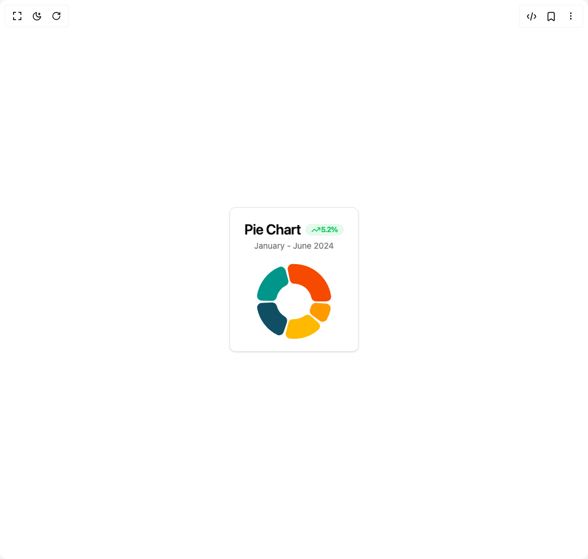

# Build Pie Chart in BuilderStudio

> Build this component in our Agentic IDE: [BuilderStudio](https://builderstudio.dev).
>
> Join the BuilderStudio community on [Discord](https://discord.gg/QdWeSGCqfe) and [Reddit](https://reddit.com/r/builderstudio).



## Component

- Author group: `svg-ui`
- Component: `pie-chart`
- Variant: `default`
- Rendered HTML snapshot: [`rendered.html`](rendered.html)

## BuilderStudio prompt

You are implementing a React component based on a component reference.

## Component identity

- Author: svg-ui
- Component slug: pie-chart
- Demo slug: default
- Title: pie-chart
- Description: 

## Goal

Recreate this component in a React + TypeScript + Tailwind CSS project. Preserve the visual layout, spacing, colors, border radius, shadows, interaction behavior, animation behavior, responsive behavior, and dark mode behavior shown in the rendered demo.

## Implementation requirements

- Use React and TypeScript.
- Use Tailwind CSS classes whenever possible.
- Keep the component self-contained unless the source files require helper components.
- If the source uses CSS variables, custom CSS, animations, or keyframes, include them.
- If the source uses external packages, list and use the required packages.
- Preserve accessibility attributes, button semantics, links, keyboard behavior, and ARIA attributes when visible in the source.
- Do not replace the component with a simplified placeholder.
- Return complete production-ready code.

## Dependencies

No reference metadata available.

## Rendered DOM snapshot

This is the rendered demo HTML extracted from the live preview. Use it to verify structure, class names, visible content, and layout.

```html
<div id="root"><div class="w-screen min-h-screen flex justify-center items-center"><div class="w-screen min-h-screen flex justify-center items-center"><div class="rounded-lg border bg-card text-card-foreground shadow-sm flex flex-col"><div class="flex flex-col space-y-1.5 p-6 items-center pb-0"><h3 class="text-2xl font-semibold leading-none tracking-tight">Pie Chart<div class="inline-flex items-center rounded-full border px-2.5 py-0.5 text-xs font-semibold transition-colors focus:outline-none focus:ring-2 focus:ring-ring focus:ring-offset-2 text-green-500 bg-green-500/10 border-none ml-2"><svg xmlns="http://www.w3.org/2000/svg" width="24" height="24" viewBox="0 0 24 24" fill="none" stroke="currentColor" stroke-width="2" stroke-linecap="round" stroke-linejoin="round" class="lucide lucide-trending-up h-4 w-4" aria-hidden="true"><polyline points="22 7 13.5 15.5 8.5 10.5 2 17"></polyline><polyline points="16 7 22 7 22 13"></polyline></svg><span>5.2%</span></div></h3><p class="text-sm text-muted-foreground">January - June 2024</p></div><div class="p-6 pt-0 flex-1 pb-0"><div data-slot="chart" data-chart="chart-«r0»" class="[&amp;_.recharts-cartesian-axis-tick_text]:fill-muted-foreground [&amp;_.recharts-cartesian-grid_line[stroke='#ccc']]:stroke-border/50 [&amp;_.recharts-curve.recharts-tooltip-cursor]:stroke-border [&amp;_.recharts-polar-grid_[stroke='#ccc']]:stroke-border [&amp;_.recharts-radial-bar-background-sector]:fill-muted [&amp;_.recharts-rectangle.recharts-tooltip-cursor]:fill-muted [&amp;_.recharts-reference-line_[stroke='#ccc']]:stroke-border flex justify-center text-xs [&amp;_.recharts-dot[stroke='#fff']]:stroke-transparent [&amp;_.recharts-layer]:outline-hidden [&amp;_.recharts-sector]:outline-hidden [&amp;_.recharts-sector[stroke='#fff']]:stroke-transparent [&amp;_.recharts-surface]:outline-hidden [&amp;_.recharts-text]:fill-background mx-auto aspect-square max-h-[250px]"><style>
 [data-chart=chart-«r0»] {
  --color-chrome: var(--chart-1);
  --color-safari: var(--chart-2);
  --color-firefox: var(--chart-3);
  --color-edge: var(--chart-4);
  --color-other: var(--chart-5);
}


.dark [data-chart=chart-«r0»] {
  --color-chrome: var(--chart-1);
  --color-safari: var(--chart-2);
  --color-firefox: var(--chart-3);
  --color-edge: var(--chart-4);
  --color-other: var(--chart-5);
}
</style><div class="recharts-responsive-container" style="width: 100%; height: 100%; min-width: 0px;"><div style="width: 0px; height: 0px; overflow: visible;"><div class="recharts-wrapper" style="position: relative; cursor: default; width: 168px; height: 168px;"><div xmlns="http://www.w3.org/1999/xhtml" tabindex="-1" class="recharts-tooltip-wrapper" style="visibility: hidden; pointer-events: none; position: absolute; top: 0px; left: 0px;"></div><svg cx="50%" cy="50%" role="application" tabindex="0" class="recharts-surface" width="168" height="168" viewBox="0 0 168 168" style="width: 100%; height: 100%;"><title></title><desc></desc><defs><clipPath id="recharts1-clip"><rect x="5" y="5" height="158" width="158"></rect></clipPath></defs><g class="recharts-layer recharts-pie" tabindex="0"><g class="recharts-layer"><g class="recharts-layer recharts-pie-sector" tabindex="-1"><path radius="10" cx="84" cy="84" fill="var(--color-chrome)" stroke="#fff" name="0" tabindex="-1" data-recharts-item-index="0" data-recharts-item-data-key="visitors" class="recharts-sector" d="M 138.6172134038345,84
    A8,8,0,0,0,146.53275157830328,74.84057971014492
    A63.2,63.2,0,0,0,80.96998794504142,20.872676066961255
    A8,8,0,0,0,73.50268432875453,30.401060050610845
  L76.86016357571364,47.544235903845966
      A8,8,0,0,0,84.56132606979641,54.00525190898635
      A30,30,0,0,1,113.32764571737901,77.6842105263158
      A8,8,0,0,0,121.14835124201342,84Z"></path></g><g class="recharts-layer recharts-pie-sector" tabindex="-1"><path radius="10" cx="84" cy="84" fill="var(--color-safari)" stroke="#fff" name="1" tabindex="-1" data-recharts-item-index="1" data-recharts-item-data-key="visitors" class="recharts-sector" d="M 69.78938221484394,31.263880099459286
    A8,8,0,0,0,58.88591539416903,26.004114332039343
    A63.2,63.2,0,0,0,21.710707950712006,73.30962601222444
    A8,8,0,0,0,29.399216527252698,82.66043135220139
  L46.86282371205091,83.08888126032225
      A8,8,0,0,0,54.836080774798674,76.96680617173587
      A30,30,0,0,1,70.2711012142871,57.32571766416852
      A8,8,0,0,0,74.3345303074009,48.13109012499198Z"></path></g><g class="recharts-layer recharts-pie-sector" tabindex="-1"><path radius="10" cx="84" cy="84" fill="var(--color-firefox)" stroke="#fff" name="2" tabindex="-1" data-recharts-item-index="2" data-recharts-item-data-key="visitors" class="recharts-sector" d="M 29.438777706357904,86.4724525928263
    A8,8,0,0,0,21.945989627978364,95.98080951977084
    A63.2,63.2,0,0,0,55.30450479795829,140.30993300572823
    A8,8,0,0,0,66.51585804621212,135.74306504392445
  L72.1080156605182,119.1934753678792
      A8,8,0,0,0,68.6281607187472,109.7625029279248
      A30,30,0,0,1,54.98832751573708,91.63694046499394
      A8,8,0,0,0,46.88973157653829,85.68165916244072Z"></path></g><g class="recharts-layer recharts-pie-sector" tabindex="-1"><path radius="10" cx="84" cy="84" fill="var(--color-edge)" stroke="#fff" name="3" tabindex="-1" data-recharts-item-index="3" data-recharts-item-data-key="visitors" class="recharts-sector" d="M 70.16786229543868,136.83665362721274
    A8,8,0,0,0,77.02402136890554,146.81381792359474
    A63.2,63.2,0,0,0,125.11706667899418,131.9961126312866
    A8,8,0,0,0,125.16938577646486,119.89041201753767
  L112.00169960949884,108.41116177037446
      A8,8,0,0,0,101.95633304790422,108.0326882281767
      A30,30,0,0,1,82.68248764766031,113.97105539018325
      A8,8,0,0,0,74.5919566771441,119.93728872404353Z"></path></g><g class="recharts-layer recharts-pie-sector" tabindex="-1"><path radius="10" cx="84" cy="84" fill="var(--color-other)" stroke="#fff" name="4" tabindex="-1" data-recharts-item-index="4" data-recharts-item-data-key="visitors" class="recharts-sector" d="M 127.57268780544669,116.931153599731
    A8,8,0,0,0,139.4101930504972,114.39655418146324
    A63.2,63.2,0,0,0,145.74149607738295,97.49917264599966
    A8,8,0,0,0,138.4841686170343,87.80990421278189
  L121.05785972545748,86.59133798805107
      A8,8,0,0,0,112.81563784381933,92.34619767641814
      A30,30,0,0,1,111.20517015738562,96.64431558874163
      A8,8,0,0,0,113.63632544170933,106.39839758360165Z"></path></g></g></g></svg></div></div></div></div></div></div></div></div></div>
```

## Reference source files

No reference source files were available.
